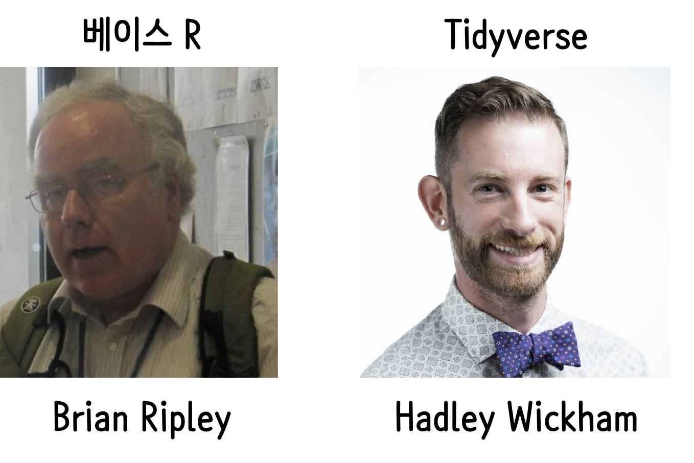
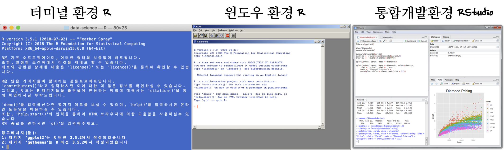

``` {r, include=FALSE}
# source("tools/chunk-options.R")
knitr::opts_chunk$set(echo = TRUE, warning=FALSE, message=FALSE,
                    comment="", digits = 3, tidy = FALSE, prompt = FALSE, fig.align = 'center')
library(reticulate)
use_condaenv("anaconda3")
# reticulate::repl_python()
```

# 빅데이터 {#tidyverse-bigdata-strategy}

| 구분  |  데이터 크기 |
|--------------|--------------|
| 매우 큰 데이터 | 컴퓨터 한대 메모리에 저장될 수 없는 크기 : **>5 TB** |
| 중간 데이터 | 서버 컴퓨터 메모리에 저장할 수 있는 크기 : **10 GB -- 5 TB** |
| 작은 데이터 | 노트북 컴퓨터 메모리에 저장할 수 있는 크기 : **<10 GB** |

전통적으로 R은 작은 데이터를 빠르게 탐색하는데 최적의 환경을 제공한다.
중간크기 데이터를 작업하지 못할 기술적인 이유는 없지만, 거의 작업이 이뤄지지 않고 있다.

빅데이터를 처리하는 전략

1. 요약/표본추출/부분집합 추출 (90%)
2. 작은 데이터 문제로 쪼개서 분할 정복 (9%)
3. 더이상 어찌할 수 없는 큰 문제 데이터 (1%)


<style>
div.blue { background-color:#e6f0ff; border-radius: 5px; padding: 10px;}
</style>
<div class = "blue">

**데이터 분석 정의**

데이터 분석은 데이터가 이해되고, 지식이 되고, 통찰을 얻게 되는 과정이다.  

* "Data analysis is the process by which data becomes understanding, knowledge and insight"*    

<br>
--- Hadley Wickham
</div>

# 해들리 위컴과 브라이언 리플리 {#ds-who}

[Brian D. Ripley](https://en.wikipedia.org/wiki/Brian_D._Ripley)는 "S Programming", "Modern Applied Statistics with S" 두권의 책으로 잘 알려져 있으면 베이스(Base) R로 알려진 핵심 코드의 상당부분을 저작한 것으로 유명하다. [Hadley Wickham](https://en.wikipedia.org/wiki/Hadley_Wickham)은 #JSM2019 에서 COPSS award를 수상하며 그동안 `tidyverse` 구축에 공헌한 것을 인정받았으며 최근 R 생태계 구축 및 R 코드 상당부분을 저작하여 기여했다.




# 데이터 사이언스 파이프라인 [^before-and-after] [^pipeline-webinar] {#data-science-pipeline}

[^pipeline-webinar]: [Pipelines for data analysis in R](https://www.rstudio.com/resources/webinars/pipelines-for-data-analysis-in-r/)

[^before-and-after]: [Jared P. Lander (2019) "R: Then and Now", New York R Conference](https://www.youtube.com/watch?v=gjpNEVcG1nU)

데이터 분석은 다른 소프트웨어 개발과 동일하게 **컴퓨터 시간(Computer time)**과 
**개발자 시간(Human time)**을 최적화하는 과정으로 볼 수 있다.
최근에 가장 희귀하고 귀중한 자원은 컴퓨터가 아니라 개발자 시간 즉, 사람이다.

따라서, 사람 시간을 최적화하는 것이 데이터 분석에서 가장 중요한 요소가 되면 그 해답이
**%>%** 즉, `magrittr` 팩키지에도 존재한다.
프랑스 액센트가 들어간 [magrittr](https://cran.r-project.org/web/packages/magrittr/) 팩키지는 
개발시간을 단축하고 코드 가독성을 높이고 유지보수성을 높이는 목적을 갖고 있다.
유닉스 쉘, `F#`, haskell, clojure, method chaining에서 영감을 받았다.


파일(`.csv`같은 일반 텍스트 파일, 엑셀같은 이진 파일) 형태, 데이터베이스(SQL, NoSQL) 형태,
웹데이터(JSON, XML) 형태로 존재하는 데이터를 가져와서 이를 분석에 적합한 형태, 즉 **깔끔한 데이터(tidy data)**로 
변환을 해야만 한다. 깔끔한 데이터는 기계도 잘 이해하고, 분석가도 잘 이해하는 형태가 되어야 한다.

|   기계 저장 방식   |     사람 이해 방식    |
|:------------------:|:---------------------:|
|   파일/테이블      |    데이터셋(Data set) |
|      행(row)       |   관측점(Observation) |
|    열(column)      |    변수(Variable)     |

# 데이터 사이언스 통합개발환경 {#ds-ide}

1990년대 초반 탄생한 R 언어는 초기 빈약하고 불편한 개발환경에서 진화에 진화를 거듭하여 RStudio 통합개발환경을 통해 4개의 작은창(pane)을 통해 데이터 사이언스 세계로 들어가는 포탈을 열었다는 평가를 받고 있다.



## `setwd()`, `getwd()` &rarr; `here` [^ncsoft-danbi] {#tidyverse-here}

[^ncsoft-danbi]: [DANBI, "R 사용자를 위한 효과적인 패키지 및 폴더 관리"](https://danbi-ncsoft.github.io/etc/2018/08/14/head-of-r.html)

개발환경이 준비되면 본격적인 데이터 사이언스 프로젝트를 시작해야 하는데 이에 필수적인 요소가 작업 디렉토리 설정(working directory)이 된다. `setwd("~/data-science")`와 같이 시작하거나, `setwd("D:\\workspace\\data-science")` 형태 작업을 수행하게 되는데, 본인이 여러대의 컴퓨터에서 작업하거나, 다른 작업자와 협업하는 경우 여간 고통스럽고 귀찮은 일이 아니다. `here` 팩키지는 상대경로를 절대경로로 바꿔주는 아주 편리하며 유용한 팩키지다.

현재 프로젝트 작업 디렉토리 구조가 유지된다고 가정하면 누구의 컴퓨터이든지 관계없이 `here` 팩키지를 사용하게 되면 데이터에 대한 사항을 그대로 유지시킬 수가 있어 재현가능한 데이터 사이언스 작업환경이 된다.

<div class = "row">
  <div class = "col-md-6">
**작업 디렉토리 구조**

```{r directory-structure, eval=FALSE}
D:.                          
├─code                       
├─data                       
│  ├─by_sido.csv
│  └─by_city.csv
...

```

  </div>
  <div class = "col-md-6">
**복사하여 붙여넣기**

```{r here-package}
library(tidyverse)
library(here)

here("data", "by_sido.csv")

salary_df <- read_csv(here("data", "by_sido.csv"))

salary_df %>% 
  select(CTP_KOR_NM, CTPRVN_CD, votes_tlt) %>% 
  sample_n(3) %>% 
  DT::datatable()
```
  </div>
</div>


# 데이터 사이언스 팩키지- `tidyverse` {#tidyverse-packages}

데이터 과학을 위한 파이프라인은 유닉스 파이프와 마찬가지로 
각 모듈별로 통일된 인터페이스를 유지해야만, 
앞선 선행작업을 후행작업과 연결하거나 조합하여 사용한다. 처음으로 데이터를 가져와서 최종적으로 
의사소통하는 일련의 과정에 데이터 과학 각 모듈별로 공통된 인터페이스를 갖고 이를 조합하여 연결해내는 
과정을 `tidyverse` 팩키지에 수많은 데이터과학자의 노력이 녹아져 있다.

* **데이터 가져오기**
    - readr : 데이터 가져오기
    - DBI : 데이터베이스
    - haven: SPSS, SAS, Stata
    - httr: 웹 APIs
    - jsonlite: JSON
    - readxl: 엑셀
    - rvest: 웹스크래핑
    - xml2: XML
    - readr : 데이터 가져오기
* **데이터 정제**
    - tidyr : 데이터 깔끔화
    - dplyr : 데이터 조작
    - ggplot2 : 데이터 시각화
    - ggvis: 인터랙티브 시각화
    - purrr : 함수형 프로그래밍
* **데이터 자료형**
    - tibble : 최신 데이터프레임
    - hms : 시간 자료형
    - stringr : 문자열 자료형
    - lubridate : 날짜/시간 자료형
    - forcats : 요인 자료형
* **모형**
    - modelr : 파이프라인 내부 모형개발
    - broom : 모형산출물을 깔끔한 데이터로 변환
* **의사소통**
    - rmakrdown : 마크다운 문서화
    - bookdown : 다양한 출력물 산출(pdf, html, ePub등)
    - flexdashboard : 정적 인터랙티브 대쉬보드
    - shiny : 웹응용프로그램, 동적 대쉬보드


# `Base R`과 `tidyverse` 비교 {#base-r-tidyverse}

## `magrittr` 코드와 일반 R 코드 비교 [^magrittr-vignette] {#function}

[^magrittr-vignette]: [Library magrittr](https://cran.r-project.org/web/packages/magrittr/vignettes/magrittr.html)

전통적인 R코드는 본인이 작성하지 않았다면 해독하기가 만만치 않고, 괄호가 많다.
결국 읽기 어렵고 이해하기 힘든 함수 조합을 가독성 높은 순열(sequence)로 변환하는 역할을 한다.

``` {r message=FALSE, warning=FALSE, comment=FALSE, results="hide", eval=FALSE}
x %>% f(y)
# f(x, y)
x %>% f(z, .)
# f(z, x)
x %>% f(y) %>% g(z)
# g(f(x, y), z)
```

`mtcars` 데이터셋을 파이프를 통해 데이터를 깔끔하게 정리하는 것과 기존 전통적 방식으로 개발된 코드를 비교해 보자.

<div class = "row">
  <div class = "col-md-6">
**`tidyverse`**

``` {r magrittr-nyc}
library(magrittr)

mtcars %>%
  subset(hp > 100) %>%
  aggregate(. ~ cyl, data = ., FUN = . %>% mean %>% round(2)) %>%
  transform(kpl = mpg %>% multiply_by(0.4251)) %>%
  print
```

  </div>
  <div class = "col-md-6">
**`Base R`**

``` {r base-r-function}
transform(aggregate(. ~ cyl, 
                    data = subset(mtcars, hp > 100), 
                    FUN = function(x) round(mean(x, 2))), 
          kpl = mpg * 0.4251)
```

  </div>
</div>

## 자료구조: `data.frame`, `tibble` {#tidyverse-dataframe}

`data.frame`은 파이썬 판다스 데이터프레임과 어떤 점에서 유사한 점이 있고 작은 데이터(small data)를 가정하고 탐색적 데이터 분석과 모형개발에 사용하는 것을 염두에 두고 제작된 자료구조다. 반면에 `tibble`은 기존 `data.frame`이 갖고 있던 가정을 깨고 현재 상황에 맞춰 그동안의 데이터 사이언스 경험을 바탕으로 제작된 새로운 자료구조다.

`row.names` 관련하여 행렬의 행명칭(row name)처럼 연산작업 중간에 엉키거나 유실되는 경우가 있지만, `tibble`은 이를 염두에 두고 분석가 친화적으로 만들어지고 가장 우려되는 데이터프레임에서 변수를 하나만 추출하게 되는 경우 벡터로 바뀌게 되는 문제를 미연에 방지해 둔 것이 예측가능성을 높혔다.

<div class = "row">
  <div class = "col-md-6">
**Base R**

```{r mtcars-tidyverse}
mtcars[, c("mpg")]

subset(mtcars, select=mpg, drop = TRUE)
```

  </div>
  <div class = "col-md-6">
**`tidyverse` filter**

```{r mtcars-tidyverse-filter}
mtcars %>% 
  rownames_to_column(var="car_name") %>% 
  tbl_df() %>% 
  select(car_name, mpg)
```

  </div>
</div>

## 깔끔한 데이터: `tidyr` {#tidyverse-tidyr}

지저분한(messy) 데이터를 데이터 사이언스 작업에 적합한 형태로 `tidyr` 팩키지 핵심 동사 `gather`, `spread`, `separate`, `unite` 등을 활용하여 깔끔한 데이터로 파이프 연산자와 함께 연결시켜 변환시킨다.

``` {r tidyverse-tidyr}
# 데이터 가져오기
tb <- read_csv("https://raw.githubusercontent.com/hadley/tidyr/master/vignettes/tb.csv")

tb %>% 
  DT::datatable()

# 깔끔한 데이터 변환
tidy_tb <- tb %>%
  gather(demographic, n, m04:fu, na.rm = TRUE) %>% 
  separate(demographic, c("sex", "age"), 1) %>%  # 변수를 성별과 연령으로 쪼갠다.
  rename(country = iso2) %>%
  arrange(country, year, sex, age)

tidy_tb %>% 
  sample_n(100) %>% 
  DT::datatable()
```

## 변환: `dplyr` {#tidyverse-dplyr}

- `select`: 데이터테이블에서 변수를 뽑아낸다.
- `filter`: 값으로 관측점을 뽑아낸다.
- `mutate`: 신규 변수를 생성한다. (log 변환)
- `summarise`: 관측점을 하나로 축약한다. (평균)
- `arrange`: 관측점을 오름차순, 내림차순으로 정렬한다.

<div class = "row">
  <div class = "col-md-6">
**총계: `aggregate`**

```{r tidyverse-aggregate}
# 공식
aggregate(mpg ~ cyl, data=mtcars, FUN="mean")
```

  </div>
  <div class = "col-md-6">
**`summarize`**

```{r tidyverse-aggregate-group}
# 공식
mtcars %>% 
  group_by(cyl) %>% 
  summarise(mean_mpg = mean(mpg),
            max_mpg  = max(mpg))
```

  </div>
</div>

# 시각화: `ggplot` {#viz-ggplot}

R에는 [R 시각화 시스템](https://statkclee.github.io/viz/viz.html#2_r_%EC%8B%9C%EA%B0%81%ED%99%94_%EC%8B%9C%EC%8A%A4%ED%85%9C_5)에서 2017년 3월 조사한 내용에 따르면 크게 3가지 시각화 시스템이 존재한다. 자세한 사항은 R 시각화 시스템을 참조한다. 이외에도 [인터랙티브(Interactive) 시각화](https://statkclee.github.io/viz/viz-interactive.html), [`rbokeh`](https://statkclee.github.io/viz/viz-rbokeh.html)와 빅데이터 시각화를 위한 [`trelliscope`](https://statkclee.github.io/viz/viz-trelliscope.html) 등이 존재한다.

- 정적 시각화
    - `Base` 시각화
    - `lattice`
    - `ggplot`
- 인터랙티브 시각화
    - `plotly`
    - `rbokeh`
- 애니메이션
    - `gganimate`
- 빅데이터 시각화
    - `trelliscope`
    
# 모형: `tidymodels` {#tidyverse-tidymodels}

`tidyverse`에서 모형에 대한 자세한 사항은 [`tidymodels`](https://statkclee.github.io/model/tidyverse-model.html)를 참조한다.

