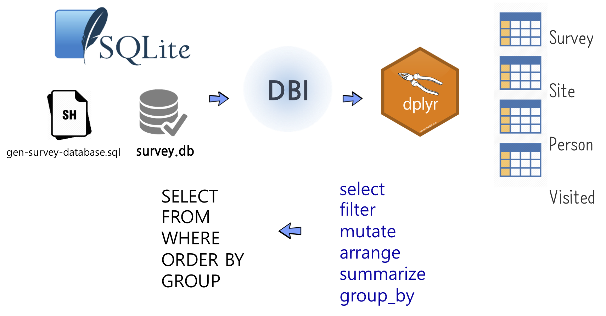

``` {r, include=FALSE}
source("tools/chunk-options.R")
knitr::opts_chunk$set(echo = TRUE, warning=FALSE, message=FALSE, fig.width=12)

library(DBI)
library(tidyverse)

par(family = "NanumGothic")
```


## 1. R에서 바라본 SQL  {#r-sql}

NoSQL, 빅데이터 등이 여전히 집중 관심을 받고 있지만, 데이터를 분석하는 입장에서 그럼에도 불구하고 
여전히 SQL은 중요한 기본기가 된다. 이번 에피소드를 통해 *SQL*에 대한 이해를 바탕으로 하여 
데이터 조작(Data Manipulation)의 기본을 잡고 더 나아가 `DBI` 팩키지를 통해 `dplyr`을 연결하여 그대로 활용하는 방안을
살펴보자.



R 개발자가 데이터를 분석할 때 데이터분석은 `dplyr`을 사용하고, 데이터베이스에 붙어 데이터 작업을 할 때는 `SQL`을 사용하는 것이 
관례로 오랜동안 사용되어온 작업흐름이다. 하지만, 좀더 곰곰히 생각해 보면 왜 동일한 작업을 두번 중복해서 할까?
이런 불편함에 대해 `dplyr`을 `DBI`, `odbc`와 붙여 사용하게 되면 `dplyr` 동사를 직접 사용해서 SQL 작업을 할 수 있다.
중간 통역이 제공되어 온전히 `dplyr` 동사를 데이터베이스에 던지면 작업이 가능하게 되었다.

### 1. SQL 자료처리 {#sql-basic}

자료를 원하는 방향으로 처리하기 위해서는 다음과 같은 다양한 기본적인 자료 처리 방법을 조합하여 사용한다.

 - 데이터 선택하기
 - 정렬과 중복 제거하기
 - 필터링(filtering)
 - 새로운 값 계산하기
 - 결측 데이터 (Missing Data)
 - 집합 (Aggregation)
 - 데이터 조합하기 (Combining Data)

``` {r sql-select, eval=FALSE}
# 칼럼과 행 선택
SELECT 칼럼명1, 칼럼명2....칼럼명N
FROM   테이블명
WHERE  조건;

# 그룹에 따른 정렬 및 집합(aggregation)
SELECT SUM(칼럼명)
FROM   테이블명
WHERE  조건
ORDER BY 칼럼명 {오름차순|내림차순};
GROUP BY 칼럼명;
```

## 2. SQLite와 실습 데이터베이스 {#sqlite}

먼저 이론을 이해하는 것과 더블어 예제 데이터베이스를 설치하고 실습을 진행하기 위해서 
먼저 명령-라인을 사용하여 어떻게 디렉토리 여기저기 이동하는지와 명령-라인에서 명령문을 어떻게 실행하는지 숙지할 필요가 있다.

이런 주제와 친숙하지 않다면, [유닉스 쉘(Unix Shell)](http://software-carpentry.org/v5/novice/shell/index.html) 학습을 참조한다. 
우선, `SQLite` 데이터베이스가 어떻게 동작하는지 설명을 할 필요가 있다.

인터랙티브하게 학습을 수행하기 위해서는 [설치 방법](http://software-carpentry.org/v5/setup.html)에 언급된 SQLite 를 참조하여 설치하고, 
학습자가 선택한 위치에 "software_carpentry_sql" 디렉토리를 생성한다. 예를 들어,

1. 명령-라인 터미널 윈도우를 연다.
2. 다음과 같이 명령어를 타이핑해서 디렉토리를 생성한다.

``` {r create-directory, eval=FALSE}
$ mkdir ~/swc/sql
```

3. 생성한 디렉토리로 현재 작업 디렉토리를 변경한다.

``` {r change-directory, eval=FALSE}
$ cd ~/swc/sql
```

### 2.1. SQLite 설치 [^install-sqlite3] {#install-sqlite}

[^install-sqlite3]: [SQLite3 설치 및 간단한 사용법](http://blog.simplism.kr/?p=2329)

[SQLite Download Page](http://sqlite.org/download.html)에서 [sqlite-tools-win32-x86-3200000.zip](http://sqlite.org/2017/sqlite-tools-win32-x86-3200000.zip)을 다운로드 받는다.
압축을 풀면 황당하게 몇개 `.exe` 파일이 존재하는 황당함을 느낀다. 설치가 완료되었다.

``` {r install-sqlite3-cmd, eval=FALSE}
$ ls
gen-survey-database.sql  sqlite3.exe           survey.db
sqldiff.exe              sqlite3_analyzer.exe
```

- sqlite3.exe: sqlite 실행파일
- gen-survey-database.sql: `survey.db` sqlite 데이터베이스를 생성시키는데 사용되는 스크립트
- survey.db: `sqlite3.exe` 명령어를 실행해서 `gen-survey-database.sql` 스크립트를 통해 생성된 데이터베이스


### 2.2. 실습 예제 데이터베이스 다운로드 {#download-database}

`깃헙(GitHub)`에서 `gen-survey-database.sql` 파일을 어떻게 다운로드 받을까요?

`~/swc/sql` 디렉토리로 이동한 후에 그 디렉토리에서 
GitHub 사이트 [https://github.com/swcarpentry/bc/blob/master/novice/sql/gen-survey-database.sqlSQL](https://github.com/swcarpentry/bc/blob/master/novice/sql/gen-survey-database.sqlSQL)에 
위치한 SQL 파일("gen-survey-database.sql")을 다운로드한다.

파일이 GitHub 저장소 내에 위치하고 있어서, 전체 Git 저장소(git repo)를 복제(cloning)하지 않고 단일 파일만 로컬로 가져온다. 
이 목적을 달성하기 위해서,
HTTP, HTTPS, FTP 프로토콜을 지원하는 명령-라인 웹크롤러(web-crawler) 소프트웨어 [GNU Wget](http://en.wikipedia.org/wiki/Wget) 혹은, 
다양한 프로토콜을 사용하여 데이터를 전송하는데 사용되는 라이브러리이며 명령-라인 도구인 [cURL](http://en.wikipedia.org/wiki/CURL)을 사용한다.
두가지 도구 모두 크로스 플랫폼(cross platform)으로 다양한 운영체제를 지원한다.

`Wget` 혹은 `cURL`을 로컬에 설치한 후에, 터미널에서 다음 명령어를 실행한다.

**Tip:** 만약 cURL을 선호한다면, 다음 명령문에서 "wget"을 `curl -O`로 대체하세요.

``` {r download-survey-db, eval=FALSE}
root@hangul:~/swc/sql$ wget https://raw.githubusercontent.com/swcarpentry/bc/master/novice/sql/gen-survey-database.sql
```

상기 명령문으로 Wget은 HTTP 요청을 생성해서 github 저장소의 "gen-survey-database.sql" 원파일만 현재 작업 디렉토리로 가져온다.

성공적으로 완료되면 터미널은 다음 출력결과를 화면에 표시한다.

``` {r download-output, eval=FALSE}
--2014-09-02 18:31:43--  https://raw.githubusercontent.com/swcarpentry/bc/master/novice/sql/gen-survey-database.sql
Resolving raw.githubusercontent.com (raw.githubusercontent.com)... 103.245.222.133
Connecting to raw.githubusercontent.com (raw.githubusercontent.com)|103.245.222.133|:443... connected.
HTTP request sent, awaiting response... 200 OK
Length: 3297 (3.2K) [text/plain]
Saving to: ‘gen-survey-database.sql’

100%[=========================================================================================================================&gt;] 3,297       --.-K/s   in 0.01s   

2014-09-02 18:31:45 (264 KB/s) - ‘gen-survey-database.sql’ saved [3297/3297]
```

이제 성공적으로 단일 SQL 파일을 가져와서, 
`survey.db` 데이터베이스를 생성하고 
`gen-survey-database.sql` 에 저장된 지시방법에 따라서 데이터를 채워넣는다.

명령-라인 터미널에서 SQLite3 프로그램을 호출하기 위해서, 다음 명령문을 실행한다.

``` {r create-survey-db, eval=FALSE}
root@hangul:~/swc/sql$ sqlite3 survey.db < gen-survey-database.sql
```

### 2.3. SQLite DB 연결 및 설치 테스트 {#connect-sqlite}

생성된 데이터베이스에 연결하기 위해서, 데이터베이스를 생성한 디렉토리 안에서 SQLite를 시작한다. 그래서 `~/swc/sql` 디렉토리에서 다음과 같이 타이핑한다.

``` {r run-survey-db, eval=FALSE}
root@hangul:~/swc/sql$ sqlite3 survey.db
```

`sqlite3 survey.db` 명령문이 데이터베이스를 열고 데이터베이스 명령-라인 프롬프트로 안내한다. 
SQLite에서 데이터베이스는 플랫 파일(flat file)로 명시적으로 열 필요가 있다. 
그리고 나서 SQLite 시작되고 `sqlite`로 명령-라인 프롬프트가 다음과 같이 변경되어 표시된다.


``` {r run-survey-db-output, eval=FALSE}
SQLite version 3.20.0 2017-08-01 13:24:15
Enter ".help" for usage hints.
Connected to a transient in-memory database.
Use ".open FILENAME" to reopen on a persistent database.
sqlite>  
```

다음 출력결과가 보여주듯이 `.databases` 명령문으로 소속된 데이터베이스 이름과 파일 목록을 확인한다.

``` {r check-database, eval=FALSE}
sqlite> .databases
seq  name             file                                                      
---  ---------------  ----------------------------------------------------------
0    main             ~/novice/sql/survey.db
```


다음과 같이 타이핑해서 필요한 "Person", "Survey", "Site" "Visited" 테이블이 존재하는 것을 확인한다.
`.table`의 출력결과는 다음과 같다.

``` {r check-tables, eval=FALSE}
sqlite> .tables
Person   Site     Survey   Visited
```

## 3. `dplyr` 동사 활용한 데이터베이스 작업 {#sql-dplyr}

### 3.1. 데이터베이스 연결 {#db-connection}

가장 먼저 앞에서 생성한 sqlite3 데이터베이스에 R과 연결시킨다. 
그리고 연결된 데이터베이스에 들어있는 테이블을 살펴본다.

``` {r connect-to-database}
# 0. 환경설정 -----------------------

# library(DBI)
# library(tidyverse)

# 1. 데이터 연결 -----------------------

con <- dbConnect(RSQLite::SQLite(), "data/survey.db")
dbListTables(con)
```

### 3.2. SQL을 직접 던지기 {#dplyr-sql}

`dbGetQuery` 명령어를 통해 연결된 `con`을 통해 데이터베이스에 질의문(query)를 직접 던질 수 있다.

``` {r sql-query}
# 2. SQL 활용 -----------------------
dbGetQuery(con, 'SELECT * FROM Person LIMIT 5')
```

### 3.3. dplyr 동사 활용 {#dplyr-dplyr}

`tbl` 함수로 `con` 으로 연결된 데이터베이스의 특정 테이블 "Survey"를 뽑아낸다.

``` {r extract-table}
# 3. dplyr 방식 -----------------------

survey_df <- tbl(con, "Survey")
head(survey_df)
```

### 3.4. 데이터프레임 변환 {#dataframe}

`tbl` 함수로 `con` 으로 연결된 데이터베이스의 특정 테이블 "Survey"를 뽑아낸 상태는 아직
R에서 작업이 가능한 데이터프레임이 아니라 `collect` 함수를 활용해서 데이터프레임으로 변환시켜 
후속 작업을 R에서 실행한다.

``` {r convert-to-dataframe}
# 4. 데이터프레임 변환 -----------------------

survey_df %>% collect() %>% 
    ggplot(aes(x= quant, y=reading)) +
    geom_boxplot()
```

### 3.5. SQL 변환 과정 살펴보기 {#conversion}

`show_query` 함수를 사용해서 `dplyr` 동사가 SQL 질의문으로 변환된 상황을 살펴볼 수도 있다.

``` {r show-query}
# 5. 내부 SQL 변환과정 살펴보기 --------------

show_query({
    survey_df %>% filter(quant == "sal")
})
```

### 3.6. 데이터베이스 연결 끊기 {#disconnect}

데이터베이스는 혼자 사용하는 것이 아니라 사용하지 않는 경우 필히 연결시켜 놓은 `con`을 반듯이 끊어 놓는다.

``` {r db-disconnect}
# 7. 연결 끊기 -----------------------

dbDisconnect(con)
```

