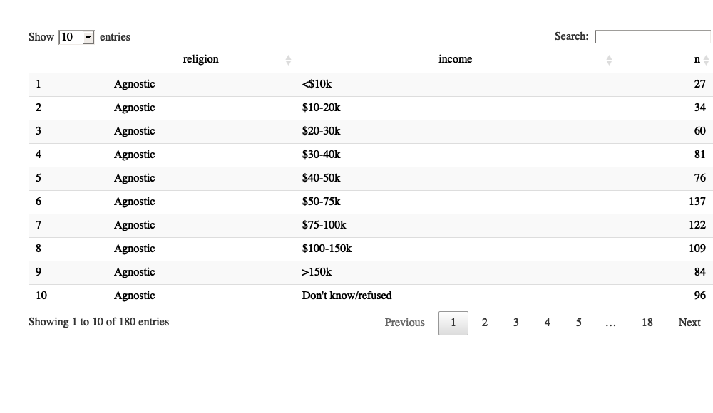
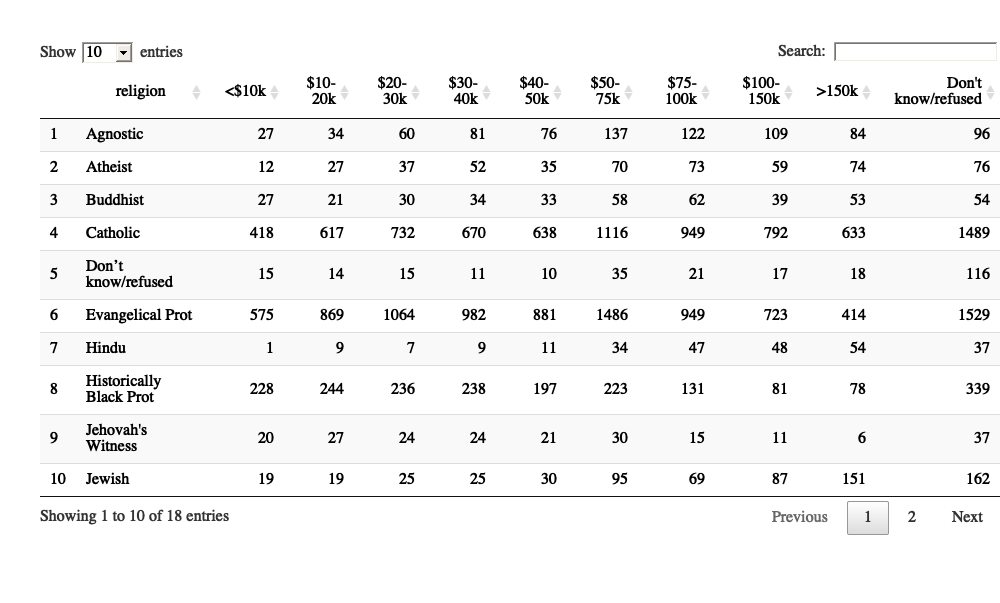

 


# 데이터 깔끔화 [^tidy-data] [^wrangling-webinar] {#tidy-data}

[^wrangling-webinar]: [Data wrangling with R and RStudio](https://www.rstudio.com/resources/webinars/data-wrangling-with-r-and-rstudio/)

깔끔한 데이터(Tidy datasets)이 준비되면, 데이터를 조작하고, 모형화하고, 시각화가 용이하다.
또한 깔끔한 데이터는 특정한 구조를 갖추고 있는데 **변수** 는 열(column)이고, **관측점** 은 행(row)이며, 
**관측단위에 대한 형태** 는 테이블(table)로 구성된다.

깔끔한 데이터 원칙은 코드(Codd) 박사의 **관계대수(relational algebra)** 와 깊은 관련이 있지만,
통계학 전공자에게 친숙한 언어로 표현된다.

<style>
div.blue { background-color:#e6f0ff; border-radius: 5px; padding: 10px;}
</style>
<div class = "blue">

**깔끔한 데이터 관련 R 팩키지**
 
- `reshape`, `reshape2` ([Wickham 2007](http://www.jstatsoft.org/v21/i12/))
- `ggplot2` (Wickham 2009)[^wickham-2009]
- `plyr` ([Wickham 2011](http://www.jstatsoft.org/v40/i01/))

</div>


[^tidy-data]: [Tidy Data - Journal of Statistical Software](https://www.jstatsoft.org/article/view/v059i10)
[^wickham-2009]: Wickham H (2009). ggplot2: Elegant Graphics for Data Analysis. Springer-Verlag, New York.

해당 데이터셋에 관측점과 변수를 각각 식별하는 것이 쉽게 생각되지만, 
일반적으로 변수와 관측점을 정확하게 정의하는 것이 놀랍게도 어렵다.
따라서, 행과 행보다는 변수간 **기능적 관계(functional relationship)**를 기술하는 것이 더 쉽다.
또한, 칼럼 그룹집단과 집단보다는 관측점 그룹집단 사이 비교를 하는 것이 더 쉽다. 

<style>
div.blue { background-color:#e6f0ff; border-radius: 5px; padding: 10px;}
</style>
<div class = "blue">

**데이터셋(Dataset)**
 
데이터셋은 정량적이면 숫자형, 정성적이면 문자열로 저장되는 **값(value)** 의 집합이다.
모든 값은 *변수(variable)* 와 *관측점(observation)* 에 속하게 된다.
변수에 모든 값은 동일한 속성을 측정하게 되고 (예를 들어, 키, 온도, 기간 등), 
관측점은 속성마다 동일한 단위로 측정되는 값이 담겨진다 (예를 들어, 사람, 종족, 날짜).

</div>


# 깔끔한 데이터 {#tidy-data-setup}

깔끔한 데이터는 데이터셋의 의미를 구조에 매칭하는 표준적인 방식이다. 
행, 열, 테이블이 관측점, 변수, 형식에 매칭되는 방식에 따라 데이터셋이 깔끔하거나 깔끔하지 않은 것으로 나뉜다.

**깔끔한 데이터(tidy data)** 는 결국 데이터분석을 쉽게 할 수 있는 데이터다.

1. 각 변수가 칼럼이 된다.
1. 각 관측점은 행이 된다.
1. 관측 단위에 대한 형태가 테이블을 구성한다.

|       저장 구분          |     의미    |
|--------------------------|-------------|
| 테이블/파일(table/file)  | 데이터셋 (dataset) |
| 행(row)                  | 관측점 (observation)  |
| 열(column)               | 변수 (variable)  |


**깔끔하지 않는 데이터(messy data)** 는 위와는 다른 형태의 데이터를 지칭한다. 
중요한 것은 컴퓨터 과학에서 말하는 코드 제3 정규형이지만, 통계적 언어로 다시 표현한 것이다.

또한, 깔끔한 데이터는 R같은 벡터화 프로그래밍 언어에 특히 잘 맞는다. 
왜냐하면 동일한 관측점에 대한 서로 다른 변수 값이 항상 짝으로 매칭되는 것을 보장하기 때문이다.

변수와 관측점의 순서가 분석에 영향을 끼치는 것은 아니지만, 순위를 잘 맞춰 놓으면 값을 스캔해서 검색하는 것이 용이하다.
고정된 변수(fixed variable)가 실험계획법에 기술되듯이 먼저 나오고 측정된 값이 뒤에 나오는 것처럼 
이와 같이 변수와 값에 대한 순위를 잘 맞춰 정리해 놓는 것이 장점이 많다.

<div class = "row">
  <div class = "col-md-6">
  
**깔끔한 데이터가 아닌 보통 데이터**

| id | x    | y     |
|----|------|-------| 
| 1  |22.19 | 24.05 | 
| 2  |19.82 | 22.91 | 
| 3  |19.81 | 21.19 | 
| 4  |17.49 | 18.59 | 
| 5  |19.44 | 19.85 | 

  </div>
  <div class = "col-md-6">
  
**깔끔하게 처리한 데이터 **

| id|변수| 값|
|---|---|-------|
| 1 | x | 22.19 | 
| 2 | x | 19.82 | 
| 3 | x | 19.81 | 
| 4 | x | 17.49 | 
| 5 | x | 19.44 | 
| 1 | y | 24.05 | 
| 2 | y | 22.91 | 
| 3 | y | 21.19 | 
| 4 | y | 18.59 | 
| 5 | y | 19.85 | 

  </div>
</div>


5가지 깔끔하지 않은 데이터 문제점

1. 칼럼 헤더에 변수명이 아닌 값이 온다.
1. 변수 다수가 한 칼럼에 저장되어 있다.
1. 변수가 행과 열에 모두 저장되어 있다.
1. 관측 단위에 대한 다양한 형태가 동일한 테이블에 저장되어 있다.
1. 한가지 관측 단위가 테이블 다수에 흩어져 저장되어 있다.

# 깔끔한 데이터 변형 사례 {#tidy-data-case-study}

[Pew Research Center Religion & Public Life](http://pewforum.org/Datasets/Dataset-Download.aspx) 웹사이트에서 2015년 다운로드 받았고, [GitHub](https://github.com/hadley/tidy-data/blob/master/data/pew.sav)에 데이터가 올라가 있다.

깔끔하지 않은 `messy` 상태 데이터를 깔끔한 `tidy` 상태 데이터로 변환을 시켜보자.

<div class = "row">
  <div class = "col-md-6">
  
**깔끔하기 전 데이터**

| 종교  | <$10k | $10-20k | $20-30k | $30-40k | $40-50k | $50-75k |
|------------|-----|-----|-----|-----|-----|-----| 
| Agnostic   |  27 |  34 |  60  | 81  | 76  |137 |
| Atheist    |  12 |  27 |  37  | 52  | 35  | 70 |
| Buddhist   |  27 |  21 |  30  | 34  | 33  | 58 |
| Catholic   | 418 | 617 | 732  |670  |638  |1116| 
| 모름/거절     |  15 |  14 |  15  | 11  | 10  | 35 |
| Evangel    | 575 | 869 | 1064 | 982 | 881 | 1486| 
| Hindu      |   1 |   9 |   7  |  9  | 11  | 34 |
| Black Prot | 228 | 244 | 236  |238  |197  |223 |
| 여호와의 증인  |  20 |  27 |  24  | 24  | 21  | 30 |
| Jewish     |  19 |  19 |  25  | 25  | 30  | 95 |

  </div>
  <div class = "col-md-6">
  
**깔끔하게 만든 후 데이터**

| religion | income    | freq | 
|----------|----------|-------|
| Agnostic | < $10k    |  27  |
| Agnostic | $10-20k   |  34  |
| Agnostic | $20-30k   |  60  |
| Agnostic | $30-40k   |  81  |
| Agnostic | $40-50k   |  76  |
| Agnostic | $50-75k   | 137  |
| Agnostic | $75-100k  | 122  |
| Agnostic | $100-150k | 109  |
| Agnostic | >$150k    |  84  |
| Agnostic | 모름/거절    |  96  |

  </div>
</div>


#### 깔끔한 데이터 만드는 R 코드

다운로드 받은 `pew.sav` 파일을 데이터프레임으로 만든 후 범주형 자료분석을 위해서 요인형(factor) 변수로 수준을 정리한 후 `count` 함수를 빈도수를 산출한다.


```r
library(tidyverse)
library(foreign)

# Load data -----------------------------------------------------------------
pew <- read.spss("data/pew.sav")
pew <- as.data.frame(pew)

religion <- pew[c("q16", "reltrad", "income")]
religion$reltrad <- as.character(religion$reltrad)
religion$reltrad <- str_replace(religion$reltrad, " Churches", "")
religion$reltrad <- str_replace(religion$reltrad, " Protestant", " Prot")
religion$reltrad[religion$q16 == " Atheist (do not believe in God) "] <- "Atheist"
religion$reltrad[religion$q16 == " Agnostic (not sure if there is a God) "] <- "Agnostic"
religion$reltrad <- str_trim(religion$reltrad)
religion$reltrad <- str_replace_all(religion$reltrad, " \\(.*?\\)", "")

religion$income <- c("Less than $10,000" = "<$10k", 
  "10 to under $20,000" = "$10-20k", 
  "20 to under $30,000" = "$20-30k", 
  "30 to under $40,000" = "$30-40k", 
  "40 to under $50,000" = "$40-50k", 
  "50 to under $75,000" = "$50-75k",
  "75 to under $100,000" = "$75-100k", 
  "100 to under $150,000" = "$100-150k", 
  "$150,000 or more" = ">150k", 
  "Don't know/Refused (VOL)" = "Don't know/refused")[religion$income]

religion$income <- factor(religion$income, levels = c("<$10k", "$10-20k", "$20-30k", "$30-40k", "$40-50k", "$50-75k", "$75-100k", "$100-150k", ">150k", "Don't know/refused"))

counts <- religion %>% 
  count(reltrad, income)

names(counts)[1] <- "religion"

counts %>% 
  DT::datatable()
```



사람이 보기 편한 형태 `wide` 표형태 데이터는 다음과 같이 나타낼 수 있다.


```r
counts %>% 
  spread(income, n) %>% 
  DT::datatable()
```




# 깔끔한 데이터 도구 {#tidy-tools}

깔끔한 데이터가 의미가 있으려면 깔끔한 데이터가 입력으로 들어가서 깔끔한 데이터가 입력으로 나와야만 된다.


- (깔끔한) 데이터 입력 &rarr; 함수  f(x)  &rarr; (깔끔한) 데이터 출력 
- Tidy-input      &rarr; 함수  f(x)  &rarr; Tidy-output


## 데이터 조작(Manipulation) {#tidydata-manipulate}

**plyr** 팩키지의 `subset()`, `transform()`, `aggregate()`, `summarise()`, `arrange()` 함수를 통해 
데이터 조작 기능을 구현했고 이는 `dplyr` 팩키지에 그대로 이어서 기능과 구문작성이 개선되어 오늘에 이르고 있다.

<style>
div.blue { background-color:#e6f0ff; border-radius: 5px; padding: 10px;}
</style>
<div class = "blue">

**데이터 조작 4가지 경우**

- 필터링(Filtering): 특정 조건으로 관측점을 제거하거나 부분집합을 뽑아냄
- 변환(Translform): 변수 추가 혹은 변경 (단일 변수 혹은 변수 다수를 사용하기도 함)
- 총합(Aggregate): 다수 값을 값 하나로 축약 (예, 합계 혹은 평균)
- 정렬(Sort): 관측점 순서를 오름차순 혹은 내림차순으로 변경

</div>


## 시각화(Visualization) {#tidydata-viz}

깔끔한 시각화 도구는 깔끔환 데이터셋과 궁합이 잘 맞는데 왜냐하면 변수와 그래프의 
심미적인 속성(위치, 크기, 모양, 색상) 간에 매핑으로 시각화를 구현하기 때문이다.
사실 그래픽 문법(grammar of graphics)의 근본적인 아이디어다.
이를 구현한 팩키지가 `ggplot`이다.

## 모형개발(Modeling)  {#tidydata-model}

표준 선형대수 루틴에 수치 형렬을 집어 넣어 모형을 개발하려면 통상적으로 
상수항을 추가(1로 구성된 칼럼)하고, 범주형 변수를 이진 가변수로 변환하고,
데이터를 스프라인(spline) 함수 기저에 투영하는 과정이 포함된다. 
깔끔한 데이터를 받아 모형에 적합시킨 후에 깔끔한 데이터 형식으로 출력해야 하지만,
다양한 형태로 구현되어 이러한 문제 대응하기 위해서 나온 대표적인 움직임이 
`broom`이다.

[^tidy-workflow]: [broom: a package for tidying statistical models into data frames](http://www.r-bloggers.com/broom-a-package-for-tidying-statistical-models-into-data-frames/)
