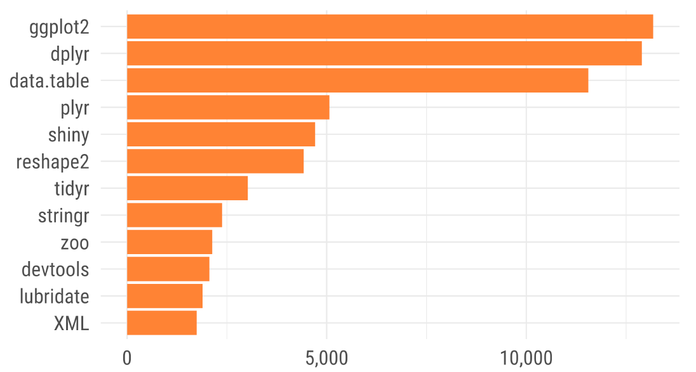
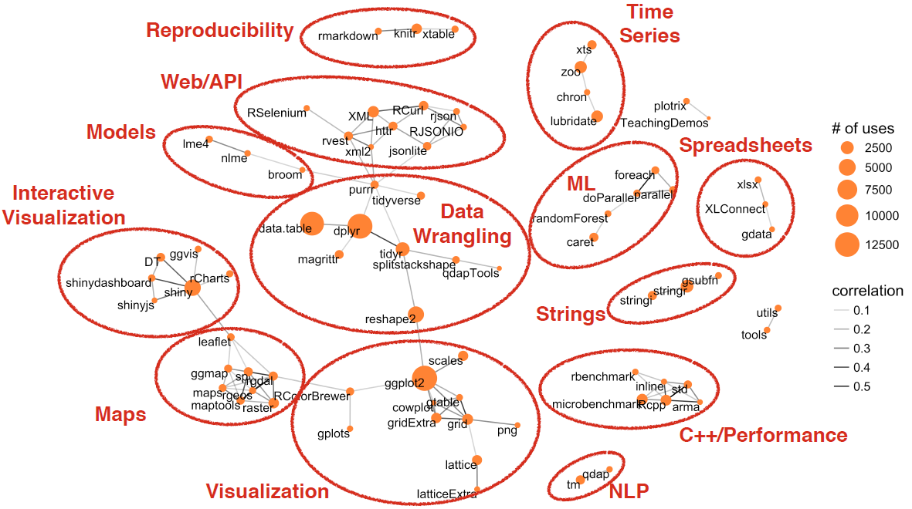
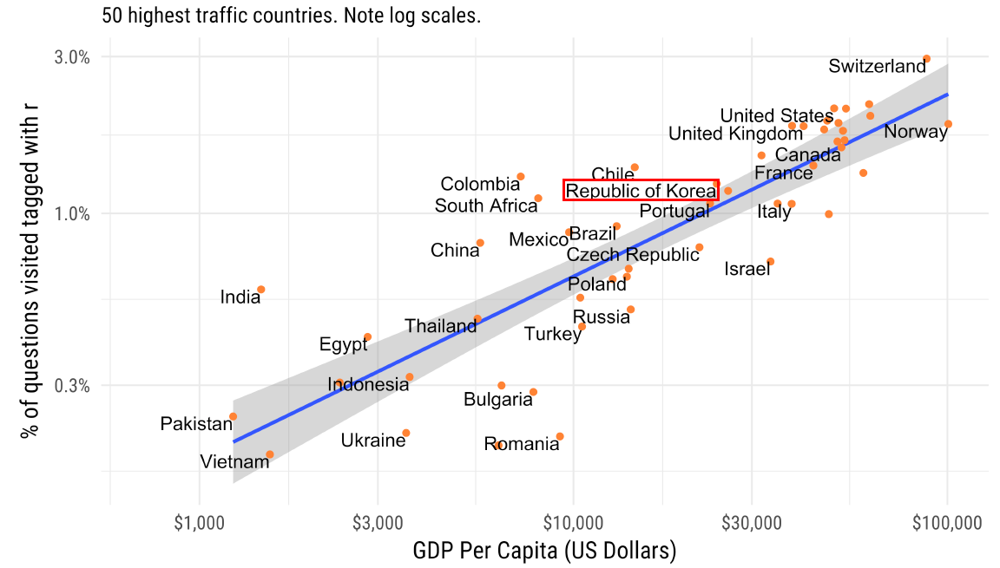

# 데이터 과학

## 1. R 팩키지 저장소

R 저장소(Repository)는 R 팩키지를 모아놓은 곳으로 (비)공식적으로 많이 사용되는 저장소는 다음과 같다.

- [CRAN](https://cran.r-project.org/): R 커뮤니티 공식 저장소 
- [Bioconductor](https://www.bioconductor.org/): 생물 정보학(Bioinformatic)을 위한 CRAN과 같은 저장소.
- [GitHub](https://github.com/): 소프트웨어 개발을 위한 협업 플랫폼.

> ### 팩키지(package)와 라이브러리(Library) 차이점
>
> 라이브러리는 도서관이라고 생각하면 되고, 팩키지는 도서관에서 대여하는 책이라고 생각할 수 있다.
> 즉, 책(package)가 필요하면 library() 함수로 대여해서 데이터 분석과 작업에 사용한다.
> 
> - Ian Lyttle @ijlyttle: Why are they called libraries when they are actually packages? Or is it the other way around? #rstatspic.twitter.com/YpA1IqyYpq
> - Hadley Wickham @hadleywickham: @ijlyttle a package is a like a book, a library is like a library; you use library() to check a package out of the library #rsats
> 

## 2. 팩키지 CRUD [^datacamp-r-package]

[^datacamp-r-package]: [R Packages: A Beginner Guide May 18th, 2017 in R Programming](https://www.datacamp.com/community/tutorials/r-packages-guide)

팩키지를 설치(install)하고, 불러오고, 갱신하고 삭제하는 과정이 필요하다.

- 팩키지 설치: install.packages()
    - 팩키지를 다수 설치하는 경우: install.packages(c("ggplot2", "caret"))
- 팩키지 삭제: remove.packages()
- 팩키지 갱신: update.packages()
- 팩키지 불러오기, 다시 재자리: library(), detach()
    - 팩키지 함수 직접 사용: 팩키지명에 함수명을 붙여 scales 팩키지, comma 함수를 `scales::comma` 형태도 사용가능하다.
    - `library` vs. `require`: library() 명령어로 팩키지를 불러올 때 팩키지가 없으면 오류가 나지만 `require`는 팩키지가 없어도 그냥 무시한다는 차이가 있다.
    - 팩키지 다수를 불러올 경우 `lapply` 함수를 활용. [^load-package-lapply]

[^load-package-lapply]: [Load multiple packages at once](https://stackoverflow.com/questions/8175912/load-multiple-packages-at-once)

~~~{.r}
x <- c("plyr", "psych", "tm")
lapply(x, require, character.only = TRUE)
~~~

### 2.1. R 팩키지(package) 설치 

R의 강점은 다양한 패키지를 지원하므로 새로이 뭔가 필요한 것을 자체 개발하는 것보다 우선 다른 사람들이 해놓은 것을 참조하고 
이를 확대하여 가는 것을 권장한다. R 팩키지를 설치하는 방법에 대해서 알아보자. 
*RStudio* 상에서 R 패키지를 설치하는 방법은 메뉴 상단의 `Tools > Install Packages…` 를 클릭하면 
`Install Packages` 팝업 메뉴가 나오고 원하는 패키지를 설치하면 된다.

`rpart`는 의사결정나무모델 (Decision Tree) 을 구현할 때 자주 사용되는 패키지로 별도로 개발할 필요없이 
기존의 개발 검증된 `rpart` 팩키지를 사용하는 것도 좋겠다. 
GUI를 통해서 일일이 설치하는 것도 좋지만, `install.packages`를 통한 명령어를 통해서도 설치가 동일하게 가능하다.

~~~{.r}
> install.packages("rpart")

trying URL 'http://cran.rstudio.com/bin/windows/contrib/3.1/rpart_4.1-8.zip'
Content type 'application/zip' length 917885 bytes (896 Kb)
opened URL downloaded 896 Kb

package ‘rpart’ successfully unpacked and MD5 sums checked
The downloaded binary packages are in
  C:\Users\Administrator\AppData\Local\Temp\Rtmp4Ce7l1\downloaded_packages
~~~

- R 팩키지를 설치하는 다양한 방법 
    - 기본 디폴트 설정된 R 저장소를 통해 안정된 버젼을 다운로드 받는 경우.
        - install.packages("mapmisc")
    - 별도 R 저장소를 지정하여 원하는 버젼 팩키지를 설치하는 것도 가능하다. 이런 경우 저장소(`repos=`)를 별도 설정한다.
        - `install.packages("mapmisc", repos="http://R-Forge.R-project.org")`
- `devtools` 팩키지를 활용한 방법: 
    - install_bioc() : Bioconductor
    - install_bitbucket() : Bitbucket,
    - install_cran() : CRAN,
    - install_git() : Git 저장소
    - install_github() : GitHub
    - install_local() : 로컬 파일
    - install_svn() : SVN 저장소
    - install_url() : 웹 URL
    - install_version() : CRAN 특정 버젼

`devtools` 팩키지를 제대로 사용하려고 하면, 윈도우의 경우 [Rtools](https://cran.r-project.org/bin/windows/Rtools/)를 별도로 설치하고,
맥에서는 Xcode, 리눅스에서는 `r-base-dev`, `r-devel`을 설치한다.

### 2.2. 소품문(Vignette)

팩키지가 설치되면 개발자는 팩키지에 대해서 잘 알지만,
처음 팩키지를 설치한 사용자는 팩키지에 대해서 아는 것이 전혀 없다.
따라서 팩키지를 설치했지만 사용자는 잘 사용할 수 없다.
이러한 "닭이 먼저냐 달걀이 먼저냐" 문제로 팩키지에 대한 장문 안내서가 소품문(Vignettes)이 포함되어 있다.

함수 명칭을 알기만 한다면 함수 문서(Function Documentation)가 훌륭하지만, 명칭을 알지 못한다면 아무런 쓸모가 없다. 
소품문은 논문이나 책 장(chapter)과 같다: 개발된 팩키지로 해결하려는 문제를 기술하고 나서, 독자에게 문제해결하는 방법을 보여준다.
따라서, 소품문은 함수를 유용한 범주로 나눠야 하고, 문제 해결을 위해서 다수 함수를 조직화하는 방법을 시연해야 한다. 
소품문을 또한 팩키지 세부사항을 설명하는데 유용하게 활용할 수도 있다. 

예를 들어, 복잡한 통계 알고리즘을 구현했다면 소품문에 상세한 전체 내용을 기술할 수도 있다. 
그렇게 함으로써 팩키지 사용자가 내부적으로 동작되는 구조를 이해할 수 있고, 알고리즘이 올바르게 구현됐다는 확신을 줄 수 있다.

현존하는 많은 팩키지에는 소품문이 있다. browseVignettes() 명령어로 설치된 모든 소품문을 볼 수 있다. 
특정 팩키지 소품문을 보려고 한다면, 인자로 팩키지 명칭을 browseVignettes("packagename")와 같이 넣는다. 
각 소품문은 세가지를 제공한다: 원 소스파일, 읽기 가능한 HTML 페이지 혹은 PDF, R 코드 파일. 
vignette(x) 명령어로 특정 소품문을 읽을 수 있으며, edit(vignette(x)) 명령어로 코드를 볼 수도 있다. 
설치되지 않은 팩키지에 대한 소품문을 보려면, 예를 들어, [http://cran.r-project.org/web/packages/dplyr](http://cran.r-project.org/web/packages/dplyr) 처럼 CRAN 페이지를 살펴본다.

### 2.3. 설치된 팩키지 검색방법 [^statmethods-packages]

`library` 명령어를 실행시키면 설치된 전체 팩키지가 검색된다.
`search` 명령어도 팩키지를 찾는데 도움되는 키워드다.

~~~{.r}
library()
search()
~~~

[^statmethods-packages]: [Statmethods - Packages](http://www.statmethods.net/interface/packages.html)

### 2.4. 라이브러리 설정  

`.libPaths()` 명령어로 현재 팩키지가 설치된 디렉토리를 확인할 수 있다.

~~~{.r}
.libPaths()
~~~

예를 들어, `[1] "C:/Users/KwangChun/Documents/R/win-library/3.2"` 디렉토리는 
사용자가 개별적으로 설치한 팩키지 목록이 나와 있고,
`[2] "C:/Program Files/R/R-3.2.3/library"` 디렉토리에는 기본 팩키지와 유틸리티가 나타나 있다.

`.Rprofile` 파일에 `.libPaths("C:/Users/xwMOOC/Rpackages")`를 추가해서 팩키지를 한 곳에 몰아 관리할 수도 있다. 

## 3. R 팩키지

R 팩키지를 설치할 때 가장 고민하게 되는 것은 설치하는 팩키지가 정말 맞나하는 고민이다.
다른 오픈소스 프로젝트도 그렇지만 동일한 기능을 수행하는 팩키지가 너무 많기 때문에 사실 그 팩키지가
본인이 작업하는데 사용되는 팩키지가 맞는지 확신이 서지 않는 것이다.

R팩키지가 12,000개를 넘어서게 되고 비공식적으로 개발된 GitHub 저장소에 존재하는 팩키지까지 고려하면 고민이 깊어질 수 밖에 없다.
이에 대한 한가지 반가운 그리고 정확한 정보가 인터넷에 공개되었다.

### 3.1. 스택오버블로우(stackoverflow)

얼마전 뉴욕 R 컨퍼런스(New York R Conference)에서 스택오버블로우 데이터과학자가 R 팩키지관련 내용을 발표하여 이를 
바탕으로 12,000개가 넘는 팩키지에 대해서 정리를 하고 어떤 팩키지를 골라 작업을 해야하는지 지침으로 삼을 수 있을 것으로 보인다.

[stackoverflow](https://stackoverflow.com/)를 통해 R 사용자의 질문과 답변 그리고 방문자 정보가 그대로 남아서 
어떤 팩키지를 누가 언제 어떻게 사용하는지에 대한 구체적인 최신 정보를 입수할 수 있다.

가장 많이 사용하는 팩키지는 `ggplot2`, `dplyr`, `shiny`, `tidyr`, `stringr`, `devtools`, `lubridate` 가 있다.
물론 `data.table`, `plyr`등도 있지만 동일한 기능이 `tidyverse`에 묶여 있기 때문에 아마 이들 팩키지는 활용도가 점차 줄어들 것이다.

R 팩키지가 독립적으로 사용되고 있지는 않고 목적에 맞게 다수 팩키지가 사용된다.
가장 R 사용자가 많이 사용하는 것이 `dplyr` 즉 데이터를 다양하게 다루는데 필요한 질문과 답변 그리고,
데이터 분석결과를 시각화하는데 `ggplot2`에 대한 활용이 높고 자연어처리, 지도, 시계열, 웹, 모형, 기계학습 등 다양한 영역에서 활용되고 있다.

- 데이터 조작: dplyr, magrittr, purrr, tidyverse, data.table, qdapTools, splitstackshape, reshape2
- 시각화: ggplot2, scales, gridExtra, lattice, png, RColorBrewer
- 지도: leaflet, ggmap, maps, rgeos, maptools, raster, sp, gdal
- 자연어처리: tm, qdap
- 인터랙티브 시각화: DT, ggvis, rCharts, shiny, shinydashboard, shinyjs
- 모형: broom, nlme, lme4
- 웹/API: XML, RCurl, rjson, httr, rvest, xml2, RJSONIO, jsonlite, RSelenium
- 재현: rmarkdown, knitr, xtable
- 시계열: lubridate, chron, zoo, xts
- 기계학습: foreach, doParallel, parallel, randomForest, caret
- 문자열: stringr, stringi, gsubfn
- 성능/C++: rbenchmark, inline, std, Rcpp, microbenchmark
- 스프레드쉬트: xlsx, XLConnect, gdata

### 3.2. 경쟁 팩키지

R 팩키지 생태계에 나타났듯이 오픈소스 프로젝트는 동일한 기능을 제공하는 팩키지가 서로 경쟁하는 것이 큰 특징이다.
스택오버플로우의 질의 응답을 통해서도 동일한 기능을 제공하는 다양한 팩키지가 서로 경쟁하는 것이 나타난다.
즉, 특정 팩키지와 연관된 질문을 하면 다른 팩키지를 통해서도 가능하다는 답변이 댓글로 바로 달리는 식이다.
이를 통해 경쟁하는 팩키지에 대한, 혹은 주도권을 잡아나가고 있는 팩키지에 대해서도 확인이 가능하다.

- 데이터 다루기: **dplyr**, data.table
- 깔끔한 데이터(tidy): **tidyr**, reshape2
- 문자열: **stringr**, stringi
- 깔끔한 데이터(tidy): **tidyr**, splitstackshape
- 다중 그래프: **grid**, cowplot
- 웹스크래핑: **rvest**, XML
- 엑셀: xlsx, XLConnect
- 다중 그래프: **gridExtra**, cowplot
- JSON 파일: jsonlite, rjson
- 문자열: **stringr**, gsubfn
- XML: xml2, XML

## 4. 국가경쟁력과 데이터과학 R 활용

David Robbinson 발표중에 국민총생산(GDP)과 데이터과학 R 활용이 관련이 있을까? 라는 어떻게 보면 조금 도발적인 분석이 있었다.
결과는 놀랍니다. 선진국(GDP가 높은 국가)이 데이터과학 R 활용이 높은 것으로 나타나고 있다. 따라서 경제를 발전시키려면 데이터과학 R(?)을 
사용해야 된다는 추론도 가능하다. :-)

