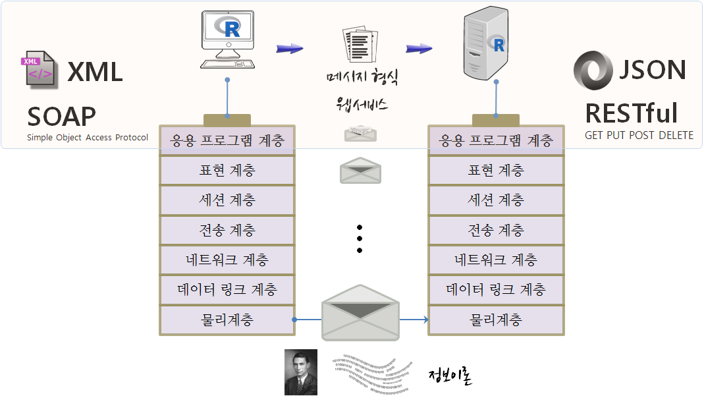

 
``` {r, include=FALSE}
source("tools/chunk-options.R")
knitr::opts_chunk$set(error = TRUE)
library(dplyr)
library(ggplot2)
library(tidyr)
library(jsonlite)
library(httr)
library(rvest)
```

> ## 학습 목표 {.objectives}
>
>  * 웹에서 데이터 추출을 위한 기본 API와 HTTP 개념을 이해한다.
>  * 웹사이트에서 통계분석과 모형개발에 필요한 데이터를 가져온다.
>  * 웹 페이지에서 데이터를 추출한다.

## 1. API와 HTTP [^httr-pkg] [^user2016-tutorial]

[^httr-pkg]: [Extracting Data from the Web  Part 1 - APIs](https://www.rstudio.com/resources/webinars/)

[^user2016-tutorial]: [Extracting Data from the Web Scott Chamberlain, Karthik Ram, Garrett Grolemund](http://github.com/ropensci/user2016-tutorial)

웹에서 데이터 추출을 위한 기본 API와 HTTP 개념을 이해하는 것이 필요하다. 
정보를 전달하기 위해서 국제표준화기구(OSI)에서 제시한 OSI 모형 (Open Systems Interconnection Reference Model)[^1]을 사용하고,
이를 기반으로 응용 프로그램을 웹서비스와 데이터 형식에 과거 **SOAP와 XML** 조합을 많이 사용했다면, 최근에는 **RESTful API와 JSON** 조합을 주로 사용한다. 
웹에서 정보를 얻기 위해서는 서버 API에서 정보를 제공하는 형식에 맞춰 정보를 전달하기만 하면 서버가 제공하는 정보를 받을 수 있고, 
이를 이후 데이터과학 작업을 위해 데이터 처리작업을 수행하면 된다.



[^1]: [OSI 모형](https://ko.wikipedia.org/wiki/OSI_모형)

> ### **API** (Application Programming Interface, 응용 프로그램 프로그래밍 인터페이스) {.callout}
> 
> API는 특정 프로그램이 다른 소프트웨어 일부와 상호작용하는 방식에 대한 지침으로
> 운영체제, 운영체제, 소프트웨어 팩키지, 웹응응프로그램이 그 대상이 될 수 있다.

### 1.1. HTTP와 URL

**HTTP**(HyperText Transfer Protocol, 초본문전송규약, 하이퍼본문전송규약)는 
WWW 웹상에서 정보를 주고받을 수 있는 프로토콜로 TCP와 UDP를 사용하며, 80번 포트를 통해 주로 HTML 문서를 주고받는다.
1996년 버전 1.0, 그리고 1999년 1.1 규격이 각각 발표되었다.

**URL**(Uniform Resource Locator, 파일식별자, 유일자원지시기)은 네트워크 상에서 
자원(resource)이 어디 있는지를 알려주기 위한 규약으로 웹 사이트 주소뿐만 아니라 컴퓨터 네트워크상의 자원을 모두 나타낼 수 있다.

URL을 통해 컴퓨터 네트워크상의 자원을 `프로토콜 &rarr; 호스트명 &rarr; 포트명 &rarr; 경로명 &rarr; 쿼리 매개변수 &rarr; (Fragment)ID`
표현한다.

``` {r, eval=FALSE}
http://www.hostname.com:80/path/to/resource?a=1&b=2#id
------ ---------------- -- ---------------- ------- --
ㄴ프로토콜  |            |         |           |     ㄴ(Fragment)ID
            ㄴ호스트명   |         |           |
                         ㄴ포트    |           |
                                   ㄴ경로명    |
                                               ㄴ쿼리 매개변수
```

### 1.2. HTTP 메시지 구조

`request`, `response` 요청이냐 응답이냐가 HTTP 메시지 구조의 첫줄이 되고 
그다음에 헤더에 `키:값` 내용이 쭉 나열되고 나서, 공백이 메시지 본문과 구별하기 위해 끼워들게 되는 구조를 갖는다.

| 요청 혹은 응답    | GET /resources/webinars/ HTTP/1.1      |
|-------------------|----------------------------------------|
| | Host: www.rstudio.com                                    |
| | User-Agent: libcurl/7.43.0 r-curl/2.1 httr/1.2.1         |
| | Accept-Encoding: gzip, deflate                           |
| | Accept: application/json, text/xml, application/xml, */* |
| | 공백                                                     |
| | 메시지 본몬                                              |

첫줄에 HTTP 동사가 나오고 URL 경로명, HTTP 버젼이 나열된다.

``` {r, eval=FALSE}
GET /resources/webinars/ HTTP/1.1
--- ------------------- ----------
ㄴHTTP동사  |              |      
            ㄴURL경로명    |      
                           ㄴ HTTP 버젼
```

> HTTP 동사(Verbs) {.callout}
> 
> - `GET` : (Retrieve), URL에서 정보를 가져온다. 
> - `POST` : (Create), URL에 리소스(resource)를 생성한다.
> - `PUT` : (Update), URL의 리소스(resource)를 갱신한다.
> - `DELETE` : (Delete), URL의 리소스(resource)를 삭제한다.

### 1.3. JSON 자료형

웹 API를 통해 데이터를 불러오는 경우 데이터에 대한 일종의 약속이 필요한데 **JSON** 자료형이 공통된 약속으로 
웹사이트에 자료를 요청하게 되면 반환되는 자료형이다.

> ### **JSON** (제이슨, JavaScript Object Notation) {.callout}
>
> JSON은 속성-값(Key-Value) 쌍으로 이루어진 데이터 오브젝트를 전달하기 위해 인간이 읽을 수 있는 텍스트를 사용하는 
> 개방형 표준 포맷으로 웹 API에 있어 표준 자료형으로 널리 사용되고 있다.
> 
> ``` {r}
> {  "Title": "Frozen",  
>    "Year": "2013",  
>    "Rated": "PG",  
>    "Released": "27 Nov 2013" 
> }
> ```

``` {r}
# library(jsonlite) 
toJSON(list(a = 1, b = 2, c = 3))
fromJSON('{"a":[1],"b":[2],"c":[3]}') 
```


## 2. `httr` 팩키지

`httr` 팩키지를 불러오고 나서 `GET` 명령어를 통해 웹페이지를 불러온다.
`verbose()` 인자를 넣어 웹사이트에서 데이터를 불러오는 과정을 자세히 살펴볼 수 있다.

``` {r}
library(httr) 
r <- GET("http://httpbin.org/get", verbose())
r
```

웹API를 통해 데이터를 요청하게 되면 다음과 같은 응답을 얻게 된다.

|  응답    | HTTP/1.1 200 OK                        |
|----------|-------------------------------------------------|
| | Server: nginx                                            |
| | Date: Wed, 09 Nov 2016 14:14:47 GMT                      |
| | Content-Type: application/json                           |
| | 공백                                                     |
| | 메시지 본몬                                              |

서버에서 응답결과를 첫줄에 웹서비스를 요청한 클라이언트에 전달하는데 
`HTTP/1.1 200 OK`와 같이 먼저 HTTP버젼을 전달하고, 상태코드, 그리고 상태코드를 영어로 설명한 정보가 전달된다.

``` {r, eval=FALSE}
HTTP/1.1     200      OK 
--------- ---------- ---
ㄴHTTP버젼 |          |
           ㄴ상태코드 |
                      ㄴ 상태코드 영어 설명                           
```

### 2.1. 상태코드(status code)

상태코드(status code)에 대한 자세한 설명은 [HTTP Status Cats API](http://http.cat)에서 재미지게 확인이 가능하다.
웹 API를 통해 자료를 요청한 후에 가장 먼저 해야할 작업을 요청결과를 확인하는 작업이다. 이를 위해 
`$status_code` 혹은 `http_status()` 함수를 통해 상태코드를 확인한다.

``` {r}
r$status_code
http_status(r) 
```

방어적 프로그래밍(defensive programming)을 위해 `warn_for_status()`, `stop_for_status()` 함수를 활용한다.


### 2.2. 헤더(headers)

`headers()` 함수를 통해 헤더 정보를 추출한다.

``` {r}
headers(r)
headers(r)$server 
```

### 2.3. 본문 내용(contents)

웹API를 통해 요청하는 이유는 본문 내용(contents)를 입수하기 위해서다. 
이를 위해 `$content`, `content()` 함수를 사용한다.
본문내용 추출은 "raw", "text", "parse" 세가지 방식을 지원한다.

``` {r}
content(r, "raw") 
content(r, "text") 
content(r, "parse", type = "application/json")
```

## 3. 위키데이터 추출 및 시각화 [^wiki-scraping] [^invalid-multibyte-string]

[^wiki-scraping]: [Using rvest to Scrape an HTML Table](http://www.r-bloggers.com/using-rvest-to-scrape-an-html-table/)

[^invalid-multibyte-string]: [Web Scraping and “invalid multibyte string”](https://www.r-bloggers.com/web-scraping-and-invalid-multibyte-string/)

### 3.1. 웹 스크래핑

마음에 드는 웹페이지에서 데이터를 발견했을 때, 데이터를 복사하여 붙여넣기 신공을 하지 않고, 데이터를 깔끔하게 뽑아내는 방법을 살펴본다.
먼저, 마음에 드는 웹페이지를 방문하고 나서, 웹브라우져(크롬 기준)에서 마우스 우클릭으로 **검사** 를 클릭한다.
그리고 나서 해당 데이터가 보관되어 있는 위치로 이동한다. (여기서는 20대 총선 정당별 지지율 추이표)
해당하는 곳에 마우스를 올리거나, `검사창` 에서 해당 `<table>` 태그를 찾아 마우스 우클릭하고 **Copy** 메뉴의
**Copy XPath** 를 클릭해서 `XPath`를 복사하고 나서 다음 R 스크립트에 복사해서 붙여넣는다.

제 20 대 총선 위키페이지 url은 다음과 같다. 

- url : [https://ko.wikipedia.org/wiki/대한민국_제20대_국회의원_선거](https://ko.wikipedia.org/wiki/대한민국_제20대_국회의원_선거)
- XPath: //*[@id="mw-content-text"]/table[4]

``` {r message=FALSE, warning=FALSE, comment=FALSE}
# library(rvest)
# library(dplyr)
# library(httr)
# library(rvest) 
# Sys.setlocale("LC_ALL", "English")

url <- "https://ko.wikipedia.org/wiki/대한민국_제20대_국회의원_선거" 

poll <- url %>%
  read_html() %>%
  html_nodes(xpath='//*[@id="mw-content-text"]/table[4]') %>%
  html_table(fill = TRUE) %>% 
  .[[1]]

head(poll)
```

### 3.2. 데이터 전처리

위키피디아 사이트에서 가져온 데이터는 텍스트형이라서 통계분석을 위해 데이터를 전처리한다. 
우선 정당 지지도를 숫자형으로 변환한다. 정규표현식을 사용해서 숫자 혹은 `.`이 아닌 것은 제거하고 남은 것을 숫자로 변환한다.
조사기관에 대해서도 출처 정보 `[숫자]`가 들어간 것을 제거한다.
마지막으로 `2016년 3월 15일`처럼된 날짜정보를 R에서 인식할 수 있는 자료형으로 변환한다.
먼저 숫자가 아닌 것을 제거하고 나서 이를 `tidyr` 팩키지의 `separate()`, `unite()` 함수로 정제한다.

``` {r message=FALSE, warning=FALSE, comment=FALSE}
# 데이터 전처리-------------------------------

# 지지율 숫자변환
poll$새누리당      <- as.numeric(gsub("[^0-9.]", "", poll$새누리당))
poll$더불어민주당  <- as.numeric(gsub("[^0-9.]", "", poll$더불어민주당))
poll$국민의당      <- as.numeric(gsub("[^0-9.]", "", poll$국민의당))
poll$정의당        <- as.numeric(gsub("[^0-9.]", "", poll$정의당))
poll$`기타·무응답` <- as.numeric(gsub("[^0-9.]", "", poll$`기타·무응답`))

# 조사기관 변환
poll$기관 <- gsub("\\[.*\\]", "", poll$기관)

# 날짜 변환
poll <- poll %>% separate(날짜, into=c("year", "month", "day"), sep="[^[:alnum:]]+",  remove = TRUE) %>% 
  mutate(year = gsub("[^0-9]", "", year),
         month = gsub("[^0-9]", "", month),
         day = gsub("[^0-9]", "", day)) %>% 
  unite(date, year, month, day, sep="-")
```

마지막으로 `wide형` 데이터를 시각화가 가능한 `long형` 데이터로 변환시킨다.

``` {r message=FALSE, warning=FALSE, comment=FALSE}
# 데이터 전처리

poll_long <- poll %>% gather(정당, 지지율, 새누리당:`기타·무응답`) %>% 
  mutate(정당 = factor(정당, levels=c("새누리당", "더불어민주당", "국민의당", "정의당", "기타·무응답")))

# 시각화
ggplot(data = poll_long, aes(y = 지지율, x = date, col = 정당, group=정당)) +
  geom_point(alpha = 0.5) +
  geom_smooth(span = 0.5, se=FALSE) +
  labs(title="제20대 총선") +
  theme_grey(base_family='NanumGothic') + 
  theme(axis.text.x = element_text(angle = 90, hjust = 1))
```