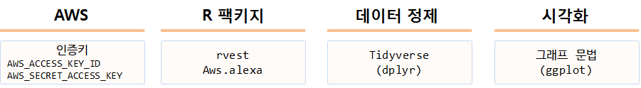
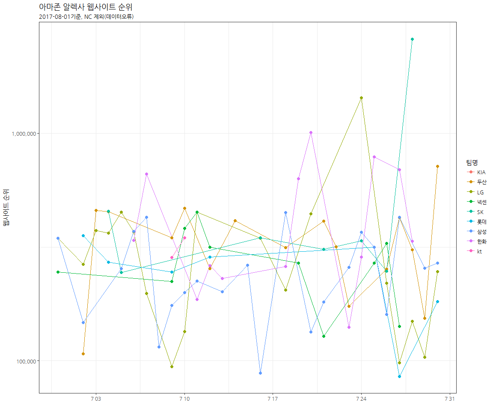

# xwMOOC 데이터 과학
xwMOOC  
2017-08-01  
 

## 1. KBO 프로야구 웹사이트 인기도 {#kbo}

KBO 프로야구 각 구단별 인기도를 웹사이트 방문 정보를 통해 간접적으로 유추해보자.
이를 위해서 사전 준비가 다소 필요하다.

- [AWS Web Information Service(Alexa Web Information Service, AWIS)](https://aws.amazon.com/ko/awis/): 전세계 웹사이트 교통현황 
- [aws.alexa: Client for the Amazon Alexa Web Information Services API](https://cran.r-project.org/web/packages/aws.alexa/): AWIS R 팩키지
- 데이터 분석 및 시각화 도구: `tidyverse`, `ggplot` 등 

## 2. AWS 웹 정보 서비스 {#awis}

AWS 웹 정보 서비스(AWIS)에 접속하기 전에 웹이터페이스를 통해 AWIS 서비스를 제공하고 있다. 
[@Alexa](http://www.alexa.com/siteinfo) 사이트에 방문하고 나서 웹사이트를 넣게 되면 웹교통량, 통계, 분석결과를 나름 잘 정리해서 보기 쉽게 정보를 제공한다.

AWIS는 현재 가장 많이 사용하고 있는 IAM 서비스에 통합되어 있지 않아 따로 **Access Keys (Access Key ID and Secret Access Key)**를 전달받아야 한다.
관련한 자세한 사항은 [Q: How do I get started with AWIS?](https://aws.amazon.com/ko/awis/faqs/) 웹사이트를 참조한다.

즉, AWIS 서비스를 사용하기 위해서는 먼저 [Alexa Web Information Service](https://aws.amazon.com/ko/awis/)에 가입하고 나서, 별도 접속인증키를 발급받아야만 한다.

1. “Sign up for AWIS”
1. "Go to the Management Console"
1. AWS Management Console 웹페이지 우측 상단 "My Security Credentials"을 선택
1. "Access Keys (Access Key ID and Secret Access Key)" 발급

상기 인증절차를 완료하면 발급받은 인증키를 R이 활용할 수 있도록 사전준비를 한다.
가장 쉬운 방법은 Sys.setenv에 다음과 같이 넣는 것으로 보안에 취약하지만 나름 편리하게 바로 개발에 착수할 수 있는 장점이 있다.

~~~{.r}
Sys.setenv("AWS_ACCESS_KEY_ID" = "AKXXXXXXXXXXXXXXXXXXX",
           "AWS_SECRET_ACCESS_KEY" = "zYYYYYYYYYYYYYYYYYYYYYYYYYYYYY")
~~~

> ### [AWIS는 유료](https://aws.amazon.com/ko/awis/)
>
> - 1,000 요청건/월 : 무료
> - 1,001 -- 1,000,000 요청건/월 : 요청건당 $0.00045(약 0.54원, 1,200원/달러 기준)
> - 1,000,000 요청건/월 이상 : 요청건당 $0.00030(약 0.36원, 1,200원/달러 기준)

## 3. KBO 웹사이트 인기도  {#kbo-awis}

KBO 웹사이트를 바탕으로 각 팀에 대한 인기도를 추정할 수 있다. 이를 위해서 KBO 웹사이트에서 각 팀정보를 바탕으로 
각 팀별 웹사이트를 AWIS에 넘겨, 페이지뷰(page_views_per_million), 유저당페이지뷰(page_views_per_user),
웹사이트순위(rank), 도달수(reach_per_million) 데이터를 얻을 수 있다. 해당 정보에 대한 
자세한 사항은 [About the Alexa Traffic Rankings](https://chnm.gmu.edu/digitalhistory/links/cached/chapter5/link5.25b.AlexaTrafficRankings.html) 페이지를 참조한다.

- 페이지뷰(page_views_per_million): 백만유저당 페이지뷰
- 유저당페이지뷰(page_views_per_user): 유저당 페이지뷰
- 웹사이트순위(rank): AWIS에서 자체 산정한 웹사이트 순위
- 도달수(reach_per_million): 백만유저당 도달수

### 3.1. 환경설정과 데이터 준비 {#kbo-awis-setup}

`aws.signature`, `aws.alexa`를 설치한다. R에서 AWIS를 사용할 수 있도록 제작된 팩키지다.
금일 기준(2017-08-01) [KBO 팀순위](http://www.koreabaseball.com/teamrank/teamrank.aspx) 데이터를 준비한다.
긁어온 팀순위 데이터와 자체 수집한 각 팀별 웹사이트 정보를 붙여 AWIS에 넘길 데이터를 준비한다.

~~~{.r}
# 0. 환경설정 ---------------------------------------
library(aws.signature)
library(tidyverse)
library(aws.alexa)
library(rvest)
library(readxl)
library(purrr)
library(extrafont)
library(ggthemes)
loadfonts()

Sys.setenv("AWS_ACCESS_KEY_ID" = "AKXXXXXXXXXXXXXXXXXXX",
           "AWS_SECRET_ACCESS_KEY" = "zYYYYYYYYYYYYYYYYYYYYYYYYYYYYY")

# 1. 데이터 가져오기 --------------------------------
## 1.1. KBO 팀순위
Sys.setlocale("LC_ALL", "English")

team_rank_url <- "http://www.koreabaseball.com/teamrank/teamrank.aspx"
team_rank_xml <- read_html(team_rank_url)

team_rank_tbl <- html_nodes(team_rank_xml, xpath='//*[@id="cphContents_cphContents_cphContents_udpRecord"]/table')
team_rank_tbl <- html_table(team_rank_tbl, fill=TRUE)[[1]]

Sys.setlocale("LC_ALL", "Korean")

## 1.2. KBO 홈페이지
team_homepage <- read_excel("data/kbo_team_homepage.xlsx")

## 1.3. 병합
team_homepage <- inner_join(team_rank_tbl, team_homepage) %>% 
    arrange(순위)

# 8월 1일
DT::datatable(team_homepage)
~~~

### 3.2. 웹데이터 긁어오기 {#kbo-awis-crawl}

`for` 반복문 대신 함수형 프로그래밍으로 간결한 코드로 각 팀별 웹트래픽을 AWIS에서 받아온다.
웹에서 데이터를 긁어오는 경우 대부분 자료가 리스트 형태로 가져오게 되어 시각화 혹은 모형개발을 위해 
데이터 후처리 작업이 일반적이다.

~~~{.r}
# 2. 웹페이지 데이터 -----------------------

## 2.1. 웹페이지 활동성 데이터 ------------

team_hp_alexa <- map(team_homepage$homepage, traffic_history)

names(team_hp_alexa) <- team_homepage$팀명

for(i in seq_along(team_homepage$팀명)) {
    team_hp_alexa[[i]] <- team_hp_alexa[[i]] %>% 
        mutate(team = team_homepage$팀명[i])
}

team_traffic_df <- map_df(team_hp_alexa, bind_rows)

team_traffic_df <- team_traffic_df %>% 
    mutate(team = factor(team, levels=c("KIA", "NC", "두산", "LG", "넥센", "SK", "롯데", "삼성", "한화", "kt")))

team_traffic_df <- team_traffic_df %>% 
    mutate(일자 = lubridate::ymd(date),
             페이지뷰 = as.numeric(page_views_per_million),
             유저당페이지뷰 = as.numeric(page_views_per_user),
             웹사이트순위 = as.numeric(rank),
             도달수 = as.numeric(reach_per_million)) %>% 
    dplyr::select(일자, 페이지뷰, 유저당페이지뷰, 웹사이트순위, 도달수, 팀명=team) %>% 
    filter(팀명 != "NC")

listviewer::jsonedit(team_hp_alexa, mode="view")
~~~

### 3.3. 팀별 웹트래픽 시각화 {#kbo-awis-viz}

AWIS가 전세계를 대상으로 하고 KBO 프로야구 웹사이트가 상대적으로 웹트래픽이 많지 않아 
순위 백만에 들지 않는 경우는 제외되고, 일부 구단(NC)에 대해서는 가비지 데이터가 들어가 있어 
이를 제외하고 시각화한다.

웹사이트 순위가 낮아야 좋은 것으로 이점만 유의하면 된다.

~~~{.r}
# 3. 팀별 웹페이지 시각화 ------------

ggplot(team_traffic_df, aes(x=일자, y=웹사이트순위, color=팀명, group=팀명)) +
    geom_line() +
    geom_point(size=2) +
    scale_y_log10(labels = scales::comma) +
    theme_bw(base_family="NanumGothic") +
    labs(x="", y="웹사이트 순위", title="아마존 알렉사 웹사이트 순위",
         subtitle="2017-08-01기준, NC 제외(데이터오류)")
~~~

상기 그래프에 너무 많은 팀이 시점별로 얽혀있어 각 팀별로 뽑아내어 시각화하면 다음과 같다.

~~~{.r}
ggplot(team_traffic_df, aes(x=일자, y=웹사이트순위, color=팀명, group=팀명)) +
    geom_line() +
    geom_point(size=2) +
    scale_y_log10(labels = scales::comma) +
    theme_bw(base_family="NanumGothic") +
    labs(x="", y="웹사이트 순위", title="아마존 알렉사 웹사이트 순위",
         subtitle="2017-08-01기준, NC 제외(데이터오류)") +
    facet_wrap(~팀명)
~~~

