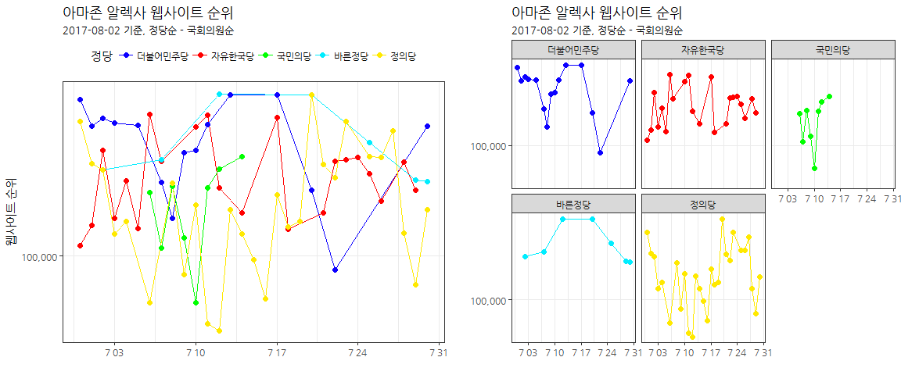
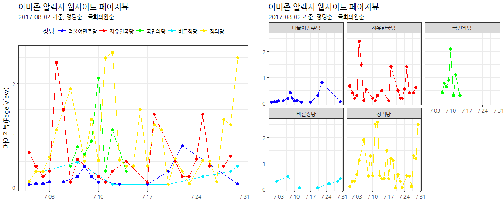
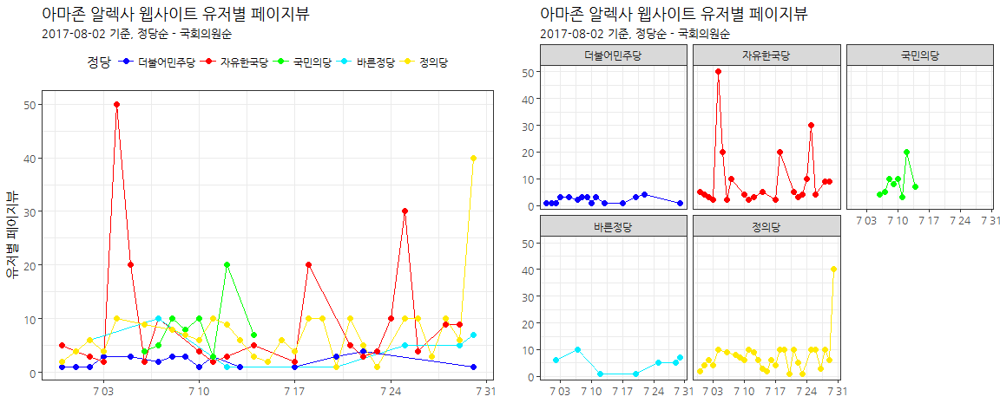

# xwMOOC 데이터 과학
xwMOOC  
2017-08-01  
 

> ### 폴리뉴스, 홍경환 칼럼니스트, 2017.08.04 16:31:56
>
> 데이터 분석 결과를 홍경환 칼럼리스트가 해석한 내용은 [홍경환 칼럼 - 인기 높아도 뜨내기손님만 많은 민주당, 악플 보다 무서운 무플의 국민의당](http://www.polinews.co.kr/news/article.html?no=323405&sec_no=1)
> 확인 가능합니다.

## 1. 대한민국 주요 정당 {#party-info}

대선 후 기존 양당 정치구조에서 외형상 다당제 정치구조를 갖추게 되었다.
정치권 일각에서는 다당제가 다시 양당제로 회귀한다고 주장하는 반면, 민심은 이미 다당제를 원해 
외형상 구축된 다당제가 쭉 지속될 것이라는 견해가 공존하고 있다.

|     정당       |                      정당 웹사이트 주소                              |
|----------------|----------------------------------------------------------------------|
| "더불어민주당" | [http://theminjoo.kr/](http://theminjoo.kr/)                         |
| "자유한국당"   | [http://www.libertykoreaparty.kr/](http://www.libertykoreaparty.kr/) |
| "국민의당"     | [http://www.people21.kr/](http://www.people21.kr/)                   |
| "바른정당"     | [http://bareun.party/](http://bareun.party/)                         |
| "정의당"       | [http://www.justice21.org/](http://www.justice21.org/)               |

## 2. 웹사이트 트래픽을 통해 본 각 정당 인기도 {#website-popularity}

[프로야구 구단 인기도](http://statkclee.github.io/data-science/data-webapi-aws-alexa.html) 
사례를 통해보면, 절대적인 웹트래픽이 상대적으로 구글등과 비교하여 적은 경우 편차가 매우크다.
하지만, [소셜 커머스, 인터넷 커머스](http://statkclee.github.io/data-science/data-webapi-social-shopping.html) 사례를 보면,
나름 안정적인 웹트래픽 데이터를 제공하는 것으로 판단된다.

### 2.1. 환경설정과 데이터 준비 {#setup}

아마존 알렉사 웹API를 활용하여 데이터를 가져와서 분석을 수행할 것이기 때문에 데이터 분석과 
시각화에 필요한 팩키지를 설치하고 데이터를 준비한다.

~~~{.r}
# 0. 환경설정 ---------------------------------------
library(aws.signature)
library(tidyverse)
library(aws.alexa)
library(rvest)
library(readxl)
library(purrr)
library(extrafont)
library(ggthemes)
loadfonts()
library(gridExtra)

Sys.setenv("AWS_ACCESS_KEY_ID" = "AKxxxxxxxxxxxxxxxxxxxxxx",
           "AWS_SECRET_ACCESS_KEY" = "wTQfxxxxxxxxxxxxxxxxxxxxxxxxxx")

# 1. 데이터 가져오기 --------------------------------

party_df <- tribble(
    ~party, ~website,
    "더불어민주당", "http://theminjoo.kr/",
    "자유한국당", "http://www.libertykoreaparty.kr/",
    "국민의당", "http://www.people21.kr/",
    "바른정당", "http://bareun.party/",
    "정의당", "http://www.justice21.org/"
)

# 2. 웹페이지 데이터 -----------------------
## 2.1. 홈페이지 정보 긁어오기 -------------

Sys.setlocale("LC_ALL", "English")

party_hp_info <- map_df(party_df$website, url_info)

## 2.2. 웹페이지 활동성 데이터 ------------

party_hp_alexa <- map(party_df$website, traffic_history)

Sys.setlocale("LC_ALL", "Korean")

names(party_hp_alexa) <- party_df$party

for(i in seq_along(party_df$party)) {
    party_hp_alexa[[i]] <- party_hp_alexa[[i]] %>% 
        mutate(정당 = party_df$party[i])
}

party_traffic_df <- map_df(party_hp_alexa, bind_rows)

party_traffic_df %>% count(정당) %>% pull(정당) %>% dput()

party_traffic_df <- party_traffic_df %>% 
    mutate(정당 = factor(정당, levels=c("더불어민주당", "자유한국당", "국민의당", "바른정당",  "정의당")))

party_traffic_df <- party_traffic_df %>% 
    mutate(일자 = lubridate::ymd(date),
             페이지뷰 = as.numeric(page_views_per_million),
             유저당페이지뷰 = as.numeric(page_views_per_user),
             웹사이트순위 = as.numeric(rank),
             도달수 = as.numeric(reach_per_million)) %>% 
    dplyr::select(일자, 페이지뷰, 유저당페이지뷰, 웹사이트순위, 도달수, 정당)
~~~

### 2.2. 웹트래픽 데이터 가져와서 정제하기 {#data-wrangling}

AWIS를 통해 웹사이트 웹트래픽 데이터를 가져온 후에 분석자가 이해하기 편한 형태로 데이터를 가공한다.

~~~{.r}
listviewer::jsonedit(party_hp_alexa, mode="view")
~~~

<!--html_preserve-->

<!--/html_preserve-->

## 3. 정당 웹사이트 웹트래픽 시각화 {#party-viz}

### 3.1. 웹사이트 순위 {#website-rank}

가장 먼저 각 정당별 웹사이트 순위를 시각화한다. 웹트래픽이 적은 경우
AWIS에서 추적된 결과를 제공하지 않고 있다. 국민의당의 경우 7월 중순부터 
웹트래픽이 올라오고 있지 않다.

~~~{.r}
# 3. 정당별 웹페이지 시각화 ------------
party_colors <- c("#0c00ff", "#ff0000", "#00ff00", "#00edff", "#ffe900")
## 3.1. 정당 웹사이트 순위 -----------
rank_g <- ggplot(party_traffic_df, aes(x=일자, y=웹사이트순위, color=정당)) +
    geom_line() +
    geom_point(size=2) +
    scale_y_log10(labels = scales::comma) +
    theme_bw(base_family="NanumGothic") +
    labs(x="", y="웹사이트 순위", title="아마존 알렉사 웹사이트 순위",
         subtitle="2017-08-02 기준, 정당순 - 국회의원순") +
    theme(legend.position = "top") +
    scale_color_manual(values= party_colors)

rank_facet_g <- ggplot(party_traffic_df, aes(x=일자, y=웹사이트순위, color=정당)) +
    geom_line() +
    geom_point(size=2) +
    scale_y_log10(labels = scales::comma) +
    theme_bw(base_family="NanumGothic") +
    labs(x="", y="", title="아마존 알렉사 웹사이트 순위",
         subtitle="2017-08-02 기준, 정당순 - 국회의원순") +
    facet_wrap(~정당) +
    theme(legend.position = "none") +
    scale_color_manual(values= party_colors)

grid.arrange(rank_g, rank_facet_g, nrow=1)
~~~

### 3.2. 웹사이트 페이지뷰 {#website-pageview}

웹사이트 순위(랭크)는 페이지뷰, 사용자당 페이지뷰 등 다양한 웹트래픽 측도를 가중하여 순위를 제공하고 있다.
백만명당 페이지뷰도 유의미한 측도가 된다.

~~~{.r}
## 3.2. 정당 웹사이트 페이지뷰 -----------
pageview_g <- ggplot(party_traffic_df, aes(x=일자, y=페이지뷰, color=정당)) +
    geom_line() +
    geom_point(size=2) +
    scale_y_continuous(labels = scales::comma) +
    theme_bw(base_family="NanumGothic") +
    labs(x="", y="페이지뷰(Page View)", title="아마존 알렉사 웹사이트 페이지뷰",
         subtitle="2017-08-02 기준, 정당순 - 국회의원순") +
    theme(legend.position = "top") +
    scale_color_manual(values= party_colors)

pageview_facet_g <- ggplot(party_traffic_df, aes(x=일자, y=페이지뷰, color=정당)) +
    geom_line() +
    geom_point(size=2) +
    scale_y_continuous(labels = scales::comma) +
    theme_bw(base_family="NanumGothic") +
    labs(x="", y="", title="아마존 알렉사 웹사이트 페이지뷰",
         subtitle="2017-08-02 기준, 정당순 - 국회의원순") +
    theme(legend.position = "none") +
    facet_wrap(~정당) +
    scale_color_manual(values= party_colors)

grid.arrange(pageview_g, pageview_facet_g, nrow=1)
~~~

### 3.3. 유저당 페이지뷰 {#website-pageview-per-user}

웹사이트 순위(랭크), 페이지뷰와 함께 유저당 페이지뷰도 유용한 참고정보가 될 수 있다.

~~~{.r}
## 3.3. 정당 웹사이트 유저별 페이지뷰 -----------

pageview_per_user_g <- ggplot(party_traffic_df, aes(x=일자, y=유저당페이지뷰, color=정당)) +
    geom_line() +
    geom_point(size=2) +
    scale_y_continuous(labels = scales::comma) +
    theme_bw(base_family="NanumGothic") +
    labs(x="", y="유저별 페이지뷰", title="아마존 알렉사 웹사이트 유저별 페이지뷰",
         subtitle="2017-08-02 기준, 정당순 - 국회의원순") +
    scale_color_manual(values= party_colors) +
    theme(legend.position = "top")

pageview_per_user_facet_g <- ggplot(party_traffic_df, aes(x=일자, y=유저당페이지뷰, color=정당)) +
    geom_line() +
    geom_point(size=2) +
    scale_y_continuous(labels = scales::comma) +
    theme_bw(base_family="NanumGothic") +
    labs(x="", y="", title="아마존 알렉사 웹사이트 유저별 페이지뷰",
         subtitle="2017-08-02 기준, 정당순 - 국회의원순") +
    scale_color_manual(values= party_colors) +
    facet_wrap(~정당) +
    theme(legend.position = "none")

grid.arrange(pageview_per_user_g, pageview_per_user_facet_g, nrow=1)
~~~

