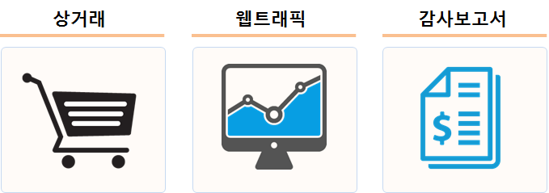
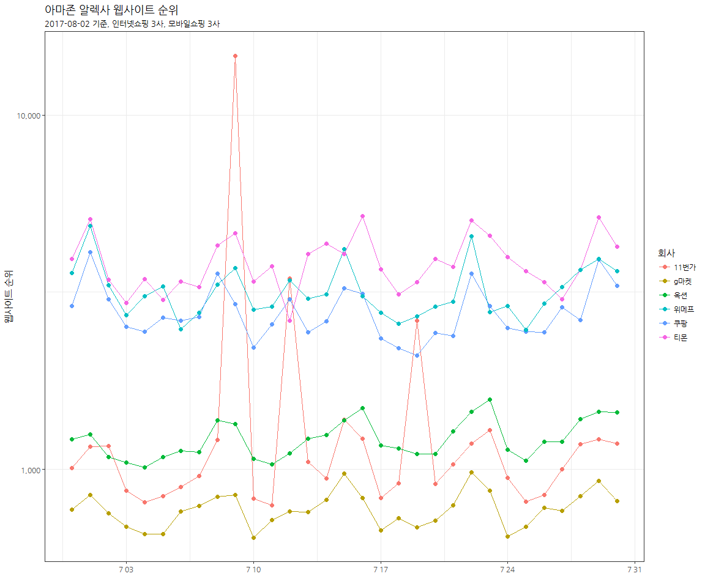
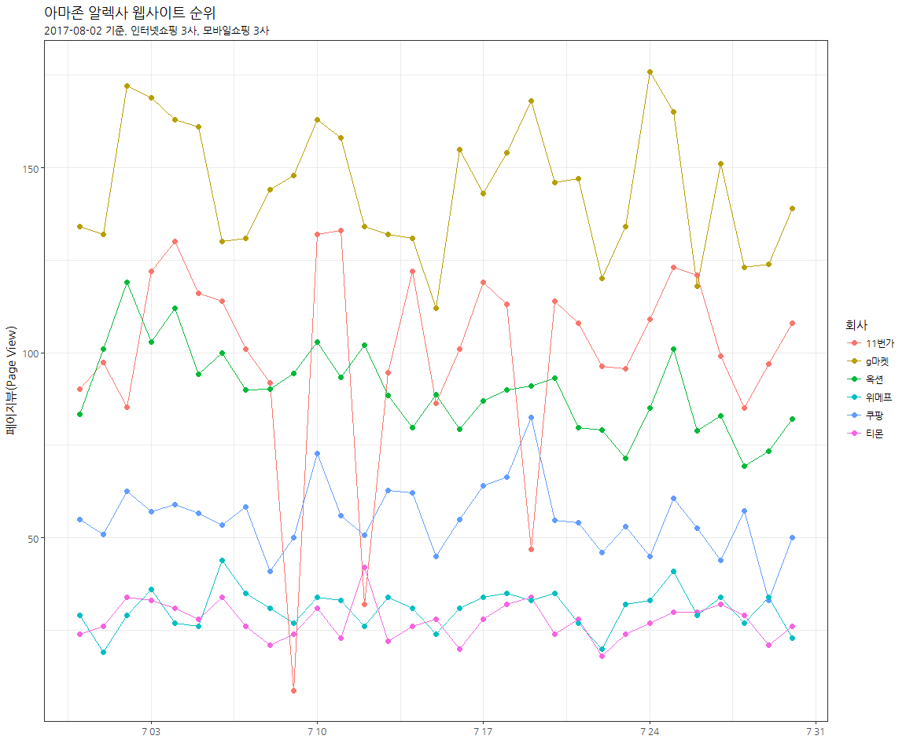
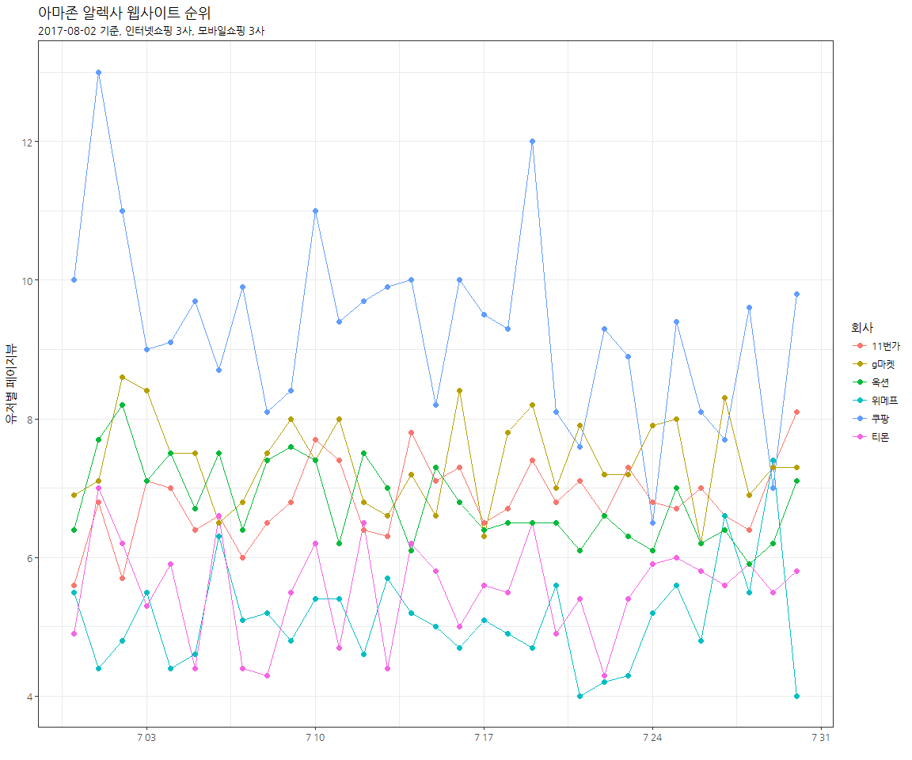

# xwMOOC 데이터 과학
xwMOOC  
2017-08-01  
 

## 1. 인터넷 쇼핑 사이트, 소셜 커머스

기존 인터넷 쇼핑 사이트에 더하여 소셜 커머스 3사가 신규로 의미있는 경쟁을 만들어 내고 있다.
[‘엇갈린 실적’ 위메프만 웃었다…쿠팡·티몬, 적자 더 늘어](http://www.ddaily.co.kr/news/article.html?no=154946) 기사는 
작년 감사보고서를 통해 쿠팡, 티몬, 위메프를 비교했다. 

그럼 이러한 재무정보 이전에 웹트래픽과 함께 상거래 정보를 파악하면 소셜 커머스 3사 뿐만 아니라 기존 인터넷 상거래 업체를 
통한 쇼핑에도 유용한 정보를 제공하게 된다.

## 2. 소셜 커머스 3사와 인터넷 커머스 3사 웹사이트 순위

### 2.1. 환경설정과 데이터 가져오기

웹트래픽 정보를 알렉사를 통해 수집하기 위한 사전 준비를 하고, 대상 웹사이트를 선별하여 
데이터프레임으로 준비한다. 

~~~{.r}
# 0. 환경설정 ---------------------------------------
library(aws.signature)
library(tidyverse)
library(aws.alexa)
library(rvest)
library(readxl)
library(purrr)
library(extrafont)
library(ggthemes)
loadfonts()

Sys.setenv("AWS_ACCESS_KEY_ID" = "AKIxxxxxxxxxxxxxxxxxxxxxx",
           "AWS_SECRET_ACCESS_KEY" = "wTQxxxxxxxxxxxxxxxxxxxxxxxxxxxxx")

# 1. 데이터 가져오기 --------------------------------

shop_df <- tribble(
    ~name, ~website,
    "쿠팡", "http://www.coupang.com/",
    "11번가", "http://www.11st.co.kr/",
    "티몬", "http://www.ticketmonster.co.kr/",
    "위메프", "http://www.wemakeprice.com/",
    "g마켓", "http://www.gmarket.co.kr/",
    "옥션", "http://www.auction.co.kr/"
)
~~~

### 2.2. 웹트래픽 정보 가져와서 정제

웹트래픽 정보를 가져와서 사람이 이해하기 편한 상태로 데이터를 전처리한다.

~~~{.r}
# 2. 웹페이지 데이터 -----------------------
## 2.1. 홈페이지 정보 긁어오기 -------------

Sys.setlocale("LC_ALL", "English")

shop_hp_info <- map_df(shop_df$website, url_info)

## 2.2. 웹페이지 활동성 데이터 ------------

shop_hp_alexa <- map(shop_df$website, traffic_history)

Sys.setlocale("LC_ALL", "Korean")

names(shop_hp_alexa) <- shop_df$name

for(i in seq_along(shop_df$name)) {
    shop_hp_alexa[[i]] <- shop_hp_alexa[[i]] %>% 
        mutate(company = shop_df$name[i])
}

shop_traffic_df <- map_df(shop_hp_alexa, bind_rows)

shop_traffic_df <- shop_traffic_df %>% 
    mutate(company = factor(company, levels=c("쿠팡", "위메프", "티몬", "11번가", "옥션", "g마켓")))

shop_traffic_df <- shop_traffic_df %>% 
    mutate(일자 = lubridate::ymd(date),
             페이지뷰 = as.numeric(page_views_per_million),
             유저당페이지뷰 = as.numeric(page_views_per_user),
             웹사이트순위 = as.numeric(rank),
             도달수 = as.numeric(reach_per_million)) %>% 
    dplyr::select(일자, 페이지뷰, 유저당페이지뷰, 웹사이트순위, 도달수, 회사=company)
~~~

AWS에서 받아온 정보도 꼼꼼히 살펴보고 [@Alexa](http://www.alexa.com/siteinfo)에서 상호 검증도 진행한다. 

~~~{.r}
listviewer::jsonedit(shop_hp_alexa, mode="view")
~~~

<!--html_preserve-->

<!--/html_preserve-->

## 3. 소셜 커머스/인터넷 커머스 3사 웹트래픽

### 3.1. 순위

아마존 알렉사 기준 웹사이트 순위(rank)를 ggplot으로 시각화한다.

~~~{.r}
# 3. 회사별 웹페이지 시각화 ------------

ggplot(shop_traffic_df, aes(x=일자, y=웹사이트순위, color=회사)) +
    geom_line() +
    geom_point(size=2) +
    scale_y_log10(labels = scales::comma) +
    theme_bw(base_family="NanumGothic") +
    labs(x="", y="웹사이트 순위", title="아마존 알렉사 웹사이트 순위",
         subtitle="2017-08-02 기준, 인터넷쇼핑 3사, 모바일쇼핑 3사")
~~~

### 3.2. 페이지뷰(PageView)

아마존 알렉사 기준 웹사이트 페이지뷰(PageView)를 ggplot으로 시각화한다.

~~~{.r}
ggplot(shop_traffic_df, aes(x=일자, y=페이지뷰, color=회사)) +
    geom_line() +
    geom_point(size=2) +
    scale_y_continuous(labels = scales::comma) +
    theme_bw(base_family="NanumGothic") +
    labs(x="", y="페이지뷰(Page View)", title="아마존 알렉사 웹사이트 순위",
         subtitle="2017-08-02 기준, 인터넷쇼핑 3사, 모바일쇼핑 3사")
~~~

### 3.3. 유저당 페이지뷰

아마존 알렉사 기준 웹사이트 유저당 페이지뷰를 ggplot으로 시각화한다.

~~~{.r}
ggplot(shop_traffic_df, aes(x=일자, y=유저당페이지뷰, color=회사)) +
    geom_line() +
    geom_point(size=2) +
    scale_y_continuous(labels = scales::comma) +
    theme_bw(base_family="NanumGothic") +
    labs(x="", y="유저별 페이지뷰", title="아마존 알렉사 웹사이트 순위",
         subtitle="2017-08-02 기준, 인터넷쇼핑 3사, 모바일쇼핑 3사")
~~~

