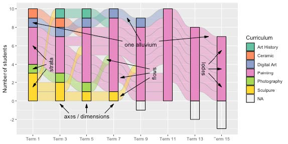
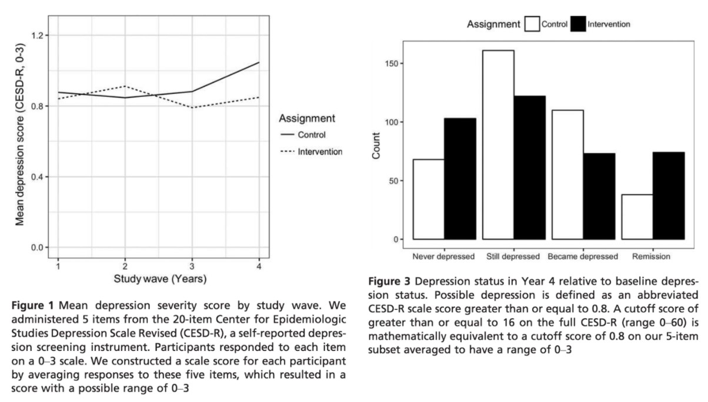

```{r setup, include=FALSE}
knitr::opts_chunk$set(echo = TRUE, warning=FALSE, message=FALSE,
                    comment="", digits = 3, tidy = FALSE, prompt = FALSE, fig.align = 'center')

library(reticulate)
library(tidyverse)

```


# 관련정보 {#categorical-alluvial}

- ["Graphing multivariate categorical data: The how, what and why of mosaic plots and alluvial diagrams", R Consortium](https://www.youtube.com/watch?v=fIB-FlTHheI&t=3992s)
- Brunson, Jason. (2020). ggalluvial: Layered Grammar for Alluvial Plots. Journal of Open Source Software. 5. 2017. 10.21105/joss.02017. 
- [Eric Green, "Alluvial Diagrams - Plotting pathways over time", towards data science](https://towardsdatascience.com/alluvial-diagrams-783bbbbe0195)
- 패키지
    - [ggalluvial: Alluvial Plots in 'ggplot2'](https://cran.r-project.org/web/packages/ggalluvial/index.html)
    - [alluvial: Alluvial Diagrams](https://cran.r-project.org/web/packages/alluvial/index.html)
    - [ggpcp: Generalized parallel coordinate plots with ggpcp](https://yaweige.github.io/ggpcp/)
    - [easyalluvial](https://github.com/erblast/easyalluvial/)
    - [riverplot: Sankey or Ribbon Plots](https://cran.r-project.org/web/packages/riverplot/index.html)

# 개념 {#main-concept}

`alluvial plot`을 이해하는데 다음 기본 구성요소를 이해하는 것이 도움이 된다.

- strata, or stacked bar plots, located in parallel along a (plotting) axis of (variable) axes
or dimensions
- alluvia, ribbons through strata that connect the categories of individual cases or cohorts
at different axes
- lodes, subdivisions of strata by their intersections with alluvia
- flows, segments of alluvia between strata


# 사례: `alluvial`

## 우울증 데이터

[Eric Green, "Alluvial Diagrams - Plotting pathways over time", towards data science](https://towardsdatascience.com/alluvial-diagrams-783bbbbe0195) 블로그에 게시된 alluvial 그래프 소개에 포함된 케냐 학생 우울증 데이터를 가져와서 시각화해보자. 전통적인 방식으로 다음과 같이 작업을 하여 설명을 달아 논문이나 보고서에 제출하게 된다.



2018년에 나온 블로그글이다 보니 다소 문법이 오래되어 최신 R 문법에 맞춰 일부 코드를 수정하여 경고나 오류가 없도록 한다.

```{r depression-dataset}
# load packages
library(tidyverse)

# get the data
data <- read_csv("https://raw.githubusercontent.com/ericpgreen/JCPP2018/master/data%20and%20replication%20files/input/dat.csv")

tidy_data <- data %>% 
# select the key variables for analysis
  select(ID, w1group, 
         w1_54a, w1_54b, w1_54d, w1_54e, w1_54f,
         w2_54a, w2_54b, w2_54d, w2_54e, w2_54f,
         w3_54a, w3_54b, w3_54d, w3_54e, w3_54f,
         w4_54a, w4_54b, w4_54d, w4_54e, w4_54f) %>%
# replace any NaN with NA
  mutate_at(vars(-ID, -w1group), ~ ifelse(is.nan(.), NA, .)) %>%
# rescale data range (1-4) to (0-3) by subtracting 1
  mutate_at(vars(-ID, -w1group), funs(. - 1)) %>%
# reverse code variable _54a
  mutate_at(vars(w1_54a, w2_54a, w3_54a, w4_54a), 
            funs(3 - .)) %>%
# construct depression severity
  rowwise() %>% 
  mutate(depress.1 = mean(c(w1_54a, w1_54b, w1_54d, w1_54e, w1_54f), 
                          na.rm=TRUE),
         depress.2 = mean(c(w2_54a, w2_54b, w2_54d, w2_54e, w2_54f), 
                          na.rm=TRUE),
         depress.3 = mean(c(w3_54a, w3_54b, w3_54d, w3_54e, w3_54f), 
                          na.rm=TRUE),
         depress.4 = mean(c(w4_54a, w4_54b, w4_54d, w4_54e, w4_54f), 
                          na.rm=TRUE)
  )  %>% 
  select(ID, w1group, depress.1, depress.2, depress.3, depress.4) %>% 
  pivot_longer(cols = depress.1:depress.4, names_to = "time", values_to = "depress") %>% 
 mutate(time = str_remove(time, "depress.")) %>%
# construct indicator of depression
  mutate(dep16 = ifelse(depress >= 0.8, 1, 0)) %>%
# construct indicator of depression at baseline for every obs using dep16
  group_by(ID) %>%
  mutate(dep16Base = dep16[time == 1L]) %>%
  ungroup() %>%
# categorize participants relative to baseline (time 1) 
  mutate(depStatus = case_when(dep16Base==1 & dep16==1 ~ "still depressed",
                               dep16Base==1 & dep16==0 ~ "remission",
                               dep16Base==0 & dep16==1 ~ "became depressed",
                               dep16Base==0 & dep16==0 ~ "never depressed",
                               TRUE ~ "missing")) %>%
# labels
  mutate(w1group = factor(w1group, levels=c(0, 1), labels=c("control", "intervention"))) %>%
# highlight two participants
  mutate(highlight = case_when(ID == 2 ~ 1,
                               ID == 3 ~ 2, 
                               TRUE ~ 3))  

tidy_data
```

## 전통적인 시각화


```{r visualization-traditional}
tidy_data %>% 
  filter(highlight > 2) %>% 
  ggplot() +
# plot N-2 as a base layer 
  geom_line(aes(time, depress, color=factor(highlight), group=ID), size=0.5) +
# highlight two individuals and plot them second to appear on top
  geom_line(data = tidy_data %>% filter(highlight < 3),
            aes(time, depress, color=factor(highlight), group=ID), size=1) +
  scale_color_manual(values=c("#ff0000", "#0000ff", "#D3D3D3")) +
  scale_size_manual(values=c(1, 1, 0.5)) +
  facet_wrap(~w1group) +
  theme_bw() + 
  theme(legend.position="none")
```

## alluvial 그래프

```{r graph-alluvial}
# convert back to wide for alluvial
alluvial_data <- tidy_data %>% 
# long to wide
  select(ID, w1group, time, depress, dep16) %>%
  pivot_longer(depress:dep16, names_to = "variable", values_to = "value") %>%
  # gather(key = variable, value = value, -ID, -w1group, -time) %>%
  unite(variableT, variable, time, sep=".") %>%
  spread(variableT, value) %>%
# alluvial prep
  filter(complete.cases(.)) %>%
  group_by(dep16.1, dep16.2, dep16.3, dep16.4) %>%
  summarise(n = n()) %>%
  ungroup() %>%
  mutate_at(vars(-n), funs(factor(., levels=c(0, 1), labels=c("not depressed", 
                                                           "depressed"))))
# alluvial diagram   
library(alluvial)
alluvial(alluvial_data[,1:4], freq=alluvial_data$n,
         col = ifelse(alluvial_data$dep16.4 == "depressed", "#ff0000", "#D3D3D3"),
         axis_labels = c("Year 1", "Year 2", "Year 3", "Year 4"),
         cex = 0.7)
```

# `ggalluvial`

`alluvial` 패키지와 `ggalluvial` 패키지 차이점은 다음과 같다.

- `alluvial` understands a variety of inputs (vectors, lists, data frames), whereas **ggalluvial** requires a single data frame;
- `alluvial` uses each variable of these inputs as a dimension of the data, whereas **ggalluvial** requires the user to specify the dimensions, either as separate aesthetics or as key-value pairs;
- `alluvial` produces both the alluvia, which link cohorts across multiple dimensions, and (what are here called) the strata, which partition the data along each dimension, in a single function; whereas **ggalluvial** relies on separate layers (stats and geoms) to produce strata, alluvia, and alluvial segments called lodes and flows.

## `wide` 폭 넓은 형태

```{r ggalluvial-titanic}
library(ggalluvial)
titanic_wide <- as_tibble(Titanic)

# # A tibble: 32 x 5
#    Class Sex    Age   Survived     n
#    <chr> <chr>  <chr> <chr>    <dbl>
#  1 1st   Male   Child No           0
#  2 2nd   Male   Child No           0
#  3 3rd   Male   Child No          35
#  4 Crew  Male   Child No           0
#  5 1st   Female Child No           0
#  6 2nd   Female Child No           0
#  7 3rd   Female Child No          17
#  8 Crew  Female Child No           0
#  9 1st   Male   Adult No         118
# 10 2nd   Male   Adult No         154
# # ... with 22 more rows

titanic_wide %>% 
  ggplot(aes(axis1 = Class, axis2 = Sex, axis3 = Age, y = n)) +
    scale_x_discrete(limits = c("Class", "Sex", "Age"), expand = c(.2, .05)) +
    geom_alluvium(aes(fill = Survived)) +
    geom_stratum() +
    geom_text(stat = "stratum", aes(label = after_stat(stratum))) +
    theme_minimal() +
    labs( x = "Demographic",
          title = "passengers on the maiden voyage of the Titanic",
          subtitle = "stratified by demographics and survival")
```


## `long` 긴 형태

```{r ggalluvial-titanic-long}
titanic_long <- to_lodes_form(titanic_wide,
              key = "demographic",
              axes = c("Class", "Sex", "Age"))

# # A tibble: 96 x 5
#    Survived     n alluvium demographic stratum
#    <chr>    <dbl>    <int> <fct>       <fct>  
#  1 No           0        1 Class       1st    
#  2 No           0        2 Class       2nd    
#  3 No          35        3 Class       3rd    
#  4 No           0        4 Class       Crew   
#  5 No           0        5 Class       1st    
#  6 No           0        6 Class       2nd    
#  7 No          17        7 Class       3rd    
#  8 No           0        8 Class       Crew   
#  9 No         118        9 Class       1st    
# 10 No         154       10 Class       2nd    
# # ... with 86 more rows

titanic_long %>% 
  ggplot(aes(x = demographic, stratum = stratum, alluvium = alluvium,
             y = n, label = stratum)) +
  geom_alluvium(aes(fill = Survived)) +
  geom_stratum() + 
  geom_flow(width = 1) +
  # geom_text(stat = "stratum", size = 3) +
  ggfittext::geom_fit_text(stat = "stratum", width = 1/4, min.size = 3) +
  scale_x_discrete(expand = c(0, .1)) +
  theme_void() +
    labs( x = "Demographic",
          title = "passengers on the maiden voyage of the Titanic",
          subtitle = "stratified by demographics and survival")
```


