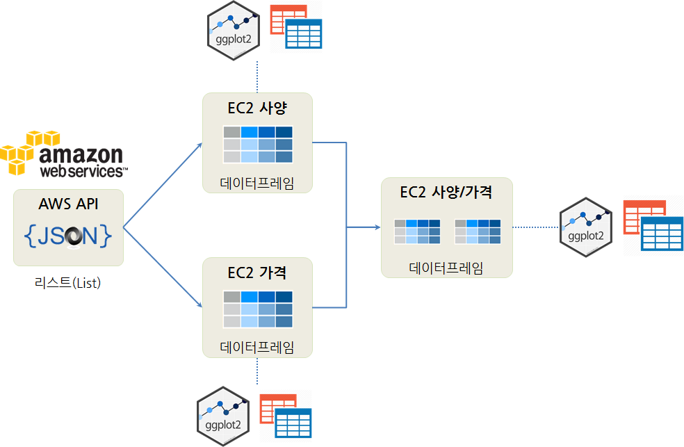

``` {r, include=FALSE}
source("tools/chunk-options.R")
knitr::opts_chunk$set(echo = TRUE, warning=FALSE, message=FALSE, fig.width=12)

library(httr)
library(jsonlite)
library(listviewer)
library(tidyverse)
library(stringr)
library(ggthemes)
library(extrafont)
loadfonts()

par(family = "NanumGothic")
```


## 1. AWS 웹서비스 가격 API {#aws-price-api}

아마존 웹 서비스(AWS) 가격 API (AWS Price List API)는 2015년 말 AWS 고객 요청으로 제공되게 되었다.
관련된 자세한 사항은 [Amazon Web Services 한국 블로그 - AWS Price List API 업데이트 – 리전별 가격 정보 제공](https://aws.amazon.com/ko/blogs/korea/aws-price-list-api-update-regional-price-lists/)를
참조한다.

AWS 웹서비스 가격을 수작업을 하는 것보다 API를 통해 가져오게 되면 필요에 따라 가격표를 다운로드하여 원하는 업무를 최적화할 수 있으며,
가격이 변동될 때마다 알람을 설정하여 실시간 대응도 가능하게 된다.

1. `https://pricing.us-east-1.amazonaws.com/offers/v1.0/aws/index.json` 파일을 먼저 확인한다.
1. `currentRegionIndexUrl`에서 서울 리젼(ap-northeast-2)을 확인한다.
1. `currentVersionUrl`에서 사양과 가격을 확인한다. 



AWS 가격목록 API를 통해 데이터를 긁어오면 JSON 형태 데이터로 가져오게 된다. 이를 EC2 사양과 가격으로 별도 구별되어 관리되기 때문에
두개의 데이터프레임으로 각기 만들어 개별적으로 분석을 진행하고 나서, EC2 사양과 가격을 병합하여 연관분석도 함께 진행한다.

## 2. AWS 서울리젼 EC2 사양과 가격 데이터 {#aws-ec2-spec-price}

### 2.1. API 데이터 긁어오기 {#aws-ec2-all}

`httr` 팩키지 `GET()` 함수를 기본으로 해서 결국 서울 리젼에서 제공하는 EC2 인스턴스 사양과 가격을 확인해보자.

1. `httr` 팩키지 `GET()` 함수를 통해 원데이터를 가져와서, 원본데이터를 읽고 해석할 수 있는 형태로 데이터를 가공한다.
1. `$offers$AmazonEC2$currentRegionIndexUrl` 을 다시 AWS 던져 EC2 컴퓨터, 서울리젼(ap-northeast-2) 정보를 확인한다.
1. `aws_ec2_json$regions$`ap-northeast-2`$currentVersionUrl`을 다시 던져 가격과 사양 정보를 가져온다.

``` {r aws-api}
# 0. 환경설정 -----------------------------------
# http://blog.zorangagic.com/2016/03/aws-pricing-api.html
# https://aws.amazon.com/ko/blogs/korea/aws-price-list-api-update-regional-price-lists/

# library(httr)
# library(jsonlite)
# library(listviewer)
# library(tidyverse)
# library(stringr)
# library(ggthemes)
# library(extrafont)
# loadfonts()

# 1. 데이터 긁어오기 ----------------------------
## 1.1. AWS API ---------------------------------
aws_api_url  <- "https://pricing.us-east-1.amazonaws.com"
path <- "offers/v1.0/aws/index.json"

aws_api_rd <- GET(url = aws_api_url, path = path)

aws_api_json <- rawToChar(aws_api_rd$content) %>% 
    fromJSON()

## 1.2. EC2 + 리젼   ----------------------------
aws_ec2_path <- aws_api_json$offers$AmazonEC2$currentRegionIndexUrl
aws_ec2_rd <- GET(url = aws_api_url, path = aws_ec2_path)

aws_ec2_json <- rawToChar(aws_ec2_rd$content) %>% 
    fromJSON()

## 1.3. EC2 + 리젼 + 사양/가격   ----------------------------
aws_ec2_region_path <- aws_ec2_json$regions$`ap-northeast-2`$currentVersionUrl
aws_ec2_region_rd <- GET(url = aws_api_url, path = aws_ec2_region_path)

aws_ec2_region_json <- rawToChar(aws_ec2_region_rd$content) %>% 
    fromJSON()

jsonedit(aws_ec2_region_json)
```

## 3. AWS 서울리젼 EC2 사양 데이터 분석 {#aws-ec2-spec}

JSON 파일을 R로 리스트 객체로 변환시켰다. 다음 단계로 이를 데이터 분석이 가능한 형태인 데이터프레임으로 
변환시키는 작업을 수행한다. 우선 사양에 대한 분석을 먼저 진행한다.

``` {r aws-api-spec-wrangling}
# 2. 데이터 전처리 ----------------------------
## 2.1. EC2 인스턴스 사양 ---------------------
aws_ec2_spec_name <- map(aws_ec2_region_json$products, "sku") 
length(aws_ec2_spec_name)

aws_ec2_spec_df <- map_df(aws_ec2_region_json$products, "attributes") 

aws_ec2_spec_df <- aws_ec2_spec_name %>% enframe() %>% 
    bind_cols(aws_ec2_spec_df) %>% 
    select(-value)

aws_ec2_spec_df <- aws_ec2_spec_df %>% 
    filter(servicecode != "AWSDataTransfer")
```

### 3.1. AWS 서울리젼에 제공되는 EC2 컴퓨터 CPU와 메모리 사양 {#aws-api-spec-wrangling}

AWS 서울 리전에 제공되는 EC2 인스턴스 사양 특히, CPU갯수와 메모리용량 관계에 대해 살펴보자.
이를 위해 문자열이 포함된 CPU, 메모리 변수를 제거하고 숫자형으로 변환시키고 나서,
이를 `ggplot`에 던져 AWS 서울리젼에 제공되는 EC2 컴퓨터 CPU와 메모리 사양을 시각화보고 관련성을 찾아본다.

``` {r aws-api-spec-ggplot}
# 3. 데이터 분석 ----------------------------

aws_ec2_spec_num_df <- aws_ec2_spec_df %>% select(vcpu, clockSpeed, memory) %>% 
    mutate(vcpu = as.numeric(vcpu)) %>% 
    # mutate(clockSpeed = as.numeric(str_extract(clockSpeed, "[0-9]+\\.[0-9]+"))) %>% 
    mutate(memory = as.numeric(str_extract(memory, "\\d{0,3}(\\.\\d{1,2})?")))

aws_ec2_spec_num_df %>% 
    ggplot(aes(x=vcpu, y=memory, color=clockSpeed)) +
    geom_point(size=2) +
    theme_bw(base_family = "NanumGothic") +
    labs(x="중앙처리장치갯수(CPU)", y="메모리 용량(GB)",
         title="AWS 제공하는 EC2 컴퓨터 사양") +
    scale_y_continuous(labels = scales::comma) +
    scale_x_log10()

aws_ec2_spec_num_df %>% 
    ggplot(aes(x=vcpu, y=memory, color=clockSpeed)) +
    geom_point(size=2) +
    theme_bw(base_family = "NanumGothic") +
    labs(x="중앙처리장치갯수(CPU)", y="메모리 용량(GB)",
         title="AWS 제공하는 EC2 컴퓨터 사양") +
    scale_y_continuous(labels = scales::comma)
```

## 4. AWS 서울리젼 EC2 가격 데이터 분석 {#aws-ec2-price}

가격 정보가 담겨있는 "pricePerUnit"을 찾아 이를 데이터프레임으로 변환시킨고,
사양정보가 담긴 데이터프레임과 병합(merge)하기 위해서 키값(`name`)도 함께 준비시킨다.

``` {r aws-api-price-wrangling}
# 2. EC2 인스턴스 사양 데이터 정제 ----------------------------
## 2.1. EC2 인스턴스 가격
aws_ec2_price_df <- aws_ec2_region_json$terms$OnDemand %>% 
    flatten() %>% 
    map(., "priceDimensions") %>% 
    flatten() %>% 
    map_df(., "pricePerUnit")

aws_ec2_price_label <- aws_ec2_region_json$terms$OnDemand %>% 
    flatten() %>% 
    map(., "priceDimensions") %>% 
    flatten() %>% 
    names()

aws_ec2_price_df <- aws_ec2_price_label %>% as_tibble() %>% 
    bind_cols(aws_ec2_price_df) 

aws_ec2_price_df <- aws_ec2_price_df %>% 
    mutate(name = str_extract(value, "^.*?(?=\\.)")) %>%
    mutate(USD = as.numeric(USD)) %>% 
    select(name, price=USD)
```

### 4.1. AWS 서울리젼에 제공되는 EC2 컴퓨터 가격 {#aws-api-price-viz}

가격에 대한 정보가 달러로 표기되어만 있어 이에 대해서는 히스토그램을 통해 EC2 인스턴스 전체적인 가격분포만 확인한다.

``` {r aws-api-price-ggplot}
# 3. 시각화 ----------------------------

ggplot(aws_ec2_price_df, aes(x=price)) +
    geom_histogram() +
    theme_bw(base_family = "NanumGothic") +
    labs(x="EC2 인스턴스 가격 (단위:$)", y="빈도수")
```

## 5. AWS 서울리젼 EC2 사양과 가격 데이터 분석 {#aws-ec2-spec-price}

가격정보(`aws_ec2_price_df`)와 사양정보(`aws_ec2_spec_df`)를 병합하여 사양과 가격에 대한 교차분석을 진행한다.
특히, AWS EC2 인스턴스에 대해서 크게 5가 범주로 나눠 용도별로 사용할 수 있도록 
정리가 되어있는 웹페이지가 있어 자세한 사항은 [Amazon EC2 인스턴스 유형](https://aws.amazon.com/ko/ec2/instance-types/)을 참조한다.
즉, EC2 인스턴스 유형을 CPU, 메모리, 스토리지 및 네트워킹 용량에 따라 다양한 조합을 하여 
애플리케이션에 따라 최적의 조합을 찾아내어 최고의 가성비를 찾아낼 수 있다.

- Mx.xxxxx 계열: 범용(M형 인스턴스) 
- Cx.xxxxx 계열: 컴퓨팅 (C형 인스턴스)
- Rx.xxxxx 계열: 메모리(R형 인스턴스)
- Ix.xxxxx 계열: 스토리지(I형 인스턴스)
- Gx.xxxxx 계열: 가속컴퓨팅형 (G형 인스턴스)


``` {r aws-api-price-spec-wrangling}
# 2. EC2 인스턴스 사양 + 가격 ---------------------
aws_ec2_spec_price_m <- inner_join(aws_ec2_price_df, aws_ec2_spec_df, by="name")

aws_ec2_spec_price_df <- aws_ec2_spec_price_m %>% 
    select(name, price, instanceType, memory, storage, vcpu, clockSpeed, physicalProcessor, ecu, operatingSystem, normalizationSizeFactor) %>% 
    mutate(price = as.numeric(price)) %>% 
    filter(price > 0) %>% 
    mutate(vcpu = as.numeric(vcpu)) %>% 
    mutate(memory = as.numeric(str_replace_all(memory, "GiB|Gib|,", ""))) %>% 
    filter(!is.na(instanceType), 
           !is.na(memory)) %>% 
    mutate(instance = str_extract(instanceType, "^.*?(?=\\.)")) %>% 
    mutate(instance = case_when(instance %in% c("c3", "c4") ~ "컴퓨팅(C형 인스턴스)",
                                instance %in% c("t2", "m3", "m4") ~ "범용(M형 인스턴스)",
                                instance %in% c("x1", "r3", "r4") ~ "메모리(R형 인스턴스)",
                                instance %in% c("i2", "i3", "d2") ~ "스토리지(I형 인스턴스)",
                                instance %in% c("g2", "g3", "p2") ~ "가속컴퓨팅형(G인스턴스)"
                                ))

aws_ec2_spec_price_df %>% 
    DT::datatable()
```

### 5.1. AWS 서울리젼에 제공되는 EC2 컴퓨터 사양과 성능 {#aws-api-price-spec-viz}

가격정보(`aws_ec2_price_df`)와 사양정보(`aws_ec2_spec_df`)를 병합하여 사양과 가격에 대한 교차분석을 시각화를 통해 수행한다.

``` {r aws-api-spec-price-ggplot}
# 3. EC2 사양과 가격 시각화 ---------------------
## 3.1. 메모리 용량과 가격
ggplot(aws_ec2_spec_price_df, aes(x=memory, y=price, color=instance)) +
    geom_point(size=2.0, alpha=0.3) +
    geom_jitter(width = 0.1, height = 0.1) +
    geom_smooth(se=FALSE) +
    theme_bw(base_family = "NanumGothic") +
    scale_x_log10() +
    labs(x="메모리용량 (단위:GB)", y="가격 (단위:$)", color="EC2 인스턴스 유형")
    
## 3.2. CPU 갯수와 가격
ggplot(aws_ec2_spec_price_df, aes(x=vcpu, y=price, color=instance)) +
    geom_point(size=2.0, alpha=0.3) +
    geom_jitter(width = 0.1, height = 0.1) +
    geom_smooth(se=FALSE) +
    theme_bw(base_family = "NanumGothic") +
    scale_x_log10() +
    labs(x="CPU 갯수", y="가격 (단위:$)", color="EC2 인스턴스 유형")

## 3.3. CPU 갯수 대역별 메모리 vs. 가격

aws_ec2_spec_price_df %>% mutate(cpu_group = case_when(vcpu <= 4 ~ "04개 이하",
                                                       vcpu >= 5 & vcpu <=8 ~ "05개 - 08개",
                                                       vcpu >= 9 & vcpu <=40 ~ "09개 - 40개",
                                                       vcpu >= 41 ~ "41개 이상")) %>% 
    ggplot(aes(x=memory, y=price, color=instance)) +
      geom_point(size=2.0, alpha=0.3) +
      geom_jitter(width = 3, height = 1) +
      geom_smooth(se=FALSE) +
      theme_bw(base_family = "NanumGothic") +
      labs(x="메모리용량 (단위:GB)", y="가격 (단위:$)", color="EC2 인스턴스 유형") +
      facet_wrap(~cpu_group, scale="free")
```