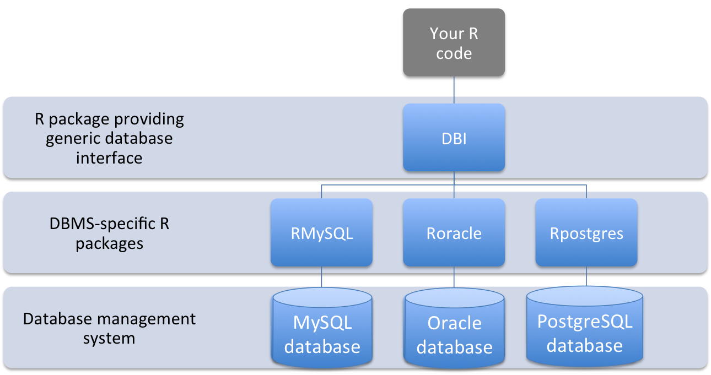

 

```{r, include=FALSE}
knitr::opts_chunk$set(echo = TRUE, message=FALSE, warning=FALSE,
                      comment="", digits = 3, tidy = FALSE, prompt = FALSE, fig.align = 'center')

library(tidyverse)
```

# 다양한 관계형 데이터베이스 {#dbi-database}

관계형 데이터베이스는 비정형 빅데이터가 출현하기 전까지 한시대를 풍비한 멋진 기술이다. 그렇다고 관계형 데이터베이스가 그렇다고 죽은 것은 아니며, 최근의 흐름을 보게 되면 주연은 아니고 빛나는 조연으로 계속 묵묵히 역할을 계속할 것으로 예상된다.


## `DBI` {#database-dbi-interface}

동일한 철학을 공유하고 있지만, 다양한 특징을 갖고 있는 관계형 데이터베이스를 추상화하여 표준 SQL 문법에 맞춰 데이터 작업을 수행할 수 있도록 R은 [`DBI`](https://github.com/r-dbi/DBI) 팩키지, 파이썬은 [SQLAlchemy](https://www.sqlalchemy.org/)를 사실상 표준으로 받아들이고 있다.

즉, DBI 팩키지를 통해서 서로 다른 관계형 데이터베이스에 대한 표준 인터페이스를 제공하기 때문에 DBMS 특화된 R 팩키지를 DBI 뒤에 두고 R코드에서 DBI만 바라보고 작업하면 삶의 질을 많이 높일 수 있다.



오라클, MS, Sqlite, 마리아 등 다양한 관계형 데이터베이스와 독립적으로 `DBI` 팩키지를 통해 공통적으로 수행되는 작업을 다음과 같이 정리할 수 있다.

|     DBI 함수    |                   기능 설명                                        |
|-----------------|--------------------------------------------------------------------|
| `dbDriver`      | 데이터베이스 인스턴스에 대한 드라이버 객체 생성 |
| `dbConnect`     | 데이터베이스 인스턴스에 연결                    |
| `dbListTables`  | 연결된 데이터베이스 인스턴스에 포함된 테이블 목록을 출력 |
| `dbListFields`  | 해당 테이블 내부 필드 목록을 출력 | 
| `dbSendQuery`   | 연결된 데이터베이스 인스턴스에 쿼리를 전달 |
| `dbFetch`       | SQL 쿼리 결과를 R 데이터프레임으로 가져옮  |
| `dbGetQuery`    | 데이터베이스 인스턴스로부터 데이터를 쿼리함과 동시에 가져옮 |
| `dbClearResult` | SQL 쿼리로 가져온 결과(result set)를 닫음 |
| `dbWriteTable`  | 신규 테이블을 데이터베이스 인스턴스에 기록함 |
| `dbRemoveTable` | 데이터베이스 인스턴스에서 테이블을 삭제함 |
| `dbDisconnect`  | 데이터베이스 인스턴스에 연결을 해제함 |

상기 작업에 적용되는 상용/공개/오픈 관계형 데이터베이스는 다음과 같다.
`bigrquery`는 관계형 데이터베이스를 포함하지만, `DBI` 팩키지를 통해 동일한 인터페이스를 제공한다.


| R 팩키지 | 데이터베이스 관리 시스템(DBMS) |
|------------------------------|--------------------------------------------------|
| [`ROracle`](https://cran.r-project.org/web/packages/ROracle/index.html) | 오라클(Oracle) |
| [`RMySQL`](https://cran.r-project.org/web/packages/RMySQL/index.html) | MySQL |
| [`RSQLServer`](https://github.com/imanuelcostigan/RSQLServer) |  Microsoft SQL Server |
| [`RPostgres`](https://github.com/r-dbi/RPostgres) | PostgreSQL |
| [`RSQLite`](https://github.com/r-dbi/RSQLite) |  SQLite |
| [`bigrquery`](https://github.com/r-dbi/bigrquery) |  Google's BigQuery |

## `DBI` 표준화 {#database-dbi-interface-syntax}
	
[Recent developments in R's database interface - Kirill Müller - SatRday 2018 Amsterdam](https://www.youtube.com/watch?v=XGwpvS6nQKw)	강연을 통해 서로 다른 데이터베이스 엔진을 DBI로 표준화가 필요한 사례로 세가지 데이터베이스를 들고 있다.
즉, SQLite는 데이터베이스가 파일이라 이를 지정하면 되고, 
Maria DB는 `.my.cnf` 파일 내부에 데이터베이스 접속 인증 정보를 저장해서 불러와야 하고,
PostgreSQL은 호스트와 포트를 지정해야 데이터베이스에 접속하여 인스턴스를 생성시키고 SQL 쿼리 작업이 가능하게 된다.
	
<div class = "row">
  <div class = "col-md-4">
**`SQLite`**

```{r dbi-sqlite, eval=FALSE}
con_sqlite <- dbConnect(
  RSQLite::SQLite()
  path =  "data/survey.db"
)
```

  </div>
  <div class = "col-md-4">
**`MariaDB`**

```{r dbi-mariadb, eval=FALSE}
con_mariadb <- dbConnect(
  RMariaDB::MariaDB()
  default.file =  "~/.my.cnf"
)
```

  </div>
  <div class = "col-md-4">
**`PostgreSQL`**

```{r dbi-postgresql, eval=FALSE}
con_postgresSQL <- dbConnect(
  RPostgres::Postgres()
  host = "..."
  port = "..."
)
```

  </div>
</div>	


# 사례 - `SQLite` [^rstudio-dbi] {#dbi-sqlite3}

[^rstudio-dbi]: [R interface for SQLite](https://github.com/r-dbi/RSQLite)

`r-dbi` [R interface for SQLite](https://github.com/r-dbi/RSQLite)를 참조하여 `DBI` 데이터베이스 인터페이스를 통해 대용량 데이터를 다루는 방법을 살펴보자.

## 데이터베이스 연결 {#dbi-database-connect}

로컬 컴퓨터에 저장된 `SQLite` 파일 데이터베이스가 있다면 이것을 불러와서 연결작업을 수행하고, 그렇지 않는 경우 메모리에 임의로 데이터베이스 연결을 생성시킨다.

```{r dbi-sqlite3-connect}
library(DBI)

con <- dbConnect(RSQLite::SQLite(), ":memory:")
# con <- dbConnect(RSQLite::SQLite(), "data/survey.db")

dbListTables(con)
```

## `irir` 테이블 {#dbi-database-iris}

`iris` 데이터프레임으로 `dbWriteTable` 함수를 사용해서 `iris` 동일한 명칭의 테이블을 생성한다.

```{r dbi-sqlite3}
dbWriteTable(con, "iris", iris)
dbListTables(con)
```

다음으로 테이블 구조를 파악하기 위해서 `dbListFields()` 함수를 전달한다.

```{r dbi-sqlite3-field}
dbListFields(con, "iris")
```

`dbReadTable()` 함수로 테이블 전체를 불러올 수도 있다.

```{r dbi-sqlite3-field-table}
# dbReadTable(con, "iris")
```

## SQL 쿼리 던지기 {#sql-query-send}

`SQL` 쿼리문을 작성하여 `dbSendQuery()` 함수에 실어 보내면 테이블에서 원하는 결과를 수월히 얻을 수 있다. `dbFetch()` 명령어를 통해서 데이터베이스 객체를 R 메모리 위의 데이터프레임으로 변환시킨다.

```{r dbi-sqlite3-query}
library(tidyverse)

iris_query <- "SELECT * 
          FROM iris 
          WHERE Species = 'setosa' 
            AND `Petal.Length` > 1.5"
iris_qry <- dbSendQuery(con, iris_query)
iris_df <- dbFetch(iris_qry)

DT::datatable(iris_df)
```

## 데이터베이스 연결 해제 {#sql-query-quit}

마지막으로 데이터베이스에 연결을 해제시킨다.

```{r dbi-sqlite3-query-quit}
dbDisconnect(con)
```

