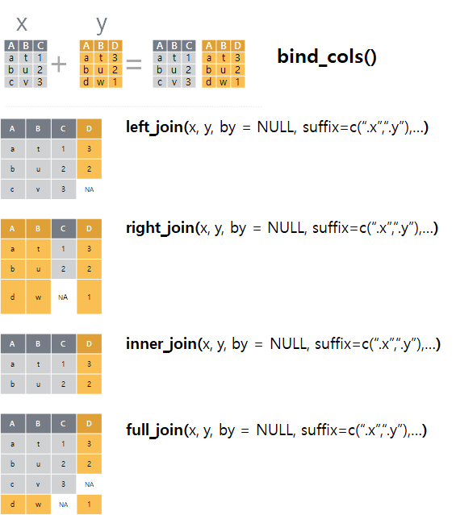

```{r, include=FALSE}
knitr::opts_chunk$set(echo = TRUE, warning=FALSE, message=FALSE,
                    comment="", digits = 3, tidy = FALSE, prompt = FALSE, fig.align = 'center')

library(tidyverse)
```


# 두-테이블 동사 [^dplyr-join-vignette] [^stat545-dplyr-join] [^tidyexplain-dplyr-join] {#two-table-verbs}

[^tidyexplain-dplyr-join]: [gadenbuie/tidyexplain, "Animations of tidyverse verbs using R, the tidyverse, and gganimate"](https://github.com/gadenbuie/tidyexplain)

[^dplyr-join-vignette]: [Two-table verbs](https://cran.r-project.org/web/packages/dplyr/vignettes/two-table.html)

[^stat545-dplyr-join]: [Cheatsheet for dplyr join functions](http://stat545.com/bit001_dplyr-cheatsheet.html)

매일 데이터를 분석하는 현업작업에서 단일 데이터프레임을 갖고 작업하는 경우는 매우 드물다.
보통 데이터 통계분석에는 수많은 테이블이 동원된다. 이런 경우 여러 형태를 갖는 테이블을 자유로이 다룰 수 있는 능력도 필수적이다.
`dplyr`에는 두 테이블 동사로 다음과 같은 세가지 유형을 지원한다.

- **Mutating Join**: 두 테이블을 결합할 때, 두 테이블 간에 행이 매칭되는 경우 첫번째 테이블에 새로운 변수를 추가.
- **Filtering Join**: 다른 테이블에 관측점이 매칭되냐 매칭되지 않냐에 근거하여 해당 테이블의 관측점을 필터링함.
- **집합연산**: 마치 집합원소처럼 데이터셋의 관측점을 집합연산으로 조합.
 
## 중요개념 {#two-table-verb-key-concept}

Base R에는 동일한 개념이 필요하여 `merge()` 함수로 기능을 제공하였지만, 
`dplyr` 두-테이블 동사를 활용해서도 동일한 기능을 구현하는데 문제가 없다.

<style>
div.blue { background-color:#e6f0ff; border-radius: 5px; padding: 10px;}
</style>
<div class = "blue">

**`merge`와 `dplyr` 두-테이블 동사**

기존 Base R에서 많이 사용된 `merge` 함수와 비교하여 `dplyr` 두-테이블 동사를 사용하는 경우 장점은 다음과 같다.

- 항상 행순서를 보존한다.
- 구문이 직관적이다.
- 관계형 데이터베이스, 스파크에도 적용할 수 있다.

</div>


테이블 두개를 결합할 경우 생각보다 다양한 조합의 수가 존재한다. 
두 테이블을 병합할 때, 먼저 두 테이블 모두 공통된 변수가 존재해야 된다. 
이를 키라고 부르는데, 두 테이블 모두 존재하기 때문에 명칭을 달리할 필요가 있다.
따라서, 기준 테이블의 키를 `기본키(Primary key)`, 병합할 테이블의 키를 `외래키(Foreign key)`라고 부른다.
기본키와 외래키를 꼭 한 필드로 고정할 필요는 없고, 다수 필드를 묶어 기본키와 외래키를 정의하는 것도 가능하다.


# 변수(칼럼): `mutate join` 유형 병합(join) {#two-table-join}

데이블 두개를 병합하는데 사용되는 기본 병합(join) 동사는 4개가 있다: `left_join()`, `right_join()`, `inner_join()`, `full_join()`
이런 유형의 두 데이터프레임 동사는 데이터프레임의 형태가 변형(`mutate`)된다는 특징이 있어 이를 `mutate join` 동사라고 한다.



먼저 `superheroes`, `publishers` 데이터프레임을 생성한다. 

```{r two-table-join}
library(tidyverse)
library(readr)

superheroes <- "
    name, alignment, gender,         publisher
 Magneto,       bad,   male,            Marvel
   Storm,      good, female,            Marvel
Mystique,       bad, female,            Marvel
  Batman,      good,   male,                DC
   Joker,       bad,   male,                DC
Catwoman,       bad, female,                DC
 Hellboy,      good,   male, Dark Horse Comics
"
superheroes <- read_csv(superheroes, trim_ws = TRUE, skip = 1)

publishers <- "
  publisher, yr_founded
         DC,       1934
     Marvel,       1939
      Image,       1992
"
publishers <- read_csv(publishers, trim_ws = TRUE, skip = 1)
```

## `inner_join()` {#two-table-inner-join} 

`inner_join()`은 두 테이블 모두에 존재하는 행이 있는 경우 이를 병합하여 새로운 테이블을 생성시킨다.

`inner_join(x,y)` 를 수행하면 기준 테이블의 모든 행을 반환시키는데 조건은 상대 테이블에 매칭되는 행이 있는 경우다.
두 테이블 사이 다수가 매칭되면, 모든 매칭 조합이 반환된다. 대표적인 `mutating join` 사례다.

```{r two-table-inner}
ijsp <- inner_join(superheroes, publishers)
```

```{r two-table-inner-table}
superheroes_kable <- knitr::kable(superheroes)
publishers_kable <- knitr::kable(publishers)
ijsp_kable <- knitr::kable(ijsp)
```

<table border = 1>
  <tr>
  <td valign="top">
  superheroes
  `r superheroes_kable`
</td>
  <td valign="top">
  publishers
  `r publishers_kable`
</td>
  <td valign="top">
  semi-join(x = superheroes, y = publishers)
  `r ijsp_kable`
</td>
</tr>
</table>


## `left_join()` {#two-table-left-join} 

```{r two-table-verb-left-join}
(ljsp <- left_join(superheroes, publishers))
```

```{r two-table-verb-left-join-table}
ljsp_kable <- knitr::kable(ljsp)
```

<table border = 1>
  <tr>
  <td valign="top">
  superheroes
  `r superheroes_kable`
</td>
  <td valign="top">
  publishers
  `r publishers_kable`
</td>
  <td valign="top">
  left_join(x = superheroes, y = publishers)
  `r ljsp_kable`
</td>
</tr>
</table>


## `right_join()` {#two-table-right-join} 

```{r two-table-verb-right-join}
(rjsp <- right_join(superheroes, publishers))
```


```{r two-table-verb-right-join-table}
rjsp_kable <- knitr::kable(rjsp)
```

<table border = 1>
  <tr>
  <td valign="top">
  superheroes
  `r superheroes_kable`
</td>
  <td valign="top">
  publishers
  `r publishers_kable`
</td>
  <td valign="top">
  right_join(x = superheroes, y = publishers)
  `r rjsp_kable`
</td>
</tr>
</table>


## `full_join()` {#two-table-verb-full-join}

```{r two-table-verb-full-join}
(fjsp <- full_join(superheroes, publishers))
```


```{r two-table-verb-full-join-table}
fjsp_kable <- knitr::kable(fjsp)
```

<table border = 1>
<tr>
<td valign="top">
  superheroes
  `r superheroes_kable`
</td>
<td valign="top">
  publishers
  `r publishers_kable`
</td>
<td valign="top">
  full_join(x = superheroes, y = publishers)
  `r fjsp_kable`
</td>
</tr>
</table>


# 변수(칼럼): `filtering join` 유형 병합(join) {#two-table-join-column}

`mutate join`과 달리 `filtering join`은 해당 데이터프레임에 새로운 것이 추가되거나 해서 변형되는 것이 아니라 다른 데이터프레임을 참조해서 필터링된다는 점에서 차이가 난다.


## `semi_join()` {#two-table-semi-join} 

`semi_join()`은 두 데이터프레임에 공통된 것을 필터로 찾아서 반환시키는 역할을 수행한다.

```{r two-table-verbs-semi-join}
(sjsp <- semi_join(superheroes, publishers))
```

```{r two-table-verbs-semi-join-print}
sjsp_kable <- knitr::kable(sjsp)
```

<table border = 1>
  <tr>
  <td valign="top">
  superheroes
  `r superheroes_kable`
</td>
  <td valign="top">
  publishers
  `r publishers_kable`
</td>
  <td valign="top">
  semi-join(x = superheroes, y = publishers)
  `r sjsp_kable`
</td>
</tr>
</table>


## `anti_join()` {#two-table-verb-anti-join}

`anti_join()`은 두 데이터프레임에 공통된 것을 필터로 찾아서 `semi_join()`과 정반대 역할을 수행한다. 즉, `anti_join(x, y)`은 필터링 조인으로 `y` 데이터프레임에 매칭되지 않지만 `x` 데이터프레임에 있는 칼럼만 반환한다.

```{r two-table-verb-anti-join}
(ajps <- anti_join(publishers, superheroes))
```

```{r two-table-verb-anti-join-table}
ajps_kable <- knitr::kable(ajps)
```

<table border = 1>
  <tr>
<tr>
<td valign="top">
publishers
`r publishers_kable`
</td>
<td valign="top">
superheroes
`r superheroes_kable`
</td>
<td valign="top">
anti_join(x = publishers, y = superheroes)
`r ajps_kable`
</td>
</tr>
</table>


# 관측점(행): 집합 연산자 {#row-set-operators}


변수(칼럼) 두 데이터프레임 동사와 비교하여 관측점(행) 두 데이터프레임 동사는 집합 연산자로 알려져 있으며 변수명이 동일한 상태에서 관측점에 대한 다양한 연산작업을 수행할 수 있고, 교집합(`intersect`), 차집합(`setdiff`), 합집합(`union`) 연산자가 많이 사용된다.

먼저, `x_df`, `y_df` 두 데이터프레임을 정의해보자.

```{r set-intersect}
library(tidyverse)

x_df <- tribble(
  ~A, ~B, ~C,
  "a", "t", 1,
  "b", "u", 2,
  "c", "v", 3
)

y_df <- tribble(
  ~A, ~B, ~C,
  "c", "v", 3,
  "d", "w", 4
)

x_df

y_df
```


## 교집합(`intersect`) {#row-set-operators-intersect}

교집합(`intersect`) 연산자는 한쪽 데이터프레임에서 다른 쪽 데이터프레임과 공통된 관측점을 추출할 때 사용된다.


데이터프레임 `x_df`에서 데이터프레임 `y_df` 차집합(`intersect`) 연산을 가하게 되면 공통된 행만 추출하게 된다.

```{r set-intersect-run}
intersect(x_df, y_df)
```

## 차집합(`setdiff`) {#row-set-operators-setdiff}

차집합(`setdiff`)은 첫번재 데이터프레임과 두번째 데이터프레임 간의 공통된 부분을 제거하고 차이가 나는 관측점만 남기게 된다.


```{r set-setdiff}
setdiff(x_df, y_df)
```

## 합집합(`union`) {#row-set-operators-union}

합집합(`union`)은 중복된 관측점은 제외시키고 `x_df`와 `y_df` 둘 중 한 데이터프레임에 있는 관측점을 추출시키게 된다.


```{r set-union}
setdiff(x_df, y_df)
```

# R과 SQL 비교 {#two-table-verb-comparison}

두 데이터프레임 동사와 SQL 구문을 비교하면 다음과 같다.

|    R	          |  SQL                                                               |
|:----------------|:-------------------------------------------------------------------|
| inner_join()    |  SELECT * FROM x JOIN y ON x.a = y.a                               |
| left_join()     |  SELECT * FROM x LEFT JOIN y ON x.a = y.a                          |
| right_join()    |  SELECT * FROM x RIGHT JOIN y ON x.a = y.a                         |
| full_join()     |  SELECT * FROM x FULL JOIN y ON x.a = y.a                          |
| semi_join()     |  SELECT * FROM x WHERE EXISTS (SELECT 1 FROM y WHERE x.a = y.a)    |
| anti_join()     |  SELECT * FROM x WHERE NOT EXISTS (SELECT 1 FROM y WHERE x.a = y.a)|
| intersect(x,y)  |  SELECT * FROM x INTERSECT SELECT * FROM y                         |
| union(x, y)     |  SELECT * FROM x UNION SELECT * FROM y                             |
| setdiff(x, y)   |  SELECT * FROM x EXCEPT SELECT * FROM y                            |

# 사례: 레고 [^dplyr-lego] {#dplyr-two-lego}

[LEGO Database - The LEGO Parts/Sets/Colors and Inventories of every official LEGO set](https://www.kaggle.com/rtatman/lego-database) 캐글 데이터셋은 BOM(bill of material)을 이해할 수 있는 매우 좋은 데이터일 뿐만 아니라 데이터 정규화가 잘 되어 있어 앞서 학습한 `dplyr` 두 데이터프레임 동사를 연마하기도 좋다. 그러기 전에 먼저 데이터에 대한 관계도를 살표보자.

[^dplyr-lego]: [xwMOOC 데이터 과학: "R과 SQL - 소프트웨어 카펜트리"](https://statkclee.github.io/data-science/data-handling-sql.html)

```{r datamodelr}
## 데이터 가져오기 -----
colors          <-read_csv("data/colors.csv")
sets            <-read_csv("data/sets.csv")
parts           <-read_csv("data/parts.csv")
inventory_sets  <-read_csv("data/inventory_sets.csv")
inventories     <-read_csv("data/inventories.csv")
inventory_parts <-read_csv("data/inventory_parts.csv")
themes          <-read_csv("data/themes.csv")
part_categories <-read_csv("data/part_categories.csv")

## 데이터 테이블 -----

library(datamodelr)

## 테이블
lego_tbl <- dm_from_data_frames(colors, sets, parts, inventory_sets, inventories, inventory_parts, themes, part_categories)

dm_create_graph(lego_tbl, rankdir = "BT", col_attr = c("column", "type"))

## 테이블 관계
lego_tbl <- dm_add_references(
  lego_tbl,
  
  inventory_sets$inventory_id  == inventories$id,
  inventory_sets$set_num       == sets$set_num,
  inventory_parts$inventory_id == inventories$id,
  inventory_parts$part_num     == parts$part_num,
  inventory_parts$color_id     == colors$id,
  parts$part_cat_id            == part_categories$id,
  sets$theme_id                == themes$id
)

lego_graph <- dm_create_graph(lego_tbl, rankdir = "RL", col_attr = c("column", "type"))

dm_render_graph(lego_graph)

## 테이블 그룹

table_segments <- list(
  Product = c("sets", "themes"),
  Parts = c("parts", "part_categories"),
  Inventory = c("inventories", "inventory_parts", "inventory_sets")
)

lego_tbl_segment <- dm_set_segment(lego_tbl, table_segments)
lego_graph_segment <- dm_create_graph(lego_tbl_segment, rankdir = "BT", view_type = "keys_only")
dm_render_graph(lego_graph_segment)
```

## 아이언맨과 슈퍼맨 BOM 비교 {#dplyr-two-lego-comparison}

먼저, 아이언맨 가장 오래된 레고상품과 가장 최신 레고상품 BOM을 비교해보자. 이를 위해서 먼저 아이언맨을 `sets`에서 찾아낸다.

```{r lego-ironman}
iron_super_man <- sets %>% 
  filter(set_num %in% c("4529-1", "4526-1"))
iron_super_man
```

마블을 대표하는 아이언맨과 DC코믹스를 대표하는 배트맨의 부품을 상호비교해보자.

- [4529-1  iron man  2012](https://brickset.com/sets/4529-1/Iron-Man)
- [4526-1  batman  2012](https://brickset.com/sets/4526-1/Batman)


## 부품 공용화 {#dplyr-two-lego-comparison-common}

해당 셋트에서 부품을 찾아내기 위해서는 `inventories`를 통해 `inventory_parts`, 그리고 마지막으로 `parts` 테이블을 합쳐야 해당 세트를 구성하는 부품을 찾아낼 수 있다.

```{r lego-ironman-parts}
full_info <- iron_super_man %>% 
  left_join(inventories, by="set_num") %>% 
  left_join(inventory_parts, by=c(id = "inventory_id")) %>% 
  left_join(parts, by="part_num", suffix=c("_hero", "_part"))

batman_df <- full_info %>% 
  filter(name_hero == "Batman") %>% 
  select(part_num, name_part)

ironman_df <- full_info %>% 
  filter(name_hero == "Iron Man") %>% 
  select(part_num, name_part)
```

- 요약표
    - 배트맨 총 부품수: `r nrow(batman_df)`
    - 아이언맨 총 부품수: `r nrow(ironman_df)`
    - 공통부품수: `r intersect(batman_df, ironman_df) %>% nrow()`

즉, `intersect()` 함수를 통해 공통으로 사용되는 부품을 찾아내서 부품공용화를 이뤄낼 수 있다.

# 자기 자신과 병합(self-join) {#dplyr-self-join}

자기 자신과 병합(self-join)을 하게 되면 위계(hierarchy)를 갖는 데이터를 쭉 펼칠 수 있는 형태 즉, 부모-자식(parent-child) 관계가 한 행에 위치할 수 있게 된다.

반지의 제왕(The Lord of the Rings)은 톨킨의 3부작 소설로 구성되어 있다. 데이터를 보게 되면 `parent_id`가 있고 `id`를 통해서 부모-자식 관계를 확인할 수 있다.

```{r self-join-lord-of-the-rings}
themes %>% 
  filter(str_detect(name, "The Lord of the Rings|The Fellowship of the Ring|The Two Towers|The Return of the King"))
```

이와 같은 위계가 있는 데이터를 `self join` 즉, 자기자신과 병합하게 되면 데이터를 한 행에 부모-자식 관계를 명시적으로 나타낼 수 있게 된다. 

```{r self-join}
themes %>% 
  inner_join(themes, by=c(parent_id = "id"), suffix = c("_child", "_parent")) %>% 
  filter(str_detect(name_parent, "The Lord of the Rings"))
```


