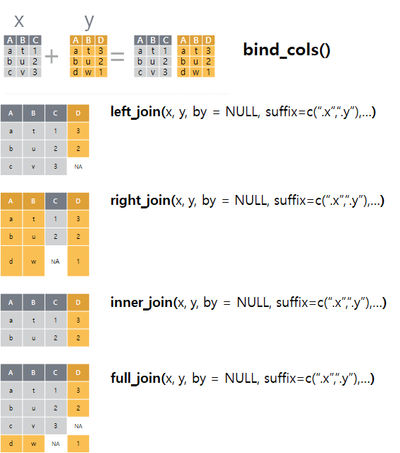

> ## 학습 목표 {.objectives}
>
> * 

## 1. 두-테이블 동사 [^dplyr-join-vignette] [^stat545-dplyr-join]

[^dplyr-join-vignette]: [Two-table verbs](https://cran.r-project.org/web/packages/dplyr/vignettes/two-table.html)

[^stat545-dplyr-join]: [Cheatsheet for dplyr join functions](http://stat545.com/bit001_dplyr-cheatsheet.html)

매일 데이터를 분석하는 현업작업에서 단일 데이터프레임을 갖고 작업하는 경우는 매우 드물다.
보통 데이터 통계분석에는 수많은 테이블이 동원된다. 이런 경우 여러 형태를 갖는 테이블을 자유로이 다룰 수 있는 능력도 필수적이다.
`dplyr`에는 두 테이블 동사로 다음과 같은 세가지 유형을 지원한다.

- **Mutating Join**: 두 테이블을 결합할 때, 두 테이블 간에 행이 매칭되는 경우 첫번째 테이블에 새로운 변수를 추가.
- **Filtering Join**: 다른 테이블에 관측점이 매칭되냐 매칭되지 않냐에 근거하여 해당 테이블의 관측점을 필터링함.
- **집합연산**: 마치 집합원소처럼 데이터셋의 관측점을 집합연산으로 조합.

### 1.1. 중요개념

Base R에는 동일한 개념이 필요하여 `merge()` 함수로 기능을 제공하였지만, 
`dplyr` 두-테이블 동사를 활용해서도 동일한 기능을 구현하는데 문제가 없다.

> ### `merge`와 `dplyr` 두-테이블 동사 {.callout}
>
> 기존 Base R에서 많이 사용된 `merge` 함수와 비교하여 `dplyr` 두-테이블 동사를 사용하는 경우 장점은 다음과 같다.
>
> - 항상 행순서를 보존한다.
> - 구문이 직관적이다.
> - 관계형 데이터베이스, 스파크에도 적용할 수 있다.

테이블 두개를 결합할 경우 생각보다 다양한 조합의 수가 존재한다. 
두 테이블을 병합할 때, 먼저 두 테이블 모두 공통된 변수가 존재해야 된다. 
이를 키라고 부르는데, 두 테이블 모두 존재하기 때문에 명칭을 달리할 필요가 있다.
따라서, 기준 테이블의 키를 `기본키(Primary key)`, 병합할 테이블의 키를 `외래키(Foreign key)`라고 부른다.
기본키와 외래키를 꼭 한 필드로 고정할 필요는 없고, 다수 필드를 묶어 기본키와 외래키를 정의하는 것도 가능하다.

## 2. 기본 병합(join)

데이블 두개를 병합하는데 사용되는 기본 병합(join) 동사는 4개가 있다: `left_join()`, `right_join()`, `inner_join()`, `full_join()`

먼저 `superheroes`, `publishers` 데이터프레임을 생성한다. 

~~~{.r}
suppressPackageStartupMessages(library(dplyr))
~~~

~~~{.output}
Warning: package 'dplyr' was built under R version 3.2.5

~~~

~~~{.r}
library(readr)
~~~

~~~{.output}
Warning: package 'readr' was built under R version 3.2.5

~~~

~~~{.r}
superheroes <- "
    name, alignment, gender,         publisher
 Magneto,       bad,   male,            Marvel
   Storm,      good, female,            Marvel
Mystique,       bad, female,            Marvel
  Batman,      good,   male,                DC
   Joker,       bad,   male,                DC
Catwoman,       bad, female,                DC
 Hellboy,      good,   male, Dark Horse Comics
"
superheroes <- read_csv(superheroes, trim_ws = TRUE, skip = 1)

publishers <- "
  publisher, yr_founded
         DC,       1934
     Marvel,       1939
      Image,       1992
"
publishers <- read_csv(publishers, trim_ws = TRUE, skip = 1)
~~~

### 2.1. `inner_join()` 

`inner_join()`은 두 테이블 모두에 존재하는 행이 있는 경우 이를 병합하여 새로운 테이블을 생성시킨다.

`inner_join(x,y)` 를 수행하면 기준 테이블의 모든 행을 반환시키는데 조건은 상대 테이블에 매칭되는 행이 있는 경우다.
두 테이블 사이 다수가 매칭되면, 모든 매칭 조합이 반환된다. 대표적인 `mutating join` 사례다.

~~~{.r}
ijsp <- inner_join(superheroes, publishers)
~~~

~~~{.output}
Joining, by = "publisher"

~~~

<table border = 1>
<tr>
	<td valign="top">
		superheroes
		

|name     |alignment |gender |publisher         |
|:--------|:---------|:------|:-----------------|
|Magneto  |bad       |male   |Marvel            |
|Storm    |good      |female |Marvel            |
|Mystique |bad       |female |Marvel            |
|Batman   |good      |male   |DC                |
|Joker    |bad       |male   |DC                |
|Catwoman |bad       |female |DC                |
|Hellboy  |good      |male   |Dark Horse Comics |

</td>
	<td valign="top">
	  publishers
	  

|publisher | yr_founded|
|:---------|----------:|
|DC        |       1934|
|Marvel    |       1939|
|Image     |       1992|

</td>
	<td valign="top">
		inner_join(x = superheroes, y = publishers)
	  

|name     |alignment |gender |publisher | yr_founded|
|:--------|:---------|:------|:---------|----------:|
|Magneto  |bad       |male   |Marvel    |       1939|
|Storm    |good      |female |Marvel    |       1939|
|Mystique |bad       |female |Marvel    |       1939|
|Batman   |good      |male   |DC        |       1934|
|Joker    |bad       |male   |DC        |       1934|
|Catwoman |bad       |female |DC        |       1934|

</td>
</tr>
</table>

### 2.2. `semi_join()`

~~~{.r}
(sjsp <- semi_join(superheroes, publishers))
~~~

~~~{.output}
Joining, by = "publisher"

~~~

~~~{.output}
# A tibble: 6 × 4
      name alignment gender publisher
     <chr>     <chr>  <chr>     <chr>
1   Batman      good   male        DC
2    Joker       bad   male        DC
3 Catwoman       bad female        DC
4  Magneto       bad   male    Marvel
5    Storm      good female    Marvel
6 Mystique       bad female    Marvel

~~~

<table border = 1>
  <tr>
  <td valign="top">
  superheroes
  

|name     |alignment |gender |publisher         |
|:--------|:---------|:------|:-----------------|
|Magneto  |bad       |male   |Marvel            |
|Storm    |good      |female |Marvel            |
|Mystique |bad       |female |Marvel            |
|Batman   |good      |male   |DC                |
|Joker    |bad       |male   |DC                |
|Catwoman |bad       |female |DC                |
|Hellboy  |good      |male   |Dark Horse Comics |

</td>
  <td valign="top">
  publishers
  

|publisher | yr_founded|
|:---------|----------:|
|DC        |       1934|
|Marvel    |       1939|
|Image     |       1992|

</td>
  <td valign="top">
  semi-join(x = superheroes, y = publishers)
  

|name     |alignment |gender |publisher |
|:--------|:---------|:------|:---------|
|Batman   |good      |male   |DC        |
|Joker    |bad       |male   |DC        |
|Catwoman |bad       |female |DC        |
|Magneto  |bad       |male   |Marvel    |
|Storm    |good      |female |Marvel    |
|Mystique |bad       |female |Marvel    |

</td>
</tr>
</table>

### 2.3. `left_join()`

~~~{.r}
(ljsp <- left_join(superheroes, publishers))
~~~

~~~{.output}
Joining, by = "publisher"

~~~

~~~{.output}
# A tibble: 7 × 5
      name alignment gender         publisher yr_founded
     <chr>     <chr>  <chr>             <chr>      <int>
1  Magneto       bad   male            Marvel       1939
2    Storm      good female            Marvel       1939
3 Mystique       bad female            Marvel       1939
4   Batman      good   male                DC       1934
5    Joker       bad   male                DC       1934
6 Catwoman       bad female                DC       1934
7  Hellboy      good   male Dark Horse Comics         NA

~~~

<table border = 1>
  <tr>
  <td valign="top">
  superheroes
  

|name     |alignment |gender |publisher         |
|:--------|:---------|:------|:-----------------|
|Magneto  |bad       |male   |Marvel            |
|Storm    |good      |female |Marvel            |
|Mystique |bad       |female |Marvel            |
|Batman   |good      |male   |DC                |
|Joker    |bad       |male   |DC                |
|Catwoman |bad       |female |DC                |
|Hellboy  |good      |male   |Dark Horse Comics |

</td>
  <td valign="top">
  publishers
  

|publisher | yr_founded|
|:---------|----------:|
|DC        |       1934|
|Marvel    |       1939|
|Image     |       1992|

</td>
  <td valign="top">
  left_join(x = superheroes, y = publishers)
  

|name     |alignment |gender |publisher         | yr_founded|
|:--------|:---------|:------|:-----------------|----------:|
|Magneto  |bad       |male   |Marvel            |       1939|
|Storm    |good      |female |Marvel            |       1939|
|Mystique |bad       |female |Marvel            |       1939|
|Batman   |good      |male   |DC                |       1934|
|Joker    |bad       |male   |DC                |       1934|
|Catwoman |bad       |female |DC                |       1934|
|Hellboy  |good      |male   |Dark Horse Comics |         NA|

</td>
</tr>
</table>

### 2.4. `anti_join()`

~~~{.r}
(ajsp <- anti_join(superheroes, publishers))
~~~

~~~{.output}
Joining, by = "publisher"

~~~

~~~{.output}
# A tibble: 1 × 4
     name alignment gender         publisher
    <chr>     <chr>  <chr>             <chr>
1 Hellboy      good   male Dark Horse Comics

~~~

<table border = 1>
  <tr>
  <td valign="top">
  superheroes
  

|name     |alignment |gender |publisher         |
|:--------|:---------|:------|:-----------------|
|Magneto  |bad       |male   |Marvel            |
|Storm    |good      |female |Marvel            |
|Mystique |bad       |female |Marvel            |
|Batman   |good      |male   |DC                |
|Joker    |bad       |male   |DC                |
|Catwoman |bad       |female |DC                |
|Hellboy  |good      |male   |Dark Horse Comics |

</td>
  <td valign="top">
  publishers
  

|publisher | yr_founded|
|:---------|----------:|
|DC        |       1934|
|Marvel    |       1939|
|Image     |       1992|

</td>
  <td valign="top">
  anti_join(x = superheroes, y = publishers)
  

|name    |alignment |gender |publisher         |
|:-------|:---------|:------|:-----------------|
|Hellboy |good      |male   |Dark Horse Comics |

</td>
</tr>
</table>

### 2.5. `anti_join()`

> anti_join(x, y): Return all rows from x where there are not matching values in y, keeping just columns from x. This is a filtering join.

~~~{.r}
(ajps <- anti_join(publishers, superheroes))
~~~

~~~{.output}
Joining, by = "publisher"

~~~

~~~{.output}
# A tibble: 1 × 2
  publisher yr_founded
      <chr>      <int>
1     Image       1992

~~~

We keep __only__ publisher Image now (and the variables found in `x = publishers`).

<table border = 1>
  <tr>
<tr>
<td valign="top">
publishers

|publisher | yr_founded|
|:---------|----------:|
|DC        |       1934|
|Marvel    |       1939|
|Image     |       1992|

</td>
<td valign="top">
superheroes

|name     |alignment |gender |publisher         |
|:--------|:---------|:------|:-----------------|
|Magneto  |bad       |male   |Marvel            |
|Storm    |good      |female |Marvel            |
|Mystique |bad       |female |Marvel            |
|Batman   |good      |male   |DC                |
|Joker    |bad       |male   |DC                |
|Catwoman |bad       |female |DC                |
|Hellboy  |good      |male   |Dark Horse Comics |

</td>
<td valign="top">
anti_join(x = publishers, y = superheroes)

|publisher | yr_founded|
|:---------|----------:|
|Image     |       1992|

</td>
</tr>
</table>

### 2.6. `full_join()`

~~~{.r}
(fjsp <- full_join(superheroes, publishers))
~~~

~~~{.output}
Joining, by = "publisher"

~~~

~~~{.output}
# A tibble: 8 × 5
      name alignment gender         publisher yr_founded
     <chr>     <chr>  <chr>             <chr>      <int>
1  Magneto       bad   male            Marvel       1939
2    Storm      good female            Marvel       1939
3 Mystique       bad female            Marvel       1939
4   Batman      good   male                DC       1934
5    Joker       bad   male                DC       1934
6 Catwoman       bad female                DC       1934
7  Hellboy      good   male Dark Horse Comics         NA
8     <NA>      <NA>   <NA>             Image       1992

~~~

<table border = 1>
<tr>
<td valign="top">
  superheroes
  

|name     |alignment |gender |publisher         |
|:--------|:---------|:------|:-----------------|
|Magneto  |bad       |male   |Marvel            |
|Storm    |good      |female |Marvel            |
|Mystique |bad       |female |Marvel            |
|Batman   |good      |male   |DC                |
|Joker    |bad       |male   |DC                |
|Catwoman |bad       |female |DC                |
|Hellboy  |good      |male   |Dark Horse Comics |

</td>
<td valign="top">
  publishers
  

|publisher | yr_founded|
|:---------|----------:|
|DC        |       1934|
|Marvel    |       1939|
|Image     |       1992|

</td>
<td valign="top">
  full_join(x = superheroes, y = publishers)
  

|name     |alignment |gender |publisher         | yr_founded|
|:--------|:---------|:------|:-----------------|----------:|
|Magneto  |bad       |male   |Marvel            |       1939|
|Storm    |good      |female |Marvel            |       1939|
|Mystique |bad       |female |Marvel            |       1939|
|Batman   |good      |male   |DC                |       1934|
|Joker    |bad       |male   |DC                |       1934|
|Catwoman |bad       |female |DC                |       1934|
|Hellboy  |good      |male   |Dark Horse Comics |         NA|
|NA       |NA        |NA     |Image             |       1992|

</td>
</tr>
</table>

## R과 SQL 비교

|    R	          |  SQL                                                               |
|:----------------|:-------------------------------------------------------------------|
| inner_join()    |  SELECT * FROM x JOIN y ON x.a = y.a                               |
| left_join()     |  SELECT * FROM x LEFT JOIN y ON x.a = y.a                          |
| right_join()    |  SELECT * FROM x RIGHT JOIN y ON x.a = y.a                         |
| full_join()     |  SELECT * FROM x FULL JOIN y ON x.a = y.a                          |
| semi_join()     |  SELECT * FROM x WHERE EXISTS (SELECT 1 FROM y WHERE x.a = y.a)    |
| anti_join()     |  SELECT * FROM x WHERE NOT EXISTS (SELECT 1 FROM y WHERE x.a = y.a)|
| intersect(x,y)  |  SELECT * FROM x INTERSECT SELECT * FROM y                         |
| union(x, y)     |  SELECT * FROM x UNION SELECT * FROM y                             |
| setdiff(x, y)   |  SELECT * FROM x EXCEPT SELECT * FROM y                            |

