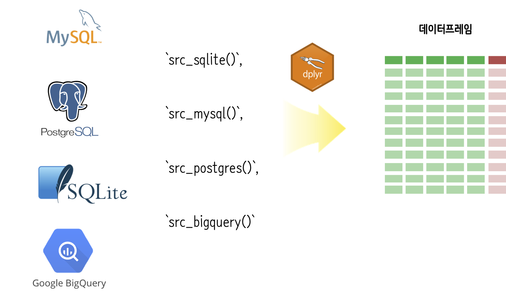

 

```{r, include=FALSE}
source("tools/chunk-options.R")

knitr::opts_chunk$set(echo = TRUE, message=FALSE, warning=FALSE,
                      comment="", digits = 3, tidy = FALSE, prompt = TRUE, fig.align = 'center')

library(tidyverse)
```


`dplyr` 힘과 데이터베이스 힘을 연결해서, `dplyr` 동사 혹은 SQL 질의문을 작성하여 최종 작업문을 통해 데이터프레임을 만들어 낸다. 즉, `collect()` 함수를 적용하여 최종 `tbl_df()` 데이터프레임을 생성시킨다.

# 속도와 저장공간 [^duke-dplyr-sql] {#dplyr-sql}

[^duke-dplyr-sql]: [dplyr and SQL](http://www2.stat.duke.edu/~cr173/Sta523_Fa14/dplyr_sql.html)

구글 제프딘이 모든 엔지니어가 알아야 되는 속도[^jeff-dean-number]에 대해 언급한 내용을 정리하면 다음과 같다.

[^jeff-dean-number]: [Numbers everyone should know](http://surana.wordpress.com/2009/01/01/numbers-everyone-should-know/)

|      작업             |   소요 시간                   |
|-----------------------|:-----------------------------:|
| L1 캐쉬 참조          |	0.5 ns                      |
| L2 캐쉬 참조          |     7 ns                      |
| 주기억장치 참조       |   100 ns                      |
| 주기억장치에서 1 MB 순차적 읽어 오기 | 250,000 ns     |
| 디스크 검색           | 10,000,000 ns                 |
| 네트워크에서 1 MB 순차적 읽어 오기 |  10,000,000 ns   |

$10 GB$ 텍스트 파일이 있는 경우 전체 데이터를 순차적으로 불러 읽어들이는 경우 소요되는 시간은 다음과 같다.

- 파일을 메모리로 올리는 경우 소요 시간
    - $10 GB \times (250 \mu s / 1 MB) = 0.25초$
- 디스크에서 파일에 접근하는데 필요한 소요 시간     
    - $10 GB \times (250 \mu s / 1 MB) = 30초$

만약 $100 GB$ 크기 데이터 파일이 있는 경우는 다음과 같다.

- 파일을 메모리로 올리는 경우 소요 시간
    - $100 GB \times (250 \mu s / 1 MB) = 2.5초$
- 디스크에서 파일에 접근하는데 필요한 소요 시간     
    - $100 GB \times (250 \mu s / 1 MB) = 300초$

일반적으로 메모리 비용이 훨씬 디스크 비용보다 비싼 반면에, 속도는 메모리가 디스크에 비해 훨씬 빠른다.
데이터가 커지게 되면 메모리를 크게하면 되지만, 메모리는 한정되어 확장성에 문제가 있다.

이에 대한 해법이 **블록(block)**을 생성하는 것인데 아이디어는 유사한 속성을 갖는 행을 집단으로 묶어
한번에 다수 행을 불러 읽어들이는 것이다. 이런 경우 최적 크기를 결정해야 되는데 풀고자 하는 문제에 따라 
최적 크기를 결정하면 된다.


# 공공 데이터를 `dplyr`과 SQLite 작업 [^vignettes-dplyr-db] [^duke-dplyr-sql] {#dplyr-public-api}

[^vignettes-dplyr-db]: [`dplyr` Databases](https://cran.r-project.org/web/packages/dplyr/vignettes/databases.html)

[교통위반(Traffic Violations)](https://catalog.data.gov/dataset?res_format=JSON) 데이터를 `read_csv` 함수로 불러읽어 온다.
데이터프레임으로 불러읽어들이면 행이 826,934, 열이 35개가 되고 366 MB가 된다.
저장공간도 문제가 되고 나중에 작업을 위해 바이너리로 압축하여 저장하면 $\frac{1}{10}$ 이상 크기가 줄어 27 MB까지 줄일 수 있다.


``` {r dplyr-import}
#-----------------------------------------------------------------------------------------
# 01. 환경설정
#-----------------------------------------------------------------------------------------
library(readr)
library(dplyr)
library(RSQLite)

#-----------------------------------------------------------------------------------------
# 02. 빅데이터 가져오기 및 데이터베이스 연결
#-----------------------------------------------------------------------------------------
# https://catalog.data.gov/dataset?res_format=JSON
park_df <- read_csv("https://data.montgomerycountymd.gov/api/views/4mse-ku6q/rows.csv?accessType=DOWNLOAD")

park_df %>% 
  write_rds("data/park_df.rds")
```



`dplyr`에서 데이터베이스에 연결하는 경우 `src_sqlite()`, `src_mysql()`, `src_postgres()`, `src_bigquery()`를  사용한다. 이렇게 생성된 객체는 내부에 데이터가 전혀없는 깡통이다.
데이터가 크지 않는 경우 `copy_to` 명령어를 사용해서 마치 R 데이터프레임처럼 원데이터베이스에서 R로 데이터를 흘린다.

``` {r dplyr-sqlite}
# SQLite 데이터베이스에 연결
dir.create("data/db", showWarnings = FALSE)
db <- src_sqlite("data/park_db.sqlite3", create = TRUE)
system("ls data/*.sqlite3")

# SQLite 데이터베이스를 R로 가져옮
park_sqlite  <- copy_to(db, park_df, temporary = FALSE, overwrite = TRUE)
park_sqlite
```

`tbl(db, sql("SELECT * FROM park LIMIT 10"))` 와 같이 `db` 연결에 `sql()` 인자를 넣어 직접 SQL
질의문을 실행시키는 것도 가능하다.

``` {r dplyr-sqlite-sql}
#-----------------------------------------------------------------------------------------
# 03. SQL 쿼리문 작성
#-----------------------------------------------------------------------------------------
# 1. SQL 문장을 바로 전달가능

tbl(db, sql("SELECT * FROM park_df LIMIT 10"))
```

`dplyr` 동사를 순차적으로 적용시킬 경우 지연연산(lazy evaluation)이 적용되어 바로 실행되지 않고,
`collect`를 실행할 경우 한방에 실행된다. 결국 최종 질의문 혹은 `dplyr` 동사들이 완성되면
`collect()`를 사용하여 데이터베이스에서 데이터를 쭉 끌어내서 `tble_df()`을 생성시키는 작업흐름을 갖추게 된다.


``` {r dplyr-sqlite-lazyeval}
# 2. dplyr 동사를 순차적으로 적용하여 한방에 실행

select_sql <- dplyr::select(park_sqlite, Agency, Accident, Belts, Geolocation) 
filter_sql <- dplyr::filter(select_sql, Accident=="No" & Belts =="No")
arrange_sql <- dplyr::arrange(filter_sql, Agency)
collect(arrange_sql)
```