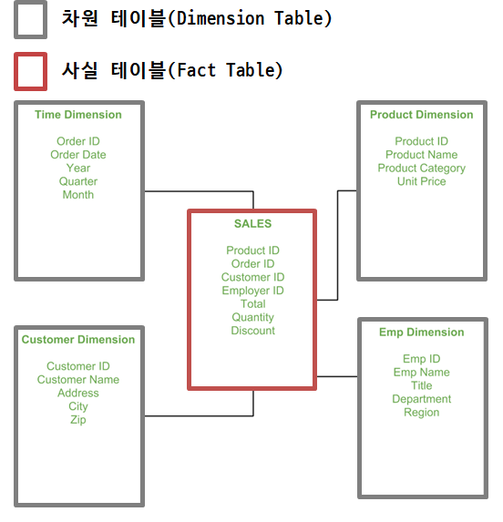

```{r, include=FALSE}
knitr::opts_chunk$set(echo = TRUE, warning=FALSE, message=FALSE,
                    comment="", digits = 3, tidy = FALSE, prompt = FALSE, fig.align = 'center')

library(tidyverse)
```


# 스타 스키마 [^위키-star-schema] {#star-schema}

[^위키-star-schema]: [위키백과, "스타 스키마"](https://ko.wikipedia.org/wiki/%EC%8A%A4%ED%83%80_%EC%8A%A4%ED%82%A4%EB%A7%88)

스타 스키마를 이용하면, 전통적인 관계형 데이터베이스를 활용하여 다차원 데이터베이스(MDDB) 기능을 할 수 있다. 
거의 모든 분야에서 관계형 데이터베이스가 가장 일반적인 데이터 관리 시스템이기 때문에, 관계형 데이터베이스를 사용하여 다-차원 뷰를 구현한다는 점은 매우 매력적이다. 스타 스키마(star schema, 조인 스키마라고도 불림)는 데이터 웨어하우스 스키마 중 가장 단순한 종류의 스키마인데, 한 개의 사실 테이블과 주 키 및 각 차원과 추가적인 사실들로 이루어진 스키마이다. 스타 스키마라는 이름은 스키마 다이어그램이 마치 "별표(star)" 모양이라 해서 붙인 이름이다.

스타 스키마는 사실 테이블(fact tables)과 차원 테이블(dimension tables)로 구분된다.
이는 surrogate key, surrogate primary key로 서로 연결된다. [^star-schema-example]

[^star-schema-example]: [GeeksforGeeks, "Star Schema in Data Warehouse modeling"](https://www.geeksforgeeks.org/star-schema-in-data-warehouse-modeling/)

{#id .class width="57%"}

# 스타 스키마 샘플 데이터 {#star-schema-case}

- [Mubin M. Shaikh (2013-09-15), "Create First Data WareHouse", Code Project for those who code](https://www.codeproject.com/Articles/652108/Create-First-Data-WareHouse)
- [An example mini data warehouse for python project stats, template for new projects](https://github.com/mara/mara-example-project)
- [`postgreSQL` Sample Database](https://wiki.postgresql.org/wiki/Sample_Databases)
- ["Jan Gorecki" (2015-06-29), Data Warehousing with R](https://cdn.rawgit.com/jangorecki/jangorecki.github.io/master/_posts/Data-Warehousing-with-R.html#1)
 