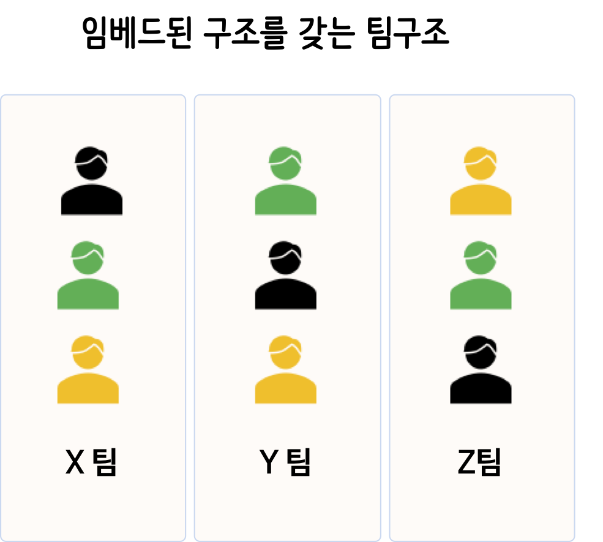
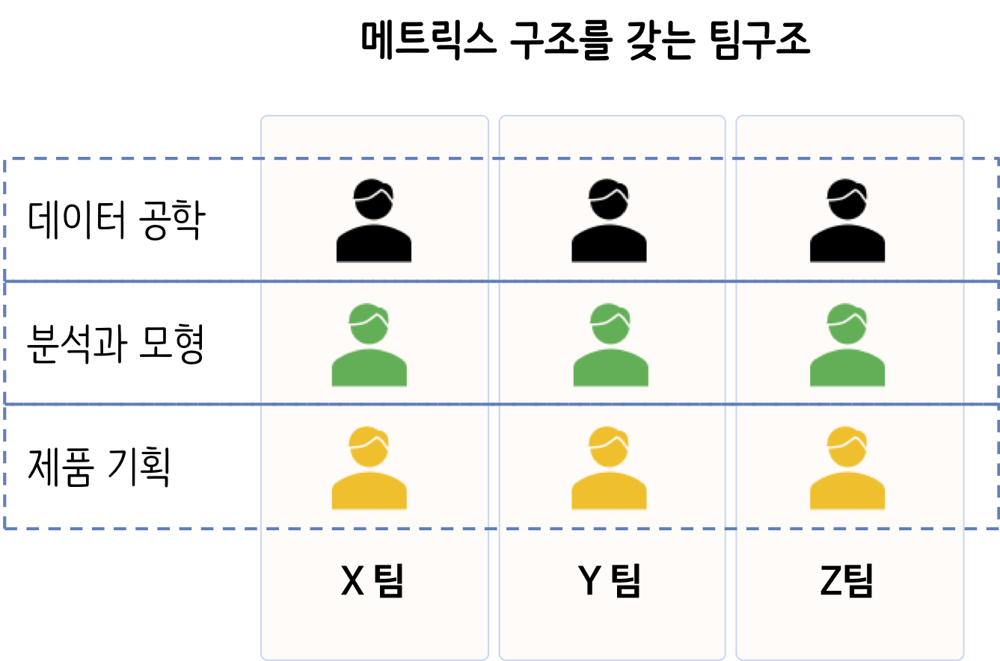

``` {r, include=FALSE}
knitr::opts_chunk$set(echo = TRUE, warning=FALSE, message=FALSE,
                    comment="", digits = 3, tidy = FALSE, prompt = FALSE, fig.align = 'center')

library(tidyverse)
```

# 데이터 과학 [^wiki-data-science] {#data-science-definition}

[^wiki-data-science]: [Wikipedia, "Data Science"](https://en.wikipedia.org/wiki/Data_science)

**데이터 과학(data science)**이란, 데이터 마이닝(Data Mining)과 유사하게 정형, 비정형 형태를 포함한 다양한 데이터로부터 지식과 인사이트를 추출하는데 과학적 방법론, 프로세스, 알고리즘, 시스템을 동원하는 융합분야다. 데이터 과학은 데이터를 통해 실제 현상을 이해하고 분석하는데 통계학, 데이터 분석, 기계학습과 연관된 방법론을 통합하는 개념으로 정의되기도 한다.

데이터의 구체적인 내용이 아닌 서로 다른 성질의 내용이나 형식의 데이터에 공통으로 존재하는 성질, 또는 그것들을 다루기 위한 기술의 개발에 착안점을 둔다는 특징을 가진다.

튜링상을 수상한 짐그레이(Jim Gray) 박사는 데이터 과학은 과학의 네번째 패러다임으로 정의하고 과학(경험, 이론, 계산, 그리고 이제 데이터)에 관한 모든 것이 바뀌고 있는데 이유는 **정보기술**과 **데이터 범람(data deluge)** 때문이라고 주장했다.

즉 다양한 데이터 예를 들면, [텍스트 데이터](https://statkclee.github.io/text/), [직사각형 데이터](https://statkclee.github.io/data-science/), [시각 데이터](https://statkclee.github.io/trilobite/), [네트워크 데이터](https://statkclee.github.io/network/), [공간정보 지도데이터](https://statkclee.github.io/spatial/), [문서 데이터](https://statkclee.github.io/comp_document/) 등 다양한 형태의 데이터를 취합할 수 있고 이용할 수 있는 세상이 되었다.

이와 더불어 [빅데이터 - 스파크](https://statkclee.github.io/bigdata/),
[고성능 컴퓨팅(HPC)](https://statkclee.github.io/hpc/), [클라우드 컴퓨팅 소개](https://statkclee.github.io/cloud-genomics-kr/), [R 병렬 프로그래밍](https://statkclee.github.io/parallel-r/) 등을 활용하여 정형, 비정형 데이터를 저장하고 쉽게 접근하여 가치를 창출할 수 있는 시대가 열렸다.

다양한 데이터를 발굴하고 이를 축적하게 되면 이를 이해할 수 있는 과정이 필요하다. 이를 위해서 반듯이 필요한 것이 시각화다. 이유는 복잡한 것을 단순화하고 빠른 시간내에 의사결정을 내릴 수 있는 최대한 많은 정보를 제공하는 것이 시각화외에는 다른 대안이 없다. 이를 위해 필요한 것이 대쉬보드다. [시각화](https://statkclee.github.io/viz/)에 대한 다양한 구성요소가 준비되어 있다.

마지막으로 가치를 창출하는 부분이 필요한데 이를 위해서 다양한 비즈니스 사례를 발굴하고 적합한 통계모형/기계학습(machine learning) 알고리즘 적용과 다양한 통계 이론과 기법을 적용하는 것이 필수적이다. 이를 위해서 [xwMOOC 기계학습](https://statkclee.github.io/ml/), [데이터 과학 - 모형](https://statkclee.github.io/model/)에 대한 내용을 참고한다. 그외 빠질 수 없는 내용이 [Deep Learning](https://statkclee.github.io/deep-learning/), [자연어 처리(NLP)](https://statkclee.github.io/nlp2/)를 들 수 있다.


{#id .class width="100%"}

## 데이터로 할 수 있는 것 {#data-science-to-do}

데이터가 엄청 많아지고 유용한 가치를 많이 지니고 있는 것은 알겠는데 데이터로 할 수 있는 것은 무엇인지 알아보자.

1. 현재 상태를 객관적으로 파악할 수 있다.
    - 기술통계량, 시각화, 대쉬보드 등
1. 비정상적인 사건을 탐지할 수 있음
    - 이상점(outlier), 이상점 탐지(Anomaly Detection), 사기 탐지(fraud detection) 
1. 특정 사건과 행태에 대한 원인을 파악하고 진단을 내릴 수 있음.
    - A/B 검정, 인과관계(Causality)
1. 장래 사건을 예측할 수 있음
    - 예측모형(predictive model), 기계학습

- [손씻기 그리고 통계 - 제멜바이스](https://statkclee.github.io/statistics/stat-hand-washing.html)
- [기념비적인 시각화 역작모음](https://statkclee.github.io/viz/viz-history.html)
- [독일 V2로켓 영국 폭격](https://statkclee.github.io/statistics/stat-flying-bomb-poisson.html)
- [러시아 월드컵(2018) - 한국 vs 독일](https://statkclee.github.io/viz/viz-worldcup-germany.html)
- [코에이(Koei) 삼국지 국력비교](https://statkclee.github.io/data-product/dp-koei-three-kingdoms-powers.html)
- [저출산과 소요예산 - 상관관계](https://statkclee.github.io/viz/viz-low-birth-rate.html)
- [지진해일 대피소 - `crosstalk`](https://statkclee.github.io/viz/viz-earthquake-shelter.html)
- [일본 캐릭터와 미디어 프랜차이즈](https://statkclee.github.io/data-product/dp-media-franchise.html)
- [서울대학교 경제학과 - 국내박사배출](https://statkclee.github.io/data-product/data-journalism-snu.html)
- [국세 세금 데이터 분석](https://statkclee.github.io/election/election_tax_EDA.html)

## 데이터 과학의 불편한 진실 [^data-science-fun-fact] {#data-science-fact}

[^data-science-fun-fact]: [Kamil Bartocha (lastminute.com), "The Inconvenient Truth About Data Science"](https://www.kdnuggets.com/2015/05/data-science-inconvenient-truth.html)

[KDnuggets](https://www.kdnuggets.com/) 웹사이트에 올라오 데이터과학에 관한 불편한 진실을 김재광 교수님께서 번역하여 페이스북에 공유해 주셨습니다. 가슴이 아프지만, 실무를 해보신 분은 누구나 공감하실 듯 싶습니다. 하지만, 채용과정에서는 딥러닝, 인공지능, 기계학습에 대한 내용에 상당부분 할애하는 경우가 다반사입니다. 그런 이유인지 몰라도 신입직원에 대한 조기 퇴사율이 높은 이유를 설명하는데 도움이 될 듯 싶습니다.

1. Data is never clean.(데이터는 절대 깨끗하지 않다)
1. You will spend most of your time cleaning and preparing data.(당신은 분석의 대부분의 시간을 전처리 단계에서 보내게 될 것이다)
1. 95% of tasks do not require deep learning (95% 일은 Deep Learning을 필요로 하지 않는다)
1. In 90% of cases generalized linear regression will do the trick. (실제 분석의 90%는 GLM으로 해결된다 )
1. Big Data is just a tool (빅 데이터는 단지 도구일 뿐이다)
1. You should embrace the Bayesian approach (당신은 베이지안 접근을 포용해야 한다)
1. No one cares how you did it. (사용자 입장에서는 네가 어떤 방법을 사용했는가는 중요하지 않다.) 
1. Academia and business are two different worlds. (학계와 산업계는 서로 다른 세계이다)
1. Presentation is key - be a master of Power Point (프리젠테이션이 핵심이다: PowerPoint 의 마스터가 되라)
1. All models are false, but some are useful. (모든 모델은 틀렸다, 하지만 몇몇은 유용하다)
1. There is no fully automated Data Science. You need to get your hands dirty (완전 자동화된 데이터 과학같은 것은 없다. 인간이 개입되어야 할 부분이 있다)

# 데이터 {#data-science-data}

컴퓨터(Computer)라는 말은 라틴어 "computare"에 기원하는데 계산하고 더한다는 의미를 지니지만, 오늘날 컴퓨터는 거대한 계산기 이상이다. 컴퓨터는 도서관도 될 수 있으며, 컴퓨터로 글을 작성할 수 있으며, 정보를 찾고, 음악을 연주하고, 영화를 보기도 한다. 그런데 컴퓨터는 이렇게 많은 모든 정보를 어떻게 저장할까? 믿든 믿지 않든, 컴퓨터는 단지 두 가지만을 사용한다. 영('0')과 일('1')이다.

빅데이터 시대를 맞이하여 데이터는 도처에 널려있지만, 오랜 세월을 거치면서 데이터는 나름대로 각자의 서식지를 가지게 되었다. 과거 중요한 정보를 관계형 데이터베이스에서 체계적으로 관리를 했다면 빅데이터를 저장하고, 처리하고, 활용할 수 있는 기술은 비약적으로 발전하여 최근에는 이를 기계학습과 딥러닝 기법을 적용하여 혁신을 통해 가치를 창출하는 단계로 넘어가고 있다.

{#id .class width="77%"}

## 데이터 라이선스 {#data-license}

데이터는 사방에 널려 있지만, 데이터를 특정 기준으로 나눠서 살펴보는 것은 향후 지적재산과 연관된 다양한 법적인 문제를 푸는데도 큰 도움이 된다.

- 데이터
    - 공공 데이터 (public open data): 오픈되서 누구나 사용할 수 있는 공개된 데이터
        - API 형태로 제공되는 데이터: [금융감독원 DART](https://dart.fss.or.kr/dsap001/intro.do), [공공데이터 포털 API](https://www.data.go.kr/), 위키백과사전, ...
        - 공공 데이터
            - 국제기구: [Federal Reserve Bank](https://research.stlouisfed.org/docs/api/fred/), UN, WTO, 월드 뱅크, ...
        - 통계청: 인구총조사 및 다양한 조사 [KOSIS](http://kosis.kr/index/index.do)
        - 정부기관: 기상청, 환경부, 국토부 ... [공공데이터 포털](https://www.data.go.kr/)
    - 회사 데이터 (private company data): 특정 회사가 수집하여 의사결정을 내리기 위한 목적으로 수집된 비공개 상용 데이터
        - 회사 운영에 필요한 내부 ERP 데이터
        - 온라인 웹사이트를 운영할 경우 웹로그 데이터
        - SNS도 운영할 경우 페이스북, 유튜브, 트위터 등 SNS 데이터
        - 콜센터도 운영할 경우 콜센터에서 수집되는 데이터
        - 채봇도 운영할 경우 채팅관련 텍스트 및 관련 비정형 데이터
        - 고객 설문: 제품과 서비스 판매 및 고객 만족도 향상을 위한 전통적인 설문 데이터

## 데이터 유형과 크기 {#data-types}

다양한 데이터 원자재를 산업화하는 과정은 다양한 실험을 통해서 성공했던 과학기술이 비로소 사업화와 접목되어야만 가능하다. 데이터 원자재를 엑셀과 같은 형태의 직사각형 정형데이터로 가정한다면 이를 사업화하여 얻을 수 있는 실익은 크지 않다. 하지만, 데이터 원자재를 정형 데이터 뿐만 아니라, 이미지, 텍스트, 소리, 로드 등 비정형 데이터를 아우르게 되면 데이터의 양과 질, 그리고 속도에서 비교가 되지 않는 고도의 기술을 필요로 한다.

- [직사각형 데이터](https://statkclee.github.io/data-science/)
    - 양적자료(量的資料, quantitative data): 측정할 수 있는 자료, 예를 들어 키, 몸무게, 속도 등
    - 질적자료(質的資料, qualitative data): 관측은 되지만, 측정할 수 없는 자료, 예를 들어, 색상, 성별 등
- [텍스트 데이터](https://statkclee.github.io/text/)
- [네트워크 데이터](https://statkclee.github.io/network/)
- [지리정보 데이터](https://statkclee.github.io/spatial/)
- [이미지 데이터](https://statkclee.github.io/trilobite/)
- 오디오/소리 데이터
- ...

빅데이터(Big Data)를 일반적으로 통칭해서 말하고 있지만, 보통 노트북이나 PC에 저장해서 메모리로 불러 작업할 수 있는 데이터를 Small Data, 성능 좋은 서버에 데이터를 저장하고 RDMBS 등으로 관리하여 필요한 경우 SQL로 가져오는데 적합한 데이터를 중간 데이터라고 한다. 빅데이터는 처리에 많은 비용이 수반되기 때문에 클라우드 저장소 예를 들어 S3와 같이 저렴(?)한 Object Storage에 저장하고 클러스터를 구축하여 임시로 데이터를 분석, 모형개발 등 작업을 마친 후에 동원된 컴퓨팅 자원을 회수하는 방식으로 처리되는 데이터를 빅데이터로 통칭한다.

|       구분     |               데이터 크기                                     |
|----------------|---------------------------------------------------------------|
| 작은 데이터    | 노트북 컴퓨터 메모리에 저장할 수 있는 크기 : **10 GB 이하**       |
| 중간 데이터    | 서버 컴퓨터 메모리에 저장할 수 있는 크기 : **10 GB -- 5 TB**  |
| 매우 큰 데이터 | 컴퓨터 한대 메모리에 저장될 수 없는 크기 : **5 TB이상**          |

## 데이터 공학 {#data-science-data-engineering}

본격적으로 데이터 과학을 시작하려면 데이터 저장부터 시작해야 한다. 이를 위해서 데이터 유형을 먼저 파악하고 이에 맞는 적절한 저장방법을 찾아야 한다.

- 정형 데이터: 관계형 데이터베이스(Relational Database)
    - 쿼리 언어: SQL
- 비정형 데이터: 문서 데이터베이스(Document Database)
    - 쿼리 언어: NoSQL

이제 데이터를 추출하고, 변환하고, 적재하는 ETL(Extract Transform Load) 작업을 유닉스 쉘의 CRON 혹은 아파치 Airflow 등을 통해서 자동화 시킨다. 관련된 자세한 사항은 다음 링크를 참조한다.

[데이터 공학(Data Engineering)](https://statkclee.github.io/sw4ds/data-engineering.html)


# 통계학 [^statistics] {#data-science-education-definition}

[^statistics]: [김충락 부산대 통계학과 교수 한국통계학회장, "통계를 ‘권력의 시녀’로 만들려는 유혹"](https://news.joins.com/article/22939324)

통계학은 영어로 ‘Statistics’인데 이는 국가(State)를 통치하는 데 필요한 학문이라는 어원을 갖고 있고, 통계학은 크게 세 단계로 정의된다.

1. 자료를 수집 (sampling), 
1. 자료를 분석 (analysis), 
1. 이를 바탕으로 일반화된 결론을 끌어냄(generalization)

“자료 그 자체에 충실하라(Let the data speak for  themselves)”는 말이 있다.
과학적 성과의 입증이나 정부의 정책을 뒷받침하는 과정에서 자료나 통계가 조금이라도 왜곡되거나 조작되면 안 된다. 이를 흔히 우리는 **통계의 중립성**과 **독립성**이라 부른다. 

과거 통계학이 경제학의 보조학문 정도로 사용됐으나 현재는 경제학·의학·생물학·공학·사회과학 등 여러 학문 분야에서 통계학적 기법을 빌어서 활용하고 있다. 국가 통계 담당 통계청의 역사는 다음과 같다.

- 1948년: 공보처 통계국으로 시작
- 1955년: 내무부 통계국
- 1961년: 경제기획원 조사통계국
- 1990년: 12월 통계청 

## 연역적/귀납적 사고 {#data-science-thinking}

논리적 사고의 근간을 이루는 가장 중요한 밥법론이 귀납법과 연역법이다. 개별적인 특수한 사실이나 원리를 전제로 하여, 즉 데이터를 바탕으로 하여 일반적인 사실이나 원리로서의 결론을 이끌어 내는 연구 방법으로 인과 관계를 확정하는 데에 주로 사용된다. 반면 연역에 따른 추리의 방법은 일반적 사실이나 원리를 전제로 하여 개별적인 특수한 사실이나 원리를 결론으로 이끌어 내는 추리 방법으로 경험에 의하지 않고 논리상 필연적인 결론을 도출하는 것이 가능하고, 흔히 삼단 논법이 그 대표적인 형식으로 자리 잡고 있다. 하지만, 최근에 통계검증과 결합하여 논리적 사고에 따른 오류를 바로잡고 새로운 인사이트를 찾고자 하는 시도가 일반적이다.

{#id .class width="100%"}

## 관측/실험 데이터 {#data-science-data-experiment-obs}

자료 그 자체에 충실하기 위해서는 데이터가 만들어지는 과정에 대한 이해가 반듯이 필요하다. 데이터는 **관측 데이터(Observational data)**와 **실험 데이터(Experimental Data)**로 나뉜다. 데이터 자체가 두집단을 표현하더라도 생성과정이 달라 이를 통해서 얻을 수 있는 추론 결과도 다르게 된다.

{#id .class width="100%"}

## 데이터로부터 추론 {#data-science-inference}

무작위 추출을 하게 되면 일반화(Generalization)가 가능하지만, 무작위 표본 추출이 아닌 데이터에서 얻은 정보는 일반화를 하면 안된다.
유사하게 무작위 할당을 해서 얻게 된 정보를 바탕으로 인과관계를 도출할 수 있지만, 무작위 할당을 하지 않은 경우는 인과관계를 예단할 수는 없다.

- **무작위 추출(random sampling)**은 모집단에서 표본을 추출할 때 아무나 골라서 무작위로 뽑는 것을 의미한다.
- **무작위 할당(random assignment)**은 표본을 집단에 집어넣을 때 무작위로 각 집단에 할당하는 것을 뜻한다.

{#id .class width="77%"}

## 심슨의 역설 {#simpson-paradox}

- [데이터 과학 – 기초 통계 :" 심슨의 역설(Simpson Paradox)"](https://statkclee.github.io/statistics/stat-simpson.html)


#  데이터 사이언스 작업흐름도 {#ds-workflow}

데이터 사이언스 작업흐름은 데이터를 수집하고 이를 이해하는 과정과 추상화하는 과정을 거쳐 최종 산출물로 사람이 최종 소비자가 되는 보고서/대쉬보드와 기계가 최종 소비자가 되는 API/코드 형태로 최종 작업이 이뤄지게 된다.


{#id .class width="100%"}

## 데이터 사이언스 팀구성원 {#data-science-team}

데이터 사이언스 팀은 크게 3가지 역할로 나눌 수 있다. 

1. 데이터 엔지니어 (Data Engineer): 데이터를 저장하고 관리, SQL/자바/스칼라/파이썬
1. 데이터 분석가 (Data Analyst): 탐색적 데이터 분석, 스프레드쉬트/SQL/상용 대쉬보드 도구
1. 데이터 과학자 (Data Scientist): 통계학 기반 실험과 통계 모형 개발, 자료 추출 SQL, 실험과 모형 R/파이썬
1. 기계학습 데이터 과학자 (Machine Learning Scientist): 기계학습 모형 개발, R/파이썬

데이터 엔지니어는 기본적으로 대량의 데이터를 수집하고, 저장하고, 관리하는 역할을 주된 업무로 한다. 이를 위해서 `SQL`이 기본 기술이고 데이터 수집과 자동 처리를 위해서 자바, 스칼라, 파이썬이 필요한 주된 기술로 전산 기본기가 특히 중요하다.

- 데이터 엔지니어 기본 역량 &rarr; 데이터 저장하고 관리하는 것이 주업무
    - 클라우드 컴퓨팅: 대용량 데이터를 저장하고 처리하는 컴퓨팅 자원을 다루는 기술 (애저, AWS, GCP)
    - 유닉스 쉘: 데이터 작업을 자동화하는 CLI 유닉스 쉘
    - SQL: 데이터를 저장하고 관리하는데 필요한 데이터에 대한 기본 기술
    - 파이썬/자바/스칼라: 대용량 데이터를 처리하는데 사용되는 프로그래밍 인어

데이터 분석가는 대쉬보드를 생성하고, 가설 검정, 데이터 시각화를 주된 업으로 하며 일차적으로 누군가 혹은 특정 장소에 저장된 데이터를 바탕으로 탐색적 데이터 분석을 수행하는 것을 업으로 한다. 이런 업무를 무리없이 수행하기 위해서 엑셀 혹은 구글 쉬트와 같은 스프레이쉬트를 자유자제로 다룰 수 있는 기본기가 필요하고, 데이터를 추출하기 위해서 SQL 쿼리 기술, 대쉬보드 작성을 위해 루커(looker), 타블로(Tableau), 파워 BI (Power BI) 더 나아가 R Shiny 대쉬보드를 활용할 수 있어야 한다.

- 데이터 분석가 기본 역량 &rarr; 데이터를 기술하고 시각화하는 것이 주업무
    - BI 도구: 대쉬보드와 시각화를 위한 도구 사용법, 루커(looker), 타블로(Tableau), 파워 BI (Power BI), R Shiny 대쉬보드
    - 스프레드쉬트(엑셀/구글 쉬트/Numbers/Calc): 엑셀 닌자, 엑셀 장인, 혹은 `vloopup`, 매크로 등을 다루는 역량
    - SQL: 파일, RDBMS에서 데이터를 가져오거나 총계를 내서 분석 가능형태로 변환시킬 수 있는 기술
    - R/파이썬: 데이터를 불러 간단한 탐색적 데이터 분석을 수행.

데이터 과학자(Data Scientist)는 오랜 동안 통계학을 공부하여 주로 A/B 테스트와 같은 실험을 설계하고 운영하며 결과를 토대고 인과(causality)를 추론하고 전통적인 기계학습(traditional machine learning) 즉 정형 RDBMS에서 SQL을 사용해서 데이터를 추출하여 통계 모형 개발을 개발하는 업무를 주로한다. 

- 데이터 과학자 기본 역량 &rarr; 데이터에서 인사이트를 얻는 것이 주업무
    - SQL: 정형/비정형 데이터 저장소에서 데이터를 분석 가능한 형태로 가져올 수 있는 역량
    - R/파이썬: R `tidyverse`를 기반으로 다양한 보고서(interactive, parameterized documents)를 제작하고, A/B 테스트 등 데이터에 기반한 인과관계를 추론할 수 있는 실험을 설계하고 운영하고 의사결정을 할 수 있는 강한 통계지식과 회귀분석, 다변량 분석, 시계열 분석, 공간통계 모형, 네트워크 모형 등을 이해하고, 개발 및 배포할 수 있는 역량

기계학습 데이터 과학자는 예측(Prediction & Extraploation)과 분류를 주된 업으로 하고 최근 들어 강조되고 있는 비정형 데이터 이미지와 텍스트를 딥러닝 방법론을 활용하여 개발하는 작업을 주된 업무로 한다. 이를 위해서 R과 파이썬을 주된 프로그래밍 언어로 강한 통계, 확률, 미적분, 선형대수 지식을 갖춰야 한다.

- 기계학습 과학자(Machine Learning Scientist) 기본 역량 &rarr; 데이터를 사용해서 예측하는 것이 주업무
    - 파이썬/R: 대용량 데이터를 스파크(`spark`)로 다룰 수 있는 역량과 딥러닝 모형을 텐서플로우(`tensorflow`) 등 라이브러리를 사용해서 텍스트 혹은 이미지를 데이터 자원으로 사용해서 딥러닝 모형을 개발하고 배포할 수 있는 역량
    
{#id .class width="100%"}

## 데이터 사이언스 업무 세분화 [^airbnb-data-science] {#data-science-specialization}

[^airbnb-data-science]: [Elena Grewal(July 25, 2018), "One Data Science Job Doesn’t Fit All"](https://www.linkedin.com/pulse/one-data-science-job-doesnt-fit-all-elena-grewal/)

데이터 과학(Data Science)는 2012년을 변곡점으로 해서 급격하게 관심도가 높아지고 있다. [Google Trends](https://trends.google.com/trends/explore?date=all&geo=US&q=data%20science)
초창기 데이터 과학자가 데이터에 대한 수집, 분석, 모형개발, 추론, 제품/서비스 개발 및 운영을 모두 했다면 최근 2~3년 동안 업무의 분화가 가속화되어 일어나고 있다.


**분석(Analytics) 데이터 과학자**는 좋은 질문을 던질 수 있고, 탐색적 데이터 분석을 통해서 명확히 하는 재주가 있고, 대쉬보드와 시각화를 통해 데이터 분석을 자동화하고,
추천 결과물로 비즈니스를 변화시킨다. **알고리즘(algorithm) 데이터 과학자**는 기계학습에 특기가 있는 사람에 적합하고 제품/서비스, 프로세스에 
데이터를 녹여내서 비즈니스 가치를 창출한다. **추론(inference) 데이터 과학자**는 통계를 사용해서 의사결정을 향상시키고, 업무의 영향도를 측정하는데 주로 통계학자, 
경제학자, 사화과학자에 적합하다.
 
|  구분 |                                                         설명                                                 |
|-------|--------------------------------------------------------------------------------------------------------------|
| 기술  | - Analytics - Defines and monitors metrics, creates data narratives, and builds tools to drive decisions     |
|       | - Algorithms - Builds and interprets algorithms that power data products                                     |
|       | - Inference - Employs statistics to establish causal relationships                                           |
|       | - Foundation - Demonstrates ownership and accountability for data quality and code (expected for all tracks) |
|       |                                                                                                              |
| 사업  | - Ownership - Able to drive projects to success, enables others, owns impact                                 |
|       | - Influence - Communicates clearly, demonstrates teamwork, and builds relationships                          |
|       | - Enrichment - Contributes to team-building through mentorship, culture, recruiting, and diversity efforts   |

## 데이터 사이언스 팀구조 {#data-science-orgaization}

데이터를 원재료로 이를 공학적으로 제품과 서비스를 개발하는데 있어 크게 3가지 기능이 필요하고 이를 어떻게 조합하냐에 따라 데이터 사이언스 팀구조가 다음과 같이 나눠진다. 먼저 데이터 엔지니어로 구성된 팀, 데이터를 통해 뭔가 유용한 제품과 서비스를 만들어 내는 공학팀, 데이터 사이언스 제품과 서비스를 설계하고 기획하는 팀으로 명확히 구분된 데이터 사이언스 조직을 운영할 수 있다.


다른 대안으로 데이터 엔지니어, 데이터 과학자, 기획자가 각각 팀을 이뤄 다양한 데이터 제품과 서비스를 기획하는 것도 가능한 형태다.



마지막으로 상기 두 조직을 합친 형태로 데이터 사이언스 팀구조를 가져가는 것도 가능하다. 즉, 매트릭스 형태로 각 기능별 특징은 유지하면서 데이터 엔지니어와 분석가/모형 개발자, 그리고 제품 기획자가 하나의 팀으로 구성된 사례를 들 수 있다.




# 데이터 사이언스 응용 {#data-science-applications}

데이터 사이언스 응용분야로 최근 떠오르는 분야를 포함하면 다음과 같다.

1. 기계학습 - 예측모형
    - 집값 예측, 제품 구매 확률, 클릭확률, 이상점/사기 탐지(Fraud Detection), 암세포 분류 등
1. 사물 인터넷(Internet of Things, IoT)
    - 스마트 워치, 하이패스, 지하철 탑승 티켓, POS 시스템, 전자 에너지 관리 시스템, CCTV 등
1. 딥러닝
    - 자연어 처리 (Natural Language Processing)
    - 이미지 인식 (Computer Vision)

기계학습(Machine Learning) 예측모형을 개발하여 성공적으로 적용시키기 위해서는 다음 세가지 질문에 대해서 답을 할 수 있어야 한다.

1. 예측하고자 하는 사건에 대한 명확한 정의 
    - 집값, 암세포일 확률, 이상/어뷰징 확률, 구매확률 등
1. 라벨 데이터
    - 집값, 기업가치, 암세포 혹은 암세포 아님, 구매 혹은 비구매 
1. 알고리즘을 적용시켜 라벨 데이터와 엮을 수 있는 데이터
    - 나이 성별 주소 등이 포함된 인구 통계, 날씨 범죄율 등 공공데이터, 거래내역, SNS 등 정형 비정형 데이터셋
    
전통적인 기계학습 알고리즘 방식을 기반으로 응용분야가 기존 전산 시스템을 넘어 IoT 기기를 통해서 확산되고 과거 정형데이터에서 이미지와 자연어를 다룰 수 있게 됨에 따라 파급력을 급격히 확대시켜 나가고 있다.


# R의 파이썬 대비 우수성 [^linkedin-r-python] {#data-science-education-r}

[^linkedin-r-python]: [Alfonso R. Reyes, Chief Data Scientist at AEM Enersol (September 11, 2018), "For what things R programming language is better than Python?", LinkedIn](https://www.linkedin.com/pulse/what-things-r-programming-language-better-than-python-reyes/)

저자는 10년이상 파이썬 응용프로그램을 작성했지만, 지금은 R을 사용하고 있다.
R을 사용하진 2년이 지난 시점에서 파이썬 보다 R의 우수성에 대해서 10가지로 요약하고 있다.

간략히 요약하면, R은 데이터 과학과 기계학습 프로젝트에 이례적인 도구라고 볼 수 있다.
R로 개발할 때 생산성은 훨씬 더 크게 느껴진다. 하지만, R을 익숙하게 다루는데는 시간이 다소 소요되기 때문에
시간에 대한 투자도 당근 고려되어야 한다. 특히, 파이썬이 근접할 수 없는 분야는 
프로토타입을 개발할 때 재현성을 비롯한 상당한 매력과 장점이 있다. 파이썬은 다용도 언어로 데이터 과학 선택지로서 
입지를 다져가고 있다.

<div class = "row">
  <div class = "col-md-6">
**한글 번역**

1. R은 과학, 통계학, 수학, 공학에 집중한다. 따라서 과학과 공학에 R로 접근하는 것이 엄청 필요하다.
1. 지원에 대해서는 세계적이다. 어디를 가나 StackOverflow, 포럼, 트위터, 링크트인, 팟캐스트 등을 쉽게 접할 수 있고,
R 커뮤니티 자체가 매우 이타적이라 모두 기꺼이 도움을 주고 받고 해서 R 실력이 더 향상되도록 한다.
1. 재현성(reproducibility)이 황우석 사태 이후 큰 주목을 받고 있다. 재현성을 구현하는데 팩키지가 이미 다수 개발되어 있고 진화를 거듭하고 있다.
작업한 결과물은 팀뿐만 아니라, 외부에서도 재현되어야 하는데, 데이터 과학의 궁극의 목적으로 재현성을 최극단까지 도달할 수 있도록 R 커뮤니티가 노력을 경주하고 있다.
1. 로마시절에 라틴어가 만인의 언어이고, 현재 영어가 전세계 공용어이듯이, R마크다운은 R에서 공용 의사소통언어로 자리 잡았다.
R마크다운으로 보고서, 슬라이드, 학위논문, 논문, 책을 집필할 수 있다. R마크다운을 쥬피터 노트북과 비교하면 생산성이 1000:1 정도 될 것이다.
하지만, 반대로 R을 학습하는데 상당한 시간을 투여해야 되는 것도 사실이다.
1. 정말 빠른 배포. RStudio 회사 직원이 어떻게 하는지 모르겠지만, 어쨌든 제품을 단 1,2년만에 뚝딱 만들어 냈다.
Shiny를 말하고 싶은데, 파이썬으로 몇주 몇달 걸리는 것과 비교하여 단지, 몇분, 몇시간이면 뚝딱 웹앱을 배포할 수 있다.
다른 말로, 파이썬으로 개발한 것은 실무적으로 공유하기 힘들다(non-shareable). 
1. 가장 단순하면서도 최상의 통합개발환경(IDE)가 발명되었다. RStudio는 매우 단순하지만, 동시에 개발에 확장이 가능한 개발환경을 제공하고 있다.
처음에 믿을 수가 없겠지만, 작은 창 4개를 가지고 어마어마한 작업을 수행할 수 있다. 단순하지만 더 단순할 수 없도록 만들었다.
1. 팩키지 품질관리. CRAN(the Comprehensive R Archive Network)에 팩키지를 올리려면 상당한 품질 기준을 만족해야 된다.
문서가 없는 팩키지는 승인되지 않는데, 이런 점이 현재 R을 만들었다. 현시점 기준 13,000개가 넘는 팩키지가 있는데 갯수가 중요한 것이 아니라,
R을 강하고 확장가능하게 만든 것은 문서의 품질이라고 본다.
1. 확장성(extendable). 팩키지 품질관리로 통해서 품질 좋은 팩키지가 만들어져서 이후 만들어지는 팩키지는 이런 토대위에 제작되어 더 좋은 팩키지로 거듭남.
누가 가장 혜택을 볼 수 있을까? 바로 사용자.
1. 고품질 그래프. `matplotlib`에 관해 무엇을 언급하든, Base 그래프, 그래프 문법 ggplot2 그래프에는 근접하지 못한다.
Alfonso R. Reyes는 matplotlib을 오랜동안 사용했지만, 비표준 그래프는 뭐든지 맨땅에서부터 작성해야 했다. 
반대로 R은 ggplot2를 비롯한 방대한 기능을 아직도 모두 소진해본적은 없는듯 싶다.
물론, 그래프에 대해 지켜야할 몇가지 기본 규칙이 부수적으로 따라온다: 다중 y축을 사용하지 말고, 원그래프는 피하고, 
3D 그래프를 과사용하지 말고, 특별한 이유가 없다면 맨 처음부터 그래프 작성을 시작한다.
1. 함수(function) 중심. 파이썬과 R을 기본적으로 다르게 만드는 것 중 하나다.
클래스는 파아썬에서 남용에 가깝게 사용되곤 한다. 때로는 특별한 이유도 없다.
클래스와 객체형 프로그래밍을 배우려고 한다면, 파이썬을 추천한다. 세상에서 가장 배우기 쉬운 것 중 하나다.
이런 관점에 반대하여 R 세상은 다르다; 함수가 R세상에서는 첫째 시민(first class citizen)이다. 
다른 언어와 달리 R에서 클래스는 함수 아래서 동작한다. S3와 S4는 자바와 파이썬 클래스와는 근본적으로 다르게 동작한다; 가장 가까운 친적이 R6가 될 듯 싶다.


  </div>
  <div class = "col-md-6">
  
**영어 원문**

1. Its focus in science, statistics, mathematics and engineering. It is intense to the point that it is required from you to apply scientific rigor on the work you do in R.
1. The support is best in class. Wherever you go: StackOverflow, forums, Twitter, LinkedIn. Everyone is willing to help and make you better at R. Very altruistic spirit in the R community.
1. Reproducibility receives great focus. A good number of packages have evolved around this. The concept, again, comes from the scientific rigor, that in essence, any work you do, has to be able to be reproduced by anyone in your team, or from the outside world. The community go to extremes to make reproducibility the king and master of data science.
1. Universal text editing platform. Rmarkdown is the lingua franca in R. Everything that you write can be made in Rmarkdown: reports, slides, thesis, papers, books, literate programming, etc. No rock has been unturned with Rmarkdown. If you compare Rmarkdown with Jupyter notebooks, Rmarkdown will give you a yield of 1000:1. However, you have to invest a pretty good portion of time in learning R.
1. Fast deployment. I don’t know how they do it but the people in RStudio made a product, probably, in couple of years, that takes your breath away. I am talking about Shiny. You can web deploy an app in few minutes to hours, compared to Python, weeks to months, or never. In other words, what you develop in Python, is practically, non-shareable.
1. One of the simplest and best IDE ever invented. Again, RStudio makes the grade for coming out with this simple, and at the same time, ever-expanding platform for development. At first sight, it fools you. Difficult to believe that with four panes you can do so much stuff. Made simple but not simpler.
1. Package quality control. CRAN (the Comprehensive R Archive Network) has a high bar if you want to publish a package. They will not allow a package that doesn’t come with full documentation. And that what makes R what it is. Yes, there are more than 11,000 packages in CRAN but that is not the point. I think it is the quality of the documentation of the functions what makes R so strong and expandable.
1. Extendable. This is a consequence of the point above. Many, many high quality packages have been built over the solid foundation of existing libraries. And the packages offspring give birth to even better packages. And who is to to benefit? The users.
1. Publishing quality graphics. Say what you want about matplotlib but it will never be that close to the base graphics or R; or ggplot2, for that matter. I used matplotlib quite a lot but everything that is non-standard has to be created from scratch. On the side of R, I haven't been able yet to exhaust what seems to be an infinite pool of graphics functions of base-graphics and ggplot2 and its offspring. Takes your breath away. Of course, this comes with a set of basic rules on plotting: cannot use multiple y-axis; avoid pie-charts and bars; don't abuse of 3D, or avoid it at all; start plots at zero unless you have a good reason; and couple more.
1. Function centric. This is one of the things that makes R so different than Python. Classes have been used to an abuse in Python, and sometime with no reason. Probably, because of the way Python idea was sold. Still, if you want to learn classes and Object Oriented Programming, I would recommend doing it with Python; easiest in the world. Opposing this view, the world in R is different: the function is a first class citizen in the R world. You may not want to believe this but there are at least four class frameworks in R: S3, S4, R6, RC. There are more but these four comes quickly in my mind. The difference with other languages (I have used classes in Java and Python), is that in R the class works underneath the function. S3 and S4 work radically different than Java and Python classes; the closest relative would be R6.

  </div>
</div>


# 데이터 과학 교육 {#data-science-education}

과연 우리나라에서 좋은 데이터과학은 어떤 것일까에 대한 고민이 [한국 Tidyverse](https://www.facebook.com/groups/tidyverse)에서 
**"대중의 지혜(wisdom of the crowd)"**를 동원하여 풀어보고자 하네요.

지금(`r Sys.Date()`)까지 논의된 사항을 정리하면 다음과 같습니다.
네가지 강의유형이 있지만, 모든 강의가 공개되어 있고 유료로 진행되는 강의가 가장 좋은 데이터과학 교육과정으로 검토되고 있습니다. 

- 유료강의로 모든 콘텐트가 공개된 데이터과학 교육과정 
    - 유료강의로 콘텐트가 수강생에게만 공개되는 교육과정 (@나성호)
    - 무료강의로 콘텐트가 수강생에게만 공개되는 교육과정
    - 무료강의로 콘텐트가 모두에게 공개되는 교육과정
    - 특정 강의에 준비된 분이 아니라, 일단 강의를 만들고 강사는 랜덤으로 지원받아 배정하는 방식도 있습니다. (@김경민)

그외 @김정훈님이 언급하신 vicious circle도 있습니다.

- 사업이 성사 된다 &rarr; 누군가가 교육과정을 짠다. 
  &rarr; 각 파트별로 강사를 조립하여 모집한다. 
  &rarr; 각자 시간이 한정되어 얕은 수준의 이야기에서 끝이난다. 
  &rarr; 장시간 맛만 본다.

## 우수 데이터 과학 교육 {#data-science-lecture}

- [문건웅 교수님 Shiny 강의](https://github.com/cardiomoon/shinyLecture2)
    + 강사님이 대학교수로 전문 교육인
    + R전문가를 대상으로 R Meetup에서 무료 진행
    + 라이브 코딩으로 3시간 동안 수강생에게 실도움이 되도록 강의를 진행
- [김재광 교수님 유튜브 강의](https://www.youtube.com/channel/UC9K0bDBTcuzvQK72Tftn-VA)
    + [Computer Age Statistical Inference](https://web.stanford.edu/~hastie/CASI/)를 한국말로 그것도 동영상으로 무료강의
- [소프트웨어/데이터 카펜트리(Software/Data Carpentry)](http://statkclee.github.io/swcarpentry-version-5-3-new/)
    + 과학 컴퓨팅(Scientific Computing)에 대한 기본기 교육
    + 수십년에 걸쳐 전세계 검증된 교육과정
    + [Software Carpentry](https://software-carpentry.org/)

## 데이터 사이언스 교재 {#data-science-book}

데이터 사이언스 언어인 R이나 파이썬 모두 그렇지만 사람들이 갖고 있는 편견이 무섭습니다.
무료라면 질이 떨어질 것으로 짐작하고 쳐다보지도 않는데 다음 데이터 사이언스 특히 R 교재를 
살펴보면 달라질 것입니다.

- 입문
    - [Danielle Navarro (2019-01-11), "Learning statistics with R: A tutorial for psychology students and other beginners. (Version 0.6.1)"](https://learningstatisticswithr.com/book/)
    - [Garrett Grolemund, Hadley Wickham, "R for Data Science"](https://r4ds.had.co.nz/)
- 다양한 데이터
    - 텍스트: [Julia Silge and David Robinson, (2019-03-23), "Text Mining with R
A Tidy Approach"](https://www.tidytextmining.com/)
    - 시계열: [Rob J Hyndman and George Athanasopoulos, "Forecasting: Principles and Practice", Monash University, Australia](https://otexts.com/fpp2/)
        - [한국어 번역, 김영호](https://otexts.com/fppkr/)
    - 공간정보: [Robin Lovelace, Jakub Nowosad, Jannes Muenchow (2019-04-22), "Geocomputation with R"](https://geocompr.robinlovelace.net/)
- 시각화
    - [Claus O. Wilke, "Fundamentals of Data Visualization"](https://serialmentor.com/dataviz/)
    - [Winston Chang (2019-04-20), "R Graphics Cookbook", 2nd edition](https://r-graphics.org/)
- 심화학습
    - [Hadley Wickham, "Advanced R"](http://adv-r.had.co.nz/)
    - ["The R in Spark: Learning Apache Spark with R"](https://therinspark.com/)

## 대쉬보드(Dashboard) {#dashboard}

데이터를 시각화해서 **인지부하(cognitive load)**를 줄여 인사이트를 얻거나 의사결정에 도움이 되지만, 시각화 산출물이 정말 많은 경우 어떻게 할 것인가? 먼저 데이터에서 시각화하는 사례를 다양한 방법을 살펴보자.

- [데이터 과학 - 시각화](https://statkclee.github.io/viz/)

다음 대쉬보드를 잘 만드는 방법 &rarr; 작업 중...

# 구글 추세로 본 데이터 과학 {#data-science-google-trends}

구글 추세로 본 미국과 한국의 차이점을 데이터를 통해서 살펴보자.

## 국가코드 추출 {#data-science-google-trends-countries}

대한민국을 추출하기 위해서 `gtrendsR` 팩키지에서 담고 있는 국가코드를 추출한다.
이를 바탕으로 미국과 대한민국 `geo`가 각각 `KR`, `US`를 파악한다.

```{r google-trends-with-keywords}
library(tidyverse)
library(gtrendsR)

data("countries")

countries %>% 
  filter(str_detect(name, "KOREA|UNITED"))
```

## 구글 추세 데이터 {#data-science-google-trends-countries-dataset}

구글 추세 데이터를 추출하는데 지역을 미국으로 한정하고 검색어를 "big data", "data science", "machine learning", "deep learning"으로 놓고 데이터를 추출하여 
`us_df`에 저장한다.
동일한 방식으로 지역을 한국으로 한정하고 4차 산업혁명시대 검색어를 동일하게 "빅데이터", "데이터 과학", "기계 학습", "딥러닝"으로 놓고 `kr_df`로 저장한다.
시간은 "2010"년부터 최근까지 시간으로 삼는다.

```{r google-trends-with-keywords-plot, eval=FALSE}
# 미국
us_df <- gtrends(c("big data", "data science", "machine learning", "deep learning"), geo = c("US"), time="2010-01-01 2018-10-09", hl = "en-US")

# 대한민국
Sys.setlocale("LC_ALL", "C")
kr_df <- gtrends(c("빅데이터", "데이터 과학", "기계 학습", "딥러닝"), geo = c("KR"), time="2010-01-01 2018-10-09", hl = "ko-KR")
Sys.setlocale("LC_ALL", "Korean")

# us_df %>% write_rds("data/us_df.rds")
# kr_df %>% write_rds("data/kr_df.rds")
```

## 구글 추세 비교 {#data-science-google-trends-countries-viz}

구글 추세 데이터를 다운로드 받아 이를 `ggplot`으로 시각화한다.
2017년을 기준으로 빅데이터에 대한 검색어보다 기계학습과 데이터과학에 대한 인기도가 급상승하는 것으로 나타나고 있다.
가능한 해석은 미국 사회는 데이터 축적을 넘어 데이터과학, 기계학습, 딥러닝을 통해 가치를 창출하는 단계로 넘어간 것으로 파악된다.

```{r google-trends-comparison-us}
library(extrafont)
loadfonts()
us_df <- read_rds("data/us_df.rds")
kr_df <- read_rds("data/kr_df.rds")

us_df$interest_over_time %>% tbl_df %>% 
  mutate(hits = as.integer(hits)) %>% 
  ggplot(aes(x=date, y=hits, color=keyword)) +
    geom_line() +
    labs(x="", y="구글 인기도", color="구글 검색어", title="미국 4차 산업혁명 구글 추세") +
    theme_minimal(base_family = "NanumGothic") +
    theme(legend.position = "top")

```

대한민국은 상대적으로 빅데이터와 딥러닝이 인기를 얻어가고 기계학습과 데이터과학은 거의 회자되지 않는 것으로 나타난다.

```{r google-trends-comparison-kr}
kr_df$interest_over_time %>% tbl_df %>% 
  mutate(hits = as.integer(hits)) %>% 
  ggplot(aes(x=date, y=hits, color=keyword)) +
    geom_line() +
    labs(x="", y="구글 인기도", color="구글 검색어", title="대한민국 4차 산업혁명 구글 추세") +
    theme_minimal(base_family = "NanumGothic") +
    theme(legend.position = "top")
```


