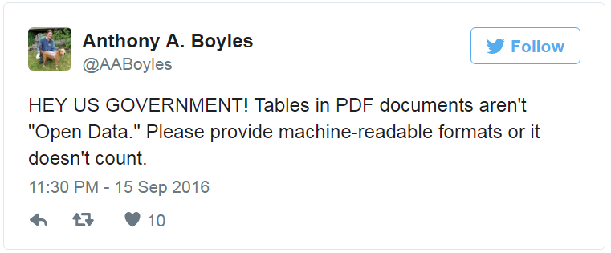
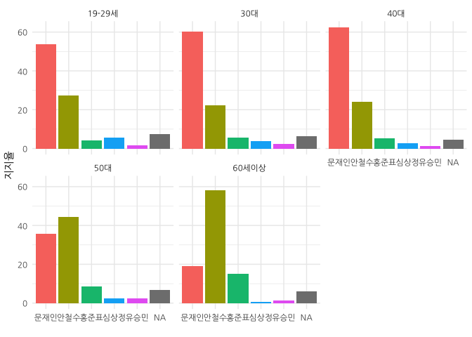

# 데이터 과학

> ## 학습 목표 {.objectives}
>
> * PDF 감옥에 감금된 공개 데이터를 탈옥시킨다.
> * `.pdf` 파일에서 데이터 분석이 가능한 형태로 데이터를 추출한다.
> * 리얼미터 PDF 대선후보 지지율 데이터를 시각화한다.

## 1. `.pdf` 감옥에 감금된 데이터 [^tesseract-ocr] [^extract-data-and-text] [^extract-data-from-pdf]

[^tesseract-ocr]: [The new Tesseract package: High Quality OCR in R](https://www.r-bloggers.com/the-new-tesseract-package-high-quality-ocr-in-r/)

[^extract-data-and-text]: [Tools for Extracting Data and Text from PDFs - A Review](http://okfnlabs.org/blog/2016/04/19/pdf-tools-extract-text-and-data-from-pdfs.html)

[^extract-data-from-pdf]: [Release 'open' data from their PDF prisons using tabulizer](http://ropensci.org/blog/blog/2017/04/18/tabulizer)

데이터에 관심이 있고 통계를 전공하지 않았더라도 엑셀등을 통해 데이터를 다뤄본 경험이 있는 분들은 누구나 데이터를 얻어 이를 분석하고자 하는 나름대로의 욕심을 가지고 있다.

하지만, 현실은 여론조사로 발표되는 데이터가 많은 경우 `.pdf` 파일로 제공되거나 경우에 따라서는 [중앙선거관리위원회 - 중앙선거여론조사심의위원회](http://www.nesdc.go.kr/portal/main.do)에서 
제공하는 것처럼 PNG 파일을 손에 얻게되는 경우도 많다. 비단 이런 문제는 대한민국 고유의 문제가 아니라 선진국이라고 인정되는 미국에서도 사회적 문제로 제기되고 있다.

## 2. `.pdf` 파일에 감금된 데이터 해방

여론조사 전문기관에서 여론조사 결과를 다양한 형태로 제공하고 있지만, 빅데이터를 활용하는 입장에서는 `.pdf` 파일 형태로 제공되는 것도 매우 고마운 일이다.
중앙선거관리위원회를 비롯한 다수 기관에서 제공되는 데이터는 pdf 파일을 이미지로 만들어서 OCR 같은 기술을 추가로 동원하지 않으면 활용도 불가능하기 때문이다.

이런 중간 작업과정이 동원되면 이미지를 글자/숫자로 인식하는 과정에서 오류가 추가로 발생되게 되어 수작업으로 오류를 수정해야 되는 손실이 발생된다.
`.pdf` 파일을 정말 창의적인 방식으로 빅데이터 시대에 맞춰 제공하는 민간 및 정부기관도 많다. 

여론조사에서 나름대로 체계적으로 데이터를 제공하는 곳은 현재 [리얼미터](http://www.realmeter.net/category/pdf/) 정도가 아닌가 판단된다.

## 3. 리얼미터 여론조사 데이터 분석

리얼미터도 설문조사 원데이터를 바탕으로 대선 후보 여론동향에 대한 분석결과를 제공한다. 
하지만, 한정된 지면과 분석인력 및 전달 방법, 데이터를 바라보는 분석자의 관점 등에 따라 데이터의 가치는 달라질 수 있다.

아마도 이런 연유로 인해 정부기관에서 데이터를 독점하지 말고 이를 풀어서 더 많은 가치를 민간에서 창출하라고 의도도 있다.

### 3.1. 환경설정

`pdf` 파일에 담긴 표에서 데이터를 추출하여 이를 R 데이터 프레임으로 변환하여야 하는데 사용되는 다양한 팩키지를 설치한다.

~~~{.r}
# 0. 환경설정 ---------------------------------------------------------------------------------------
library(tidyverse)
library(stringr)
library(tabulizer)
library(pdftools)
library(stringr)
library(extrafont)
library(testthat)
loadfonts()
~~~

### 3.2. 테스트 지향 R 코딩 

`testthat` 함수를 활용하여 결과값을 미리 지정해 둔다. 
이를 통해 pdf 파일에서 R 데이터프레임으로 제대로 데이터가 변환되었는지 확인한다.

~~~{.r}
# 1. 테스트 함수 ----------------------------------------------------------------------------------

test_that("리얼미터 4월 2주차: 정례 정치조사 주중통계표 문2",{
  expect_equivalent(support_by_age_df %>% slice(1) %>% collect %>% .[["문재인"]], 53.7)
  expect_equivalent(support_by_age_df %>% slice(1) %>% collect %>% .[["안철수"]], 27.3)
  expect_equivalent(support_by_age_df %>% slice(1) %>% collect %>% .[["심상정"]], 5.8)
})
~~~

### 3.3. pdf 파일을 R 데이터프레임으로 변환

이 부분이 가장 핵심적인 부분으로 `pdftools`에 담긴 `pdf_text` 함수로 pdf 파일을 불러읽어오게 되면 
각 페이지별가 리스트 원소로 저장된다. `list_dat[6]`는 pdf 파일 6번째 페이지를 파싱하여 리스트로 저장된 것이다.
6번째 리스트는 리얼미터 6 페이지 문2 설문문항에 대한 결과를 보여주고 있다. 

> **문2.** 다음은 대통령선거 관련 질문입니다 선생님께서는 이번 대선에서 다음 후보 중 누구에게 투표하시겠 . 습
니까 호명은 무작위 방식입니다 정당 의석 순 표기 ? . ( ) ( 1~5 ) 

우선 데이터가 표에 숫자로만 나타나 있어 이를 연령별로 후보자 지지율을 시각화해서 한눈에 볼 수 있도록 하는 목표를 가져본다.

이를 위해서 후보별, 연령별 연관된 pdf 텍스트 데이터만 추출하고 나서 이를 적절히 전처리하여 데이터프레임으로 만든다.

~~~{.r}
# 2. 리얼미터 PDF 파일에서 지지율 데이터 추출 ------------------------------------------------------------------
rm_age_fun <- function(list_dat) {
  # person_age <- unlist(strsplit(list_dat[6], split = "\\r\\n")) # 윈도우
  person_age <- unlist(strsplit(list_dat[6], split = "\\n"))    # 맥
  person_age <- str_replace_all(person_age, "\\s", "")
  support <- strsplit(person_age[c(6,32:36)], split = "\\|")
  
  support[[1]] <- append("V1", support[[1]])
  support_df <- do.call(rbind, support) %>% as_tibble()
  support_df[1,c(2:3, 12,14)] <-  c("V2", "V3", "후보없음", "없음잘모름")
  
  names(support_df) <- support_df[1,]
  names(support_df)
  support_df <- support_df %>% dplyr::select(-V1) %>% 
    dplyr::filter(V2 != "V2")
  
  support_df <- support_df %>% dplyr::rename("연령"=V2, "조사완료"=V3, "목표할당" = 사례수) %>% 
    mutate(조사완료 = str_replace_all(조사완료, "\\(|\\)", ""),
               목표할당 = str_replace_all(목표할당, "\\(|\\)", ""),
               연령 = str_replace_all(연령, "\\s|■", "")) %>% 
    mutate_at(grep("연령",colnames(.), invert=TRUE),funs(as.numeric)) %>% 
    mutate(기타응답=무소속+기타+후보없음+잘모름) %>% 
    dplyr::select(연령, 문재인=더불어, 홍준표=자유, 안철수=국민의당, 유승민=바른정당, 심상정=정의당, 기타응답)
  return(support_df)
}
~~~

### 3.4. 데이터프레임 시작화

`rm_age_fun` 함수를 만들었으니 리얼미터에서 매주 pdf 파일 양식을 바꾸지 않는다면 pdf 파일만 바꿔 넣으면 별다른 노력없이
후보별 연령별 지지율 동향을 파악할 수 있다.

~~~{.r}
# 3. 리얼미터 PDF 파일을 데이터프레임 변환 ------------------------------------------------------------------

rm_170402_pdf <- pdf_text("http://www.realmeter.net/wp-content/uploads/2017/04/realmeter_w17041321.pdf")
support_by_age_df <- rm_age_fun(rm_170402_pdf)

# 4. 데이터 시각화 ---------------------------------------------------------------------------------

support_by_age_df %>% gather(후보, 지지율, -연령) %>% 
  mutate(후보 = factor(후보, levels=c("문재인", "안철수", "홍준표", "심상정", "유승민", "기타무응답"))) %>% 
  ggplot(aes(후보, 지지율, fill=후보)) +
    geom_bar(stat="identity",  position = "dodge") +
    facet_wrap(~연령) +
    theme_minimal(base_family = "NanumGothic") +
    labs(x="") +
    theme(legend.position="none")
~~~

