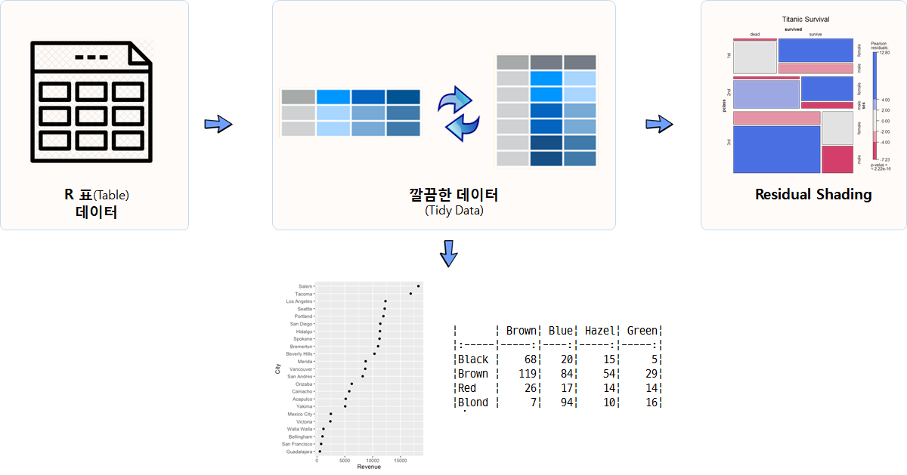

 
``` {r, include=FALSE}
source("tools/chunk-options.R")
library(tidyverse)
library(datasets)
library(forcats)
library(ggmosaic)
library(vcd)
library(gridExtra)
library(knitr)
```

> ### 학습 목표 {.getready}
>
> * 표(table) 데이터를 깔끔한 데이터(tidy data)로 변환한다.
> * 깔끔한 데이터를 범주형 데이터, 즉 요인형 자료구조로 변환시킨다.
> * R 함수를 재활용하고자 `vcd` 팩키지 `mosaic()` 함수로 시각화한다.


## 1. 범주형 자료 처리를 위한 자료구조와 시각화

일상적으로 가장 많이 접하는 데이터 형태 중의 하나가 표(Table) 데이터다. 
하지만, 역설적으로 가장 적은 데이터 활용법이 공개된 것도 사실이다. 
통계학과에서도 연속형 데이터는 많이 다루지만, 범주형 데이터를 충분히 이해하고 실습해 본 경험을 갖고 있는 분은 드물다.

사실 범주형 자료를 시각화하고 다양한 표형태로 나타내는데 다양한 지식이 필요하다.

- `table` 자료형
- 깔끔한 데이터(tidy data) 개념
- `vcd` 팩키지 `mosaic()` 함수 사용 및 해석
- 범주형 자료형 `forcats` 팩키지 활용
- 표를 웹에 표현하기 위한 `kable` 팩키지와 마크다운 언어

즉, 일반적이 표형식 데이터를 깔끔한 데이터(tidy data) 형태로 변환을 시키고 나서 탐색적 데이터 분석과정을 거쳐 최종 결과물을 생성시킨다.




## 2. 표(table) 데이터를 자유로이 작업

상기 기반지식을 바탕으로 R `datasets` 팩키지에 포함된 `HairEyeColor` 데이터셋을 가지고 데이터 분석 작업을 시작한다.

### 2.1. 환경설정 

범주형 데이터 분석 및 시각화 산출물 생성에 필요한 팩키지를 불러온다.

``` {r mosaic-plot-setup, warning=FALSE, message=FALSE, eval=FALSE}
# 0. 데이터 가져오기 ----------------------------------------------
library(tidyverse)
library(datasets)
library(forcats)
library(ggmosaic)
library(vcd)
library(gridExtra)
library(knitr)
```

### 2.2. 표(table) 데이터

범주형 데이터로 유명한 `HairEyeColor` 데이터셋을 가져온다. `HairEyeColor` 데이터셋은 데이터프레임이 아니고 
`table` 형태 데이터다. 익숙한 데이터프레임 자료형으로 작업하는데 필요한 함수가 있다.

- tbl_df() 
- as_data_frame()

tbl_df(), as_data_frame() 함수는 표(table) 자료형을 데이터프레임으로 변환시키는 유용한 함수다.

``` {r mosaic-plot-import-munging, warning=FALSE, message=FALSE}
data("HairEyeColor")

# 1. 데이터 변환 ----------------------------------------------

## 1.1 표형식 데이터 --> 깔끔한 데이터 ------------------------

hair_eye_df <- apply(HairEyeColor, c(1, 2), sum)

kable(hair_eye_df, digits=0)

tbl_df <- as_data_frame(HairEyeColor)

tbl_df(HairEyeColor)

# kable(tbl_df)
```

### 2.3. 깔끔한 데이터

데이터프레임으로 전환되면 long 형태 데이터프레임이라 원 표(table)과비교하려면 `spread` 함수와 비교한다.

``` {r mosaic-plot-tidy-data, warning=FALSE, message=FALSE}
## 1.2 Long & Wide 데이터 형식 ------------------------

long_df <- tbl_df %>% group_by(Hair, Eye) %>% 
    summarise(cnt = sum(n))

# 비교
# hair_eye_df
long_df %>% spread(Eye, cnt) %>% kable(digits=0)
```

### 2.4. 단변량 범주형 데이터 시각화

깔끔한 데이터프레임으로 작업이 되면 변수를 각 자료형에 맞춰 변환을 시킨다.
이런 과정에 도입되는 팩키지가 `forcats` 팩키지의 다양한 요인형 데이터 처리 함수다.
요인형 자료형은 다른 프로그래밍 언어에는 개념이 존재하지만, 실제 활용되는 경우도 많지 않고 R처럼 다양한 기능을 제공하는 경우는 드물다.

``` {r mosaic-plot-univariate-viz, warning=FALSE, message=FALSE}
## 1.3 범주형 데이터 ------------------------

long_df %>% ungroup() %>%  mutate(Hair = factor(Hair)) %>% 
    group_by(Hair) %>% 
    summarise(hair_sum = sum(cnt)) %>% 
        ggplot(aes(hair_sum, fct_reorder(Hair, hair_sum))) + geom_point()

long_df %>% ungroup() %>%  mutate(Eye = factor(Eye)) %>% 
    group_by(Eye) %>% 
    summarise(eye_sum = sum(cnt)) %>% 
    ggplot(aes(eye_sum, fct_reorder(Eye, eye_sum))) + geom_point()

long_df %>% ungroup() %>%  mutate(Eye = factor(Eye),
                                  Hair = factor(Hair)) %>% 
    group_by(Eye, Hair) %>% 
    summarise(eye_hair_sum = sum(cnt)) %>% 
    tidyr::unite(eye_hair, Eye, Hair) %>% 
    ggplot(aes(eye_hair_sum, fct_reorder(eye_hair, eye_hair_sum))) + geom_point() 
```

## 3. 모자이크 플롯

`ggplot`에서도 모자이크 플롯을 구현할 수 있지만, 잔차(residual)를 반영하여 시각화하는 기능을 제공하지 않고 있다.
하지만, [`ggmosaic`](https://cran.r-project.org/web/packages/ggmosaic/) 팩키지를 활용하면 모자이크 플롯을 그래프 문법에 맞춰 구현이 가능하다.
`geom_mosaic()` 함수를 사용한다. 

하지만, 잔차(residual)를 반영하여 시각화 그래프를 생성시키려면 표(table) 자료형으로 `vcd` 팩키지에서 제공하는 `mosaic()` 함수에 인자로 넘겨야 한다.

``` {r mosaic-plot-viz, warning=FALSE, message=FALSE}
# 2. 모자이크 플롯 ------------------------

long_df %>% ungroup() %>%  mutate(Eye = factor(Eye),
                                  Hair = factor(Hair)) %>% 
    ggplot() +
    geom_mosaic(aes(weight=cnt,x=product(Hair),fill=Eye))

# 3. 모자이크 플롯 통계모형 ------------------------

mosaic(HairEyeColor, shade=TRUE, legend=TRUE)

xtabs(cnt ~ Hair + Eye, long_df)

mosaic(xtabs(cnt ~ Hair + Eye, long_df), shade = TRUE, legend=TRUE)

# vcd::mosaic(hair_eye_df, shade = TRUE, legend=TRUE)
```

