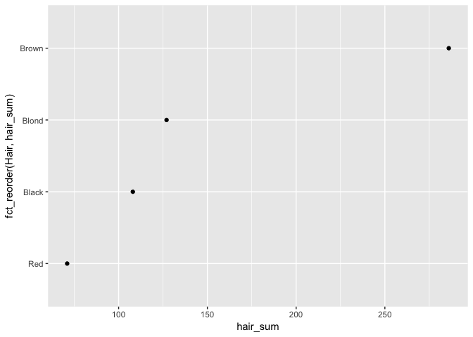
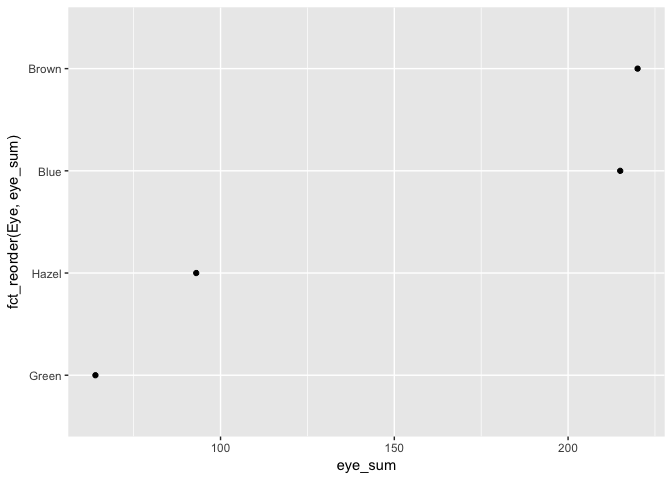
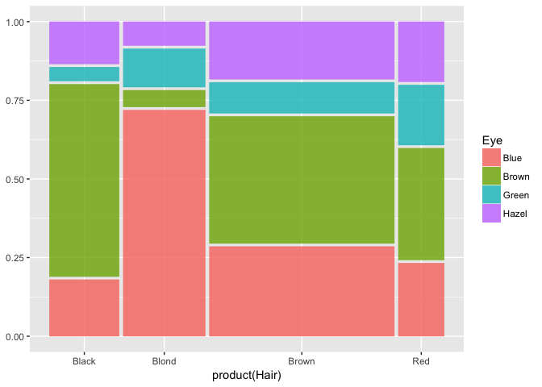
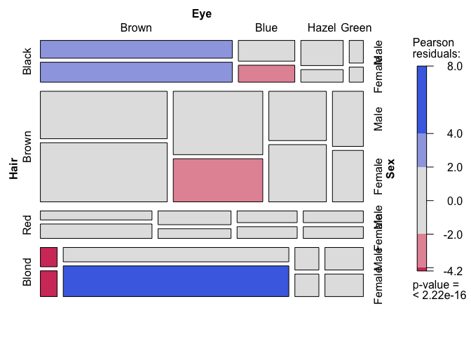
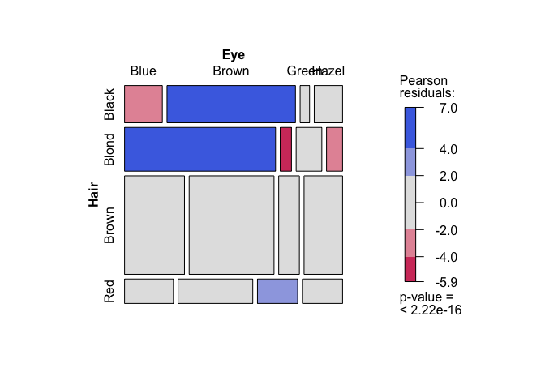
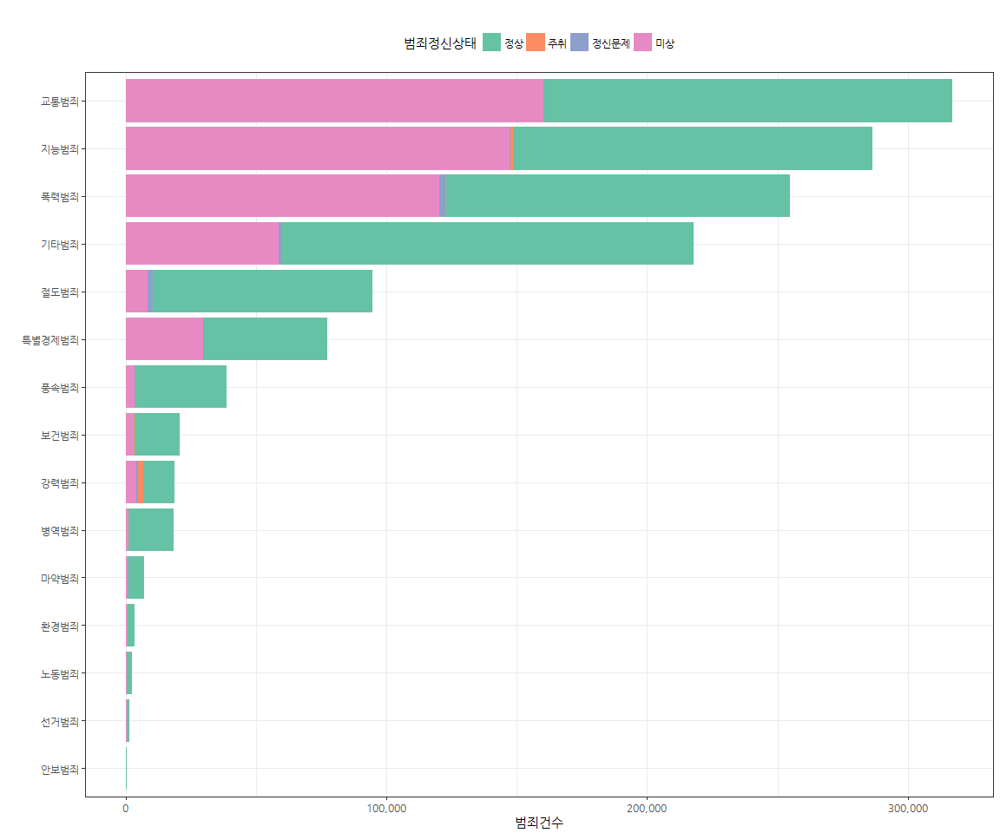
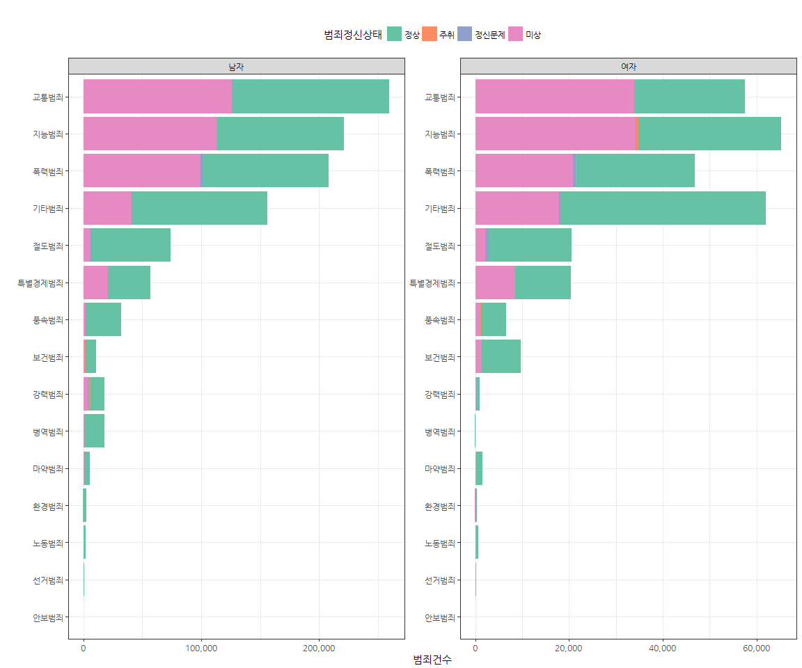
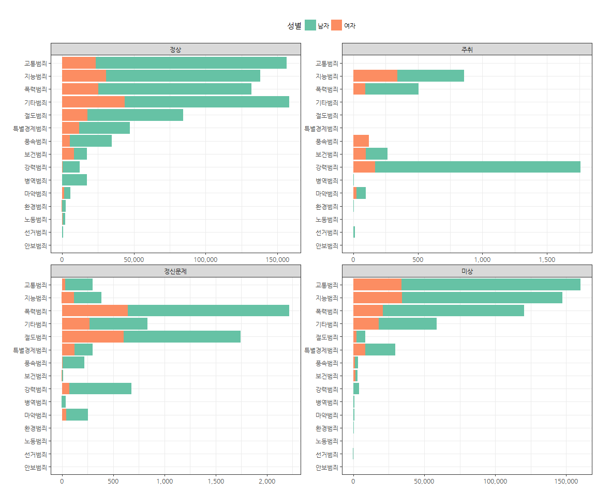
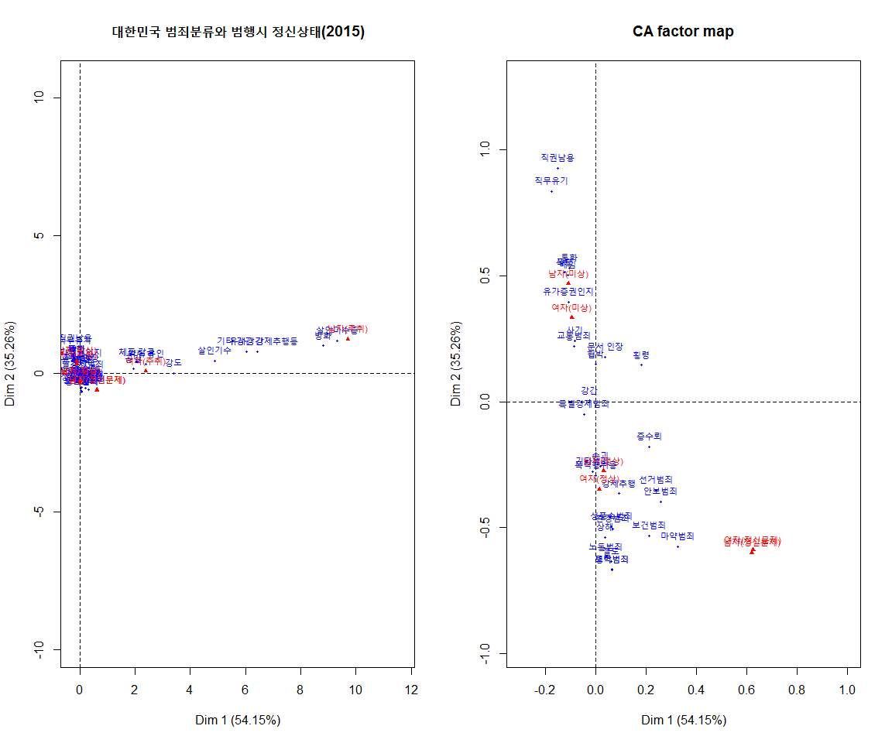

# xwMOOC 기계학습
xwMOOC  
2017-07-23  
 

> ### 학습 목표 {.getready}
>
> * 표(table) 데이터를 깔끔한 데이터(tidy data)로 변환한다.
> * 깔끔한 데이터를 범주형 데이터, 즉 요인형 자료구조로 변환시킨다.
> * 범주형 데이터를 Base 시각화 시스템 `vcd` 팩키지 `mosaic()` 함수, 그래프 문법 geom_mosaic()을 통해 시각화한다.
> * 공공데이터포털 범죄통계 데이터를 통해 범주형 데이터를 탐색적으로 분석한다.
> * 탐색적 데이터 분석을 위한 기초 도구로 대응분석을 활용한다.

## 1. 범주형 자료 처리를 위한 자료구조와 시각화 {#intro}

일상적으로 가장 많이 접하는 데이터 형태 중의 하나가 표(Table) 데이터다. 
하지만, 역설적으로 가장 적은 데이터 활용법이 공개된 것도 사실이다. 
통계학과에서도 연속형 데이터는 많이 다루지만, 범주형 데이터를 충분히 이해하고 실습해 본 경험을 갖고 있는 분은 드물다.

사실 범주형 자료를 시각화하고 다양한 표형태로 나타내는데 다양한 지식이 필요하다.

- `table` 자료형
- 깔끔한 데이터(tidy data) 개념
- `vcd` 팩키지 `mosaic()` 함수 사용 및 해석
- 범주형 자료형 `forcats` 팩키지 활용
- 표를 웹에 표현하기 위한 `kable` 팩키지와 마크다운 언어
- 범주형 데이터를 탐색적으로 분석하기 위한 대응분석을 통한 주성분 분석의 이해

즉, 일반적이 표형식 데이터를 깔끔한 데이터(tidy data) 형태로 변환을 시키고 나서 탐색적 데이터 분석과정을 거쳐 최종 결과물을 생성시킨다.
그래프 문법(ggplot)을 활용하여 범주형 데이터를 가장 잘 요약할 수 있는 그래프를 만들고 나서, 대응분석(Correspondance Analysis)를 통해 
한장의 그래프로 범주형 데이터를 통해 표현된 자료를 추상화하고 해석한다.

## 2. 표(table) 데이터를 자유로이 작업 {#tbl-data}

상기 기반지식을 바탕으로 R `datasets` 팩키지에 포함된 `HairEyeColor` 데이터셋을 가지고 데이터 분석 작업을 시작한다.

### 2.1. 환경설정  {#tbl-setup}

범주형 데이터 분석 및 시각화 산출물 생성에 필요한 팩키지를 불러온다.

~~~{.r}
# 0. 데이터 가져오기 ----------------------------------------------
library(tidyverse)
library(datasets)
library(forcats)
library(ggmosaic)
library(vcd)
library(gridExtra)
library(knitr)
~~~

### 2.2. 표(table) 데이터 {#tbl-dplyr-data}

범주형 데이터로 유명한 `HairEyeColor` 데이터셋을 가져온다. `HairEyeColor` 데이터셋은 데이터프레임이 아니고 
`table` 형태 데이터다. 익숙한 데이터프레임 자료형으로 작업하는데 필요한 함수가 있다.

- tbl_df() 
- as_data_frame()

tbl_df(), as_data_frame() 함수는 표(table) 자료형을 데이터프레임으로 변환시키는 유용한 함수다.

~~~{.r}
data("HairEyeColor")

# 1. 데이터 변환 ----------------------------------------------
## 1.1 표형식 데이터 --> 깔끔한 데이터 ------------------------

hair_eye_df <- apply(HairEyeColor, c(1, 2), sum)

kable(hair_eye_df, digits=0)
~~~

         Brown   Blue   Hazel   Green
------  ------  -----  ------  ------
Black       68     20      15       5
Brown      119     84      54      29
Red         26     17      14      14
Blond        7     94      10      16

~~~{.r}
tbl_df <- as_data_frame(HairEyeColor)

tbl_df(HairEyeColor)
~~~

~~~{.output}
# A tibble: 32 x 4
    Hair   Eye   Sex     n
   <chr> <chr> <chr> <dbl>
 1 Black Brown  Male    32
 2 Brown Brown  Male    53
 3   Red Brown  Male    10
 4 Blond Brown  Male     3
 5 Black  Blue  Male    11
 6 Brown  Blue  Male    50
 7   Red  Blue  Male    10
 8 Blond  Blue  Male    30
 9 Black Hazel  Male    10
10 Brown Hazel  Male    25
# ... with 22 more rows

~~~

~~~{.r}
# kable(tbl_df)
~~~

### 2.3. 깔끔한 데이터 {#tbl-tidy-data}

데이터프레임으로 전환되면 long 형태 데이터프레임이라 원 표(table)과비교하려면 `spread` 함수와 비교한다.

~~~{.r}
## 1.2 Long & Wide 데이터 형식 ------------------------

long_df <- tbl_df %>% group_by(Hair, Eye) %>% 
    summarise(cnt = sum(n))

# 비교
# hair_eye_df
long_df %>% spread(Eye, cnt) %>% kable(digits=0)
~~~

Hair     Blue   Brown   Green   Hazel
------  -----  ------  ------  ------
Black      20      68       5      15
Blond      94       7      16      10
Brown      84     119      29      54
Red        17      26      14      14

### 2.4. 단변량 범주형 데이터 시각화 {#tbl-univariate}

깔끔한 데이터프레임으로 작업이 되면 변수를 각 자료형에 맞춰 변환을 시킨다.
이런 과정에 도입되는 팩키지가 `forcats` 팩키지의 다양한 요인형 데이터 처리 함수다.
요인형 자료형은 다른 프로그래밍 언어에는 개념이 존재하지만, 실제 활용되는 경우도 많지 않고 R처럼 다양한 기능을 제공하는 경우는 드물다.

~~~{.r}
## 1.3 범주형 데이터 ------------------------

long_df %>% ungroup() %>%  mutate(Hair = factor(Hair)) %>% 
    group_by(Hair) %>% 
    summarise(hair_sum = sum(cnt)) %>% 
        ggplot(aes(hair_sum, fct_reorder(Hair, hair_sum))) + geom_point()
~~~

~~~{.r}
long_df %>% ungroup() %>%  mutate(Eye = factor(Eye)) %>% 
    group_by(Eye) %>% 
    summarise(eye_sum = sum(cnt)) %>% 
    ggplot(aes(eye_sum, fct_reorder(Eye, eye_sum))) + geom_point()
~~~

~~~{.r}
long_df %>% ungroup() %>%  mutate(Eye = factor(Eye),
                                  Hair = factor(Hair)) %>% 
    group_by(Eye, Hair) %>% 
    summarise(eye_hair_sum = sum(cnt)) %>% 
    tidyr::unite(eye_hair, Eye, Hair) %>% 
    ggplot(aes(eye_hair_sum, fct_reorder(eye_hair, eye_hair_sum))) + geom_point() 
~~~

## 3. 모자이크 플롯 {#tbl-mosaic}

`ggplot`에서도 모자이크 플롯을 구현할 수 있지만, 잔차(residual)를 반영하여 시각화하는 기능을 제공하지 않고 있다.
하지만, [`ggmosaic`](https://cran.r-project.org/web/packages/ggmosaic/) 팩키지를 활용하면 모자이크 플롯을 그래프 문법에 맞춰 구현이 가능하다.
`geom_mosaic()` 함수를 사용한다. 

하지만, 잔차(residual)를 반영하여 시각화 그래프를 생성시키려면 표(table) 자료형으로 `vcd` 팩키지에서 제공하는 `mosaic()` 함수에 인자로 넘겨야 한다.

~~~{.r}
# 2. 모자이크 플롯 ------------------------

long_df %>% ungroup() %>%  mutate(Eye = factor(Eye),
                                  Hair = factor(Hair)) %>% 
    ggplot() +
    geom_mosaic(aes(weight=cnt,x=product(Hair),fill=Eye))
~~~

~~~{.r}
# 3. 모자이크 플롯 통계모형 ------------------------

vcd::mosaic(HairEyeColor, shade=TRUE, legend=TRUE)
~~~

~~~{.r}
xtabs(cnt ~ Hair + Eye, long_df)
~~~

~~~{.output}
       Eye
Hair    Blue Brown Green Hazel
  Black   20    68     5    15
  Blond   94     7    16    10
  Brown   84   119    29    54
  Red     17    26    14    14

~~~

~~~{.r}
vcd::mosaic(xtabs(cnt ~ Hair + Eye, long_df), shade = TRUE, legend=TRUE)
~~~

~~~{.r}
# vcd::mosaic(hair_eye_df, shade = TRUE, legend=TRUE)
~~~

> ### 데이터 파일이 깨지는 경우 - 인코딩
> 
> RStudio로 데이터분석 작업을 할 경우 `utf-8`이 기본이라 인코딩이 깨져 문제가 되는 경우가 많다. 
> 특히, 대부분의 정부기관 데이터는 윈도우를 기본 운영체제를 가정한 경우가 많아,
> 윈도우에 최적화된 인코딩을 채택된다. 따라서 이런 문제를 인정하고 
> `read.csv()` 함수를 사용하는 경우 `encoding = "EUC-KR"` 인자를 넣어주고,
> tidyverse 팩키지 `read_csv()` 함수를 사용하는 경우 `locale=locale(encoding = "EUC-KR")`을 설정하면 깔끔하게 
> R 에서 작업할 수 있는 형태로 데이터를 받아 들릴 수 있다.

## 4. 사례 - 범죄통계(범죄자 범행시 정신상태) {#case-study-crime}

### 4.1. 공동데이터 포탈 범죄데이터 {#case-study-crime-opendata}

[범죄통계] 범죄자 범행시 정신상태 최신 데이터를 다운로드 받아 분석한다.
[범죄자 범행시 정신상태, 범죄통계(2015)](https://www.data.go.kr/dataset/3074473/fileData.do) 데이터를 csv 파일 형태로 로컬 컴퓨터에 
다운로드 받아 저장한다.

~~~{.r}
# 0. 환경설정 ---------------------------------
library(tidyverse)
library(stringr)
library(FactoMineR)
library(ggplot2)
library(ggthemes)
library(ggmosaic) # devtools::install_github("haleyjeppson/ggmosaic")
library(extrafont)
library(forcats)
loadfonts()

# 1. 데이터 가져오기 --------------------------
dat <- read_csv("data/2015년+범죄자+범행시+정신상태.csv", locale=locale(encoding = "EUC-KR"))
~~~

### 4.2. 범죄통계 데이터 정제 {#case-study-crime-wrangling}

데이터 분석의 다음 단계로 늘 있는 일이지만 데이터와 사투를 벌여야 한다.
필요없는 데이터는 제거하고 다음 단계 시각화, 기초통계, 모형 개발에 맞는 형태로 데이터를 정제한다.

~~~{.r}
# 2. 데이터 정제과정 --------------------------
tidy_tmp_dat <- dat %>% gather(정신상태, 범죄건수, -범죄대분류, -범죄중분류)

tidy_2015_dat <- tidy_tmp_dat %>% filter(!정신상태 %in% c("남자(계)", "여자(계)")) %>% 
    mutate(성별 = ifelse(str_detect(정신상태, "남자"), "남자", "여자")) %>% 
    mutate(정신상태 = str_replace_all(정신상태, "남자|여자", "")) %>% 
    mutate(정신상태 = str_replace_all(정신상태, "[^0-9a-zA-Z가-흫]+", "")) %>% 
    mutate(범죄정신상태 = case_when(
        str_detect(정신상태, "정신") ~ "정신문제",
        str_detect(정신상태, "월경") ~ "미상",
        TRUE ~ 정신상태
    )) %>% 
    mutate(범죄건수 = as.numeric(범죄건수))

tidy_2015_df <- tidy_2015_dat %>% 
    select(-정신상태) %>% 
    mutate(범죄건수 = as.numeric(범죄건수),
           범죄정신상태 = factor(범죄정신상태, levels=c("정상", "주취", "정신문제", "미상")),
           범죄중분류 = factor(범죄중분류),
           범죄대분류 = factor(범죄대분류),
           성별 = factor(성별)) %>% 
    mutate(범죄건수 = ifelse(is.na(범죄건수),0, 범죄건수))

DT::datatable(tidy_2015_dat) %>% 
    DT::formatRound(c("범죄건수"), digits=0)
~~~

<!--html_preserve-->

<!--/html_preserve-->

### 4.3. 범죄통계 시각화 {#case-study-crime-ggplot}

데이터가 준비되었으면, ggplot에 입력으로 넣어, 전체 범죄건수를 범죄자 범행시 정신상태별로 살펴본다.
다음으로 남녀별로 구분하여 살펴보고, 마지막으로 범죄자 범행시 정신상태별로 나누어서 
성별로 구분하여 범죄중분류 기준으로 살펴본다. 
주취, 즉 술을 마셨을 경우 강력범죄, 지능범죄, 폭력범죄가 높은 것이 나타난다.
또한, 마약범죄는 정신문제와 연관이 크고 절도, 폭력 등 범죄와 함께 높아지는 것이 눈에 띈다.

~~~{.r}
# 3. 시각화 --------------------------
## 3.1. 범죄대분류에 따른 범죄발생 건수
tidy_2015_df %>%
    ggplot(data = ., aes(x = fct_reorder(범죄대분류, 범죄건수, .desc = FALSE, fun=sum), y=범죄건수, fill=범죄정신상태)) +
    geom_bar(stat="identity") +
    labs(x="", y="범죄건수", title='') +
    theme_bw(base_family="NanumGothic") +
    theme(legend.position='top', legend.direction='horizontal') +
    scale_fill_brewer(palette="Set2") +
    scale_y_continuous(labels=scales::comma) +
    coord_flip()
~~~

~~~{.r}
## 3.2. 남녀별 정신상태별 범죄건수
tidy_2015_df %>%
    ggplot(data = ., aes(x = fct_reorder(범죄대분류, 범죄건수, .desc = FALSE, fun=sum), y=범죄건수, fill=범죄정신상태)) +
    geom_bar(stat="identity") +
    labs(x="", y="범죄건수", title='') +
    theme_bw(base_family="NanumGothic") +
    theme(legend.position='top', legend.direction='horizontal') +
    scale_fill_brewer(palette="Set2") +
    scale_y_continuous(labels=scales::comma) +
    coord_flip() +
    facet_wrap(~성별, scale="free")
~~~

~~~{.r}
## 3.3. 정신상태별 남녀 범죄건수
tidy_2015_df %>%
    ggplot(data = ., aes(x = fct_reorder(범죄대분류, 범죄건수, .desc = FALSE, fun=sum), y=범죄건수, fill=성별)) +
    geom_bar(stat="identity") +
    labs(x="", y="", title='') +
    theme_bw(base_family="NanumGothic") +
    theme(legend.position='top', legend.direction='horizontal') +
    scale_fill_brewer(palette="Set2") +
    scale_y_continuous(labels=scales::comma) +
    coord_flip() +
    facet_wrap(~범죄정신상태, scale="free")
~~~

### 4.4. 범죄통계 대응분석 {#case-study-crime-ca}

범주형 데이터를 관심을 갖는 관점별로 데이터를 살펴보는 대신, 주성분 분석을 통해 범죄데이터를 해석하는 것도 가능하다.
동일한 데이터를 대응분석에 맞춰 데이터를 전처리하고 나서 이를 `FactoMineR` 팩키지 `CA()` 함수에 넣어 시각화를 한다.

2차원 평면에 축약할 경우 약 90% 정보(89.411)를 담을 수 있고, X축(Dim 1) 방향은 남녀 모두 주취와 강력범죄가 연관되어 범죄자 범행시 정신상태가 많이 투영되어 있고,
Y축(Dim 2)은 직권남용/유기, 경제범죄와 반대쪽에 마약, 보건 등이 정신문제와 연관이 되어 있는 것이 두드려저 나타난다.

~~~{.r}
# 2. 데이터 정제과정 --------------------------
ca_dat <- dat %>%
    mutate_at(vars(-범죄대분류, -범죄중분류), funs(as.numeric))
ca_dat[is.na(ca_dat)] <- 0

tidy_2015_ca_df <- ca_dat %>% select(-`남자(계)`, -`여자(계)`) %>% 
    mutate(`남자(정신문제)` = `남자(정신이상)` + `남자(정신박약)`+`남자(기타정신장애)`,
           `여자(정신문제)` = `여자(정신이상)` + `여자(정신박약)`+`여자(기타정신장애)` ) %>% 
    rename(`여자(미상)`=미상) %>% 
    select(범죄중분류, `남자(정상)`, `여자(정상)`, `남자(정신문제)`, `여자(정신문제)`,
                `남자(미상)`, `여자(미상)`,
                `남자(주취)`, `여자(주취)`) %>% 
    column_to_rownames(var="범죄중분류")

# 3. CA --------------------------
crime_2015_ca <- CA(tidy_2015_ca_df, graph=FALSE)
summary(crime_2015_ca)
~~~

~~~{.output}

Call:
CA(X = tidy_2015_ca_df, graph = FALSE) 

The chi square of independence between the two variables is equal to 511526.3 (p-value =  0 ).

Eigenvalues
                       Dim.1   Dim.2   Dim.3   Dim.4   Dim.5   Dim.6
Variance               0.204   0.133   0.025   0.008   0.004   0.002
% of var.             54.152  35.259   6.759   2.074   1.057   0.448
Cumulative % of var.  54.152  89.411  96.169  98.244  99.301  99.750
                       Dim.7
Variance               0.001
% of var.              0.250
Cumulative % of var. 100.000

Rows (the 10 first)
                       Iner*1000    Dim.1    ctr   cos2    Dim.2    ctr
살인기수             |     7.118 |  4.899  3.371  0.966 |  0.462  0.046
살인미수등           |    38.378 |  9.320 18.376  0.977 |  1.186  0.457
강도                 |    17.278 |  3.398  8.331  0.984 |  0.014  0.000
강간                 |     0.747 | -0.024  0.001  0.002 |  0.004  0.000
유사강간             |    14.796 |  6.027  7.017  0.968 |  0.804  0.192
강제추행             |     5.319 |  0.094  0.029  0.011 | -0.364  0.661
기타 강간 강제추행등 |    21.596 |  6.422 10.213  0.965 |  0.793  0.239
방화                 |    89.295 |  8.828 42.681  0.975 |  1.013  0.863
절도                 |    29.650 |  0.061  0.126  0.009 | -0.635 21.148
상해                 |     8.016 |  0.039  0.020  0.005 | -0.538  5.877
                       cos2    Dim.3    ctr   cos2  
살인기수              0.009 |  0.002  0.000  0.000 |
살인미수등            0.016 |  0.104  0.018  0.000 |
강도                  0.000 | -0.163  0.154  0.002 |
강간                  0.000 | -0.462  2.423  0.826 |
유사강간              0.017 | -0.160  0.039  0.001 |
강제추행              0.165 | -0.626 10.196  0.488 |
기타 강간 강제추행등  0.015 | -0.083  0.014  0.000 |
방화                  0.013 |  0.034  0.005  0.000 |
절도                  0.948 | -0.067  1.216  0.010 |
상해                  0.974 | -0.067  0.482  0.015 |

Columns
                 Iner*1000     Dim.1     ctr    cos2     Dim.2     ctr
남자(정상)     |    41.617 |   0.032   0.233   0.011 |  -0.275  26.790
여자(정상)     |    32.620 |   0.015   0.014   0.001 |  -0.347  11.298
남자(정신문제) |     9.166 |   0.620   0.704   0.157 |  -0.600   1.012
여자(정신문제) |     3.239 |   0.626   0.270   0.170 |  -0.588   0.367
남자(미상)     |    71.613 |  -0.108   1.757   0.050 |   0.469  50.743
여자(미상)     |    13.760 |  -0.093   0.378   0.056 |   0.333   7.390
남자(주취)     |   197.014 |   9.712  94.901   0.983 |   1.246   2.397
여자(주취)     |     7.805 |   2.394   1.744   0.456 |   0.086   0.003
                  cos2     Dim.3     ctr    cos2  
남자(정상)       0.855 |  -0.104  20.158   0.123 |
여자(정상)       0.460 |   0.372  67.621   0.528 |
남자(정신문제)   0.147 |  -0.608   5.414   0.150 |
여자(정신문제)   0.150 |  -0.130   0.094   0.007 |
남자(미상)       0.941 |  -0.022   0.562   0.002 |
여자(미상)       0.714 |   0.131   5.969   0.110 |
남자(주취)       0.016 |   0.128   0.132   0.000 |
여자(주취)       0.001 |   0.144   0.051   0.002 |

~~~

~~~{.r}
par(mfrow=c(1,2))
plot(crime_2015_ca, cex=0.7, autoLab = "no", title="대한민국 범죄분류와 범행시 정신상태(2015)")
plot(crime_2015_ca, cex=0.7, autoLab = "no", ylim=c(-0.7,1), xlim=c(-0.3,1))
~~~

