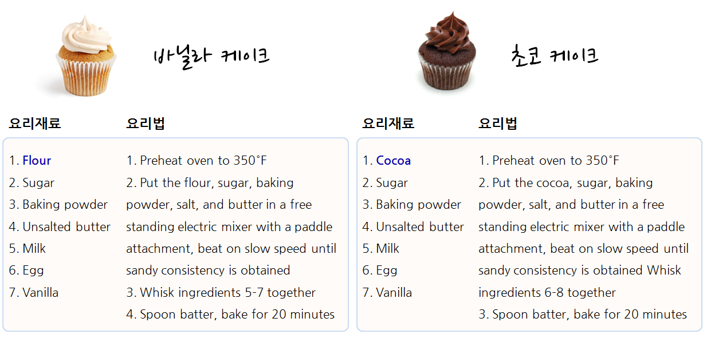
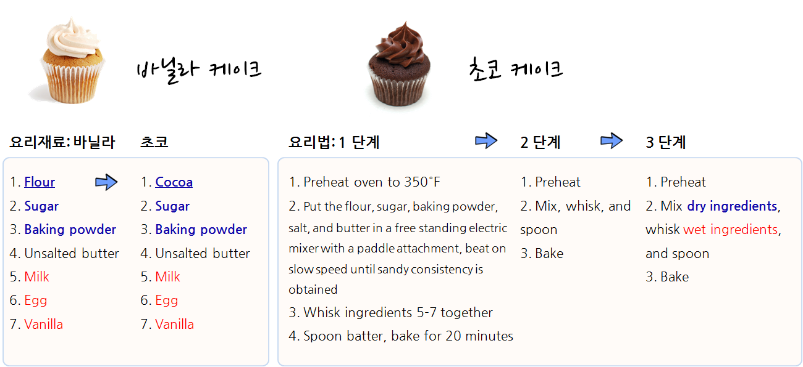

```{r, include=FALSE}
source("tools/chunk-options.R")
```

> ## 학습 목표 {.objectives}
>
> * 함수형 프로그래밍이 필요한 이유를 살펴본다.
> * 


### 1. `for` 루프 대안이 필요한 이유

`for` 루프는 객체와 구현 패턴을 강조하다보니 동작을 숨기게 된다. 
반면에 함수형 프로그래밍은 명사와 마찬가지로 동사도 강조하고, 구현에 대한 상세한 내용은
추상화하여 감추어 버린다. 이런 점에서 함수형 프로그래밍으로 코드를 작성하게 되면 
간결하고 유지보수성이 좋아진다.

> #### 함수형 프로그램 작성 순서 {.callout}
>
> 1. 전문영역지식을 활용하여 작성내용을 체계화한다.
> 1. 변수를 사용하여 정리한다.
> 1. 공통되는 코드를 뽑아낸다.

R 함수형 프로그램 작성에 Hadley Wickham이 사용하는 서양식 작은 케익(cupcake) 제작 요리법을 살펴본다.
바닐라 케이크와 쵸코 케이크 요리재료와 요리법은 거의 유사하다. 차이점이 있다면 밀가루(flour)와 코코아(cocoa)가 
큰 차이가 나고 나머지 요리법의 절차는 거의 유사하다.



바닐라 케이크와 쵸코 케이크 조리법이 두 페이지에 걸쳐 있는데 이를 한 페이지로 줄이면 다음과 같다.
즉, 요리재료를 표준화해서 공통 요소를 뽑아내면 밀가루(flour)와 코코아(cocoa)를 바꿔 넣으면 되고,
요리법의 경우 먼저 요리법을 체계화해서 1단계 예열, 2단계 재료 섞기, 3단계 굽기로 나누고 
2단계를 좀더 상세하게 마른 재료와 젖은 재료를 섞어 혼합하는 과정으로 체계화한다.



`mtcars` 데이터셋 각변수에 대한 평균과 중위수를 계산하는 것을 살펴본다. `for` 루프를 사용하는 경우 객체와 
구현 패턴에 중점을 두게 되어 `mean`, `median` 함수명만 차이나는 `for` 루프가 두개 생성되었다.

``` {r fp-why-not-for-loop, warning=FALSE, tidy=FALSE}
# 각 변수 평균을 계산

out1 <- vector("double", ncol(mtcars))

for(i in seq_along(mtcars)) {
	out1[[i]] <- mean(mtcars[[i]], na.rm = TRUE)
}

# 각 변수 중위수를 계산
out2 <- vector("double", ncol(mtcars))

for(i in seq_along(mtcars)) {
	out2[[i]] <- median(mtcars[[i]], na.rm = TRUE)
}
```

이를 `purrr` 팩키지를 사용해서 함수형 프로그램으로 작성하면 다음과 같다.

``` {r fp-mtcars-purrr, warning=FALSE, tidy=FALSE}
library(purrr)

means <- map_dbl(mtcars, mean)
medians <- map_dbl(mtcars, median)
```


### 2. 함수도 인자다.

``` {r fp-functions-argument-ex, warning=FALSE, tidy=FALSE}
col_median <- 
	function(df) {
		output <- numeric(length(df))
		for (i in seq_along(df)) {
			output[i] <- median(df[[i]])
		}
		output
	}

col_mean <- 
	function(df) {
		output <- numeric(length(df))
		for (i in seq_along(df)) {
			output[i] <- mean(df[[i]])
		}
		output
	}

col_sd <- 
	function(df) {
		output <- numeric(length(df))
		for (i in seq_along(df)) {
			output[i] <- sd(df[[i]])
		}
		output
	}
```


``` {r fp-function-argument, warning=FALSE, tidy=FALSE}
col_summary <- 
	function(df, fun) {
		output <- numeric(length(df))
		for (i in seq_along(df)) {
			output[i] <- fun(df[[i]])
		}
		output
	}
col_summary(df, fun = median)
col_summary(df, fun = mean)
col_summary(df, fun = sd)
```


