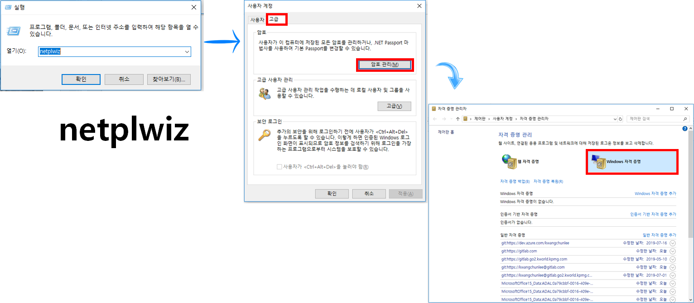

```{r, include=FALSE}
knitr::opts_chunk$set(echo = TRUE, warning=FALSE, message=FALSE,
                    comment="", digits = 3, tidy = FALSE, prompt = FALSE, fig.align = 'center')

```

{#id .class width="100%"}

# `Git` 호스팅 서비스 비교 [^hosting-comparison] {#git-hosting-service}

[^hosting-comparison]: [EjongHyuck (2017. 5. 16.),"Git 호스팅 3대장 가성비 비교"](https://m.blog.naver.com/dlwhdgur20/221006619001)

`Git` 호스팅 서비스를 제공하는 곳은 GitHub, Bitbucket, Gitlab 세곳이 유명하다.
[EjongHyuck (2017. 5. 16.),"Git 호스팅 3대장 가성비 비교"](https://m.blog.naver.com/dlwhdgur20/221006619001) 블로그를 통해서 각 Git 호스팅 업체 장단점을 비교해본다. 아마도 오픈소스 목적의 프로젝트인 경우 Github을 추천하고 개인적인 프로젝트라던가 상용화 목적인 경우 Gitlab을 많이 추천한다.

- [GitHub](http://github.com/): 마이크로소프트 인수
- [Bitbucket](https://bitbucket.com/): Atlassian
- [**Gitlab**](http://gitlab.com/)

# `gitlab` 설치 [^gitlab-install] {#install-gitlab}

[^gitlab-install]: [How to Install and Configure GitLab on Ubuntu 16.04](https://www.howtoforge.com/tutorial/how-to-install-and-configure-gitlab-on-ubuntu-16-04/)

`gitlab` 설치에 앞서 `curl` 등 필요한 도구를 설치한다.

```{r install-gitlab, eval=FALSE}
$ sudo apt-get update
$ sudo apt install curl openssh-server ca-certificates postfix
```

`gitlab`을 다운로드 받아 설치한다.

```{r install-gitlab-curl, eval=FALSE}
$ curl -sS https://packages.gitlab.com/install/repositories/gitlab/gitlab-ce/script.deb.sh | sudo bash
$ sudo apt install gitlab-ce # 시간이 조금 오래 걸림
```

이후 환경을 설정한다.


# `gitlab.com` 호스팅 서비스 연결 {#gitlab-hosting}

`gitlab`을 설치한 후에 로컬 컴퓨터에서 시간여행이 가능한 코드관리를 하더라도 협업과 백업 목적으로 `gitlab.com` 웹호스팅을 연결하는 것이 일반적이다.

## SSH [^gitlab-ssh] {#gitlab-setup-ssh}

[^gitlab-ssh]: [GitLab: SSH Key 등록 후, Source Clone 받기](https://m.blog.naver.com/semidex37/220951282334)

다음 방식으로 ssh-key를 생성해서 `gitlab.com` 웹호스트에 저장시킨다.

1. `gitbash.exe` 실행시킨 후에 `ssh-keygen`을 실행
1. `id_rsa.pub` 공개키를 복사해서 서버에 등록한다.
1. Gitlab 서버에 접속해서 사용자 > 프로파일 > 편집 > SSH Keys 메뉴로 이동하여 `id_rsa.pub` 공개키를 복사하여 등록

즉, `User Settings` > `SSH Keys` 메뉴로 들어가서 SSH Key에 대한 내용을 잘 읽고 절차대로 진행하면 된다. '~/.ssh/id_rsa.pub' 파일을 열어 **Key** 복사하여 붙여넣는다.

{#id .class width="100%"}

## Gitlab 저장소 인증: **Windows 자격 증명** {#gitlab-clone-auth}

Gitlab 저장소를 `git clone`할 경우 `git`은 포트 22 대신, `https`를 사용할 경우 다음과 같이 **Windows 자격 증명**을 활용하여 로컬 컴퓨터에 클론해 온다.

1. "윈도우키 + R" 단축키를 눌러 `netplwiz` 명령어를 실행
1. "사용자 계정" &rarr; "고급" &rarr; "암호관리"로 들어간다.
1.  "자격 증명 관리자" &rarr; **Windows 자격 증명**을 선택하고 `gitlab` 웹 저장소 설정을 맞춘다.

{#id .class width="100%"}

# `gitlab` 작업흐름 {#gitlab-common-workflow}

## `gitlab` 기본작업 흐름 {#gitlab-common-workflows} 

`git add` &rarr; `git commit - m` &rarr; `git push origin master` 작업흐름이 가장 기본적인 `gitlab` 작업흐름이라고 할 수 있다.

```{r gitlab-basic-workflow, eval=FALSE}
$ git add -A
$ git commit -m "added the most important feature ever before"
$ git push origin master
```

## `gitlab` 가지따기(`branch`) [^git-remote-branch] {#gitlab-branch-workflows} 

[^git-remote-branch]: [Git 리모트(remote) 브랜치 생성 및 삭제하기
](https://trustyoo86.github.io/git/2017/11/28/git-remote-branch-create.html)

`git` `master` 브랜치로 작업하는 것은 혼자서 모든 권한을 가지고 작업할 때 유용하다. 두 사람이상 여러명이 함께 개발작업을 할 경우 가지따기(`branch`) 즉 브랜치를 따서 작업하는 것이 유용하다. 

`git checkout -b`로 브랜치를 생성하는 것부터 `git push origin :new_feature`까지 작업 완료 후 브랜치를 삭제한다.

```{r gitlab-brach-workflow, eval=FALSE}
$ git checkout -b new_feature # `new_feature` 브랜치 생성
... # `new_feature` 기능 구현
$ git add -A # 작업 결과 Staging Area 저장
$ git commit -m "finish up the latest feature ever before" # 커밋
$ git push origin new_feature # new_feature 브랜치에 결과 푸쉬
$ git branch --set-upstream-to origin/new_feature 
$ git checkout master # `master` 브랜치 작업 시작
$ git branch --delete new_feature # 로컬 `new_feature` 브랜치 삭제
$ git branch -D new_feature # 로컬 `new_feature` 브랜치 삭제
$ git push origin :new_feature # 호스팅된 `new_feature` 브래치 삭제
```
