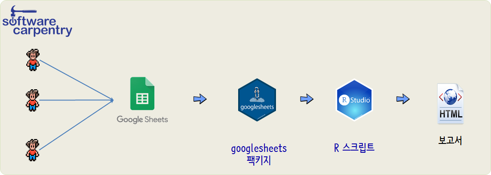

``` {r, include=FALSE}
# source("tools/chunk-options.R")
knitr::opts_chunk$set(echo = TRUE, message=FALSE, warning=FALSE,
                      comment="", digits = 3, tidy = FALSE, prompt = FALSE, fig.align = 'center')

```

# 스프레드시트 작업흐름도 [^ds-plus-googlesheets] {#googlesheets-workflow}

[^ds-plus-googlesheets]: [Rob Grant(2017-12), "How to Use googlesheets to Connect R to Google Sheets"](https://datascienceplus.com/how-to-use-googlesheets-to-connect-r-to-google-sheets/)

구글 스프레드 시트(google sheets)와 같은 "스프레드 시트"로부터 데이터를 작업할 경우 다수 사용자가 공동으로 데이터 작업을 수행하고 이를 [`googlesheets`](https://github.com/jennybc/googlesheets) 팩키지를 사용하여 인증 및 접속을 하여 데이터를 R로 가져와서 추가적인 작업을 수행하게 된다.



소프트웨어 카펜트리가 2015년부터 여러해에 걸쳐 다수 워크샵이 진행되다보니 인원관리에 대한 필요성이 제기되어 각 회차별 소프트웨어 카펜트리 데이터를 정제하고 각종 통계 작업을 할 필요성이 발생했습니다.


# 소프트웨어 카펜트리 데이터 {#googlesheets-workflow-data}

먼저, 구글쉬트의 인증과정을 거치고 해당 스프레드 쉬트를 특정하여 구글에서 가져온다.

```{r swcarpentry-data}
library(tidyverse)
library(googlesheets)

gs_auth(new_user = TRUE)

meetup_gs <- gs_key("1tZT9s3D1eS7s265DF7_Va8iP0mJxlu-a41EnxvKxWP8")

```

# 소프트웨어 카펜트리 명부 정리 {#googlesheets-workflow-data-clean}

구글 스프레드 쉬트 내부에 시트를 뽑아내서 각각의 데이터프레임으로 변환하고 통계작업을 위해서 하나의 데이터프레임으로 정리한다. 소프트웨어 카펜트리와 

```{r google-swcarpentry}
## 워크샵 -----
swc_gs <- gs_read(meetup_gs, ws="SWC참석자") %>% 
  mutate_if(is.logical, as.character) 

ds_gs <- gs_read(meetup_gs, ws="DS참석자") %>% 
  mutate_if(is.logical, as.character)
```


# SW 카펜트리 명부 정리  {#googlesheets-workflow-data-clean-eda}

`swc_gs` 데이터프레임으로 각종 통계작업과 시각화 작업을 수행한다.
우선 2015년부터 진행된 소프트웨어 카펜트리 워크샵 행사에 대한 수료와 미수료 정보를 바탕으로 표를 작성한다.

```{r swcarpentry-eda}
swc_gs %>% 
  group_by(`행사`, `수료여부`) %>% 
  summarise(complete = n()) %>% 
  spread(`수료여부`, complete, fill=0) %>% 
  DT::datatable()
```

# SW 카펜트리 명부와 데이터 사이언스 밋업  {#googlesheets-workflow-data-clean-email}

소프트웨어 카펜트리 워크샵과 데이터 사이언스 밋업과 관련하여 전자우편 발표 목록을 작성한다.
즉, 중복된 전자우편 주소 및 정제를 목적으로 작업한다.

```{r swcarpentry-eda-email}
swc_email_gs <- swc_gs %>% 
  select(`이름`=`국문이름`, `이메일`)

ds_email_gs <- ds_gs %>% 
  select(`이름`, `이메일`)

swc_ds_df <- bind_rows(swc_email_gs, ds_email_gs)

dim(swc_ds_df)

unique(swc_ds_df) %>% 
  dim

# unique(swc_ds_df) %>% 
# pull(이메일) %>% dput
```
