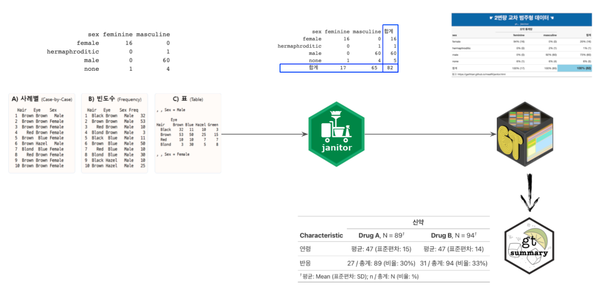
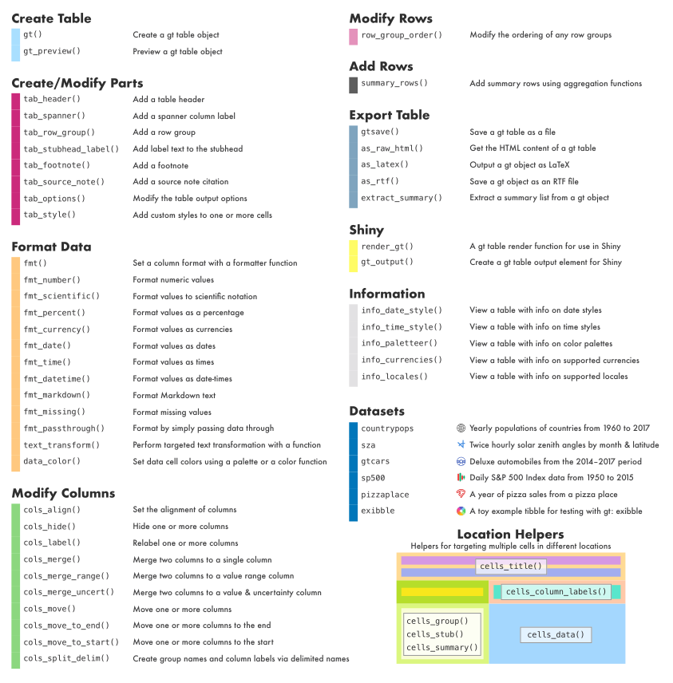

```{r setup, include=FALSE}
knitr::opts_chunk$set(echo = TRUE, warning=FALSE, message=FALSE,
                    comment="", digits = 3, tidy = FALSE, prompt = FALSE, fig.align = 'center')

library(reticulate)
library(tidyverse)

```



# 단변량 범주형 [^1] {#univariate-categorical-data}

[^1]: [`janitor` - tabyls: a tidy, fully-featured approach to counting things](https://cran.r-project.org/web/packages/janitor/vignettes/tabyls.html)

단변량 범주형 데이터를 다양한 형태의 표로 간단히 제작하는 방법을 살펴보자. `starwarsdb` 데이터 팩키지에 포함된 스타워즈 관련 데이터셋부터 시작해보자.

## 데이터 살펴보기 {#univariate-categorical-starwars}

스타워즈 영화에 출연한 캐릭터와 캐릭터의 눈 색깔을 살펴보자.

```{r janitor-univariate}
library(janitor)
library(tidyverse)
library(starwarsdb)

starwarsdb::people %>%
  select(name, eye_color)
```

## 범주형 데이터 요약 {#univariate-categorical-starwars-summary}

스타워즈 영화에 출연한 캐릭터와 캐릭터의 눈 색깔을 살펴보자. `NA` 값이 존재하기 때문에 이를 제거해보자.

```{r janitor-univariate-summary}
starwars_table <- starwarsdb::people %>%
  select(name, eye_color) %>% 
  janitor::tabyl(eye_color) %>% 
  na.omit()

starwars_table
```

## 멋진 `gt` 외양 [^2] {#univariate-categorical-starwars-viz}

[^2]: ["R NOTES TO MYSELF", "cleaning penguins with the janitor package"](http://jenrichmond.rbind.io/post/digging-into-the-janitor-package/)

`janitor` 표 결과물을 `gt` 팩키지에 연결시켜 표를 시각적으로 가치있게 제작한다.

```{r janitor-univariate-viz}
library(gt)

starwars_table %>% 
  select(-starts_with("valid")) %>% 
  gt() %>% 
    fmt_percent(
      columns = percent,
      decimals =1
    ) %>% 
    tab_header(
      title = md("**&#9755; 범주형 데이터 훈련 &#9754;**"),
      subtitle = md("*`gt`, `janitor`*")
    ) %>% 
    tab_source_note(
      source_note = md("http://jenrichmond.rbind.io/post/digging-into-the-janitor-package/")) %>% 
    cols_align(
      align = "center",
      columns = eye_color
    ) %>% 
    tab_options(
      table.width = pct(50),
      heading.background.color = "#1E61B0", # R logo 파란색
      heading.title.font.size = "32px",
      column_labels.background.color = "#F7F7F7", # R logo 회색 
      column_labels.font.weight = "bold",
      stub.background.color = "#ffffff",
      stub.font.weight = "bold"
    )  
  
```

## 단변량 표 합계 [^3] {#univariate-categorical-sum}

[^3]: [Daniel D. Sjoberg (June 27, 2019), "`gtsummary` - Introduction to {gt} + {gtsummary} Packages", Memorial Sloan Kettering Cancer Center](http://www.danieldsjoberg.com/gt-and-gtsummary-presentation/)

범주형 데이터 표를 제작하게 되면 각종 합계를 행과 열을 기준으로 작성하고 행과 열에서 비율도 계산할 필요가 있다.

```{r table-adorn}
starwars_ttl_table <- 
  starwarsdb::people %>%
    select(name, eye_color) %>% 
    janitor::tabyl(eye_color) %>% 
    na.omit() %>% 
    select(-percent, percent = valid_percent) %>% 
    adorn_totals(c("row"), name = "합계")

starwars_ttl_table
```

단변량 범주형 변수를 `gt` 팩키지로 외양을 전문가스럽게 작성한다.

```{r table-adorn-univariate}
starwars_ttl_table %>% 
  gt() %>% 
    fmt_percent(
      columns = percent,
      decimals =1
    ) %>% 
    tab_header(
      title = md("**&#9755; 범주형 데이터 훈련 &#9754;**"),
      subtitle = md("*`gt`, `janitor`*")
    ) %>% 
    tab_source_note(
      source_note = md("http://jenrichmond.rbind.io/post/digging-into-the-janitor-package/")) %>% 
    cols_align(
      align = "center",
      columns = eye_color
    ) %>% 
    tab_options(
      table.width = pct(70),
      heading.background.color = "#1E61B0", # R logo 파란색
      heading.title.font.size = "32px",
      column_labels.background.color = "#F7F7F7", # R logo 회색 
      column_labels.font.weight = "bold",
      stub.background.color = "#ffffff",
      stub.font.weight = "bold"
    )  %>% 
  tab_spanner(label = "요약 통계량", columns = c(n, percent)) %>% 
  tab_style(
    style = list(
      cell_fill(color = "skyblue"),
      cell_text(
        align = "right",
        size = "large",
        weight = "bold")
      ),
    locations = cells_body(rows = eye_color == "합계"))

```

# 2변량 범주형 {#bivariate-categorical-data}

단변량 범주형 데이터를 확대해서 2변량 범주형 데이터를 다양한 형태의 표로 간단히 제작하는 방법을 살펴보자.

## 데이터 살펴보기 {#bivariate-categorical-starwars}

스타워즈 영화에 출연한 캐릭터와 캐릭터의 생리학적 성과 성 정체성에 살펴보자. [^4]

[^4]: ["What is the difference between sex and gender?"](https://www.ons.gov.uk/economy/environmentalaccounts/articles/whatisthedifferencebetweensexandgender/2019-02-21)

-   `sex`: 생리학적 성별
-   `gender`: 성 정체성

```{r janitor-bivariate}
starwarsdb::people %>%
  select(name, sex, gender)
```

## 범주형 데이터 요약 {#bivariate-categorical-starwars-summary}

스타워즈 영화에 출연한 캐릭터 생물학적 성과 성 정체성에 대해 요약 표를 작성해보자.

```{r janitor-bivariate-summary}
gender_table <- starwarsdb::people %>%
  select(name, sex, gender) %>% 
  janitor::tabyl(sex, gender) %>% 
  na.omit()

gender_table
```

## 합계 포함된 표 {#bivariate-categorical-starwars-total}

표를 작성하는데 있어 핵심적으로 포함되는 합계(Total), 비율 등이 포함되도록 이를 넣어보자.

```{r janitor-bivariate-total}
gender_ttl_table <- starwarsdb::people %>%
  select(name, sex, gender) %>% 
  janitor::tabyl(sex, gender) %>% 
  na.omit() %>% 
  adorn_totals(where = c("row", "col"), name = "합계")

gender_ttl_table
```

"합계(Total)"을 넣었다면 이번에는 비율을 표에 삽입해 보자. 퍼센티지 비율은 행 혹은 칼럼 기준으로 지정할 수 있고 `adorn_`을 사용해서 기본 표에 다양한 기능을 넣을 수 있다.

```{r janitor-bivariate-percentage}
gender_pcnt_table <- starwarsdb::people %>%
  select(name, sex, gender) %>% 
  janitor::tabyl(sex, gender) %>% 
  na.omit() %>% 
  adorn_totals(where = c("row", "col"), name = "합계") %>% 
  adorn_percentages(denominator = "col") %>% 
  adorn_pct_formatting(digits = 0) 

gender_pcnt_table
```

```{r janitor-bivariate-percentage-ttl}
gender_ttl_pcnt_table <- starwarsdb::people %>%
  select(name, sex, gender) %>% 
  janitor::tabyl(sex, gender) %>% 
  na.omit() %>% 
  adorn_totals(where = c("row", "col"), name = "합계") %>% 
  adorn_percentages(denominator = "col") %>% 
  adorn_pct_formatting(digits = 0) %>% 
  adorn_ns(position = "rear")

gender_ttl_pcnt_table
```

## 멋진 `gt` 외양 {#bivariate-categorical-starwars-viz}

정성껏 작성한 `janitor` 표를 `gt` 팩키지에 연결시켜 2변량 범주형 표를 시각적으로 가치있게 제작한다.

```{r janitor-bivariate-viz}

gender_ttl_pcnt_table %>% 
  gt() %>% 
    tab_header(
      title = md("**&#9755; 2변량 교차 범주형 데이터 &#9754;**"),
      subtitle = md("*`gt`, `janitor`*")
    ) %>% 
    tab_source_note(
      source_note = md("참고: https://garthtarr.github.io/meatR/janitor.html")) %>% 
    cols_align(
      align = "right",
      columns = c(feminine, masculine, 합계)
    ) %>% 
    tab_options(
      table.width = pct(100),
      heading.background.color = "#1E61B0", # R logo 파란색
      heading.title.font.size = "32px",
      column_labels.background.color = "#F7F7F7", # R logo 회색 
      column_labels.font.weight = "bold",
      stub.background.color = "#ffffff",
      stub.font.weight = "bold"
    )  %>% 
  tab_spanner(label = "요약 통계량", columns =  c(feminine, masculine)) %>% 
  tab_style(
    style = list(
      cell_fill(color = "skyblue"),
      cell_text(
        align = "right",
        size = "large",
        weight = "bold")
      ),
    locations = cells_body(rows = sex == "합계",
                           columns = 합계))
```

# `gtsummary` [^5] {#gtsummary}

[^5]: [Daniel D. Sjoberg (June 27, 2019), "`gtsummary` - Introduction to {gt} + {gtsummary} Packages", Memorial Sloan Kettering Cancer Center](http://www.danieldsjoberg.com/gt-and-gtsummary-presentation/)



먼저 [`gtsummary`](http://www.danieldsjoberg.com/gtsummary/index.html) 팩키지에 포함된 `trial` 데이터셋을 바탕으로 다양한 표제작을 신속히 할 수 있는 방법을 살펴보자.

```{r gtsummary}
library(gtsummary)

sample_tbl <- 
  trial %>%
    select(trt, age, response) %>% 
    na.omit()

sample_tbl
```

`tbl_summary()` 함수를 사용해서 기본 생성 표를 제작해보자.

```{r gtsummary-table}
sample_tbl %>% 
  tbl_summary(by = "trt")
```

다음 단계로 필요한 요약 통계량을 뽑아내서 이를 표에 반영하는 방식을 살펴보자.

```{r gtsummary-table-custom}
gtsummary_tbl <- 
  sample_tbl %>% 
    tbl_summary(
      by = "trt",
      statistic = list(
        all_continuous() ~ "평균: {mean} (표준편차: {sd})",
        all_categorical() ~ "{n} / 총계: {N} (비율: {p}%)"
      ),
      label = list("age" ~ "연령",
              "response" ~ "반응")
    ) %>% 
  modify_spanning_header(all_stat_cols() ~ "**신약**")

gtsummary_tbl 
```

나름 필요한 정보가 모두 담긴 표가 제작되었으니 이를 `gt` 팩키지와 연결시켜 표를 제작해보자.

`gtsummary` 객체를 `gt()`에 연결시켜 작업하는 방법은 현재 없음.

```{r added-gt-feature, error = TRUE}
gtsummary_tbl %>% 
  gt()
```


