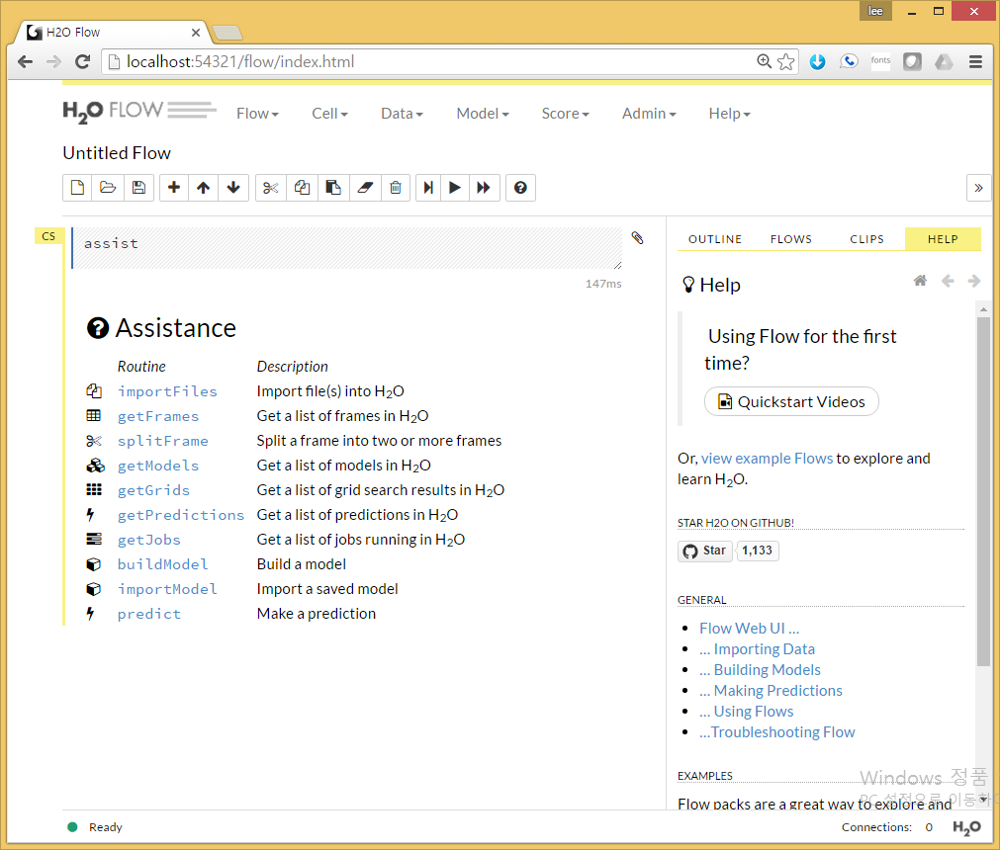
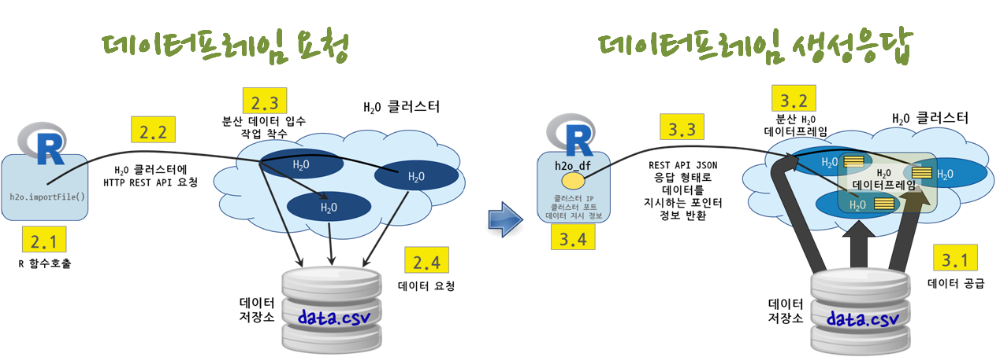
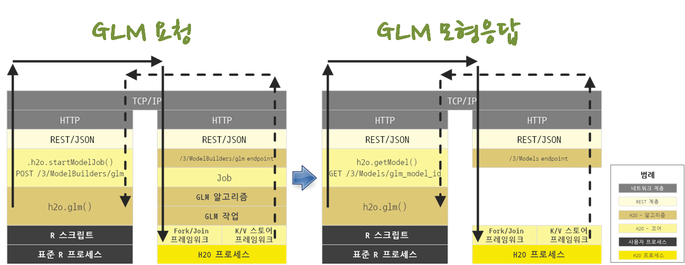

> ## 학습 목표 {.objectives}
>
> * $H_2 O$ 헬로 월드를 찍어본다.
> * $H_2 O$ 클러스터로 데이터를 가져온다.
> * $H_2 O$ 클러스터와 R 협업 과정을 이해한다.
> * 일반화 선형모형을 $H_2 O$ 클러스터 내 데이터프레임 데이터로 예측모형으로 적용한다.

### 1. $H_2 O$ 돌려보기 [^h2o-getting-started]

[^h2o-getting-started]: [R Tutorial](http://h2o-release.s3.amazonaws.com/h2o/rel-lambert/5/docs-website/Ruser/rtutorial.html)

#### 1.1. $H_2 O$ 설치 [^h20-r-install]

[^h20-r-install]: [Install H2O package in R](http://h2o-release.s3.amazonaws.com/h2o/rel-lambert/5/docs-website/Ruser/Rinstall.html)

R에서 $H_2 O$ 설치는 `install.packages` 명령어를 통해 간단히 구현된다.
만약 기존 $H_2 O$ 팩키지가 설치되어 있다면 제거하고, `install.packages` 명령어로 설치한다.

~~~ {.r}
##=========================================================================
## 01. H2O 설치: 
##=========================================================================
# 기존 H2O 제거
if ("package:h2o" %in% search()) { detach("package:h2o", unload=TRUE) }
if ("h2o" %in% rownames(installed.packages())) { remove.packages("h2o") }

# 새로 깔끔하게 H2O 설치
install.packages("h2o", repos=(c("http://s3.amazonaws.com/h2o-release/h2o/master/1497/R", getOption("repos"))))
~~~

만약 자바가 설치되지 않는 경우 다음 명령어를 통해 자바를 설치한다. 64비트 버젼이 필요하다. 32비트 자바가 설치되어 있다면 64비트 버젼으로 새로 설치해야만 된다.

~~~ {.shell}
$ sudo add-apt-repository -y ppa:webupd8team/java
$ sudo apt-get update
$ sudo apt-get -y install oracle-java8-installer
$ sudo apt-get -y install oracle-java8-set-default
$ java -version
~~~

#### 1.2. $H_2 O$ 클러스터 생성

**로컬 컴퓨터**, **아마존 EC2**, **하둡 서버** 위 어디든 다음 명령어로 $H_2 O$ 인스턴스를 띄울 수 있다.

$H_2 O$ 클러스터가 생성되면, 클러스터 노드 하나를 잡아서 `h2o.init` 명령어로 IP 주소와 포트를 인자로 넘겨 연결을 초기화한다.

~~~ {.r}
library(h2o)
localH2O <- h2o.init(ip = 'localhost', port = 54321, max_mem_size = '4g')
~~~

~~~ {.output}
H2O is not running yet, starting it now...

Note:  In case of errors look at the following log files:
    C:\Users\KWANGC~1\AppData\Local\Temp\RtmpmEjcOu/h2o_KwangChun_started_from_r.out
    C:\Users\KWANGC~1\AppData\Local\Temp\RtmpmEjcOu/h2o_KwangChun_started_from_r.err

java version "1.7.0_79"
Java(TM) SE Runtime Environment (build 1.7.0_79-b15)
Java HotSpot(TM) 64-Bit Server VM (build 24.79-b02, mixed mode)

Starting H2O JVM and connecting: . Connection successful!

R is connected to the H2O cluster: 
    H2O cluster uptime:         1 seconds 813 milliseconds 
    H2O cluster version:        3.8.2.6 
    H2O cluster name:           H2O_started_from_R_KwangChun_qyq253 
    H2O cluster total nodes:    1 
    H2O cluster total memory:   3.56 GB 
    H2O cluster total cores:    4 
    H2O cluster allowed cores:  2 
    H2O cluster healthy:        TRUE 
    H2O Connection ip:          localhost 
    H2O Connection port:        54321 
    H2O Connection proxy:       NA 
    R Version:                  R version 3.2.4 (2016-03-10) 

Note:  As started, H2O is limited to the CRAN default of 2 CPUs.
       Shut down and restart H2O as shown below to use all your CPUs.
           > h2o.shutdown()
           > h2o.init(nthreads = -1)
~~~

#### 1.2. $H_2 O$ 클러스터 정보확인

`h2o.clusterInfo()` 혹은 `h2o.clusterInfo(localH2O)` 명령어를 통해 구성된 클러스터 정보를 확인한다. 

~~~ {.r}
> h2o.clusterInfo()
~~~

~~~ {.output}
R is connected to the H2O cluster: 
    H2O cluster uptime:         11 minutes 10 seconds 
    H2O cluster version:        3.8.2.6 
    H2O cluster name:           H2O_started_from_R_KwangChun_qyq253 
    H2O cluster total nodes:    1 
    H2O cluster total memory:   3.56 GB 
    H2O cluster total cores:    4 
    H2O cluster allowed cores:  2 
    H2O cluster healthy:        TRUE 
    H2O Connection ip:          localhost 
    H2O Connection port:        54321 
    H2O Connection proxy:       NA 
    R Version:                  R version 3.2.4 (2016-03-10) 
~~~

#### 1.3. $H_2 O$ 클러스터 종료

$H_2 O$ 클러스터를 `h2o.shutdown` 명령어로 종료시킨다.

~~~ {.r}
> h2o.shutdown()
Are you sure you want to shutdown the H2O instance running at http://localhost:54321/ (Y/N)? y
[1] TRUE
~~~

### 2. $H_2 O$ 데이터 가져오기

`h2o.importFile` 명령어를 HTTP REST API를 통해 $H_2 O$ 클러스터에 전송을 하게 되면 $H_2 O$ 클러스터는 데이터저장소를 찾아 데이터를 요청하게 된다.

다른 특별한 사항이 없다면 데이터 저장소에서 $H_2 O$ 클러스터로 데이터가 공급되고, $H_2 O$ `분산 데이터프레임`이 $H_2 O$ 클러스터에 생성되고, 작업 실행결과가 REST API JSON 응답으로 반환되고, R 내부에는 `h2o_df` 데이터프레임이 생성된다. 하지만, 로컬 컴퓨터 R에는 클러스터 IP, 클러스터 포트, $H_2 O$ 분산 데이터프레임을 지시하는 포인터정보가 보관된다. 

$H_2 O$ 데이터를 가져오는 경우 $H_2 O$에 나온 설명과 차이가 나서 돌아가지 않는 경우가 있다. 활발히 성능개선이 꾸준히 일어나다 보니 문서와 코드가 맞지 않으니 가장 최신 $H_2 O$ 도움말을 참조하거나, 가장 최신 코드를 뜯어보고 사용하면 된다. 늘 오픈소스 소프트웨어를 사용하면 발생되는 사항이니 절대로 당황하지 않는다.

#### 2.1. $H_2 O$ 팩키지에 포함된 데이터 불러오기

~~~ {.r}
##=========================================================================
## 02. Data import
##=========================================================================

irisPath = system.file("extdata", "iris.csv", package="h2o")
iris.hex = h2o.importFile(path = irisPath,  destination_frame = "iris.hex")
summary(iris.hex, exact_quantiles=TRUE)
~~~

~~~ {.output}
> irisPath
[1] "C:/Users/KwangChun/Documents/R/win-library/3.2/h2o/extdata/iris.csv"
> summary(iris.hex, exact_quantiles=TRUE)
 C1              C2              C3              C4              C5                 
 Min.   :4.300   Min.   :2.000   Min.   :1.000   Min.   :0.100   Iris-setosa    :50 
 1st Qu.:5.100   1st Qu.:2.800   1st Qu.:1.600   1st Qu.:0.300   Iris-versicolor:50 
 Median :5.800   Median :3.000   Median :4.350   Median :1.300   Iris-virginica :50 
 Mean   :5.843   Mean   :3.054   Mean   :3.759   Mean   :1.199                      
 3rd Qu.:6.400   3rd Qu.:3.300   3rd Qu.:5.100   3rd Qu.:1.800                      
 Max.   :7.900   Max.   :4.400   Max.   :6.900   Max.   :2.500 
~~~

#### 2.1. $H_2 O$ 클러스터로 외부 데이터 불러오기

[항공사 데이터셋(allyear2k.csv)](https://s3.amazonaws.com/h2o-airlines-unpacked/allyears2k.csv) 파일을 다운로드 받아 로컬 컴퓨터 원하는 디렉토리에 저장을 한 후, `h2o.importFile` 명령어로 데이터를 불러온다.

~~~ {.r}
#-------------------------------------------------------------------------
# 2.2. 외부 CSV 데이터 불러오기
#-------------------------------------------------------------------------
# https://github.com/h2oai/h2o-2/wiki/Hacking-Airline-DataSet-with-H2O
# https://s3.amazonaws.com/h2o-airlines-unpacked/allyears2k.csv

pathToAirlines <- normalizePath("~/30-neural-network/allyears2k.csv")
airlines.hex <- h2o.importFile(path = pathToAirlines, destination_frame = "airlines.hex")
summary(airlines.hex, exact_quantiles=TRUE)
~~~

~~~ {.output}
  Year           Month            DayofMonth     DayOfWeek       DepTime         
 Min.   :1987   Min.   : 1.000   Min.   : 1.0   Min.   :1.000   Min.   :   1.0  
 1st Qu.:1992   1st Qu.: 1.000   1st Qu.: 6.0   1st Qu.:2.000   1st Qu.: 927.4  
 Median :1998   Median : 1.000   Median :14.0   Median :4.000   Median :1328.2  
 Mean   :1998   Mean   : 1.409   Mean   :14.6   Mean   :3.821   Mean   :1345.8  
 3rd Qu.:2003   3rd Qu.: 1.000   3rd Qu.:23.0   3rd Qu.:5.000   3rd Qu.:1733.8  
 Max.   :2008   Max.   :10.000   Max.   :31.0   Max.   :7.000   Max.   :2400.0  
                                                                NA's   :1086    
 
 .......

 NASDelay          SecurityDelay      LateAircraftDelay IsArrDelayed IsDepDelayed
 Min.   :  0.000   Min.   : 0.00000   Min.   :  0.00    YES:24441    YES:23091   
 1st Qu.:  0.000   1st Qu.: 0.00000   1st Qu.:  0.00    NO :19537    NO :20887   
 Median :  0.000   Median : 0.00000   Median :  0.00                             
 Mean   :  4.855   Mean   : 0.01702   Mean   :  7.62                             
 3rd Qu.:  0.000   3rd Qu.: 0.00000   3rd Qu.:  0.00                             
 Max.   :323.000   Max.   :14.00000   Max.   :373.00                             
 NA's   :35045     NA's   :35045      NA's   :35045   
~~~

### 3. $H_2 O$ 데이터 정제과정 [^h2o-r-scaling]

[^h2o-r-scaling]: [Scaling R with H2O](http://blog.h2o.ai/2015/06/h2o-r-functions/)

`lubridate` 팩키지의 정확한 시간 계산 함수를 사용해서 비행기 출발시간과 도착시간을 계산하여야 하나 편의상 데이터 전처리과정만을 맛보기로 보여주는 $H_2 O$ R 코드는 다음과 같다.

`DepTime`, `ArrTime` 변수에서 나머지를 구하는 연산자 `%%`을 사용하여 전체를 분으로 환산하고, 총합을 빼는 로직으로 비행기 이동시간을 산출한다.

~~~ {.r}
##=========================================================================
## 03. H2O 데이터 정제 과정
##=========================================================================

## 비행기 출발시간
depHour <- airlines.hex$DepTime %/% 100
depMin <- airlines.hex$DepTime %% 100 ## R 나머지 연산자
depTime <- depHour*60 + depMin

## 비행기 도착시간
arrHour <- airlines.hex$ArrTime %/% 100
arrMin <- airlines.hex$ArrTime %% 100 ## R 나머지 연산자
arrTime <- arrHour*60 + arrMin

## 비행기 이동시간을 계산하여 데이터프레임에 변수로 추가
airlines.hex$airliner_duration <- arrTime - depTime

summary(airlines.hex$airliner_duration)
~~~

~~~ {.output}
 trip_duration     
 Min.   :-1408.00  
 1st Qu.:   66.36  
 Median :   94.06  
 Mean   :   94.94  
 3rd Qu.:  139.58  
 Max.   :  570.00  
 NA's   :1195  
~~~

### 4. $H_2 O$ 일반화 선형모형 적합

비행기 연착에 대한 예측모형을 개발 할 때 일반화 선형모형 `h2o.glm` 함수를 사용할 경우,
REST API를 통해 JSON을 통해 `POST` 요청을 HTTP, TCP/IP 요청을 보내면 $H_2 O$ 클러스터에서
이를 받아 맵리듀스 작업을 통해 GLM 모형을 분산해서 작업처리하고 이 결과값을 K/V 스토어 프레임워크에서 
그대로 HTTP, TCP/IP 네트워크 계층을 통해 REST API JSON 응답으로 반환한다.

GLM 모형 적합 과정이 끝났기 때문에 `GET` 요청을 통해 GLM 예측모형 결과를 반환해서 볼 수 있다.
이와 같이 $H_2 O$는 계층으로 구분되고 API 호출을 통해 작업이 이루어지는 것을 쉽게 확인할 수 있다.

`h2o.glm` 함수를 통해 일반화 선형모형 적합을 한다. 

~~~ {.r}
y <- "IsArrDelayed"
X  <- c("Year", "Month", "DayofMonth", "DayOfWeek", "CRSDepTime", "UniqueCarrier", "Origin", "Dest", 'Distance')
airlines.glm <- h2o.glm(y=y, x=X, training_frame = airlines.hex, family = "binomial", nfolds = 1)

summary(airlines.glm)
~~~

~~~ {.output}
Model Details:
==============

H2OBinomialModel: glm
Model Key:  GLM_model_R_1466651157460_49 
GLM Model: summary
    family  link                                regularization number_of_predictors_total
1 binomial logit Elastic Net (alpha = 0.5, lambda = 1.286E-4 )                        285
  number_of_active_predictors number_of_iterations    training_frame
1                         174                    6 RTMP_sid_89c6_116

H2OBinomialMetrics: glm
** Reported on training data. **

MSE:  0.2292239
R^2:  0.07155948
LogLoss:  0.6494671
AUC:  0.6531338
Gini:  0.3062676
Null Deviance:  60418.47
Residual Deviance:  57124.52
AIC:  57474.52

Confusion Matrix for F1-optimal threshold:
         NO   YES    Error          Rate
NO     2252 17285 0.884732  =17285/19537
YES    1037 23404 0.042429   =1037/24441
Totals 3289 40689 0.416617  =18322/43978

Maximum Metrics: Maximum metrics at their respective thresholds
                      metric threshold    value idx
1                     max f1  0.384351 0.718686 325
2                     max f2  0.218280 0.862275 390
3               max f0point5  0.541590 0.650769 210
4               max accuracy  0.503718 0.614580 240
5              max precision  0.904514 0.920635   5
6                 max recall  0.171626 1.000000 398
7            max specificity  0.923912 0.999898   0
8           max absolute_MCC  0.564486 0.219999 191
9 max min_per_class_accuracy  0.547993 0.609049 205

Gains/Lift Table: Extract with `h2o.gainsLift(<model>, <data>)` or `h2o.gainsLift(<model>, valid=<T/F>, xval=<T/F>)`

Scoring History: 
            timestamp   duration iteration negative_log_likelihood objective
1 2016-06-23 13:17:13  0.000 sec         0             28613.08490   0.65412
2 2016-06-23 13:17:13  0.022 sec         1             28584.52677   0.65366
3 2016-06-23 13:17:13  0.043 sec         2             28584.22829   0.65366
4 2016-06-23 13:17:13  0.075 sec         3             28569.76940   0.65346
5 2016-06-23 13:17:13  0.091 sec         4             28562.73042   0.65344
6 2016-06-23 13:17:13  0.122 sec         5             28562.26209   0.65344

Variable Importances: (Extract with `h2o.varimp`) 
=================================================

Standardized Coefficient Magnitudes: standardized coefficient magnitudes
       names coefficients sign
1 Origin.HPN     0.998666  POS
2   Dest.HNL     0.966070  NEG
3 Origin.BOI     0.948073  NEG
4 Origin.MDW     0.932842  POS
5 Origin.ERI     0.913336  POS

---
                        names coefficients sign
280                Origin.TUL     0.000000  POS
281                Origin.TYS     0.000000  POS
282                Origin.UCA     0.000000  POS
283        Origin.missing(NA)     0.000000  POS
284          UniqueCarrier.DL     0.000000  POS
285 UniqueCarrier.missing(NA)     0.000000  POS
~~~