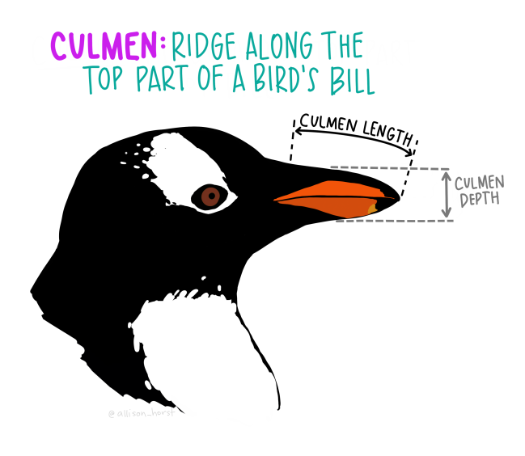

```{r, include=FALSE}
knitr::opts_chunk$set(echo = TRUE, message=FALSE, warning=FALSE,
                      comment="", digits = 3, tidy = FALSE, prompt = FALSE, fig.align = 'center')

```


# 펭귄 데이터 출현 [^penguin-dataset] {#penguin-dataset}

[^penguin-dataset]: [AbdulMajedRaja RS (17 Jun 2020), "Penguins Dataset Overview - iris alternative in R using `palmerpenguins`](https://www.programmingwithr.com/penguins-dataset-overview-iris-alternative-in-r/)

미국에서 "George Floyd"가 경찰에 의해 살해되면서 촉발된 ["Black Lives Matter"](https://ko.wikipedia.org/wiki/Black_Lives_Matter) 운동은 아프리카계 미국인을 향한 폭력과 제도적 인종주의에 반대하는 사회운동이다. 한국에서도 소수 정당인 정의당에서 [여당 의원 176명 중 누가?…차별금지법 발의할 ‘의인’을 구합니다](http://www.hani.co.kr/arti/politics/assembly/949422.html)로 기사로 낼 정도로 적극적으로 나서고 있다. 

데이터 과학에서 최근 R.A. Fisher의 과거 저술한 "The genetical theory of natural selection" [@fisher1958genetical] 우생학(Eugenics) 대한 관점[^fisher-eugenics]이 논란이 되면서 R 데이터 과학의 첫 데이터셋으로 붓꽃 `iris` 데이터를 다른 데이터, 즉 펭귄 데이터로 대체하는 움직임이 활발히 전개되고 있다. [`palmerpenguins`](https://github.com/allisonhorst/palmerpenguins) [@penguin2020] 데이터셋이 대안으로 많은 호응을 얻고 있다.

[^fisher-eugenics]: [IDO LEVY (DECEMBER 16, 2019), "EUGENICS AND THE ETHICS OF STATISTICAL ANALYSIS", Goergetown Public Policy REview](http://gppreview.com/2019/12/16/eugenics-ethics-statistical-analysis/)

## 펭귄 공부 {#penguins-study}

팔머(Palmer) 펭귄은 3종이 있으며 자세한 내용은 다음 나무위키를 참조한다. [^penguin-review]

[^penguin-review]: [신발끈 여행사, 관광안내자료](http://www.shoestring.kr/shoecast/aaa/sp_01_peninsula/peninsula.html)

- [젠투 펭귄(Gentoo Penguin)](https://namu.wiki/w/젠투펭귄): 머리에 모자처럼 둘러져 있는 하얀 털 때문에 알아보기가 쉽다. 암컷이 회색이 뒤에, 흰색이 앞에 있다. 펭귄들 중에 가장 빠른 시속 36km의 수영 실력을 자랑하며, 짝짓기 할 준비가 된 펭귄은 75-90cm까지도 자란다.
- [아델리 펭귄(Adelie Penguin)](https://namu.wiki/w/아델리펭귄): 프랑스 탐험가인 뒤몽 뒤르빌(Dumont D’Urville) 부인의 이름을 따서 ‘아델리’라 불리게 되었다. 각진 머리와 작은 부리 때문에 알아보기 쉽고, 다른 펭귄들과 마찬가지로 암수가 비슷하게 생겼지만 암컷이 조금 더 작다.
- [턱끈 펭귄(Chinstrap Penguin)](https://namu.wiki/w/턱끈펭귄): 언뜻 보면 아델리 펭귄과 매우 비슷하지만, 몸집이 조금 더 작고, 목에서 머리 쪽으로 이어지는 검은 털이 눈에 띈다. 어린 고삐 펭귄들은 회갈색 빛을 띄는 털을 가지고 있으며, 목 아래 부분은 더 하얗다. 무리를 지어 살아가며 일부일처제를 지키기 때문에 짝짓기 이후에도 부부로써 오랫동안 함께 살아간다.


```{r penguins-species, eval = FALSE}
library(webshot)

webshot(url="https://allisonhorst.github.io/palmerpenguins/", selector = "#meet-the-palmer-penguins > p > img", "fig/penguin-species.png")
```


다음으로 `iris` 데이터와 마찬가지로 펭귄 3종을 구분하기 위한 변수로 조류의 부리에 있는 중앙 세로선의 융기를 지칭하는 능선(`culmen`) 길이(culmen length)와 깊이(culmen depth)를 이해하면 된다.

```{r penguins-species-variable, eval = FALSE}
library(webshot)

webshot(url="https://allisonhorst.github.io/palmerpenguins/", selector = "#what-are-culmen-length--depth > p:nth-child(4) > img", "fig/penguin-species-variable.png")
```




## 펭귄 서식지 {#penguin-home}

`leaflet` 팩키지로 펭귄 서식지를 남극에서 특정한다.
`geocoding`을 해야 하는데 구글에서 위치 정보를 구글링하면 <https://latitude.to/>에서 직접 위경도를 반환하여 준다.
이 정보를 근거로 하여 펭귄 서식지를 시각화한다.

```{r penguin-home}
library(tidyverse)
library(leaflet)
library(palmerpenguins)
# library(tidygeocoder)

penguins %>% 
  count(island)

island_df <- tribble(~"address", ~"lat", ~"lng",
                     "Torgersen Island antarctica", -64.7666636, -64.083333,
                     "Dream Island antarctica", -64.7333304, -64.2333324,
                     "Biscoe Island antarctica", -65.4333316, -65.499998,
                     "Palmer Station", -64.774167, -64.053056)

island_df %>% 
  leaflet() %>% 
  addProviderTiles(providers$OpenStreetMap) %>% 
  addMarkers(lng=~lng, lat=~lat, 
                   popup = ~ as.character(paste0("<strong>", paste0("명칭:",`address`), "</strong><br>",
                                                 "-----------------------------------------------------------<br>",
                                                 "&middot; latitude: ", `lat`, "<br>",
                                                 "&middot; longitude: ", `lng`, "<br>"
                   ))) 

```


# 데이터 설치 {#penguin-install-dataset}

`remotes` 팩키지 `install_github()` 함수로 펭귄 데이터를 설치한다.

```{r install-penguin-dataset, eval = FALSE}
# install.packages("remotes")
remotes::install_github("allisonhorst/palmerpenguins")
```

`tidyverse` 팩키지 `glimpse()` 함수로 펭귄 데이터를 일별한다.

```{r glimpse-dataset}
library(tidyverse)
library(palmerpenguins)

glimpse(penguins)
```

## 자료구조 일별 {#penguin-EDA-skimr}

`skimr` 팩키지를 사용해서 `penguins` 데이터프레임 자료구조를 일별한다.
이를 통해서 344개 펭귄 관측값이 있으며, 7개 칼럼으로 구성된 것을 확인할 수 있다.
또한, 범주형 변수가 3개, 숫자형 변수가 4개로 구성되어 있다. 
그외 더 자세한 사항은 범주형, 숫자형 변수에 대한 요약 통계량을 참조한다.

```{r penguins-EDA-data-structure}
skimr::skim(penguins)
```

데이터가 크지 않아 `DT` 팩키지를 통해 데이터 전반적인 내용을 살펴볼 수 있다.

```{r penguins-DT}
penguins %>% 
  DT::datatable()
```


# 탐색적 데이터 분석 {#penguin-EDA}

`palmerpenguins` 데이터셋 소개에 포함되어 있는 미국 팔머 연구소 (palmer station) 펭귄 물갈퀴(flipper) 길이와 체질량(body mass) 산점도를 그려보자.

```{r mass-flipper, echo = FALSE, out.width='75%', fig.retina=2}
library(tidyverse)
library(extrafont)
loadfonts()

mass_flipper <- ggplot(data = penguins, 
                       aes(x = flipper_length_mm,
                           y = body_mass_g)) +
  geom_point(aes(color = species, 
                 shape = species),
             size = 3,
             alpha = 0.8) +
  theme_minimal(base_family = "NanumGothic") +
  scale_color_manual(values = c("darkorange","purple","cyan4")) +
  labs(title = "펭귄 크기",
       subtitle = "남극 펭귄 3종 물갈퀴 길이와 체질량 관계",
       x = "물갈퀴 길이 (mm)",
       y = "체질량 (g)",
       color = "펭귄 3종",
       shape = "펭귄 3종") +
  theme(legend.position = c(0.2, 0.7),
        legend.background = element_rect(fill = "white", color = NA),
        plot.title.position = "plot",
        plot.caption = element_text(hjust = 0, face= "italic"),
        plot.caption.position = "plot")

mass_flipper
```
