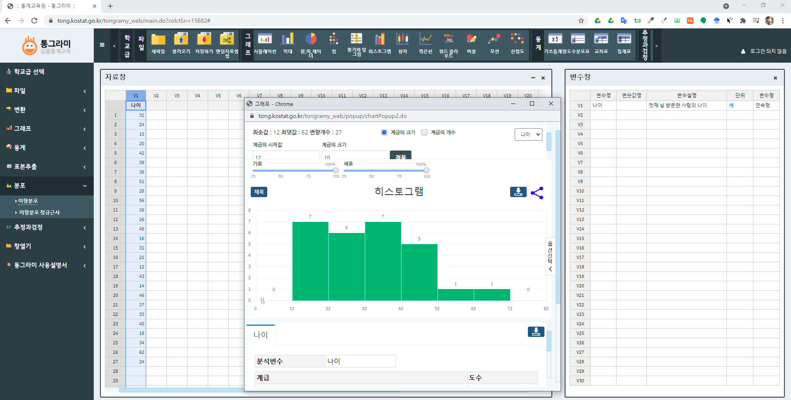

```{r setup, include=FALSE}
knitr::opts_chunk$set(echo = TRUE, warning=FALSE, message=FALSE,
                    comment="", digits = 3, tidy = FALSE, prompt = FALSE, fig.align = 'center')

library(reticulate)
library(tidyverse)

```

# `web-r` 통계 팩키지 {#web-r}


## `web-r` 접속 {#web-r-website}

<http://web-r.org/>

## 정회원 접속서버 {#main-features}

1. 웹에서 하는 R 통계 4.0 정회원용
 
- <https://cardiomoon.shinyapps.io/webr>
- <https://cardiomoon.shinyapps.io/webr1>
- <https://cardiomoon.shinyapps.io/webr2>
  
2. 웹에서 하는 R 통계 4.0 중 생존분석과 PSM
 
- <https://cardiomoon.shinyapps.io/survival>
- <https://cardiomoon.shinyapps.io/survival1>
 
3. 조건부과정분석

<https://cardiomoon.shinyapps.io/processR>
 
4. ROC 분석, Classification (Decision tree, Survival tree), Reclassification(NRI,IDI), AutomaticTransformation
 
<https://cardiomoon.shinyapps.io/webrROC>
 
5. 메타분석
 
<https://cardiomoon.shinyapps.io/metaNew>
 
6. PubMed wordcloud
 
<https://cardiomoon.shinyapps.io/pubmed>


## 스크린샷 {#screenshot}

```{r tidyverse-magic}
library(tidyverse)
library(magick)
library(slickR)

webr_filenames <- fs::dir_ls(path = "fig/web-r/", glob = "fig/web-r/*.png")
webr_filenames <- setdiff(webr_filenames, "fig/web-r/tong.png")

webr_tbl <- tibble(file_path = webr_filenames)

webr_tbl <- webr_tbl %>% 
  mutate(features = str_remove_all(file_path, pattern = "(fig/web-r/)") %>% 
         str_replace_all(., pattern = "(.png)|([0-9]+_)", replacement = ""))

slickR(obj = webr_tbl$file_path, height = "400px", width = "100%") %synch%
  ( slickR(webr_tbl$features, slideType = 'p') + settings(arrows = FALSE) )
```

# 워드 프로세서 {#word-processor}

-   [RStudio Visual Editor](https://statkclee.github.io/latex/document-ide.html)
-   [RStudio 워드 프로세서 - 맞춤법 검사](https://statkclee.github.io/comp_document/cd-rstudio-wp.html)

# 통그라미 {#tong}

## 접속방법 {#tong-connect}

<http://tong.kostat.go.kr/>

## 스크린 샷 {#tong-screenshot}



## PDF 사용설명서 {#pdf-user-manual}

```{r r embed-pdf, out.height = "460px", out.width='800px', echo=TRUE}
knitr::include_graphics("data/tong_user_guide.pdf")
```

## PC용 통그라미 {#install-PC}

[PC용 통그라미](https://tong.kostat.go.kr/front/tongramy/emplaceInfo.do)

# SRC-STAT {#SRC-STAT-stat-package}

㈜에스이랩에서는 서울대학교 데이터과학과 지식창출센터와 협력하여 통계 프로그램 패키지를 공동 개발 하였습니다 (<http://srcdsc.snu.ac.kr/srcstat/>). SRC STAT은 기본적인 통계 분석은 물론 GLM, DHGLM, Joint DHGLM 등 고급 통계 분석 기법을 지원하며 생존분석, 품질관리 등 특화된 도메인에서의 분석 기법도 지원합니다.

-   [국내 연구진, 국산 빅데이터 분석 통계 패키지 개발](https://www.itdaily.kr/news/articleView.html?idxno=43804)

## 스크릿샷 [^1] {#src-stat-screenshot}

[^1]: [서울대 데이터 과학과 지식 창출 연구 센터에서 공개한 통계 패키지 SRC-STAT](http://cantips.com/2455)

```{r tidyverse-magic-src-stat}
src_filenames <- fs::dir_ls(path = "fig/src-stat/", glob = "fig/src-stat/*.png")

src_tbl <- tibble(file_path = src_filenames)

src_tbl <- src_tbl %>% 
  mutate(features = str_remove_all(file_path, pattern = "(fig/src-stat/)"))

slickR(obj = src_tbl$file_path, height = "400px", width = "100%") %synch%
  ( slickR(src_tbl$features, slideType = 'p') + settings(arrows = FALSE) )
```

# GUI Interfaces for R [^gui-interface] {#rgui-foreign-countries}

[^gui-interface]: ["Point-and-Click Graphical User Interfaces for R", r4stats.com](http://r4stats.com/articles/software-reviews/)

- [R Graphical User Interface Comparison](http://r4stats.com/articles/software-reviews/r-gui-comparison/)
  - [R Commander](http://r4stats.com/articles/software-reviews/r-commander/): 2005년 개발된 가장 오래된 R기반 GUI 통계분석
  - [Rattle](http://r4stats.com/articles/software-reviews/rattle/): ML GUI
  - [BlueSky Statistics](http://r4stats.com/articles/software-reviews/bluesky): SPSS 개발자가 나와 만든 스타트업
  - [Deducer](http://r4stats.com/articles/software-reviews/deducer/)
  - [jamovi](http://r4stats.com/articles/software-reviews/jamovi/)
      - [중앙대 설현수](http://education.cau.ac.kr/bbs/board.php?bo_table=s0401&wr_id=23)
  - [JASP](http://r4stats.com/articles/software-reviews/jasp/)
  - [RKWard](http://r4stats.com/articles/software-reviews/RKWard)


