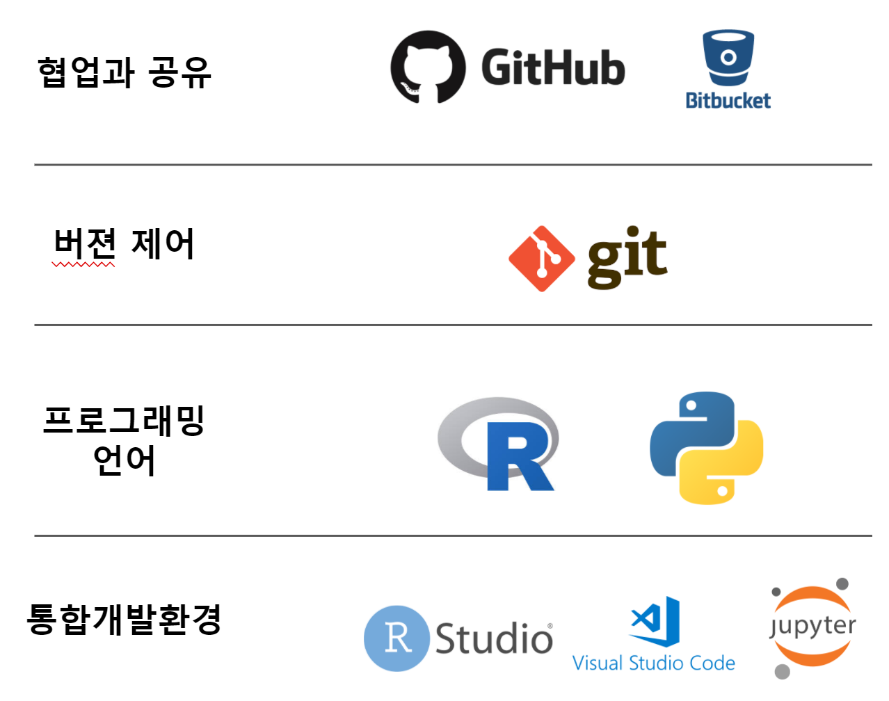
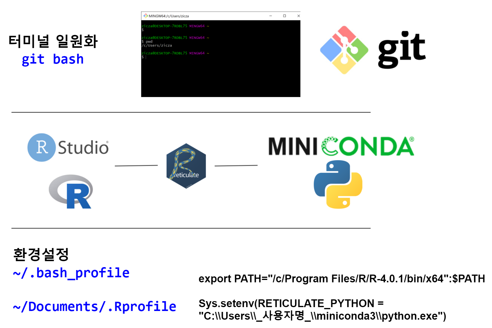
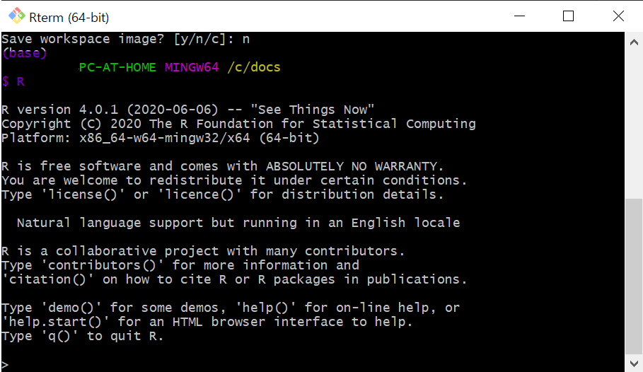
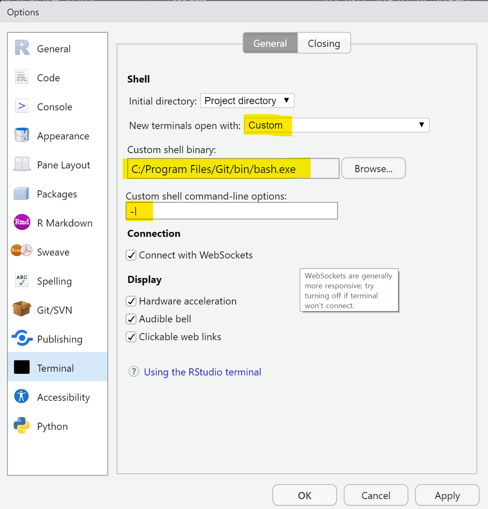
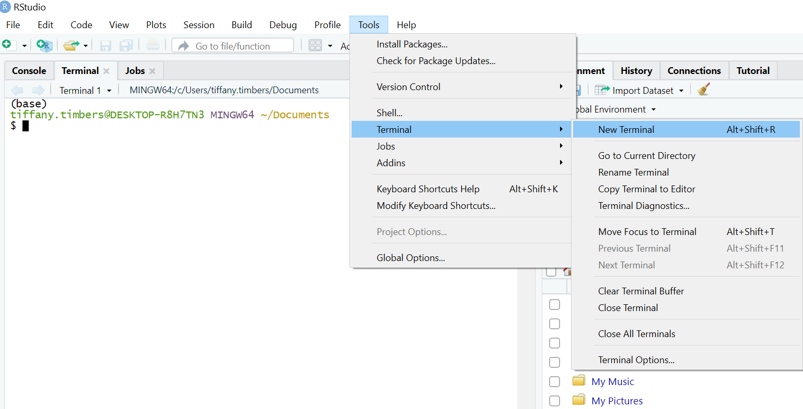

 
``` {r setup, include=FALSE}
knitr::opts_chunk$set(echo = TRUE, warning=FALSE, message=FALSE,
                    comment="", digits = 3, tidy = FALSE, prompt = FALSE, fig.align = 'center')

library(reticulate)
library(tidyverse)

py_run_string("import os as os")
py_run_string("os.environ['QT_QPA_PLATFORM_PLUGIN_PATH'] = 'C:/Users/statkclee/miniconda3/Library/plugins/platforms'")

```

# 데이터 과학 환경 [^baltimore-reticualte]  {#r-ladies-reticualte}

[^baltimore-reticualte]: [Tiffany Timbers (2020. 12. 17),  "Reticulate RStudio and your R code with Python" ](https://www.youtube.com/watch?v=U3ByGh8RmSc)

데이터 과학에 필요한 프로그래밍 언어로 R과 파이썬이 경쟁을 한동안 했다면 이제 그 세월도 흘러 
데이터 과학을 R과 파이썬을 적절히 잘 활용하는 시점으로 변경이 되었다. 데이터 과학에 필수적으로 요구되는 몇가지 구성요소로 다음이 있다. 프로그래밍 언어, 통합개발환경(코드 편집기), 버전 제어 및 형상관리, 공유와 협업이 대표적으로 요구되는 사항이다. 



# RStudio CLI + R + 파이썬 {#rstudio-cli-python-r}

RStudio 통합개발환경 즉, 코드 편집기에서 파이썬을 연결하기 위해서는 [Miniconda](https://docs.conda.io/en/latest/miniconda.html)를 설치하여 파이썬과 파이썬 팩키지 관리자(`conda`)를 함께 설치한다. [Git and Bash](https://git-scm.com/download/win)도 설치하여 윈도우에서 리눅스 터미널을 사용할 수 있도록 CLI 환경을 일치시킨다.

- [Git and Bash](https://git-scm.com/download/win)
- [Miniconda](https://docs.conda.io/en/latest/miniconda.html)



## RStudio + R [^timbers-reticulate] {#rstudio-python-r}

RStudio와 R을 윈도우에 설치하는 것은 R을 설치하게 되면 RStudio에서 자동으로 인식해 RStudio와 R 설치는 [CRAN R](https://cran.r-project.org/bin/windows/base/) 최신 버전을 다운로드 받아 설치한다.

`~/.bash_profile` 파일을 편비하여 R이 설치된 경로를 지정하여 Git Bash 터미널에서 R을 실행할 수 있도록 한다.

```{r path-setup-r, eval = FALSE}
# 경로에 R과 Rscript 추가
export PATH="/c/Program Files/R/R-4.0.2/bin/x64":$PATH
```

`~/.bash_profile` 작업을 통해서 Git Bash 터미널에서 R 경로명을 등록시켜 R을 Git Bash와 연결시키는 작업을 완수했다.




## RStudio 터미널 + Git Bash {#rstudio-terminal-gitbash}

RStudio 터미널과 Git Bash 터미널을 연결시켜 두면 추후 생길 수 있는 터미널 혼선을 막을 수 있다. 이를 위해서 `Tools` &rarr; `Global Options` &rarr; `Terminal`에서 Shell을 Git Bash로 설정한다.

- New terminals open with: `Custom`
- Custom shell binary: `C:/Program Files/Git/bin/bash.exe`
- Custom shell command-line options: `-l`



상기 작업 실행결과 RStudio 터미널이 Git Bash 터미널로 일원화 되었다.




## RStudio + 파이썬 [^timbers-reticulate] {#rstudio-python}

[^timbers-reticulate]: [Tiffany Timbers (2020-12-16), "Introduction to {reticulate}", Workshop for R Ladies Baltimore](https://ttimbers.github.io/intro-to-reticulate/)

미니콘다 [Miniconda](https://docs.conda.io/en/latest/miniconda.html)를 설치했기 때문에 파이썬과 팩키지 관리자(`conda`)가 동시에 설치가 되었다. 파이썬과 R을 연결해주는 팩키지가 `reticulate`로 `install.packages("png")`와  `install.packages("reticulate")` 명령어로 설치를 하게 되면 기본준비는 되었다.
이제 `usethis::edit_r_profile` 명령어를 R 콘솔에서 쳐서 `.Rprofile` 파일에 `Sys.setenv(RETICULATE_PYTHON = "C:\\Users\\사용자명\\miniconda3\\python.exe")`을 설정하여 파이썬을 돌릴 수 있도록 준비를 한다.
참고로 `.Rprofile` 파일은 `~/Documents/.Rprofile`에 위치한다.

# 헬로 월드 {#rstudio-python-helloworld}

`python` 코드 덩어리를 만들어 헬로월드를 찍어 R마크다운 문서에 파이썬을 실행할 수 있음을 확인한다.

```{python helloworld}
print("Hello World! 2+3 = ", 2+3)
```


# 파이썬 데이터 과학 {#rstudio-python-data-science}

아나콘다가 아닌 `miniconda`를 기본 파이썬 엔진으로 사용할 경우 아나콘다에 포함된 팩키지들이 빠져있어 별도 설치를 해야 한다. `pandas`, `matplotlib`이 대표적인다.

## 파이썬 팩키지 관리자 {#python-package-manager}

파이썬 팩키지 관리자로 `conda`를 사용하는 경우 `conda install 팩키지명`을 사용하여 원하는 파이썬 팩키지를 설치할 수 있다. `matplotlib`의 경우 `QT` 의존성이 있어 `pyqt5`도 함께 설치한다.

`conda install pandas`
`conda install pyqt5`
`conda install matplotlib`

`QT`를 설치한 후에 환경변수로 등록하는 작업이 함께 수반되어야 한다. 간단히 다음 코드를 사용해서 `matplotlib` 그래프를 그릴 때 사용하는 `QT` 라이브러리를 환경변수에서 참고하여 시각화시키는데 도움을 준다.

```{r QT-environment, eval = FALSE}
library(reticulate)

py_run_string("import os as os")
py_run_string("os.environ['QT_QPA_PLATFORM_PLUGIN_PATH'] = 'C:/Users/사용자명/miniconda3/Library/plugins/platforms'")
```


# 타이타닉 R vs 파이썬 {#titanic-r-python}

RStudio IDE 를 가지고 윈도우 10 환경에서 R과 파이썬을 데이터 과학 주 언어로 사용하는 사례를 살펴보자.

## 팩키지 불러오기 {#titanic-r-python-import}

`tidyverse`에 대응되는 대표적인 데이터 과학 팩키지가 `pandas`다. `import` 명령어로 가져온다.

<div class = "row">
  <div class = "col-md-6">
**파이썬**

```{python libraries}
import pandas as pd
```

  </div>
  <div class = "col-md-6">
**R/Tidyverse**

```{r r-libraries}
library(tidyverse)
```

  </div>
</div>

## 데이터 불러오기 {#titanic-r-python-load}

판다스 `pd.read_csv()` 메쏘드가 파일 데이터를 메모리로 불러읽어 데이터 과학 작업을 수행할 수 있도록 준비한다.
`tidyverse`에는 `read_csv()` 명령어가 이에 상응한다.

<div class = "row">
  <div class = "col-md-6">
**파이썬**

```{python load-data}
titanic  = pd.read_csv("data/titanic.csv")
```

  </div>
  <div class = "col-md-6">
**R/Tidyverse**

```{r r-load-data}
titanic_tbl <- read_csv("data/titanic.csv")
```

  </div>
</div>


## 시각화 {#titanic-r-python-viz}

파이썬은 `matplotlib` 라이브러리를 통해 판다스 데이터프레임을 시각화한다.
R은 `ggplot`으로 그래프 문법에 맞춰 시각화를 한다.


<div class = "row">
  <div class = "col-md-6">
**파이썬**

```{python plot-data}
titanic.plot.scatter(x='age', y='fare', alpha=0.3)
```

  </div>
  <div class = "col-md-6">
**R/Tidyverse**

```{r r-plot-data}
titanic_tbl %>% 
  ggplot(aes(x = age, y = fare)) +
    geom_point(alpha = 0.3)
```

  </div>
</div>

## 데이터 다루기 {#titanic-r-python-manipulation}

판다스 데이터프레임이나 R 티블(tibble) 데이터프레임은 직사각형 테이블 데이터이기 때문에 SQL 쿼리문에 대응되는 문법에 맞춰 데이터를 조작할 수 있다. 사례로 칼럼을 선택하는 경우를 비교해보자.

<div class = "row">
  <div class = "col-md-6">
**파이썬**

```{python select-data}
titanic[["age", "fare"]]
```

  </div>
  <div class = "col-md-6">
**R/Tidyverse**

```{r r-select-data}
titanic_tbl %>% 
  select(age, fare)
```

  </div>
</div>

칼럼이 아니고 행을 필터(filtering)를 걸어 추출하는 사례를 살펴보자. 예를 들어 나이가 70 이상인 타이나틱호 승선인을 추출해보자.

<div class = "row">
  <div class = "col-md-6">
**파이썬**

```{python filter-data}
titanic[titanic["age"] > 70]
```

  </div>
  <div class = "col-md-6">
**R/Tidyverse**

```{r r-filter-data}
titanic_tbl %>% 
  filter(age > 70)
```

  </div>
</div>


## 파이썬 객체 R 함수 {#python-object-ggplot2}

마지막으로 `titanic`은 파이썬 객체로 이를 `py$` 방식으로 R에서 인식하기 때문에 시각화 함수로 `ggplot`을 사용하게 되면 파이썬의 장점과 R의 장점을 함께 사용할 수 있다.

```{r r-python-plot}
py$titanic %>% 
  ggplot(aes(x = age, y = fare)) +
  geom_point(alpha = 0.5) +
  labs(x     = "탑승객 나이",
       y     = "탑승객 지불요금",
       title = "타이타닉 탑승객 나이와 요금에 대한 산점도") +
  theme_light(base_family = "NanumGothic")
```


