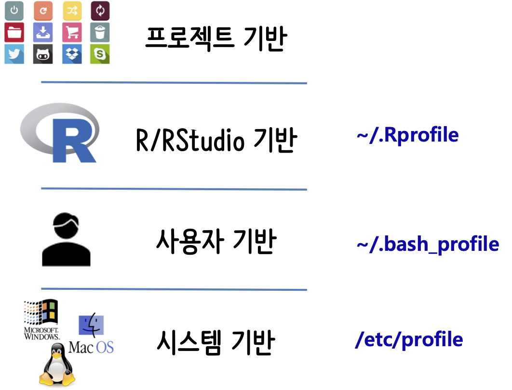

```{r, include=FALSE}
knitr::opts_chunk$set(echo = TRUE, message=FALSE, warning=FALSE,
                      comment="", digits = 3, tidy = FALSE, prompt = FALSE, fig.align = 'center')

```

# 데이터 과학 개발용 컴퓨터 {#data-science-computer}

데이터 과학을 위한 전용 컴퓨터를 새로 구매한다고 가정할 때 맥북 노트북으로 장만했다면 다음과 같은 설정을 단계별로 가져가는 것이 필요합니다.

어떤 소프트웨어도 설치된 적이 없는 맥북에 R 데이터 과학 개발환경을 설정하는 방식은 다음과 같다.

1. 터미널 확인: `bash` 혹은 `zsh` 쉘 중 어떤 쉘을 사용하고 있는지 확인한다.
1. 텍스트 편집기 확인: 나노(`nano`), `vi` 편집기가 쉘에서 기본적으로 활용할 수 있지만, GUI 텍스트 전용 편집기를 준비한다. [아톰(atom)](https://atom.io/), [써브라임 텍스트 3(sublime Text 3)](https://www.sublimetext.com/) 등 다양한 편집기가 있으니, 저작권과 사용경험담등을 참조하여 본인 텍스트 편집기를 설치한다.
1. R과 RStudio 설치: R과 RStudio를 다운로드 받아 설치한다.
    - R 맥 다운로드: https://cran.r-project.org/bin/macosx/
    - R 윈도우 다운로드: https://cran.r-project.org/bin/windows/base/
    - RStudio 다운로드: https://rstudio.com/products/rstudio/download/
1. 공개키/개인키 설정: 버전 제어 및 협업을 위해서 꼭 필요한 기능 [^mac-git-ssh]
    - [`gitlab`](https://statkclee.github.io/data-science/ds-gitlab.html#31_ssh_3) 사례 참조
1. Git, Gitlab, Github 설정
    - Git 설치: `brew install git`
    - `Gitlab`, `Github` 회원 가입 후 환경설정

[^mac-git-ssh]: [devYurim (AUGUST 8, 2018), "Git 설치와 초기 설정 for Mac OS X"](https://devyurim.github.io/development%20environment/git/2018/08/08/git-1.html)

{#id .class width="100%"}

# CLI R & RStudio 설치 {#install-cli-R-RStudio}

먼저 [HomeBrew](https://brew.sh/index_ko)를 설치한다. 명령어는 웹사이트에 나와 있듯이 간단히 다음 명령어를 터미널에 복사형 붙여 넣고 엔터친다.

```{r homebrew-install, eval = FALSE}
$ /usr/bin/ruby -e "$(curl -fsSL https://raw.githubusercontent.com/Homebrew/install/master/install)"
```


<style>
div.blue { background-color:#e6f0ff; border-radius: 5px; padding: 10px;}
</style>
<div class = "blue">

**hadley commented on 19 Oct 2018**

I think the basic advice is NEVER INSTALL R FROM BREW (unless you really know what you are doing). [Github Issues](https://github.com/tidyverse/tidyverse/issues/154#issuecomment-494434428)

</div>

`tidyverse` 설치 시 의존성 때문에 `libxml2`는 설치한다.

```{r libxml2-install, eval = FALSE}
$ brew install libxml2
```

순차적으로 R과 RStudio를 다운로드 받아 설치한다.

- R 맥 다운로드: https://cran.r-project.org/bin/macosx/
- RStudio 다운로드: https://rstudio.com/products/rstudio/download/

마지막으로 [`tidyverse`](https://tidyverse.tidyverse.org/) 팩키지를 설치한다.


# D2-coding 폰트 설치 [^mac-install-setup] {#install-D2-coding-fonts}

[^mac-install-setup]: ["맥 개발 환경 설정하기 - 나의 개발 환경 세팅을 위한 정리"](https://blog.dizy.dev/dev/2016/06/30/setting-up-the-development-environment-for-mac.html)

[네이버 D2 Coding 글꼴](https://github.com/naver/d2codingfont) 웹사이트에서 직접 D2-coding 폰트를 다운로드 받아 압축을 풀어 설치한다. `finder`에서 압축을 푼 폰트를 더블 클릭하여 설치하면 된다.

```{r install-D2-coding-font, eval = FALSE}
$ brew cask install font-d2coding
```

# 자바 설치 [^install-java] {#install-java}

[^install-java]: [HOW TO SET JAVA_HOME ON MAC OS X](http://www.sajeconsultants.com/how-to-set-java_home-on-mac-os-x/)

최신 자바 버전을 설치하면 R 팩키지중 `rJava`를 통해 구현된 라이브러리가 수행되지 않는 문제가 있으니 가능하면 낮은 버전 예를 들어 9 등을 설치한다.

1. [OpenJDK](https://jdk.java.net/archive/) 에서 OpenJDK를 다운로드 받는다. 다양한 버전이 있지만, 9버전을 다운로드 받는다. 다운로드 받은 파일이 예를 들어, `openjdk-9.0.4_osx-x64_bin.tar.gz`인 경우 압축을 풀어 이동시킨다. 압축을 풀게 되면 `jdk-9.0.4.jdk/` 디렉토리 아래 파일과 디렉토리가 풀리게 된다.

```{r java-install-step-01, eval = FALSE}
$ cd ~/Downloads
$ tar xf openjdk-9.0.4_osx-x64_bin.tar.gz
```

2. 압축을 푼 디렉토리를 `/Library/Java/JavaVirtualMachines/`으로 이동시킨다.

```{r java-install-step-02, eval = FALSE}
$ sudo mv jdk-9.0.4.jdk/ /Library/Java/JavaVirtualMachines/
```

3. 쉘 환경설정 파일(`.bash_profile`)에  `JAVA_HOME` 설정한다.

`which java` 명령어로 `java` 설치를 확인한다. `.bash_profile` 파일에 `JAVA_HOME` 경로를 등록시킨다. `/Library/Java/JavaVirtualMachines/` 디렉토리 아래 앞서 이동시킨 자바 프로그램이 복사되어 이동되었다.

이를 확인하는 방법은 `which java`로 확인이 가능하다.

```{bash java-install-step-03, eval = TRUE}
which java
```

`JAVA_HOME` 환경변수를 통해 설정된 값은 다음 명령어를 통해 확인한다.

```{bash java-install-step-04, eval = FALSE}
bash-3.2$ $JAVA_HOME/bin/java --version
openjdk 9.0.4
OpenJDK Runtime Environment (build 9.0.4+11)
OpenJDK 64-Bit Server VM (build 9.0.4+11, mixed mode)
```

<style>
div.blue { background-color:#e6f0ff; border-radius: 5px; padding: 10px;}
</style>
<div class = "blue">

**`.bash_profile` 파일 자바환경 추가**

JAVA_HOME=/Library/Java/JavaVirtualMachines/jdk-9.0.4.jdk/Contents/Home <br>
export JAVA_HOME;

</div>

4. `sudo R CMD javareconf` 명령어로 확인

`sudo R CMD javareconf` 명령어로 설정된 값을 다시 환경에 반영시킨다.

```{bash rconf-cmd, eval = FALSE}
sudo R CMD javareconf
```

5. R에 `JAVA_HOME` 설정

마지막으로 R에 `JAVA_HOME` 설정을 `Sys.setenv()` 명령어로 수행한다.

```{r r-conf}
Sys.setenv(JAVA_HOME = "/Library/Java/JavaVirtualMachines/jdk-9.0.4.jdk/Contents/Home")
```

# `rJava` 설치 [^rstudio-rJava] {#install-rJava-from-source}

[^rstudio-rJava]: [Zuo, Z., (APRIL 12, 2018), "Installing rJava on macOS"](https://zhiyzuo.github.io/installation-rJava/)

[`rJava`](http://www.rforge.net/rJava/)는 R을 자바에 연결시켜주는 인터페이스로 역할을 한다. 오라클이 선마이크로시스템즈를 인수한 이후 정말 다양한 변화가 생겼으며 `rJava`를 써야 되는 기존 자바로 개발된 프로그램을 데이터 과학에 활용하고자 할 경우 설치에 많은 노력이 요구된다.
<center>
{#id .class width="57%"}
</center>


## R 동작, RStudio 비동작 {#install-rJava-from-source-dyn}

`rJava`가 R에서는 잘 동작하지만, RStudio에서 동작하지 않는 경우 다음 명령어를 실행시킨다.

```{r dyn-load}
dyn.load('/Library/Java/JavaVirtualMachines/adoptopenjdk-8.jdk/Contents/Home/jre/lib/server/libjvm.dylib')
```

이를 위해서 다음 명령어로 제대로 설치되었는지 확인하고 만약, 본인 컴퓨터에 이런 설정이 되어 있지 않는 경우 자바부터 차근히 `rJava`를 설치한다.

```{bash find-java-home}
ls /Library/Java/JavaVirtualMachines/adoptopenjdk-8.jdk/Contents/Home/jre/lib/server/
```

## `java`, `gcc` 설치  {#install-rJava-from-source-gcc}

`java`, `gcc`가 `rJava`를 설치를 위해서 사전 전제조건으로 필요하다.
`gcc`가 설치되지 않는 경우 `brew install gcc` 명령어로 쉽게 설치된다.

```{bash, check-gcc}
gcc --version
```

`java`의 경우 `openjdk`도 있고, `java8`도 있고 몇가지 대안이 있다. 가능하면 `openjdk` 그리고 버전도 8로 하는 것을 추천한다. [^install-openjdk-on-mac]

[^install-openjdk-on-mac]: [Soo Story (2019-01-20), "homebrew로 opendjk 설치하기"](https://findstar.pe.kr/2019/01/20/install-openjdk-by-homebrew/)

`brew install openjdk`가 되면 얼마나 좋겠는가 현실은 앞서 얘기한 오라클이 선마이크로시스템즈를 인수하기 이전과 이후 자바로 나눠지고 이에 따라 버전도 달라진다. 따라서 다음과 같이 `brew tap` 이후 `brew cask` 명령어로 설치한다.

```{bash install-openjdk, eval=FALSE}
brew tap AdoptOpenJDK/openjdk
brew cask install doptopenjdk8
```

`java -version` 명령어와 `/usr/libexec/java_home` 명령어로 자바홈(`JAVA_HOME`)도 함께 확인한다.

```{bash, check-java}
java -version
/usr/libexec/java_home
```


## `jenv` 설치  {#install-rJava-from-source-jenv}

자바가 설치되었다면 자바 환경설정을 돕는 [`jenv`](http://www.jenv.be/) 도구를 사용하여 `JAVA_HOME`환경 변수를 설정한다. `brew install jenv` 명령어로 `jenv`를 설치하고 `jenv`환경을 `.bash_profile` 파일에 등록한다.

```{r install-jenv, eval=FALSE}
brew install jenv
echo 'export PATH="$HOME/.jenv/bin:$PATH"' >> ~/.bash_profile
echo 'eval "$(jenv init -)"' >> ~/.bash_profile
source ~/.bash_profile
```

`jenv`를 사용해서 `brew`로 설치한 `openjdk8` 환경을 등록한다. 
전역변수로 등록이 되어 이제 `JAVA_HOME`을 찾아 자바로 제작된 프로그램을 호출해서 사용할 수 있게 된다.

```{bash register-openjdk, eval=FALSE}
jenv add /Library/Java/JavaVirtualMachines/adoptopenjdk-8.jdk/Contents/Home/ openjdk64-1.8.0.242 added
jenv global openjdk64-1.8.0.242
```

## `gcc` 컴파일 설정 {#compile-rJava-gcc-makevars}

마지막 단계로 `install.packages("rJava", type="source")`로 `rJava`를 컴파일시켜 팩키지를 설치하는 경우 다음 과정을 거쳐야 된다. `~` 사용자 홈디렉토리에서 `.R` 디렉토리를 생성시키고 나서 `Makevars`라는 텍스트 파일을 생성하고 다음내용을 기술한다.

```{r rjava-makevar, eval=FALSE}
~$ mkdir .R
~$ cd .R
~$ touch Makevars
~$ open Makevars
```

다음 명령어로 `gcc` 버전을 확인할 수 있고, 해당 버전을 컴파일러로 사용할 예정이라 해당 버전을 `Makevars` 파일에 반영시킨다.

```{bash check-makevars-file}
ls /usr/local/Cellar/gcc/ 
```

다음은 `gcc` 버전이 `9.3.0` 이라 이것을 반영한 것이다.

```{r makevars-file, eval = FALSE}
CC=/usr/local/Cellar/gcc/9.3.0/bin/gcc-9
CXX=/usr/local/Cellar/gcc/9.3.0/bin/g++-9
CXX11=/usr/local/Cellar/gcc/9.3.0/bin/g++-9
CXX14=/usr/local/Cellar/gcc/9.3.0/bin/g++-9
cxx17=/usr/local/cellar/gcc/9.3.0/bin/g++-9
cxx1X=/usr/local/cellar/gcc/9.3.0/bin/g++-9
LDFLAGS=-L/usr/local/Cellar/gcc/9.3.0/lib
```

## `rJava` 컴파일 {#compile-rJava}

`R CMD javareconf` 명령어로 R에서 `JAVA_HOME`을 제대로 인식시키는 작업을 필히 선행시킨다.

```{bash compile-rjava, eval = FALSE}
R CMD javareconf 
```

그리고 나서 `install.packages('rJava', type='source')` 명령어로 `rJava`를 앞서 설정한 `gcc` 컴파일러를 사용해서 컴파일시킨다.

```{r rJava-compile-again, eval = FALSE}
install.packages('rJava', type='source')
```

`.jinit()`으로 제대로 설치된 `rJava` 헬로월드를 찍어본다.

```{r rjava-helloworld}
library(rJava)
.jinit()
hello_string <- .jnew("java/lang/String", "Hello World")
print(hello_string)
```

