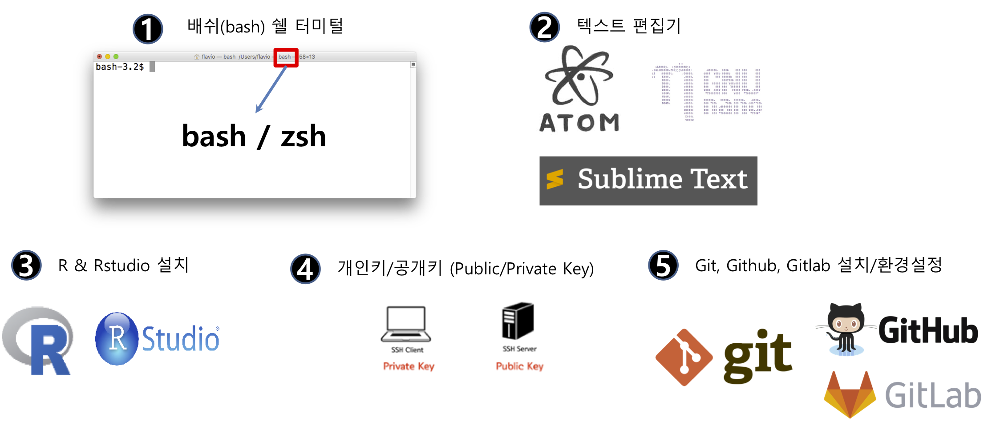

```{r, include=FALSE}
knitr::opts_chunk$set(echo = TRUE, message=FALSE, warning=FALSE,
                      comment="", digits = 3, tidy = FALSE, prompt = FALSE, fig.align = 'center')

library(reticulate)
# use_condaenv("anaconda3")
```

# 데이터 과학 개발용 컴퓨터 {#data-science-computer}

데이터 과학을 위한 전용 컴퓨터를 새로 구매한다고 가정할 때 맥북 노트북으로 장만했다면 다음과 같은 설정을 단계별로 가져가는 것이 필요합니다.

어떤 소프트웨어도 설치된 적이 없는 맥북에 R 데이터 과학 개발환경을 설정하는 방식은 다음과 같다.

1. 터미널 확인: `bash` 혹은 `zsh` 쉘 중 어떤 쉘을 사용하고 있는지 확인한다.
1. 텍스트 편집기 확인: 나노(`nano`), `vi` 편집기가 쉘에서 기본적으로 활용할 수 있지만, GUI 텍스트 전용 편집기를 준비한다. [아톰(atom)](https://atom.io/), [써브라임 텍스트 3(sublime Text 3)](https://www.sublimetext.com/) 등 다양한 편집기가 있으니, 저작권과 사용경험담등을 참조하여 본인 텍스트 편집기를 설치한다.
1. R과 RStudio 설치: R과 RStudio를 다운로드 받아 설치한다.
    - R 맥 다운로드: https://cran.r-project.org/bin/macosx/
    - R 윈도우 다운로드: https://cran.r-project.org/bin/windows/base/
    - RStudio 다운로드: https://rstudio.com/products/rstudio/download/
1. 공개키/개인키 설정: 버전 제어 및 협업을 위해서 꼭 필요한 기능 [^mac-git-ssh]
    - [`gitlab`](https://statkclee.github.io/data-science/ds-gitlab.html#31_ssh_3) 사례 참조
1. Git, Gitlab, Github 설정
    - Git 설치: `brew install git`
    - `Gitlab`, `Github` 회원 가입 후 환경설정

[^mac-git-ssh]: [devYurim (AUGUST 8, 2018), "Git 설치와 초기 설정 for Mac OS X"](https://devyurim.github.io/development%20environment/git/2018/08/08/git-1.html)

{#id .class width="100%"}

# CLI R & RStudio 설치 {#install-cli-R-RStudio}

먼저 [HomeBrew](https://brew.sh/index_ko)를 설치한다. 명령어는 웹사이트에 나와 있듯이 간단히 다음 명령어를 터미널에 복사형 붙여 넣고 엔터친다.

```{r homebrew-install, eval = FALSE}
$ /usr/bin/ruby -e "$(curl -fsSL https://raw.githubusercontent.com/Homebrew/install/master/install)"
```


<style>
div.blue { background-color:#e6f0ff; border-radius: 5px; padding: 10px;}
</style>
<div class = "blue">

**hadley commented on 19 Oct 2018**

I think the basic advice is NEVER INSTALL R FROM BREW (unless you really know what you are doing). [Github Issues](https://github.com/tidyverse/tidyverse/issues/154#issuecomment-494434428)

</div>

`tidyverse` 설치 시 의존성 때문에 `libxml2`는 설치한다.

```{r libxml2-install, eval = FALSE}
$ brew install libxml2
```

순차적으로 R과 RStudio를 다운로드 받아 설치한다.

- R 맥 다운로드: https://cran.r-project.org/bin/macosx/
- RStudio 다운로드: https://rstudio.com/products/rstudio/download/

마지막으로 [`tidyverse`](https://tidyverse.tidyverse.org/) 팩키지를 설치한다.


# D2-coding 폰트 설치 [^mac-install-setup] {#install-D2-coding-fonts}

[^mac-install-setup]: ["맥 개발 환경 설정하기 - 나의 개발 환경 세팅을 위한 정리"](https://blog.dizy.dev/dev/2016/06/30/setting-up-the-development-environment-for-mac.html)

[네이버 D2 Coding 글꼴](https://github.com/naver/d2codingfont) 웹사이트에서 직접 D2-coding 폰트를 다운로드 받아 압축을 풀어 설치한다. `finder`에서 압축을 푼 폰트를 더블 클릭하여 설치하면 된다.

```{r install-D2-coding-font, eval = FALSE}
$ brew cask install font-d2coding
```

# 자바 설치 [^install-java] {#install-java}

[^install-java]: [HOW TO SET JAVA_HOME ON MAC OS X](http://www.sajeconsultants.com/how-to-set-java_home-on-mac-os-x/)

최신 자바 버전을 설치하면 R 팩키지중 `rJava`를 통해 구현된 라이브러리가 수행되지 않는 문제가 있으니 가능하면 낮은 버전 예를 들어 9 등을 설치한다.

1. [OpenJDK](https://jdk.java.net/archive/) 에서 OpenJDK를 다운로드 받는다. 다양한 버전이 있지만, 9버전을 다운로드 받는다. 다운로드 받은 파일이 예를 들어, `openjdk-9.0.4_osx-x64_bin.tar.gz`인 경우 압축을 풀어 이동시킨다. 압축을 풀게 되면 `jdk-9.0.4.jdk/` 디렉토리 아래 파일과 디렉토리가 풀리게 된다.

```{r java-install-step-01, eval = FALSE}
$ cd ~/Downloads
$ tar xf openjdk-9.0.4_osx-x64_bin.tar.gz
```

2. 압축을 푼 디렉토리를 `/Library/Java/JavaVirtualMachines/`으로 이동시킨다.

```{r java-install-step-02, eval = FALSE}
$ sudo mv jdk-9.0.4.jdk/ /Library/Java/JavaVirtualMachines/
```

3. 쉘 환경설정 파일(`.bash_profile`)에  `JAVA_HOME` 설정한다.

`which java` 명령어로 `java` 설치를 확인한다. `.bash_profile` 파일에 `JAVA_HOME` 경로를 등록시킨다. `/Library/Java/JavaVirtualMachines/` 디렉토리 아래 앞서 이동시킨 자바 프로그램이 복사되어 이동되었다.

이를 확인하는 방법은 `which java`로 확인이 가능하다.

```{bash java-install-step-03, eval = TRUE}
which java
```

`JAVA_HOME` 환경변수를 통해 설정된 값은 다음 명령어를 통해 확인한다.

```{bash java-install-step-04, eval = FALSE}
bash-3.2$ $JAVA_HOME/bin/java --version
openjdk 9.0.4
OpenJDK Runtime Environment (build 9.0.4+11)
OpenJDK 64-Bit Server VM (build 9.0.4+11, mixed mode)
```

<style>
div.blue { background-color:#e6f0ff; border-radius: 5px; padding: 10px;}
</style>
<div class = "blue">

**`.bash_profile` 파일 자바환경 추가**

JAVA_HOME=/Library/Java/JavaVirtualMachines/jdk-9.0.4.jdk/Contents/Home <br>
export JAVA_HOME;

</div>

4. `sudo R CMD javareconf` 명령어로 확인

`sudo R CMD javareconf` 명령어로 설정된 값을 다시 환경에 반영시킨다.

```{bash rconf-cmd, eval = FALSE}
sudo R CMD javareconf
```

5. R에 `JAVA_HOME` 설정

마지막으로 R에 `JAVA_HOME` 설정을 `Sys.setenv()` 명령어로 수행한다.

```{r r-conf}
Sys.setenv(JAVA_HOME = "/Library/Java/JavaVirtualMachines/jdk-9.0.4.jdk/Contents/Home")
```


