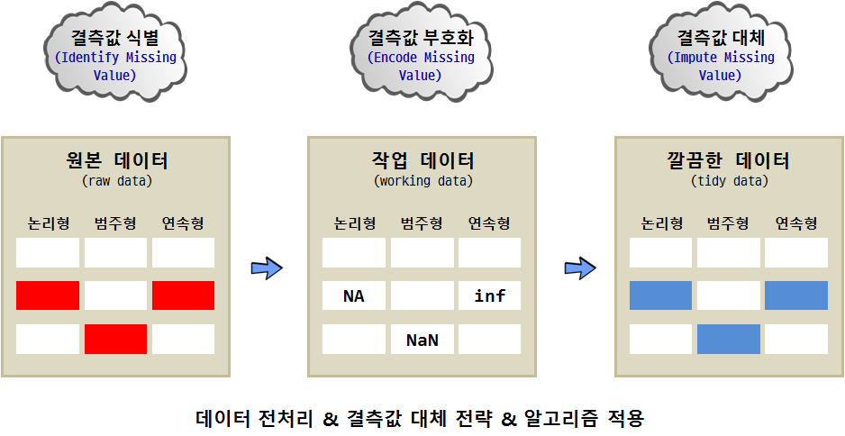

```{r, include=FALSE}
source("tools/chunk-options.R")
```

> ## 학습 목표 {.objectives}
>
> * 결측데이터, 무응답의 연관성을 파악한다.
> * 결측데이터를 이해하고 결측데이터 툴체인을 구축한다.
> * 결측데이터 처리 전략을 이해한다.
> * 결측데이터 전략에 따른 성능향상을 확인한다.

## 1. 미국대선 여론조사 [^presidential-election] [^why-trump]

[^why-trump]: [미국 대선 - 트럼프 대이변은 어떻게 일어났는가](http://ilyo.co.kr/?ac=article_view&entry_id=213504)

[^presidential-election]: [<추왕훈의 데자뷔> 선거 여론조사의 종언, 2016-11-11](http://www.yonhapnews.co.kr/bulletin/2016/11/10/0200000000AKR20161110146900022.HTML?input=1179m)

제45대 미국 대통령을 선출하는 선거에서 많은 언론에서 예측한 바와 다르게 공화당 도널드 트럼프 후보가 민주당 힐러리 클린턴 후보를 누르고 당선되었다.
이를 두고 트럼프 후보 당선을 정확히 예측한 인공지능(AI) 사례를 들며 기존 예측기법에 대한 문제점 제기 및 새로운 시대의 도래를 언급하고 있다. 이에 앞서
지금과 동일한 상황이 미국에서 여러번 있어와서 새삼스러운 것은 아니다.

- 1916년 대선: 우편 설문조사를 바탕으로 민주당 우드로 윌슨 후보 당선 예측한
    - 리터리리 다이제스트는 1936년 대통령 예측에서 실패
    - 1천만명 유권자를 대상으로 설문조사를 실시했으나 표본의 대표성에 문제가 있음
    - 주소 확보가 용이한 구독자, 자동차 등록부, 전화번호부 등 공화당 성향 유권자에 집중
- 1936년 대선: 조기 갤럽의 '미국공공여론연구소'에서 5만명 표본으로 프랭클린 루스벨트 당선 예측
    - 인구학적 분포에 대응되는 표본 추출 기법 차용
    - 1948년 선거일보다 3주 앞서 당선 후보 예측한 것이 화근이 되어, 'Dewey defeats truman'이라는 '역사적 오보'를 남김.
- 패널 조사: 장기간의 추적분석과 정치 성향이 표본 추출에 내재된 보다 정교한 여론조사 기법이 등장
    - 2016년 미국 대선에서 `non-ignorable nonresponse` 문제를 해결하지 못해 예측에 실패함.
    - 인공지능 인도 벤처기업 제니크.ai(Genic.ai) 인공지능 모그IA(MogIA)는 빅데이터 분석을 통해 10월부터 트럼프 승리 예측

> ### 결측값 구분 {.callout}
>
> - **MCAR(Missing Completely At Random)**: 모든 정보가 데이터에 담겨있어 결측값이 문제가 되지 않는 경우.
> - **MNAR(: )missing not at random)**: 결측값이 무작위가 아니라서 주도면밀한 추가 조사가 필요한 경우. 
> 데이터 생성과정을 이해하고 각 단계별로 왜 데이터에 누락이 발생했는지 따진다. 예를 들어, 미국 대선에서 왜 일부 유권자가 
> 설문조사에 응답을 거부했는지 파악하고, 설문 항목에 문제가 없는지, 설문 문항에 불명확한 점이 있는지 다각도로 조사한다.

## 2. 결측데이터 

컴퓨터 과학에서 일반적으로 결측값(missing value)은 존재하지 않는 값(null)으로 컴퓨터에서 표현된다. 하지만 
데이터 과학에서는 결측값이 무응답 혹은 단순히 자리만 차지하는 `NA`, $\frac {0}{0}$을 표현하는 `NaN` (Not a Number), 
무한을 표현하는 `inf`가 있다. 결측데이터를 처리하기 전에 결측데이터를 처리하는 프로세스는 다음과 같다.

1. 결측값을 식별한다. 원본데이터에서 다양한 형태로 결측정보가 표현되어 있으니 우선 현황 파악이 먼저다.
1. 파악된 현황정보를 바탕으로 결측값을 컴퓨터가 처리가능한 형태로 부호화한다.
1. 마지막으로 파악된 결측정보와 적절히 인코딩되어 컴퓨터에 저장된 결측값을 자료형에 맞춰 알고리즘을 적용하여 결측값을 처리한다.



## 2. 결측값 식별과 현황파악 [^missing-value-treatment] [^identify-missing-value]

[^missing-value-treatment]: [R-bloggers: Missing Value Treatment](https://www.r-bloggers.com/missing-value-treatment/)
[^identify-missing-value]: [Imputing Missing Data with R; MICE package](http://datascienceplus.com/imputing-missing-data-with-r-mice-package/)

`mlbench` 보스톤 주택가격 데이터셋을 기본으로 결측값 관련 학습 내용에 대한 실습을 진행한다.

``` {r boston-housing-na, warnings=FALSE}
## 실습데이터
# install.packages("mlbench")
suppressWarnings(suppressMessages(library(mlbench)))
suppressWarnings(suppressMessages(library(dplyr)))
data("BostonHousing")
# 원데이터를 나중에 복구하기 위해 잠시 `original` 데이터프레임으로 저장
original <- BostonHousing
# "ptratio 연속형, "rad"범주형 
BostonHousing[sample(1:nrow(BostonHousing), 40), "ptratio"] <- NA
BostonHousing[sample(1:nrow(BostonHousing), 40), "rad"] <- NA
```

연속형 변수 "ptratio"에 40개 `NA` 결측값을 주입했고,  
범주형 변수 "rad"에 40개 `NA` 결측값을 주입했다.

### 2.1. 결측값 현황 파악

`apply` 계열 함수를 사용해서 변수별, 관측점별 결측값이 얼마나 포함되어 있는지 파악한다.
`check_missing_value()` 함수를 활용하여 변수별, 관측점별 결측값 백분율을 계산한다.
만약 5%이상 관측점 혹은 변수에 결측값이 포함되어 있으면 변수를 버리거나 혹은 관측점을 제거하는 전략을 택할 수도 있다.

``` {r boston-housing-check-5-pcnt, warnings=FALSE}
check_missing_value <- function(x){sum(is.na(x))/length(x)*100}
apply(BostonHousing, 2, check_missing_value)
apply(BostonHousing, 1, check_missing_value) %>% head(20)
```

### 2.2. `mice`, `VIM` 팩키지

`mice` 팩키지를 사용해서 `md.pattern` 함수를 사용해서 "ptratio" 변수에 40개 주입한 `NA` 결측값을 확인해본다.

``` {r boston-housing-mice-md, warnings=FALSE}
suppressWarnings(suppressMessages(library(mice)))
md.pattern(BostonHousing)
````

혹은 `VIM` 팩키지를 활용하여 결측값을 시각화하는 것도 좋다. 결측값은 빨강색(`red`)로 설정하여 
각변수별로 결측값에 대한 현황을 파악하기 쉽게 도식화했다.

``` {r boston-housing-vim, warnings=FALSE}
suppressWarnings(suppressMessages(library(VIM)))
aggr_plot <- aggr(BostonHousing, col=c('gray','red'), numbers=TRUE, 
	sortVars=TRUE, labels=names(BostonHousing), cex.axis=.7, gap=3, ylab=c("Histogram of missing data", "Pattern"))

marginplot(BostonHousing[, c('ptratio','medv')])
```

`marginplot(BostonHousing[, c('ptratio','medv')])` 그래프를 통해 변수 2개만 가능하지만, 결측값이 포함된 경우와 결측값이 없는 경우를 비교해 볼 수도 있다.

## 3. 결측값 처리 전략 

결측값 처리 전략은 다음과 같은 4가지 전략이 존재한다.

1. 관측점 제거
    - 데이터가 상당히 많은 경우, 동시에 모집단을 대표하는데 무리가 없는 경우 `na.action=na.omit` 설정을 적용한다. 
    - `lm(medv ~ ptratio + rad, data=BostonHousing, na.action=na.omit)`
2. 변수 제거
    - 특정 변수에 상당한 값이 결측값인 경우, 다른 변수가 결측값을 많이 갖는 변수에 상응하는 정보량을 갖는 경우 제거한다.
3. 평균/중위수/최빈값으로 대체(impute)
    - 결측값을 변수가 연속형 숫자형인 경우 평균/중위수로 대체하고, 범주형 요인형인 경우 최빈값으로 대체한다.

``` {r boston-housing-impute, warnings=FALSE}
suppressWarnings(suppressMessages(library(Hmisc)))
suppressWarnings(suppressMessages(library(DMwR)))
suppressWarnings(suppressMessages(library(dplyr)))
impute(BostonHousing$ptratio, mean) %>% head # 평균으로 대체
impute(BostonHousing$ptratio, median) %>% head  # 중위수로 대체
impute(BostonHousing$ptratio, 20) %>% head  # 특정 값으로 대체
# 혹은 팩키지를 사용하지 않고 직접 코드를 작성해서 작업
BostonHousing$ptratio[is.na(BostonHousing$ptratio)] <- mean(BostonHousing$ptratio, na.rm = T) 
```

4. 예측값으로 대체한다.
- `DMwR` 팩키지 `knnImputation()` 함수를 사용해서 k-nn (k-인접 군집분석)을 사용한다. 
`k-nn` 대체법은 인접한 최대 k 관측점 유클리드 거리를 계산하여 가장 근접된 값으로 대체한다.

``` {r boston-housing-impute-knn, warnings=FALSE}
library(DMwR)
data(BostonHousing)
BostonHousing[sample(1:nrow(BostonHousing), 40), "ptratio"] <- NA

knnOutput <- knnImputation(BostonHousing[, !names(BostonHousing) %in% "medv"]) 

# 효과 분석
actuals <- original$ptratio[is.na(BostonHousing$ptratio)]
predicteds <- knnOutput[is.na(BostonHousing$ptratio), "ptratio"]
regr.eval(actuals, predicteds)
```

- `knn` 대체 기법은 범주형 자료의 경우 적용에 한계가 있다. 이런 경우 `rpart`, `mice` 팩키지를 활용한다.
- 먼저, `rpart`를 사용하는 경우 연속형 변수, 범주형 변수 모두 의사결정나무 모형을 순차적으로 적합시킨다.

``` {r boston-housing-impute-rpart, warnings=FALSE}
suppressWarnings(suppressMessages(library(rpart)))
data(BostonHousing)
BostonHousing[sample(1:nrow(BostonHousing), 40), "ptratio"] <- NA
BostonHousing[sample(1:nrow(BostonHousing), 40), "rad"] <- NA

class_mod <- rpart(rad ~ . - medv, data=BostonHousing[!is.na(BostonHousing$rad), ], method="class", na.action=na.omit)  # rad 변수가 범주형
anova_mod <- rpart(ptratio ~ . - medv, data=BostonHousing[!is.na(BostonHousing$ptratio), ], method="anova", na.action=na.omit)  # ptratio 변수는 숫자형
rad_pred <- predict(class_mod, BostonHousing[is.na(BostonHousing$rad), ])
ptratio_pred <- predict(anova_mod, BostonHousing[is.na(BostonHousing$ptratio), ])    
```

- `mice`를 사용하는 경우: `mice()` 함수를 사용해서 먼저 모형을 생성시키고 나서, `complete()` 함수를 사용해서 결측값을 채워넣는 2단계 과정을 거침.

``` {r boston-housing-impute-mice, warnings=FALSE}
suppressWarnings(suppressMessages(library(mice)))
data(BostonHousing)
BostonHousing[sample(1:nrow(BostonHousing), 40), "ptratio"] <- NA
miceMod <- mice(BostonHousing[, !names(BostonHousing) %in% "medv"], method="rf")  # 확률숲(random forest) 모형으로 결측모형 생성.
miceOutput <- complete(miceMod)  # 생성된 데이터를 채워 넣음.
anyNA(miceOutput)    
```

## 4. 결측값 처리 방법에 따른 성능 평가

### 4.1. 결측값 처리 방법에 따른 성능 평가 -- 연속형 변수 `ptratio`

다양한 결측값 처리 방법에 따른 성능 차이를 비교하는 것이 왜 고급 결측값 처리 방법을 활용해야 하는 근거도 된다.

먼저, 연속형 변수의 경우 다양한 결측값 처리 방법에 따른 성능의 차이를 비교해보자.
"ptratio" 변수는 연속형 변수로 506개 변수중 50개 즉 10%를 결측값, `NA`로 치환한다.

평균과 중위수를 결측값 10%를 채워넣을 경우 중위수를 채워넣은 것이 `mape`를 봤을 때 대동소이하다. [^mape]

[^mape]: Mean absolute percentage error, 평균절대 백분율 오차. $\mbox{M} = \frac{100}{n}\sum_{t=1}^n  \left|\frac{A_t-F_t}{A_t}\right|$

``` {r boston-housing-impute-perf-mean, warnings=FALSE}
data(BostonHousing)
original <- BostonHousing
BostonHousing[sample(1:nrow(BostonHousing), 50), "ptratio"] <- NA

actuals_ptratio <- original$ptratio[is.na(BostonHousing$ptratio)]
ptratios_mean_pred <- rep(mean(BostonHousing$ptratio, na.rm=T), length(actuals_ptratio))
ptratios_median_pred <- rep(median(BostonHousing$ptratio, na.rm=T), length(actuals_ptratio))
regr.eval(actuals_ptratio, ptratios_mean_pred)
regr.eval(actuals_ptratio, ptratios_median_pred)
```

두번째 `knn` 기법을 활용한 경우 `mape`가 줄어든 것이 확인된다.

``` {r boston-housing-impute-perf-knn, warnings=FALSE}
ptratios_knn_pred <- knnOutput[is.na(BostonHousing$ptratio), "ptratio"]
regr.eval(actuals_ptratio, ptratios_knn_pred)
```

세번째 `rpart` 기법을 활용한 경우 `mape`가 줄어든 것이 확인된다.

``` {r boston-housing-impute-perf-rpart, warnings=FALSE}
ptratios_anova_mod <- rpart(ptratio ~ . - medv, 
    data=BostonHousing[!is.na(BostonHousing$ptratio), ], method="anova", na.action=na.omit)
ptratio_anova_pred <- predict(ptratios_anova_mod, BostonHousing[is.na(BostonHousing$ptratio), ])
regr.eval(actuals, ptratio_anova_pred)
```

네번째는 `rf` 확률숲 모형을 적용하는데 결측값 처리 전용 `mice` 팩키지를 활용한다.
`mape` 값이 하향된 것이 관측된다.

``` {r boston-housing-impute-perf-rf, warnings=FALSE}
library(mice)
mice_mod <- mice(BostonHousing[, !names(BostonHousing) %in% "medv"], method="rf") # 1단계 모형 생성
mice_output <- complete(mice_mod)  # 2단계 결측값 채워넣기

ptratio_rf_pred <- mice_output[is.na(BostonHousing$ptratio), "ptratio"]
regr.eval(actuals, ptratio_rf_pred)
```

### 4.2. 결측값 처리 방법에 따른 성능 평가 -- 범주형 변수 `rad`

범주형 변수의 경우, 다양한 결측값 처리 방법에 따른 성능의 차이를 비교해보자.
"rad" 변수는 연속형 변수로 506개 변수중 50개 즉 10%를 결측값, `NA`로 치환한다.

먼저, `names(sort(-table(BostonHousing$rad)))[1]` 명령어를 통해 최빈값을 파악한다.
그리고 이를 결측값에 꽂아 넣는다. 

``` {r boston-housing-impute-perf-mode, warnings=FALSE}
data(BostonHousing)
original <- BostonHousing
BostonHousing[sample(1:nrow(BostonHousing), 50), "rad"] <- NA

actuals_rad <- original$rad[is.na(BostonHousing$rad)]
rad_mode_pred <- rep(names(sort(-table(BostonHousing$rad)))[1], length(actuals_rad))

mean(actuals_rad != rad_mode_pred) 
```

두번째로 `rpart` 의사결정나무 모형을 활용하여 결측값을 채워넣는다. 

``` {r boston-housing-impute-perf-rpart2, warnings=FALSE}
data(BostonHousing)
original <- BostonHousing
BostonHousing[sample(1:nrow(BostonHousing), 50), "rad"] <- NA

library(rpart)
class_mod <- rpart(rad ~ . - medv, data=BostonHousing[!is.na(BostonHousing$rad), ], method="class", na.action=na.omit)
rad_pred <- predict(class_mod, BostonHousing[is.na(BostonHousing$rad), ])

actuals_rad <- original$rad[is.na(BostonHousing$rad)]
rad_rpart_pred <- as.numeric(colnames(rad_pred)[apply(rad_pred, 1, which.max)])

mean(actuals_rad != rad_rpart_pred)
```

마지막으로 `mice` 확률숲 `rf` 모형을 사용해서 결측값을 채워넣는다. 

``` {r boston-housing-impute-perf-mice2, warnings=FALSE}
data(BostonHousing)
original <- BostonHousing
BostonHousing[sample(1:nrow(BostonHousing), 50), "rad"] <- NA

library(mice)
mice_mod <- mice(BostonHousing[, !names(BostonHousing) %in% "medv"], method="rf") # 1단계 모형 생성
mice_output <- complete(mice_mod)  # 2단계 결측값 채워넣기

actuals_rad <- original$rad[is.na(BostonHousing$rad)]
rad_rf_pred <- mice_output[is.na(BostonHousing$rad), "rad"]
mean(actuals_rad != rad_rf_pred)
```
