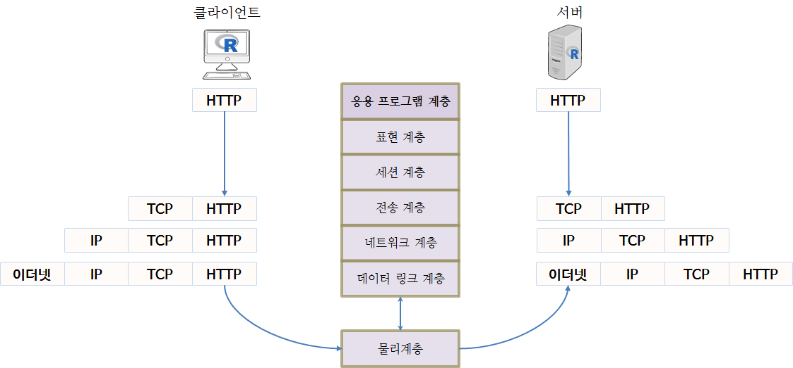
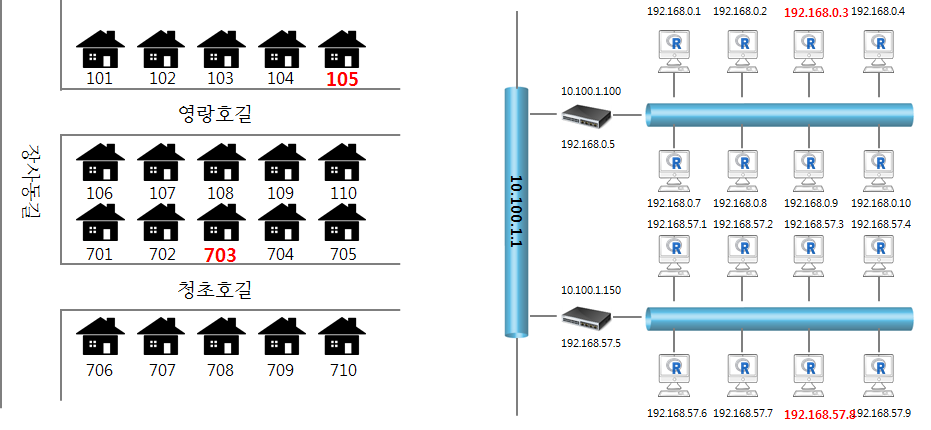
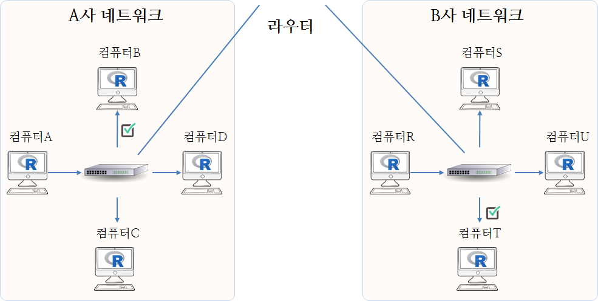

``` {r, include=FALSE}
source("tools/chunk-options.R")
knitr::opts_chunk$set(echo = TRUE, warning=FALSE, message=FALSE, fig.width=12)

library(httr)
library(jsonlite)
library(listviewer)
library(tidyverse)
library(stringr)
library(ggthemes)
library(extrafont)
loadfonts()

par(family = "NanumGothic")
```


## 패킷 분석이란? {#what-is-packet-analysis}

**패킷분석(packet analysis)**은 네트워크 위에서 무슨 작업이 발생하고 있는지 좀더 잘 이해하고자 
네트워크 위에 이동하는 실시간 데이터를 잡아내서 분석하는 과정이다. 
흔히 패킷 스니핑(packet sniffing), 프로토콜 분석(protocol analysys)이라고도 부른다.

- 네트워크 특성을 이해
- 어떤 유저가 네트워크를 사용하는지 학습
- 어떤 유저가 무슨 작업이 네트워크 가용 대역폭을 점유하는지 파악.
- 최고 네트워크 트래픽이 집중되는 시간대 파악
- 해커의 공격 혹은 이상 행동을 탐지
- 보안이 취악하고 뭔가 잘못된 응용프로그램을 발견해냄.

| 계층(Layer)   |  프로토콜(Protocol)                     |
|---------------|-----------------------------------------|
| Application   |  HTTP, SMTP, FTP, Telnet                |
| Presentation  |  ASCII, MPEG, JPEG, MIDI                |
| Session       |  NetBIOS, SAP, SDP, NWLink              |
| Transport     |  TCP, UDP, SPX                          |
| Network       |  IP, IPX                                |
| Data link     |  Ethernet, Token Ring, FDDI, AppleTalk  |

라우터 이슈는 세번째 계층문제, 소프트웨어 이슈는 7번째 계층문제 등 판단한다.










