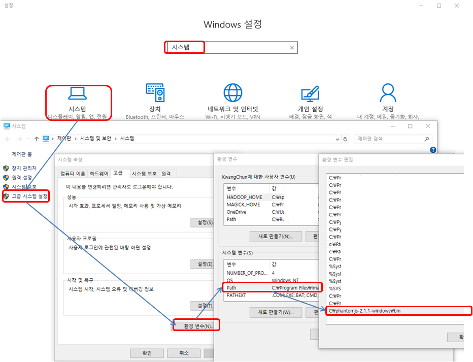
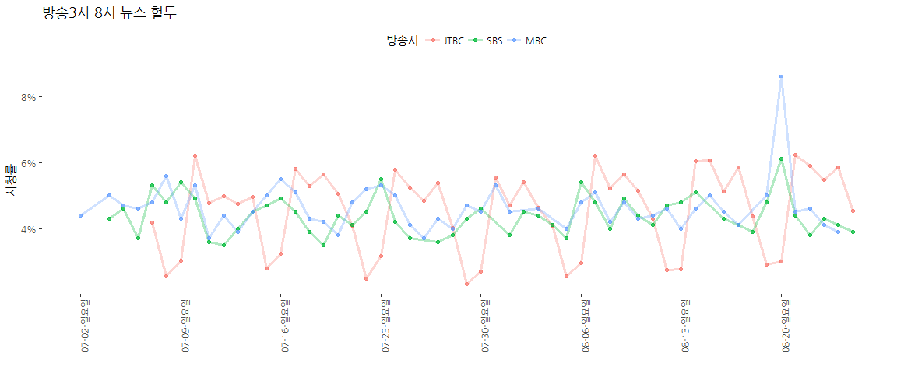
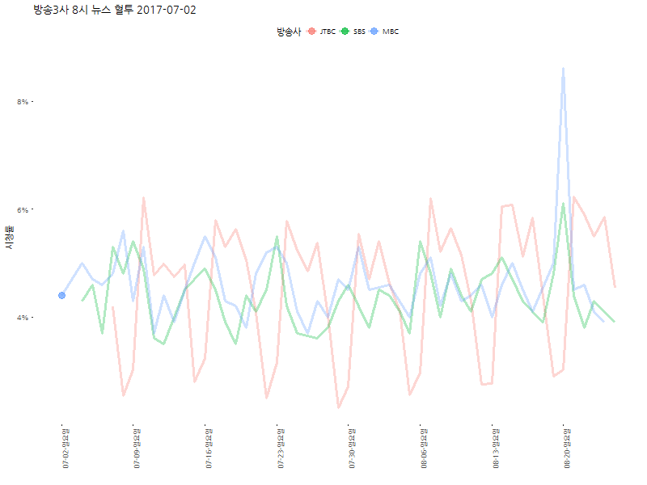

# xwMOOC 데이터 과학
xwMOOC  
`r Sys.Date()`  

## 1. 팬텀JS (PhantomJS) [^datacamp-phantomJS] {#about-phantomJS}

[^datacamp-phantomJS]: [Web Scraping with R and PhantomJS](https://www.datacamp.com/community/tutorials/scraping-javascript-generated-data-with-r)

### 1.1. 팬텀JS 설치 {#install-phantomJS}

가능하면 RStudio 환경에서 모든 작업이 가능하도록 팬텀JS를 설치하고 나서 이를 윈도우 환경경로에 설정한다.

- [phantomjs.org](http://phantomjs.org/) 웹사이트에서 [팬텀JS 다운로드](http://phantomjs.org/download.html)를 다운로드한다.
- 팬텀JS 윈도우 환경 경로에 추가한다.
    - 다운로드 받은 `phantomjs-2.1.1-windows.zip` 파일 압축을 푼다.
    - `\phantomjs-2.1.1-windows\bin` 절대 경로명을 복사하여 윈도우 환경설정 경로에 추가한다.
        - 예를 들어, `C:\Users\.....\phantomjs-2.1.1-windows\bin`

상기 작업을 수행하게 되면, 팬텀JS가 설치된 `C:\Users\.....\phantomjs-2.1.1-windows\bin` 경로에 상관없이 임의 디렉토리에서 `phantomjs` 명령어를 실행해도 명령이 실행된다.

~~~{.r}
D:\>phantomJS --version
2.1.1
~~~

자세한 사항은 다음 동영상을 참조한다.

<iframe width="300" height="180" src="https://www.youtube.com/embed/L8Lw53MjDdY" frameborder="0" allowfullscreen></iframe>

### 1.2. R 팬텀JS 테스트 {#phantomJS-test-on-R} [^phantomjs-hello-world]

[^phantomjs-hello-world]: [How to Install PhantomJS on Windows](https://www.joecolantonio.com/2014/10/14/how-to-install-phantomjs/)

윈도우 쉘환경에서 팬텀JS가 정상적으로 설치된 것이 확인되면 다음 단계로 운영체제에 맞는 `system`, `system2`, `shell` 등의 명령어로 
R 환경에서 쉘명령을 직접 실행해본다.

> ### `xwMOOC.js` 파일 {.callout}
> 
> 
> ~~~{.r}
> var page = require('webpage').create();
> 
> var url = 'http://statkclee.github.io/xwMOOC/';
> 
> page.open(url, function (status) {
>   console.log(status);
>   phantom.exit();
> });
> ~~~

~~~{.r}
> system("phantomjs --version")
2.1.1

> system("phantomjs ./code/xwMOOC.js")
success
~~~

## 2. 방송 3 사 8시 뉴스 혈투와 JTBC의 고민 {#news-viewer-ratings} 

### 2.1. 다음에서 방송 3사 시청률 데이터를 긁어온다.  {#stations} 

방송 3 사 8시 뉴스 혈투를 살펴보면 흥미로운 사실이 통계분석을 통해 나타난다.
이를 위해서 `scrape_daum_jtbc.js` 파일에 [다음 JTBC 뉴스룸](http://movie.daum.net/tv/ratings?tvProgramId=66868) 시청률 정보를 가져오는데,
[다음 SBS 8시 뉴스](http://movie.daum.net/tv/ratings?tvProgramId=48152), [다음 MBC 뉴스데스크](http://movie.daum.net/tv/ratings?tvProgramId=48135)도 
방송 시청률 데이터를 끌어오는 작업을 수행한다.

> ### `scrape_daum_jtbc.js` 파일 {.callout}
> 
> 
> ~~~{.r}
> var webPage = require('webpage');
> var page = webPage.create();
> 
> var fs = require('fs');
> var path = 'data/daum_jtbc.html';
> 
> page.open('http://movie.daum.net/tv/ratings?tvProgramId=66868', function (status) {
>   var content = page.content;
>   page.render('fig/daum_jtbc.png');
>   fs.write(path, content, 'w');
>   phantom.exit();
> });
> ~~~

~~~{.r}
# 0. 환경설정 --------------------------
# library(rvest)
# library(stringr)
# library(tidyverse)
# library(gganimate)
# library(ggthemes)
# library(extrafont)
# loadfonts()

# 1. 데이터 긁어오기 --------------------------
system("phantomjs ./code/scrape_daum_jtbc.js")
system("phantomjs ./code/scrape_daum_sbs.js")
system("phantomjs ./code/scrape_daum_mbc.js")

Sys.setlocale("LC_ALL", "C")
~~~

~~~{.output}
[1] "C"

~~~

~~~{.r}
jtbc_raw <- read_html("data/daum_jtbc.html") %>%
  html_nodes(xpath='//*[@id="menuSlide"]/div[2]/div[1]/table[2]') %>% 
  html_table(fill = TRUE) %>% 
  .[[1]]

sbs_raw <- read_html("data/daum_sbs.html") %>%
  html_nodes(xpath='//*[@id="menuSlide"]/div[2]/div[1]/table[2]') %>% 
  html_table(fill = TRUE) %>% 
  .[[1]]

mbc_raw <- read_html("data/daum_mbc.html") %>%
  html_nodes(xpath='//*[@id="menuSlide"]/div[2]/div[1]/table[2]') %>% 
  html_table(fill = TRUE) %>% 
  .[[1]]

Sys.setlocale("LC_ALL", "Korean")
~~~

~~~{.output}
[1] "LC_COLLATE=Korean_Korea.949;LC_CTYPE=Korean_Korea.949;LC_MONETARY=Korean_Korea.949;LC_NUMERIC=C;LC_TIME=Korean_Korea.949"

~~~

### 2.2. 데이터 정제  {#stations-data-wrangling} 

웹에서 긁어온 방송 3사 데이터를 데이터 분석이 가능하고, 시각화가 가능한 형태로 데이터를 가공한다.
특히, 주별 사이클이 확연히 존재하기 때문에 이를 최대한 파악하기 용이한 형태로 작업한다.

~~~{.r}
# 2. 데이터 정제 ---------------------
jtbc_df <- jtbc_raw %>% 
  mutate(방송사 = "JTBC", 
         시청률 = as.numeric(str_replace(시청률, "%", "")) / 100,
         날짜 = lubridate::ymd(str_replace(str_sub(날짜, 1, 10), "\\.", "-"))) %>% 
  select(방송사, 날짜, 시청률)

sbs_df <- sbs_raw %>% 
  mutate(방송사 = "SBS", 
            시청률 = as.numeric(str_replace(시청률, "%", "")) / 100,
            날짜 = lubridate::ymd(str_replace(str_sub(날짜, 1, 10), "\\.", "-"))) %>% 
  select(방송사, 날짜, 시청률)

mbc_df <- mbc_raw %>% 
  mutate(방송사 = "MBC", 
            시청률 = as.numeric(str_replace(시청률, "%", "")) / 100,
            날짜 = lubridate::ymd(str_replace(str_sub(날짜, 1, 10), "\\.", "-"))) %>% 
  select(방송사, 날짜, 시청률)

station_df <- bind_rows(jtbc_df, sbs_df) %>% 
  bind_rows(mbc_df) %>% 
  mutate(방송사 = factor(방송사, levels=c("JTBC", "SBS", "MBC")))

station_df %>% spread(방송사, 시청률) %>% 
  mutate(요일 = lubridate::wday(날짜, label=TRUE)) %>% 
  select(날짜, 요일, everything()) %>% 
  DT::datatable() %>% 
  DT::formatPercentage(c(2,3,4), digits=1)
~~~

<!--html_preserve-->

<!--/html_preserve-->

### 2.3. 방송 3사 시청률 시각화  {#stations-static-view} 

방송 3사 최근 약 2개월 방송 시청률을 보면 손석희 앵커가 진행하는 주중에는 확연한 JTBC 우위,
손석희 앵커가 빠지는 금요일부터 토요일 일요일은 MBC와 SBS가 경쟁하는 추세가 명확히 확인된다.

~~~{.r}
# 3. 데이터 시각화 ---------------------
## 3.1. 정적 시각화
station_colors <- c("#d60cbb", "#1187c6", "#465977")

station_df %>% 
  ggplot(aes(x=날짜, y=시청률, color=방송사)) +
  geom_line(size=1.1, alpha=0.3) +
  geom_point(size=1.5, alpha=0.7) +
  theme_tufte(base_family = "NanumGothic") +
  labs(x="", y="시청률", title="방송3사 8시 뉴스 혈투") +
  scale_y_continuous(labels=scales::percent) +
  scale_x_date(date_labels = "%m-%d-%A", 
               breaks = seq(min(station_df$날짜), max(station_df$날짜), by="week")) +
  scale_fill_manual(values= station_colors) +
  theme(legend.position = "top",
        axis.text.x=element_text(angle=90,hjust=1))
~~~

### 2.3. 방송 3사 시청률 변화  {#stations-animation} 

`gganimate` 팩키지를 활용하여 시각화할 경우 손석희 앵커의 주중 효과에 대해서 좀더 명확히 확인할 수 있다.

~~~{.r}
## 3.2. 동적 시각화

station_gg <- ggplot(station_df, aes(x=날짜, y=시청률, color=방송사)) +
    geom_line(size=1.1, alpha=0.3) +
    geom_point(aes(frame=날짜), size=3.7, alpha=0.7) +
    theme_tufte(base_family = "NanumGothic") +
    labs(x="", y="시청률", title="방송3사 8시 뉴스 혈투") +
    scale_y_continuous(labels=scales::percent) +
    scale_x_date(date_labels = "%m-%d-%A", 
                 breaks = seq(min(station_df$날짜), max(station_df$날짜), by="week")) +
    scale_fill_manual(values= station_colors) +
    theme(legend.position = "top",
          axis.text.x=element_text(angle=90,hjust=1))

gganimate(station_gg, "fig/jtbc_sbs_mbc.gif", ani.width = 800, ani.height = 600)
~~~

