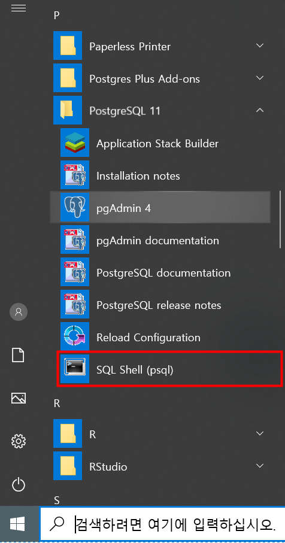
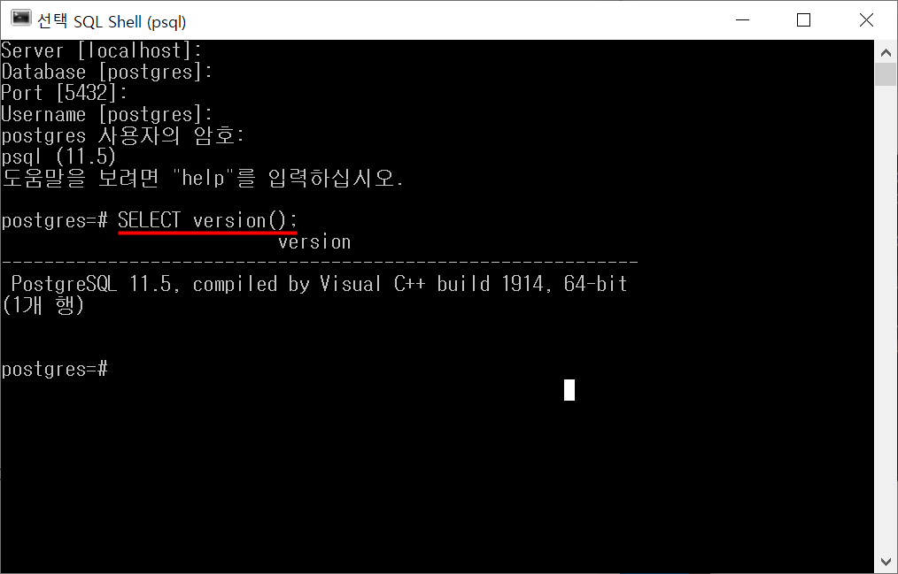
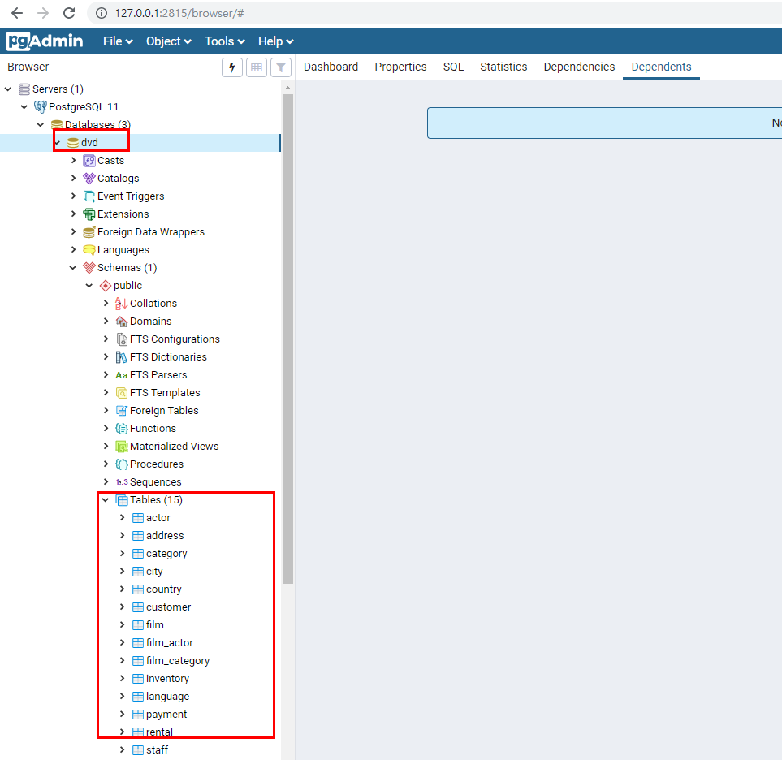
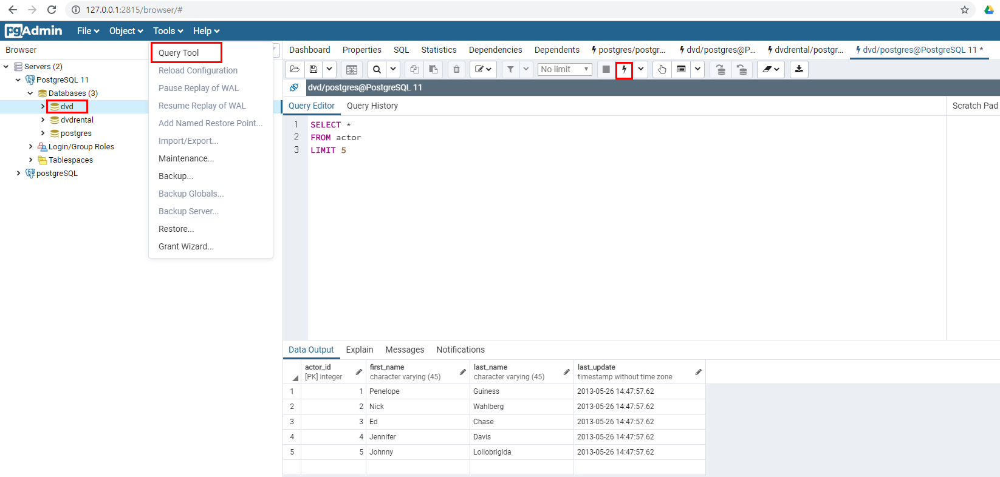

```{r, include=FALSE}
knitr::opts_chunk$set(echo = TRUE, warning=FALSE, message=FALSE,
                    comment="", digits = 3, tidy = FALSE, prompt = FALSE, fig.align = 'center')

library(tidyverse)
```


# PostgreSQL [^postgreSQL] [^postgreSQL-D2] {#about-postgreSQL}

[^postgreSQL]: [위키백과, "PostgreSQL"](https://ko.wikipedia.org/wiki/PostgreSQL)

[^postgreSQL-D2]: [NAVER D2 한눈에 살펴보는 PostgreSQL](https://d2.naver.com/helloworld/227936)

PostgreSQL은 확장 가능성 및 표준 준수를 강조하는 객체-관계형 데이터베이스 관리 시스템(ORDBMS)의 하나로 BSD 라이선스로 배포되며 오픈소스 개발자 및 관련 회사들이 개발에 참여하고 있다. 소규모의 단일 머신 애플리케이션에서부터 수많은 동시 접속 사용자가 있는 대형의 인터넷 애플리케이션(또는 데이터 웨어하우스용)에 이르기까지 여러 부하를 관리할 수 있으며 macOS 서버의 경우 PostgreSQL은 기본 데이터베이스로 상용 오라클 데이터베이스를 대체하는 오픈소스 데이터베이스로 알려져 있다.

# PostgreSQL 설치 [^install-postgreSQL] {#install-postgreSQL}

[^install-postgreSQL]: [Install PostgreSQL](http://www.postgresqltutorial.com/install-postgresql/)

[PostgreSQL: The World's Most Advanced Open Source Relational Database](https://www.postgresql.org/) 웹사이트에서 
PostgreSQL [다운로드](https://www.postgresql.org/download/windows/) 한다. 윈도우에 설치하는 경우 다음을 참고한다. 설치과정에서 나중에 도움이 될만한 정보는 다음과 같다.

- 설치 디렉토리: `C:\Program Files\PostgreSQL\11`
- 포트: `5432`
- 사용자명: `postgres`




`PostgreSQL 11` &rarr; `SQL Shell (psql)`을 클릭한 후에 postgreSQL 헬로월드를 찍어본다.
설치과정에서 등록한 비번만 넣어주고 나머지는 로컬호스트와 기본 디폴트 설정된 데이터베이스를 사용할 것이라 `postgres` 사용자 비밀번호만 넣어준다. 그리고 나서 `postgre=#` 쉘에 `SELECT version()` 명령어를 넣어준다.



# 예제 데이터베이스 - `pagila` [^postgreSQL-tutorial] {#install-dvd-postgreSQL}

[^postgreSQL-tutorial]: [PostgreSQL Sample Database](http://www.postgresqltutorial.com/postgresql-sample-database/)

[PostgreSQL Sample Database](https://github.com/devrimgunduz/pagila)를 Github에서 구해서 설치하거나, [PostgreSQL Sample Database](http://www.postgresqltutorial.com/postgresql-sample-database/), [Load PostgreSQL Sample Database](http://www.postgresqltutorial.com/load-postgresql-sample-database/)을 참조하여 DVD 대여 데이터베이스를 설치한다.

1. `SQL Shell (psql)` 쉘을 실행하여 `dvd` 데이터베이스를 생성한다.

```{r create-dvd-database, eval=FALSE}
Database [postgres]:
Port [5432]:
Username [postgres]:
postgres 사용자의 암호:
psql (11.5)
도움말을 보려면 "help"를 입력하십시오.

postgres=# CREATE DATABASE dvd;
CREATE DATABASE
```

2. `Windows + R` 단축키를 실행시켜 `cmd`를 입력하여 윈도우 쉘을 구동시킨다. 그리고 `postgreSQL`을 설치한 윈도우 디렉토리로 이동한다. `C:\Program Files\PostgreSQL\11\bin` 디렉토리가 된다. 그리고 나서 다운받은 `dvdrental.zip` 파일 압축을 풀어 `dvdrental.tar`을 지정한다.

- `pg_restore` 명령어는 데이터베이스를 생성시키는 역할을 한다.
- `-U postgres` 인자는 사용자를 지정한다.
- `-d dvd` 인자는 데이터베이스를 지정한다.
- `C:\dvdrental\dvdrental.tar` 인자는 파일로 저장된 데이터베이스 정보를 담고 있다.

```{r load-dvd-database, eval=FALSE}
C:\Program Files\PostgreSQL\11\bin> pg_restore -U postgres -d dvd C:\dvdrental\dvdrental.tar
암호:
C:\Program Files\PostgreSQL\11\bin>
```



# DVD 대여 질의문 작성 [^connect-sql] {#query-dvd-postgreSQL}

[^connect-sql]: [Connect To a PostgreSQL Database Server](http://www.postgresqltutorial.com/connect-to-postgresql-database/)

`dvd` 데이터베이스가 설치되었기 때문에 쿼리를 던지기 위해서는 postgreSQL 데이터베이스에 접속을 해야한다. 이를 위해서 `pgAdmin 4`를 실행시키게 되면 웹브라우져에 웹인터페이스가 생기게 된다. 데이터베이스를 `dvd`로 지정하고 하고 나서, `Tools` &rarr; `Query Tool`을 클릭하게 되면 해당 데이터베이스 테이블에 쿼리를 던질 수가 있게 된다.



# R에서 postgreSQL 연결 {#rstudio-dvd-postgreSQL}

`postgreSQL` DBMS 내부에 `dvd` 데이터베이스가 생성되었다. 이를 R에서 작업하기 위해서 `RPostgreSQL`, `DBI` 팩키지를 도입한다. `dbConnect()` 함수에 데이터베이스와 연결에 필요한 모든 정보를 저장시킨다. 그리고 나서 `dbGetQuery()` 함수로 쿼리를 던져 원하는 결과를 받아온다.

``` {r, eval=TRUE}
library(RPostgreSQL)
library(DBI)

pgdrv <- dbDriver("PostgreSQL")

con <- dbConnect(pgdrv, dbname="dvd", 
                 port="5432", 
                 user="postgres", 
                 password=postgre_PW, 
                 host="localhost")

actor <- dbGetQuery(con, "SELECT * FROM actor LIMIT 5")

# DBI::dbDisconnect(con)
```

`dbGetQuery()`로 가져온 데이터프레임을 `dplyr` 동사로 후속작업을 진행한다.

```{r actor-tidyverse}
library(tidyverse)
actor %>% 
  filter(actor_id ==1)
```

# 작업에 필요한 테이블 찾기 {#find-table}

데이터베이스에서 쿼리 작업을 수행할 때 가장 먼저 해야 되는 일중의 하나가 적합한 테이블을 찾는 것이다. 이를 위해서 각 DBMS마다 나름대로 정리를 해둔 메타테이블이 존재한다. `postgreSQL`의 경우는 `pg_catalog.pg_tables`가 된다. 가장 많이 사용되는 SQL 데이터베이스별로 동일한 사안에 대해서 찾아보자.

- `postgreSQL`: `SELECT * FROM pg_catalog.pg_tables;`
- sqlite3: `.tables`
- MS `SQL 서버 - Transact-SQL`: `SELECT * FROM INFORMATION_SCHEMA.TABLES;`
- MySQL: `SHOW TABLES;`

```{r find-tables}
qry <- "SELECT *
        FROM pg_catalog.pg_tables"

dbGetQuery(con, qry) %>% 
  filter(schemaname == 'public') 
```

# 테이블 별 칼럼명 {#find-table-columns}

다음으로 테이블을 찾았다고 하면, 해당되는 칼럼명을 찾을 수 있어야 한다. 이를 통해서 유의미한 의미를 찾아낼 수 있는데 칼럼명을 통해 영감을 받아 다가설 수 있게 된다.

```{r find-table-column}
col_qry <- "SELECT table_name,
                   STRING_AGG(column_name, ', ') AS columns
            FROM information_schema.columns
            WHERE table_schema = 'public'
            GROUP BY table_name;"

dbGetQuery(con, col_qry) %>% 
  DT::datatable()

DBI::dbDisconnect(con)
```

# DVD ER 다이어그램 {#dvd-er-diagram}

후속 쿼리 분석 작업을 위해서 도움이 되는 ER 다이어그램은 다음과 같다.

<style>
div.blue { background-color:#e6f0ff; border-radius: 5px; padding: 10px;}
</style>
<div class = "blue">


</div>


