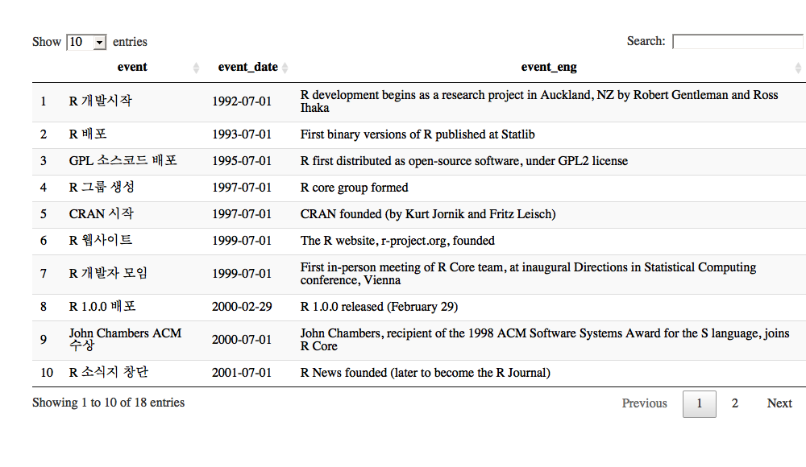
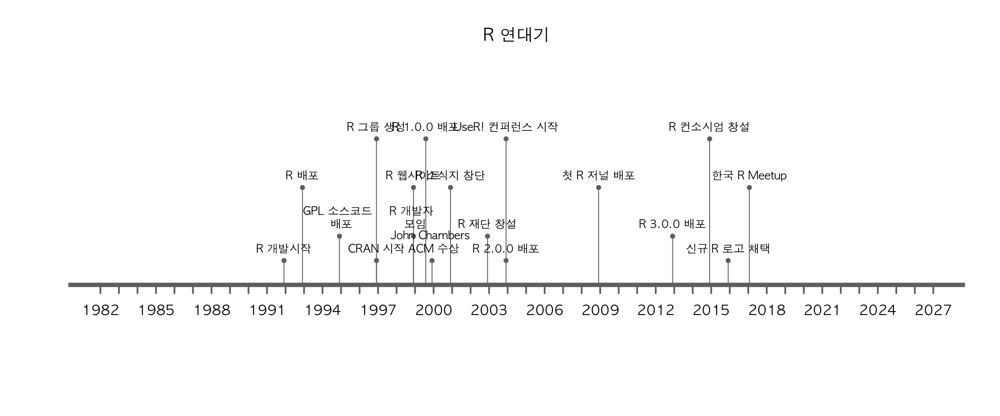
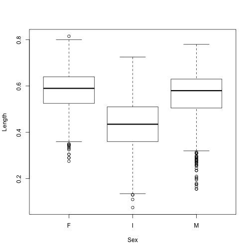

> ## 학습 목표 {.objectives}
>
> * R 언어의 역사를 이해한다.
> * 통계 팩키지와 다른 데이터과학 언어를 R 언어과 비교한다.
> * 사용자와 개발자를 나누는 사회적 장벽을 이해하고, 두언어 문제를 살펴본다.
> * 주요 R언어 구문을 이해한다.
> * R 언어 시작과 끝을 맛본다.

# 1. 데이터 과학 (Data Science) {#data-science}

자연법칙은 변수(Variable), 관측점(Observation), 값(Value)으로 구성된다. 
변수는 측정한 정량 혹은 정성적 특성이 되고, 
값은 측정한 시점에 변수의 상태이며, 관측점은 유사한 조건하에 측정한 여러 변수값 집합이다. 
자연법칙은 동일한 관측점 값에 적용되어 동작하는 변수를 다룬다. 
따라서, 자연법칙은 데이터에 **패턴(pattern)**으로 나타난다. 

변수, 관측점, 값으로 구성된 데이터를 가지고 있지만 현실 세계를 움직이는 자연법칙을 모른다면 패턴을 찾아서 자연법칙을 모사할 수 있고, 
현실 세계에 대한 자연법칙을 찾았다면 데이터를 통해서 확증하는 것도 가능하다.

## 1.1. 데이터 과학 프로세스 {#data-science-process}

[CRISP-DM(Cross-industry standard process for data mining)](https://en.wikipedia.org/wiki/Cross-industry_standard_process_for_data_mining)가 과거 유명한 
데이터 마이닝 모형이었다. [^crisp-dm-kor]

[^crisp-dm-kor]: [데이터 마이닝 방법론/프로세스 CRISP-DM](http://itlab.tistory.com/122)

- Business Understanding: 비즈니스 문제 인식 및 해결을 위한 데이터 마이닝 프로세스 명료화
- Data understanding: 데이터 탐색 및 이해
- Data prepation: 데이터를 통한 문제 인식 및 해결
- Modelding: 데이터 마이닝 기법 적용
- Evaluation: 비즈니스 상황에 따른 데이터 마이닝 결과의 해설
- Deployment: 데이터 마이닝 결과의 전개 및 유지

최근에 RStudio의 최고 데이터과학자 위캠 박사가 `tidyverse`을 통해 데이터과학을 새롭게 정의하고 있다.

> ### 데이터와 사투(Data Wrangling) {.callout}
>
> 데이터 먼징(Data Munging) 혹은 데이터 랭글링(Data Wrangling)은 원자료(raw data)를 또다른 형태로 수작업으로 
> 전환하거나 매핑하는 과정으로 데이터 원천(Data Source)에서 원래 최초 형태로 자료를 추출, 
> 알고리즘(예로, 정렬)을 사용해서 원자료를 "먼징(munging)"하거나 사전 정의된 자료구조로 데이터를 파싱(parsing)한다. 
> 마지막으로 저장이나 미래 사용을 위해 작업완료한 콘텐츠를 데이터 싱크(data sink)에 놓아두는 과정.
> 
> **데이터 랭글링(Data Wrangling)**
>     - 데이터 조작(Data Manipulation) : `dplyr`
>     - 데이터 깔끔화(Data Tidying) : `tidyr`
>     - 데이터 시각화(Data Visualization) : `ggplot`
>     - 모형(Modelling) : `broom`
>     - 데이터 프로그래밍(Data Programming) : `purrr`

# 2. R 역사 [^r-history] {#rhistory}

[^r-history]: [Revolutions (2017), An Updated History of R](http://blog.revolutionanalytics.com/2017/10/updated-history-of-r.html)

[Revolutions](http://blog.revolutionanalytics.com/2017/10/updated-history-of-r.html)에서 정리한 최근 R 역사는 
1992년 처음 뉴질랜드 오클랜드에서 Robert Gentleman, Ross Ihaka 교수가 개발을 시작한 후에 
GPL 라이선스를 장착하여 소스코드를 공개한 후에 R 코어 그룹이 만들어지고, 팩키지 배포 CRAN이 순차적으로 공개되고 나서,
[R 웹사이트](https://www.r-project.org/)가 만들어지고, 처음으로 2000년에 R 1.0.0 으로 배포되고 R 저널, UseR! 컨퍼런스, 
R 재단, R 컨소시엄이 전세계 수많은 재능있고 열정있는 수많은 사람에 의해서 만들어졌습니다. 
그리고 한국에서도 [R Meetup](https://github.com/KaggleBreak/xwmooc_Rmeetup)을 2017년부터 시작되었습니다.

~~~{.r}
# 1. R 역사 연대기 표 --------------

DT::datatable(rhistory_df)
~~~

~~~{.r}
# 2. R 역사 연대기 시각화 --------------

rhistory_df <- rhistory_df %>% 
    mutate(event_date = ymd(event_date))

timelineS(rhistory_df, main = "R 연대기", buffer.days = 3600,
          label.direction = "up", label.length = c(0.2,0.8,0.4,1.2), label.position = 3,
          labels = rhistory_df[[1]])
~~~

# 3. 통계팩키지 SAS/SPSS/Stata 주요 구성요소 비교 [^r4sas-spss] {#comparison-with-packages}

R은 현존하는 가장 강력한 통계 컴퓨팅 언어로, 그래픽과 자료분석을 위해 언어 + 팩키지 + 환경이 하나로 묶여있다.
특히, 컴퓨터 주기억장치 한계가 존재하지만, 오픈 소스로 모든 코드가 공개되어 있어 자유로이 이용이 가능하다. R은 John Chambers가 주축이 되어 벨연구소에서 
개발된 유닉스와 역사를 함께하는 S을 Ross Ihaka 와 Robert Gentleman이 1996년 구현하여 대중에게 공개하였다. 

[^r4sas-spss]: [Muenchen, Robert A. R for SAS and SPSS users. Springer Science & Business Media, 2011.](http://www.springer.com/us/book/9780387094182)

자료분석을 위해 대중에게 널리 알려진 통계팩키지에는 SAS, SPSS, Stata, Minitab 등 상업용으로 많이 판매되고 있다. 어떤 통계팩키지도 다음과 같은 공통된 5가지 구성요소를 포함하고 있다.

* 데이터 입력과 조작 언어
* 통계와 그래픽 명령어
* 출력물 관리 시스템
* 매크로 언어
* 행렬 언어(SAS IML/SPSS Matrix/Stata Mata) 

이와 비교하여 R은 5가지 구성요소가 **언어 + 팩키지 + 환경** 으로 구성된다는 점에서 차이가 크다.

# 4. 두 언어 문제 [^Ousterhout-dichotomy] {#two-language-problem}

<iframe width="320" height="200" src="https://www.youtube.com/embed/B9moDuSYzGo" frameborder="0" allowfullscreen></iframe>

[^Ousterhout-dichotomy]: [Ousterhout dichotomy](https://en.wikipedia.org/wiki/Ousterhout%27s_dichotomy)

[ODSC East 2016 - Stefan Karpinski - "Solving the Two Language Problem"](https://www.youtube.com/watch?v=B9moDuSYzGo)

| 시스템 언어  | Ousterhout 이분법  | 스크립트 언어  |
|-------------|-------------|-------------|
|   정적       |     --      |     동적     |
|   컴파일      |     --      |    인터프리터 |
| 사용자정의 자료형|     --      |  표준 자료형 |
|   빠른 속도   |     --      |   늦은 속도   |
|   어려움       |     --      |   쉬움     |

두 언어 문제로 인해 편리함을 위해 파이썬, R, Matlab을 사용하고 C/C++, 포트란 시스템 언어로 모든 힘든 작업을 수행한다.
시스템 언어와 스크립트 언어의 두가지 문제점을 해결하기 위해서 두가지 다른 언어의 장점을 취하고 이를 보완하려는 노력이 지속적으로 경주되고 있다.

과거 데이터 과학자가 선형대수, 통계&시각화, 속도, 통합작업과 관련하여 다양한 언어와 도구를 익혀야 했지만,
2010년 중반을 넘어서는 현시점에서 파이썬과 R을 함께 사용하는 것으로 중지가 모아지고 있다.

# 5. 왜 R 언어인가? [^r-rank] [^r-r4stats] {#why-r}

[Rexer Analytics](http://www.rexeranalytics.com/)가 2015년 응답자 1,220명을 대상으로 실시한 결과 R이 데이터 분석 소프트웨어 분야에서 압도적인 1위 위치를 점유하고 있음을 확인할 수 있다.

[^r-rank]: [Interactive-The Top Programming Languages](http://spectrum.ieee.org/static/interactive-the-top-programming-languages#index)

[^r-r4stats]: [The Popularity of Data Analysis Software](http://r4stats.com/articles/popularity/)

| | |
|-----------------------------------|-----------------------------------|
| | 

R이 1등을 하는 분야는 없지만, 2017년 10월 기준 [스택오버플로우-What are the Most Disliked Programming Languages?](https://stackoverflow.blog/2017/10/31/disliked-programming-languages/) 블로그를 
참조하면 가장 싫어하지 않는 언어 1위에 등극했습니다.

# 6. R 시작과 끝 (맛보기) {#r-a-bit-taste}

R이 설치되고, 필요한 패키지가 준비되면 분석에 사용할 데이터를 작업 메모리상에 올려야 한다. 
분석 데이터를 R 작업공간에 준비하는 방법은 어려가지가 있다. 
Web URL을 활용한 웹 데이터를 가져오거나, `read.table`을 이용한 로컬 디스크 상의 데이터를 메모리로 불러올 수 있다.

~~~{.r}
abalone <- read.csv(url("http://archive.ics.uci.edu/ml/machine-learning-databases/abalone/abalone.data"), header=F)
names(abalone) <- c("Sex","Length","Diameter","Height","Whole weight","Shucked weight","Viscera weight","Shell weight","Rings")
head(abalone)
~~~

~~~{.output}
FALSE   Sex Length Diameter Height Whole weight Shucked weight Viscera weight
FALSE 1   M  0.455    0.365  0.095       0.5140         0.2245         0.1010
FALSE 2   M  0.350    0.265  0.090       0.2255         0.0995         0.0485
FALSE 3   F  0.530    0.420  0.135       0.6770         0.2565         0.1415
FALSE 4   M  0.440    0.365  0.125       0.5160         0.2155         0.1140
FALSE 5   I  0.330    0.255  0.080       0.2050         0.0895         0.0395
FALSE 6   I  0.425    0.300  0.095       0.3515         0.1410         0.0775
FALSE   Shell weight Rings
FALSE 1        0.150    15
FALSE 2        0.070     7
FALSE 3        0.210     9
FALSE 4        0.155    10
FALSE 5        0.055     7
FALSE 6        0.120     8

~~~

~~~{.r}
#   Sex Length Diameter Height Whole weight Shucked weight  Viscera weight Shell weight Rings
# 1   M  0.455    0.365  0.095       0.5140         0.2245          0.1010        0.150    15
# 2   M  0.350    0.265  0.090       0.2255         0.0995          0.0485        0.070     7
# 3   F  0.530    0.420  0.135       0.6770         0.2565          0.1415        0.210     9
# 4   M  0.440    0.365  0.125       0.5160         0.2155          0.1140        0.155    10
# 5   I  0.330    0.255  0.080       0.2050         0.0895          0.0395        0.055     7
# 6   I  0.425    0.300  0.095       0.3515         0.1410          0.0775        0.120     8
~~~

분석을 진행하기 위해서 간단한 R 스크립트를 작성하여 보자. 
메뉴상단의 `File > New File > R Script` 혹은 `CTRL+SHIFT+N` 단축키를 사용하여 데이터 분석 결과를 스크립트로 작성하여 저장할 수 있다. 
분석이 완료된 스크립트는 `SimpleR.R`로 저장한다.

~~~{.r}
# 기본 분석 스크립트
# abalone <- read.csv("abalone.csv")
table(abalone$Sex)
~~~

~~~{.output}

   F    I    M 
1307 1342 1528 

~~~

~~~{.r}
plot(Length ~ Sex, data=abalone)
~~~

자료 분석 결과는 코드, 데이터, 그래프, 테이블로 나타나게 되며, 
이를 하나의 문서로 각각 정리하는 것은 매우 수고스러운 일이며 기본적으로 기계나 컴퓨터가 해야되는 일중의 하나이다. 
이를 위해서 RStudio의 Notebook 기능을 사용한다. 
먼저 RStudio의 Notebook 도 `knitr` 패키지와 `Rmarkdown` 같은 패키지를 기반으로 하지만 
`knitr` 패키지를 설치하면 모든 의존성을 자동으로 해결해 준다. 
`knitr` 패키지를 설치한 후에 메뉴상단의 `File > Compile Notebook…` 을 클릭하면 
팝업메뉴가 뜨며 제목과 저자를 표시하면 코드, 데이터, 그래프, 테이블 등 정리된 결과를 HTML 파일로 얻을 수 있다. 

R 코드, 그림, 테이블, 텍스트와 함께 하나의 작업파일로 데이터 제품을 만들 수 있다. 
노트북(Notebook), 마크다운(Markdown), HTML, LaTex 등 총 4가지 방법이 있으나 
RStudio를 사용할 경우 내장된 노트북 기능을 사용하는 것도 좋은 방법이며, 
마크다운, LaTex, HTML등 친숙한 방법을 사용할 수도 있다.

| **Markup 시스템** | **입력파일(Input)** | **리포트파일(Output)** |
|-------------------|---------------------|------------------------|
| 노트북            | `.R`                | `.html` (`.md` 경유)   |
| 마크다운          | `.Rmd`              | `.html` (`.md` 경유)   |
| HTML	            | `.Rhtml`            | `.html`                |
| `LaTeX`           | `.Rnw`              | `.pdf` (.tex 경유)     |

RStudio_RMarkdown 을 이용하여 작업파일을 만든 후에 `knit HTML` 버튼을 누루면 HTML 파일을 바로 얻을 수 있다. 

어느 소프트웨어도 마찬가지지만 사용하다보면 오류가 발생하고 이를 확인해야 할 때가 있다. 
`RStudio`의 경우 `Help>Diagnostics>Show log files` 를 통해서 확인가능하다. 
`R`과 `Rstudio` 관련 도움말은 구글 검색이나, [stack exchange](http://stackexchange.com/)를 통해 얻을 수 있다. 
작업을 하다면 콘솔화면을 깨끗이하고 다시 시작하고 싶은 경우가 있다. 
윈도나 도스의 경우 `cls` 명령어가 있는데 R에는 딱히 그런 명령어가 없다. 이런 경우 사용자 정의 함수를 하나 만들어서 실행할 수 있다. 

~~~{.r}
cls <- function() cat(rep("\n",50))
cls()
~~~

 
 
 
 
 
 
 
 
 
 
 
 
 
 
 
 
 
 
 
 
 
 
 
 
 
 
 
 
 
 
 
 
 
 
 
 
 
 
 
 
 
 
 
 
 
 
 
 
 

하지만, 매번 R을 실행할 때마다 반복적으로 해야되기 때문에 R이 시작될 때 자동으로 설정을 하는 방법은 초기 실행 환경파일에 이를 적용하는 것이다. 
`C:\Program Files\R\R-3.1.0\library\base\R\RProfile` 파일을 텍스트 편집기로 열어 하단에 `cls` 함수를 적어두고 저장한다. 
혹은, `CTRL+L` 키를 눌러 화면을 깨끗이하며 커서를 맨 위 상단으로 이동한다.

~~~{.r}
local({
    br <- Sys.getenv("R_BROWSER", NA_character_)
    if(!is.na(br)) options(browser = br)
    tests_startup <- Sys.getenv("R_TESTS")
    if(nzchar(tests_startup)) source(tests_startup)
})

# 사용자 정의함수
cls <- function() cat(rep("\n",50))
~~~

