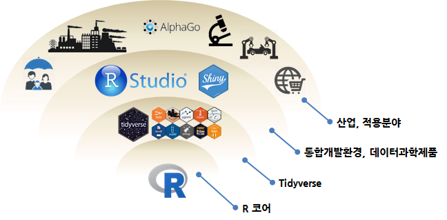

```{r setup, include=FALSE}
knitr::opts_chunk$set(echo = TRUE, warning = FALSE, message = FALSE, verbose =TRUE, cache = FALSE, fig.width=12, fig.height = 10)

# 0. 환경설정 ---------------
library(purrr)
library(tidyverse)
library(stringr)
library(DT)

```

## 1. 데이터 과학 툴체인 {#data-science-environment}

데이터를 R언어를 기반으로 분석하고 모형개발을 통한 제품과 서비스 개발을 위한 툴체인(toolchain)을 구성하는 핵심요소는 다음과 같다.

- R 코어 엔진: [The R Project for Statistical Computing](https://www.r-project.org/)
- R 팩키지: [CRAN](https://cran.r-project.org/web/packages/)
- 통합개발환경(IDE): [RStudio](https://www.rstudio.com/)
- 웹서비스 제공 도구: [Shiny](https://www.rstudio.com/products/shiny/)



## 2. 데이터 과학 소프트웨어 라이선스 [^open-source-for-business] {#data-science-license}

[^open-source-for-business]: [비즈니스를 위한 오픈 소스 소프트웨어 한국어 번역](http://statkclee.github.io/open-source-for-business/)

R 코어 엔진과 R 팩키지는 [R 라이선스](https://www.r-project.org/Licenses/)에 명시되어 있고, 
대부분 오픈소스 프로젝트에서 일반적으로 많이 사용되는 라이선스가 주종을 이루고 있다.

- The “GNU Affero General Public License” version 3
- The “Artistic License” version 2.0
- The “BSD 2-clause License”
- The “BSD 3-clause License”
- The “GNU General Public License” version 2
- The “GNU General Public License” version 3
- The “GNU Library General Public License” version 2
- The “GNU Lesser General Public License” version 2.1
- The “GNU Lesser General Public License” version 3
- The “MIT License”
- The “Creative Commons Attribution-ShareAlike International License” version 4.0

통합개발환경과 웹서비스 제공 도구도 [RStudio](https://www.rstudio.com/) 회사에서 제공되는 도구를 많이 사용한다. [GitHub](https://github.com/), [Stackoverflow.com](https://stackoverflow.com/), [r-bloggers.com](https://www.r-bloggers.com/) 등 R 커뮤니티에서 일반적인 개발도구 및 웹서비스 제공 도구로 사용되고 있다.

다만, [RStudio](https://www.rstudio.com/)는 통합개발환경(RStudio IDE)과 웹서비스 제공 도구(Shiny 서버)는 커뮤니티 버젼과 사용버젼을 기능의 차이를 두어 각각 제공하고 있다.

|                 비고           |         커뮤니티 무료 버젼             | 상용 유료 버젼 |
|--------------------------------|----------------------------------------|----------------------------------------|
|    통합개발환경(RStudio IDE)   | <https://www.rstudio.com/products/rstudio/> | <https://www.rstudio.com/products/rstudio-server-pro/> |
| 웹서비스 제공 도구(Shiny 서버) | <https://www.rstudio.com/products/shiny/> | <https://www.rstudio.com/products/rstudio-server-pro/> |


## 3. 데이터 과학 라이선스 현황 {#data-science-license-data}

데이터 과학은 과거 소프트웨어만 신경을 썼지만, 이제 데이터에 대한 부분과 콘텐츠 라이선스(Creative Commons)도 
중요하게 다뤄줘야 한다.

### 3.1. 데이터 라이선스 {#data-science-license-data}

데이터 분석을 위한 소프트웨어 라이선스 외에 공개된 데이터를 결합하여 활용한다.
예를 들어, IP주소 정보가 있는 경우 [Maxmind IP Geolocation](https://dev.maxmind.com/geoip/geoip2/geolite2/)에서 제공하는 
데이터베이스를 지리정보를 처리하는 R 팩키지와 결합하여 사용자가 접속한 위치정보를 파악할 수 있다. 
참고로, Maxmind 데이터베이스는 CC-BY-SA 4.0로 제공되는 것으로 파악된다.

### 3.2. 소프트웨어 라이선스 {#data-science-license-software}

R 코어 엔진, 통합개발환경(IDE), 웹서비스 제공 도구(Shiny)는 각각 웹사이트에서 파악하면 된다. 
갯수가 많지 않아 인터넷을 통한 라이선스 정보를 쉽게 파악할 수 있다.
대부분, 대다수 분들이 학교에서 데이터 분석을 위해서 R 코어엔진에 커뮤티니 버젼 RStudio IDE, 웹서비스 제공도구(Shiny 서버)를 
무료로 활용하고 나서, 업무의 중요도가 높아짐에 따라 상용버젼을 검토하는 순을 밟고 있다.

|   구분      |              라이선스                    |               링크                    |
|-------------|------------------------------------------|---------------------------------------|
| R 코어 엔진 |               GPL                        | <https://www.r-project.org/Licenses/> |
| R 팩키지    |             오픈소스 계열                | <https://www.r-project.org/Licenses/> |
| 통합개발환경(IDE)  | AGPL |  [RStudio](https://www.rstudio.com/products/rstudio/) |
| 웹서비스 제공 도구 | AGPL |  [RStudio Server Amazon Machine Image (AMI)](http://www.louisaslett.com/RStudio_AMI/) |


### 3.3. 팩키지 라이선스 {#data-science-license-package}

파이썬도 그렇지만, R을 통해 데이터를 분석할 경우 다양한 팩키지를 다운로드 받아 활용한다.
경우가 너무 많아서 데이터 분석가와 개발자가 라이선스를 지키는지 파악하기 어려운 경우가 있다.
`installed.packages()` 함수를 통해 설치된 팩키지를 데이터프레임으로 변환하여 기초 통계분석을 통해 라이선스 준수 여부를 
쉽게 파악할 수 있다.

```{r data-science-license}
pkg_df <- installed.packages() %>% as_tibble()

pkg_df %>% mutate(
    license_chk = 
        case_when(
            str_detect(License, "GPL") ~ "GPL",
            str_detect(License, "MIT") ~ "MIT",
            str_detect(License, "Part of R 3.4.2") ~ "GPL",
            str_detect(License, "LGPL") ~ "LGPL",
            str_detect(License, "BSD") ~ "BSD",
            str_detect(License, "MPL") ~ "MPL",
            str_detect(License, "Apache") ~ "Apache",
            str_detect(License, "Unlimited|CC0|CC BY") ~ "CC",
            str_detect(License, "Lucent Public License") ~ "Lucent Public",
            str_detect(License, "file LICENSE") ~ "file LICENSE",
            str_detect(License, "BSL") ~ "Boost Software License"
        )
    ) %>% 
    count(license_chk, sort=TRUE) %>% 
    mutate(`비율` = n / sum(n),
           `누적비` = cumsum(`비율`)) %>% 
    select(`라이선스`=license_chk, `팩키지수`=n, everything()) %>% 
    DT::datatable() %>% 
      formatPercentage(c("비율", "누적비"), digits=1)
```

팩키지에 대한 오픈소스 라이선스 구체적인 정보는 다음과 같다.

```{r data-science-license-detail}
pkg_df %>% 
    select(Package, Version, License, License_is_FOSS, Depends) %>% 
    datatable()
```


