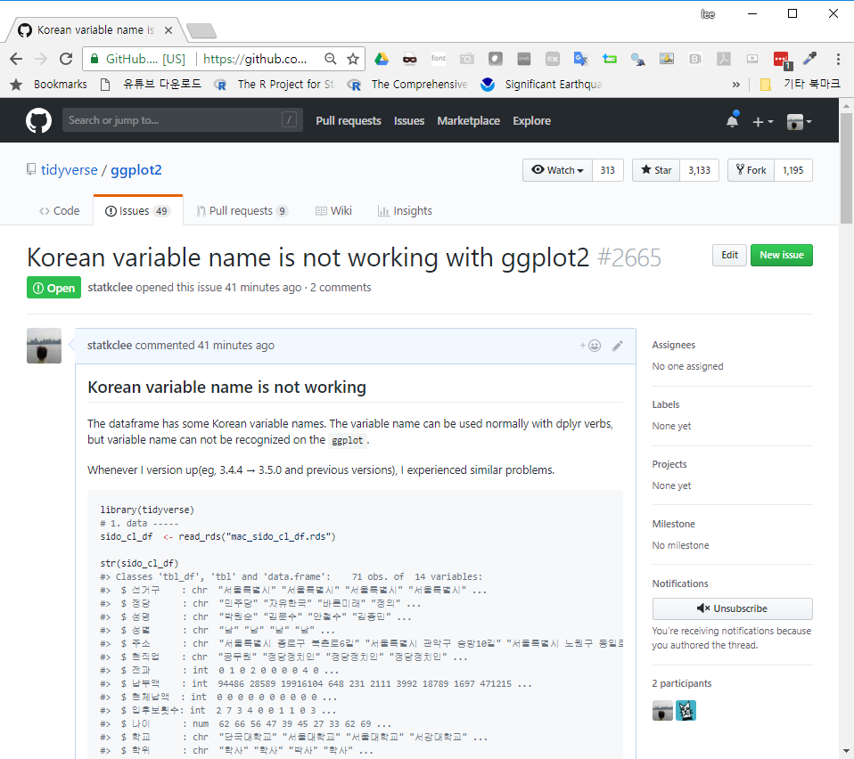

``` {r, include=FALSE}
source("tools/chunk-options.R")
knitr::opts_chunk$set(echo = TRUE, warning=FALSE, message=FALSE)
```

# 초심자의 고민 {#we-have-some-concern}

누구나 초심자로서 고민이 있다. 특히, 난관에 몰렸을 때 본인이 지금까지 겪었던 문제를 
문제를 해결해야 될 사람에게 전달하기가 참 쉽지 않다.

이런 고민에 대해서 도움이 될 수 있는 R 팩키지가 나왔다. [reprex](http://reprex.tidyverse.org/)는
**repr**oducible **ex**ample 의 줄임말로 [GitHub issues](https://guides.github.com/features/issues/), 
[stackoverflow](https://stackoverflow.com/questions/tagged/r), [Slack snippets](https://get.slack.help/hc/en-us/articles/204145658-Create-a-snippet)에 
도움을 받을 수 있도록 R 코드를 작성을 도와준다.

<iframe width="300" height="180" src="https://www.youtube.com/embed/ft_rdnFKvnc" frameborder="0" allow="autoplay; encrypted-media" allowfullscreen></iframe>

# `reprex` 사용법 {#reprex}

`reprex` 사용법은 생각보다 단순하다.

1. R 코드를 복사해서 클립보드에 집어넣는다.
1. `library(reprex)` 팩키지를 불러오고 `reprex()`을 실행한다.
1. **RStudio’s Viewer** 패널에 R 코드 실행결과가 나타난다.
    - R 코드와 R코드 실행결과를 적절히 사용해서... [GitHub issues](https://guides.github.com/features/issues/), 
[stackoverflow](https://stackoverflow.com/questions/tagged/r), [Slack snippets](https://get.slack.help/hc/en-us/articles/204145658-Create-a-snippet)에 활용한다.

# `github` 이슈등록 [^reprex-tutorial] {#reprex-github}

[^reprex-tutorial]: [Render a reprex](http://reprex.tidyverse.org/reference/reprex.html)

R 버전을 올리고, 새로운 `tidyverse` 팩키지의 기능개선 버젼이 생겨날 때마다 
한국어를 모국어로 하고 데이터를 분석하는 데이터과학자는 항상 동일한 문제에 직면한다.
바로, 한국어를 객체나 데이터프레임 변수명으로 사용하게 되는 경우 오류가 발생하는 경우가 비일비재하다.

이럴 때, 즉시, `tidyverse`의 일원인 `ggplot2`에 해당내용을 정리해서 버그나 이슈를 제보하고자 하는 경우,
`reprex()` 함수를 사용하면 유용하다. 기본적인 사용법은 위와 유사하나 
[Github: Korean variable name is not working with ggplot2 #2665](https://github.com/tidyverse/ggplot2/issues/2665)에 등록하기 위해서 다음 몇가지 사항에 유의한다.

1. 데이터 위치 작업 디렉토리
    - `getwd()` 함수로 작업 디렉토리를 파악한다.
    - `setwd()` 명령어로 데이터가 위치한 디렉토리를 지정한다.
1. R코드가 1줄 이상이 되는 경우 `reprex()` 함수내부에 `{}` 넣어 R코드를 작성한다.
1. 주석은 `#``을 붙여 R코드와 설명되는 내용이 함께 붙여 놓는다.
1. `si=TRUE, venue = "gh"`와 같은 내용을 추가하여 `sessionInfo()`와 `gh`은 GitHub으로 도움말을 활용할 곳을 지정한다.
1. `reprex({...})`를 실행하게 되면 클립보드에 내용이 자동저장되기 때문에 해당 GitHub 이슈나 Stackoverflow 페이지에 붙여넣고 불필요한 부분 편집하면 된다.

- [Korean variable name is not working with ggplot2 #2665](https://github.com/tidyverse/ggplot2/issues/2665)

```{r github-reprex-issue}
library(reprex)
library(tidyverse)

reprex({
    
    #' ## Korean variable name is not working  
    #' 
    #' The dataframe has some Korean variable names.
    #' The variable name can be used normally with dplyr verbs,
    #' but variable name can not be recognized on the ggplot.
    #' 
    
    library(tidyverse)
    # 1. data -----
    sido_cl_df  <- read_rds("data/mac_sido_cl_df.rds")
    
    str(sido_cl_df)
    
    # 2. viz -----
    ## 2.1. error
    sido_cl_df %>% 
        ggplot(aes(x=납부액, y=입후보횟수)) +
        geom_point() +
        scale_x_log10() +
        geom_smooth(stat="smooth")
    
    ## 2.2. walkaround
    sido_cl_df %>% 
        rename(num_run = "입후보횟수",
               pay_amt = "납부액") %>% 
        ggplot(aes(x=pay_amt, y=num_run)) +
        geom_point() +
        scale_x_log10() +
        geom_smooth(stat="smooth")
}, si=TRUE, venue = "gh")

```




