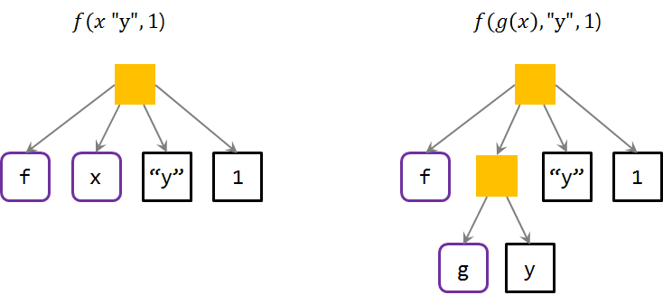
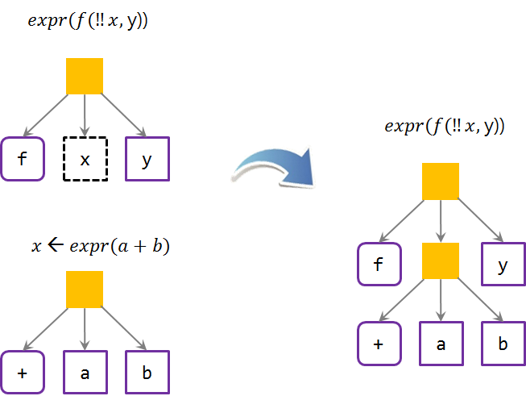

```{r setup, include=FALSE}
knitr::opts_chunk$set(echo = TRUE, warning = FALSE, message = FALSE, verbose =TRUE, cache = FALSE, fig.width=12, fig.height = 10)

# 0. 환경설정 ---------------
library(purrr)
library(tidyverse)
library(stringr)
library(DT)

```


## 1. R 구문(Syntax) {#r-syntax}

[Amelia McNamara](http://t.co/6UotowCWjt) 교수는 "R Syntax Comparison:: cheat sheet"를 작성했다. 
이를 한국어로 번역한 컨닝쪽지는 [R 구문 비교::컨닝 쪽지](https://github.com/rstudio/cheatsheets/raw/master/translations/korean/syntax-kr.pdf)를 통해 비교가 가능하다.

**구문(Syntax)** 프로그래밍 언어에서 어떤 코드는 동작하고 어떤 코드는 동작하지 않는지 관할하는 규칙의 집합이다. 
대부분의 프로그래밍 언어는 한가지 표준화된 구문을 제공하지만, 
R 언어는 팩키지 개발자가 자체 구문을 제작하여 명세하는 것이 허락되어 있다. 결과로, 매우 다양한 (동일하게 적법한) R 구문이 존재하게 되었다.

가장 널리 퍼진 R 구문은 다음과 같다:

1. **달러 기호 구문**, 때때로 베이스 R 구문으로 불리며 대부분의 베이스 R 함수에서 활용된다. 
데이터셋$변수명형태로 특징되고, 데이터셋[1,2]와 같이 꺾쇠 괄호 부분집합 추출하는 것과 연관된다. 
거의 모든 R 함수는 달러기호 구문을 인자로 전달하는 것이 허용한다.

2. **모형공식 구문**, lm(), lattice 그래픽 같은 모형함수에서 사용됨. 하나 (혹은 다수) 예측변수를 종속변수에 연결시키는데 틸드(~)를 사용한다. 다수 베이스 R 함수는 모형공식 구분을 받아들인다.

3. **깔끔한 세상(tidyverse syntax)**, `dplyr`, `tidyr`, 등에서 사용된다. 
이런 유형의 함수는 데이터가 첫번째 인자로 상정하고, `magrittr` 팩키지 “파이프” (%>%) 연산자와 함께 동작할 수 있도록 한다. 
일반적으로 `ggplot2`는 깔끔한 세상(tidyverse) 생태계 일원으로 간주되지만, 
자체 구문으로 더하기 기호(+)를 사용해서 문자열 조각을 결합하는데 사용한다. 
Hadley Wickham은 파이프를 학습한 후에 `ggplot2`를 작성했다면 지금과는 다른 구문을 갖게되었을 것이라 말을 했다.

교육서비스를 제공하는 입장에서 통일된 하나의 구문을 가르치려고 하지만, 대부분의 R 프로그래머는 다양한 구문을 조합해서 사용하는 것이 현실이다.

<blockquote class="twitter-tweet" data-lang="en"><p lang="en" dir="ltr">Thank you <a href="https://twitter.com/AmeliaMN?ref_src=twsrc%5Etfw">@AmeliaMN</a> for making an <a href="https://twitter.com/hashtag/rstats?src=hash&amp;ref_src=twsrc%5Etfw">#rstats</a> cheatsheet that compares the $, formula and <a href="https://twitter.com/hashtag/tidyverse?src=hash&amp;ref_src=twsrc%5Etfw">#tidyverse</a> coding styles in R. Now at <a href="https://t.co/OZVUTm5lDl">https://t.co/OZVUTm5lDl</a> <a href="https://twitter.com/rstudio?ref_src=twsrc%5Etfw">@rstudio</a> <a href="https://t.co/1BJDbxak83">pic.twitter.com/1BJDbxak83</a></p>&mdash; Garrett Grolemund (@StatGarrett) <a href="https://twitter.com/StatGarrett/status/961737092937277440?ref_src=twsrc%5Etfw">February 8, 2018</a></blockquote>
<script async src="https://platform.twitter.com/widgets.js" charset="utf-8"></script>

### 1.1. 달러($) 기호 구문 {#r-syntax-dollar}

> `목표함수명(데이터$x, 데이터$y)`

#### 1.1.1. 요약 통계량 {#r-syntax-dollar-stat}

목표함수명을 가정하면 `데이터셋$변수명` 형태로 R 구문을 작성한다.

``` {r r-syntax-dollar-stat, eval = FALSE}
#연속형 변수 1개:
mean(mtcars$mpg)
#범주형 변수 1개:
table(mtcars$cyl)
#범주형 변수 2개:
table(mtcars$cyl, mtcars$am)
#연속형 1개, 범주형 1개:
mean(mtcars$mpg[mtcars$cyl==4])
mean(mtcars$mpg[mtcars$cyl==6])
mean(mtcars$mpg[mtcars$cyl==8])
```

#### 1.1.2. 플롯 그래프 {#r-syntax-dollar-plot}

통계분석에 사용되는 것과 동일한 방식 `데이터셋$변수명` 형태로 R 구문을 작성하여 시각화 플롯 그래프를 도식화한다.

``` {r r-syntax-dollar-graph, eval = FALSE}
# 연속형 변수 1개:
hist(mtcars$disp)
boxplot(mtcars$disp)
# 범주형 변수 1개:
barplot(table(mtcars$cyl))
# 연속형 변수 2개:
plot(mtcars$disp, mtcars$mpg)
# 범주형 변수 2개:
mosaicplot(table(mtcars$am, mtcars$cyl))
# 연속형 1개, 범주형 1개:
histogram(mtcars$disp[mtcars$cyl==4])
histogram(mtcars$disp[mtcars$cyl==6])
histogram(mtcars$disp[mtcars$cyl==8])
boxplot(mtcars$disp[mtcars$cyl==4])
boxplot(mtcars$disp[mtcars$cyl==6])
boxplot(mtcars$disp[mtcars$cyl==8])
```

#### 1.1.3. 데이터 정제작업 (WRANGLING) {#r-syntax-dollar-wrangling}

통계분석과 플롯 그래프 시각화와 동일한 방식 `데이터셋$변수명` 형태로 R 구문을 작성하여 데이터 정제작업을 수행한다.

``` {r r-syntax-dollar-wrangle, eval = FALSE}
# 부분집합 뽑아내기(subsetting):
mtcars[mtcars$mpg>30, ]
# 신규 변수 생성:
mtcars$efficient[mtcars$mpg>30] <- TRUE
mtcars$efficient[mtcars$mpg<30] <- FALSE
```

### 1.2. 모형공식 구문 {#r-syntax-formula}

> `목표함수명(y~x|z, data=데이터, group=w)`

#### 1.2.1. 요약 통계량 {#r-syntax-formula-stat}

목표함수명을 가정하면 모형공식으로 많이 사용되는 `~` 틸드를 사용하여 R 구문을 작성한다.

``` {r r-syntax-formula-stat, eval = FALSE}
# 연속형 변수 1개:
mosaic::mean(~mpg, data=mtcars)
# 범주형 변수 1개:
mosaic::tally(~cyl, data=mtcars)
# 범주형 변수 2개:
mosaic::tally(cyl~am, data=mtcars)
# 연속형 1개, 범주형 1개:
mosaic::mean(mpg~cyl, data=mtcars)
```

#### 1.2.2. 플롯 그래프 {#r-syntax-formula-plot}

통계분석에 사용되는 것과 동일한 방식 모형공식으로 많이 사용되는 `~` 틸드를 사용하여 R 구문을 작성하여 시각화 플롯 그래프를 도식화한다.

``` {r r-syntax-formula-plot, eval = FALSE}
# 연속형 변수 1개:
lattice::histogram(~disp, data=mtcars)
lattice::bwplot(~disp, data=mtcars)
# 범주형 변수 1개:
mosaic::bargraph(~cyl, data=mtcars)
# 연속형 변수 2개:
lattice::xyplot(mpg~disp, data=mtcars)
# 범주형 변수 2개:
mosaic::bargraph(~am, data=mtcars, group=cyl)
# 연속형 1개, 범주형 1개:
lattice::histogram(~disp|cyl, data=mtcars)
lattice::bwplot(cyl~disp, data=mtcars)
```

### 1.3. 깔끔한 세상(Tidyverse) 구문 {#r-syntax-tidyverse}

> `데이터 %>% 목표함수명(x)`

### 1.3.1. 요약 통계량 {#r-syntax-tidyverse-stat}

`%>%` 연산자를 사용하여 R 구문을 작성하여 요약통계량을 산출한다.

``` {r r-syntax-tidyverse-stat, eval = FALSE}
# 연속형 변수 1개:
mtcars %>% dplyr::summarize(mean(mpg))
# 범주형 변수 1개:
mtcars %>% dplyr::group_by(cyl) %>% dplyr::summarize(n())
# 범주형 변수 2개:
mtcars %>% dplyr::group_by(cyl, am) %>% dplyr::summarize(n())
# 연속형 1개, 범주형 1개:
mtcars %>% dplyr::group_by(cyl) %>% dplyr::summarize(mean(mpg))
```

### 1.3.2. 플롯 그래프 {#r-syntax-tidyverse-plot}

`%>%` 연산자를 역할을 수행하는 `+` 연산자를 활용하여 R 구문을 작성하여 시각화 플롯 그래프를 도식화한다.
`qplot`은 `ggplot2`의 기능을 간추려 빠르게 고급 시각화 산출물을 작성할 수 있도록 한다.

``` {r r-syntax-tidyverse-plot, eval = FALSE}
# 연속형 변수 1개:
ggplot2::qplot(x=mpg, data=mtcars, geom = "histogram")
ggplot2::qplot(y=disp, x=1, data=mtcars, geom="boxplot")
# 범주형 변수 1개:
ggplot2::qplot(x=cyl, data=mtcars, geom="bar")
# 연속형 변수 2개:
ggplot2::qplot(x=disp, y=mpg, data=mtcars, geom="point")
# 범주형 변수 2개:
ggplot2::qplot(x=factor(cyl), data=mtcars, geom="bar") + facet_grid(.~am)
#  연속형 1개, 범주형 1개:
ggplot2::qplot(x=disp, data=mtcars, geom = "histogram") + facet_grid(.~cyl)
ggplot2::qplot(y=disp, x=factor(cyl), data=mtcars,geom="boxplot")
```

### 1.3.3. 데이터 정제작업(Wrangling) {#r-syntax-tidyverse-wrangle}

`%>%` 연산자를 활용하여 R 구문을 작성하여 데이터 정제작업을 정말 깔끔하게 수행할 수 있다.

``` {r r-syntax-tidyverse-wrangle, eval = FALSE}
# 부분집합 뽑아내기(subsetting):
mtcars %>% dplyr::filter(mpg>30)
# 신규 변수 생성: 
mtcars <- mtcars %>% dplyr::mutate(efficient = if_else(mpg>30, TRUE, FALSE))
```


## 2. 메타 프로그래밍 [^advanced-r-meta-programming] [^tidy-eval-blog] [^meta-minho] {#r-meta-programming}

[^advanced-r-meta-programming]: [Advanced R - 18 Introduction](https://adv-r.hadley.nz/meta.html)

[^tidy-eval-blog]: [Non-standard evaluation, how tidy eval builds on base R](https://edwinth.github.io/blog/nse/)

[^meta-minho]: [lumiamitie - METAPROGRAMMING (R-ADV WEEK3)](http://lumiamitie.github.io/r/radv-wk3-metaprog/)

<iframe width="300" height="180" src="https://www.youtube.com/embed/nERXS3ssntw" frameborder="0" allow="autoplay; encrypted-media" allowfullscreen></iframe>

[메타프로그래밍(metaprogramming)](https://ko.wikipedia.org/wiki/%EB%A9%94%ED%83%80%ED%94%84%EB%A1%9C%EA%B7%B8%EB%9E%98%EB%B0%8D)이란 
자기 자신 혹은 다른 컴퓨터 프로그램을 데이터로 처리함으로써 프로그램을 작성·수정하는 프로그램을 작성하는 것을 말한다.
R에서 메타 프로그래밍(Meta Programming)을 사용하는 R 함수를 흔히 **NSE**(Non-Standard Evalution)를 사용한다고 일컷는다.
메타 프로그래밍이 중요한 이유는 인터랙티브 데이터 분석을 촉진시키는 역할을 하기 때문이다. 물론 추가적으로 일부 모호함이 스며들어 치뤄야 하는 비용이 있는 반면에
인터랙티브 데이터 분석을 신속히 수행할 수 있게 해준다.

예를 들어, `subset()`, `dplyr::filter()`와 같은 함수에 정확성을 희생하여 간결함을 추구할 수 있고, 시각화와 데이터 조작과 같은 특정 문제 R 언어 시맨틱을 원하는 형태로 바꿔
**[도메인 특화 언어(DSL, Domain Specific Languages)](https://ko.wikipedia.org/wiki/%EB%8F%84%EB%A9%94%EC%9D%B8_%ED%8A%B9%ED%99%94_%EC%96%B8%EC%96%B4)** 구축을 가능케 한다.


### 2.0. 환경설정 {#r-lang-env}

[lobstr - iterative str() for R](https://github.com/hadley/lobstr), [rlang - Low-level API for programming with R](https://github.com/r-lib/rlang) 팩키지를 설치한다.

``` {r rlang-setup}
# 0. 환경설정 -----
# devtools::install_github("r-lib/rlang", force = TRUE)
# devtools::install_github("hadley/lobstr")
library(tidyverse)
library(rlang)
library(lobstr)
```

### 2.1. R 구문 표현식은 나무구조 {#r-lang-env}

"R code is a tree", 즉 표현식(expression)은 **나무구조(tree)**를 갖는다. 
`lobstr` 팩키지 `ast()` 함수를 통해 R 구문으로 작성된 표현식을 시각화할 수 있다.
**추상구문트리(AST, Abstract Syntax Tree)**는 직설적으로 고급언어(High-level Language)를 의미 변화없이 저급언어(Low-level Language) 기계어에 매핑하는 과정이다.
사람의 언어와 가까운 고급언어를 기계어에 매핑하는 어려운 문제를 풀고자 나온 자료구조가 추상구문트리(AST)다.



``` {r rlang-ast-theory}
# 1. 표현식은 나무구조를 갖는다 -----
## 1.1. 일반적인 함수
ast(f(x, "y", 1))

## 1.2. 중첩함수
ast(f(g(x), "y", 1))

## 1.3. 대입연산자
ast(y <- x * 10)

ast(`<-`(y, `*`(x, 10)))
```

예를 들어 연산의 우선순위는 곱셈이 덧셈보다 앞서게 된다. 이를 바꾸려고 한다면 괄호를 사용해서 명시적으로 연산의 우선순위를 지정한다.
`!x %in% y` 표현식은 `x`벡터에 `y` 벡터원소가 있다면 이를 부울 대수로 부정하는 결과를 얻는 표현식인데 `!` 연산자가 우선 순위가 낮아 먼저 부정되지 않고 
`x %in% y` 연산이 수행된 후에 부정되는 것이 확인된다.

``` {r rlang-ast-example}
## 1.4. 사례
ast(1 + 2 * 3)
ast((1 + 2) * 3)

ast(mean(x = mtcars$cyl, na.rm = TRUE))

ast(!x %in% y)
```

### 2.2. "Quoting"을 통해 나무구조를 잡아낸다. {#r-lang-quote}

Capture the tree by quoting, 즉, "Quoting"을 통해 나무구조를 잡아내는데 개발자관점과 사용자관점이 있다.
Quoting은 **[Quasi-quotation](https://en.wikipedia.org/wiki/Quasi-quotation)**의 일부를 구성한다.

Quasi-quotation은 미리 구문에 자리차지자(placeholder)를 두고, 나중에 구문을 매꿔넣어 사용하는 방식이다. 
"quasi-quotation enables one to introduce symbols that stand for a linguistic expression in a given instance and are used as that linguistic expression in a different instance."

예를 들어, 

> "Snow is white" is true if and only if snow is white.    
> Therefore, there is some sequence of symbols that makes the following sentence true when every instance of $\psi$ is replaced by that sequence of symbols: "$\psi$" is true if and only if $\psi$.

Quine이 변수사용을 회피하고자 Quasi-quotation을 도입했고, 따라서 어떤 변수도 포함하지 않는 표현식(closed sentence)에서만 동작한다. 

|     |  개발자   |    사용자   |
|-----|-----------|-------------|
|하나 |	`expr()`  | `enexpr()`  |
|다수 | `exprs()` | `enexprs()` |

``` {r rlang-quote}
# 2. "Quoting"을 통해 나무구조를 잡아낸다. -----    
## 2.1. expr() - R 코드 제작자, 즉 개발자
f1 <- function(z) expr(z)
f1(a+b)

## 2.2. enexpr() - R 코드 사용자, 즉 사용자
f2 <- function(z) enexpr(z)
f2(x+y)
```

### 2.3. "Unquoting"이 나무구조 생성을 수월하게 한다. {#r-lang-unquote}

**Unquotation**은 평가(evaluation)와 관련되어 있으며 사용자 도구다.
`rlang` 팩키지에서 `expr()`, `enexpr()` 등 다수 Quoting 함수는 `!!` (뱅뱅, unquote)를 지원한다.
추상구문트리(AST)에 속한 노드를 일대일로 대체하는 경우 `!!`, 일대다로 대체하는 경우 `!!!`을 사용한다.



``` {r rlang-unquote}
# 3. "Unquoting"이 나무구조 생성을 수월하게 한다. -----
## 3.1. 예제
(xy <- expr(x + y))
expr(!!xy + z)

## 3.1. 중첩함수
x <- expr(a+b)
expr(f(!!x, y))

ast(expr(f(!!x, y)))
```

### 2.4. Quote와 Unquote 조합 사례 {#r-lang-quote-unquote}

`dplyr` 팩키지와 `ggplot` 팩키지에 변수명을 넘겨 시각화를 하고자 할 경우 Quote와 Unquote를 조합하여 사용자 정의함수를 생성할 수 있다.
맥이나 리눅스에서 잘 동작하지만, 윈도우에서는 동작하지 않을 수도 있으니, 특히 `ggplot`의 경우 문제가 되더라도 절대 당황하지 말자.

`my_scatterplot(mtcars, wt, mpg)` 데이터프레임에 변수명을 넘겨 `ggplot`으로 시각화하는 경우 `enexpr()` 함수로 quote하고 나서 `!!xvar`을 통해 `unquote`하여 
`ggplot`을 성공적으로 시각화시킨다.
동일하게 `dplyr` 팩키지 `summarize()` 함수에 `!!var`을 통해 변수명을 성공적으로 넘겨 요약통계량을 산출한다.

``` {r rlang-quote-unquote, eval=TRUE}
# 4. Quote + Unquote 조합 -----
## 4.1. 시각화 사례
my_scatterplot <- function(df, xvar, yvar) {
    xvar <- enexpr(xvar)
    yvar <- enexpr(yvar)
    
    ggplot(df, aes(x=!!xvar, y=!!yvar)) +
        geom_point()
}

my_scatterplot(mtcars, wt, mpg)

## 4.2. 표 사례
my_summarize <- function(df, var) {
    var <- enexpr(var)

    df %>% summarise(mean(!!var), sd(!!var))
}

my_summarize(mtcars, mpg)
```

### 2.5. Quosures를 통한 표현식과 환경 포섭 {#r-lang-quosures}

무명함수(anonymous function)는 명칭을 갖지 않는 작은 함수로 사용되고 또한 클로저(clousre)를 생성하는데도 사용된다.
클로저는 함수로 작성된 함수(functions written by functions)로 무명함수와 달리 명칭을 갖는데 이유는 부모함수의 환경을 
**둘러싸고(enclose)** 환경에 속한 변수에 접근할 수 있기 때문이다. 이것이 유용한 이유는 부모수준에서 연산작업에 대해 제어하고 
자식수준에서 작업을 수행하는 것이 가능하기 때문이다.

> “An object is data with functions. A closure is a function with data.” — John D. Cook

`Quosures catpure expression and environment`, 즉 **Quosures**는 Quoting과 Closure의 합성어로 표현식(expression)과 환경(environment)을 결합시킨다.
앞서와 마찬가지로 `enexpr()`로 `quote`하게 되면 전역환경(global environment)에서 존재하는 `n`을 잡아내지 못해 원하는 결과를 얻지 못한다.
이런 경우 `enquo()` 함수로 `quote`하게 되면 환경도 함께 둘러싸서 감싸게 되어 기대했던 결과를 도출할 수 있다.

``` {r rlang-quosures}
# 5. Quosures는 표현식과 환경을 결합시킨다 -----
## Quosures 적용 전 
my_mutate <- function(df, var) {
    n <- 10
    var <- enexpr(var)
    mutate(df, !!var)
}

df <- tibble(x = 1)
n <- 100

my_mutate(df, x + n)
# # A tibble: 1 x 2
# x `x + n`
# <dbl>   <dbl>
# 1.00    11.0

## Quosures 적용 후
my_mutate <- function(df, var) {
    n <- 10
    var <- enquo(var)
    mutate(df, y = !!var)
}

df <- tibble(x = 1)
n <- 100

my_mutate(df, x + n)
# # A tibble: 1 x 2
# x     y
# <dbl> <dbl>
# 1.00   101
```

### 2.6. Map-Reduce 사례 {#r-lang-map-reduce}

$y= 10 + (5 \times x_1 ) + (-4 \times x_2 )$ 회귀식으로부터 예측값을 계산해내는 경우를 상정해보자.

총 6단계에 걸쳐서 작업을 순차적으로 수행해 나가게 된다.

1. `syms()`: 문자명 벡터를 기호 리스트로 변환
1. `expr()`, `map2()`: 회귀계수와 각 변수를 결합
1. `reduce()`, `!!`: 회귀식 완성
1. `eval()`: 회귀식 활용 예측값 생성

```{r}
intercept <- 10
coefs <- c(x1 = 5, x2 = -4)

## 6.1. 문자명 벡터를 기호 리스트로 변환: syms()
(coef_sym <- syms(names(coefs)))


## 6.2. 회귀계수와 각 변수를 결합: expr(), map2
summands <- map2(coef_sym, coefs, ~ expr((!!.x * !!.y)))
summands <- c(intercept, summands)

## 6.3. 회귀식 완성: reduce()
(reg_eq <- reduce(summands, ~ expr(!!.x + !!.y)))

## 6.4. 회귀식 활용
design_df <- data.frame(x1 = runif(5), x2 = runif(5))
y_df <- eval(reg_eq, design_df) %>% tibble()

(reg_df <- bind_cols(y_df, design_df))
```


