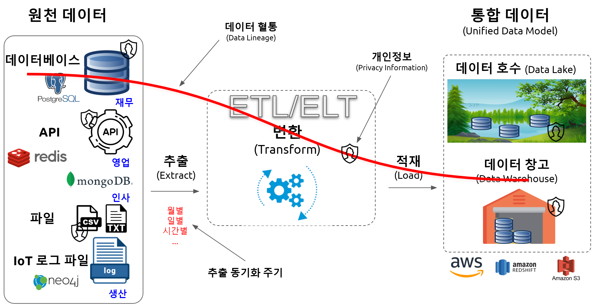
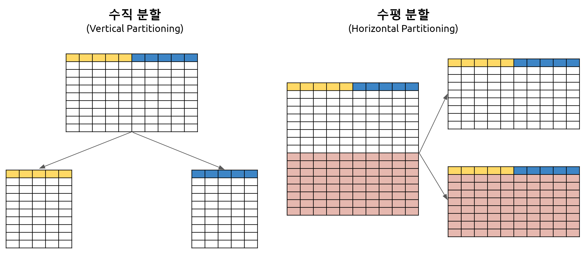
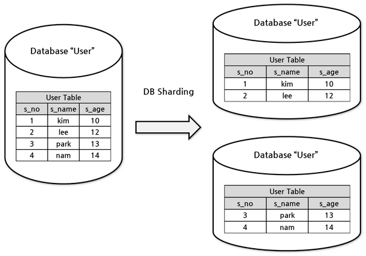
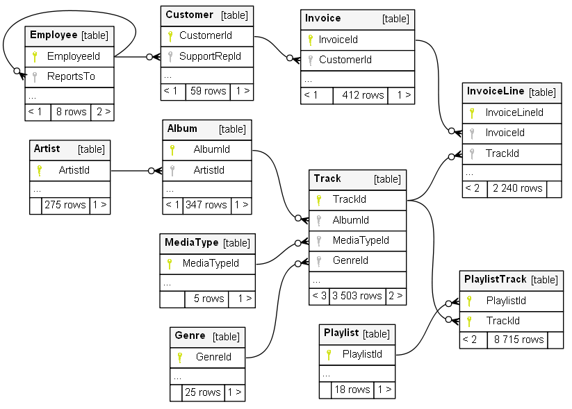

 
``` {r setup, include=FALSE}
knitr::opts_chunk$set(echo = TRUE, warning=FALSE, message=FALSE,
                    comment="", digits = 3, tidy = FALSE, prompt = FALSE, fig.align = 'center')

library(tidyverse)
```

# 데이터베이스 기본소양 {#database-basics}

## 데이터 구분 {#classify-data}

데이터는 정형데이터(RDBMS), 비정형 데이터, 반정형 데이터로 크게 나눌 수 있다. 각 자료형에 따라 장단점이 있는 것은 명확하다. 정형데이터는 분석하기 용이한 반면 확장성과 유연성이 떨어지고, 비정형 데이터는 분석하기는 다소 어려움이 있으나 확장성과 용이성에서는 장점을 갖는다. `.csv`, `.xml`, `.json` 파일은 그 중간적인 특성을 갖는 반정형 데이터로 분류도힌다.


## OLTP vs. OLAP {#oltp-vs-olap}

**OLTP** (OnLine Transaction Processing)는 데이터 자체 처리에 중점을 둔 개념인데 반해, **OLAP** (OnLine Analytical Processing)은 저장된 데이터를 분석하여 꿰뚤어 볼 수 있는 능력(Insight)를 도출하는데 중심을 두고 있다.

OLAP의 대표적인 예로 편의점 판매시점 정보관리(Point-Of-Sales, POS) 기계를 들어보자. 편의점에서 물건을 구매한 경우 다음과 같은 거래가 발생된다.

- 고객 카드에서 현금 10,000원 인출
- 편의점 통장에 10,000 지급
- 명세표 출력

상기 3건의 작업 프로세스가 하나의 트랜잭션(transaction) 묶어 모두 성공적으로 처리가 되어야 편의점 물건구매가 완료되도록 개발한다.

반면에 OLAP은 데이터를 체계적으로 저장하여 데이터에 기반한 의사결정지원을 할 수 있도록 주안점을 두고 있다.


|      |          OLAP             |          OLTP             | 
|------|:----------------------------------------------------|:---------------------------------------------------|
| 목적 | 트랜젝션 처리 | 데이터 분석과 보고서 작성, 대쉬보드 시각화 |
| 설계 | 앱 기능 지향  | 비즈니스 주제 지향 |
| 데이터 | 운영계, 실시간 최신 데이터 | 정보계, 통합/이력 데이터 |
| 크기 | 기가 바이트, 스냅샷          | 테라데이터, 아카이브 |
| SQL 쿼리 | 단순 트랜잭션, 빈번한 갱신 | 복잡한 집계 쿼리 |
| 사용자 | 아주 많음 | 분석가 포함 일부 |


따라서, OLTP는 운영 데이터베이스(Operational Database)로 적합하여 쓰기 업무(Write-intensive)가 많은 경우 빠르고 안전하게 레코드를 삽입(insert)하는데 특화된 반면, OLAP은 데이터 창고(Data Warehouse) 업무에 적합한데 다양한 분석업무를 수행할 때 쿼리 작업을 속도감있게 진행할 수 있어 읽기 업무(Read-intensive)에 특화되어 있다.

## DW, Data Lake [^warehouse-lake] {#database-warehouse-lake}

[^warehouse-lake]: [talend, ""Four key differences between a data lake and a data warehouse](https://www.talend.com/resources/data-lake-vs-data-warehouse/)

전통적인 데이터베이스(Database)는 관계형 데이터베이스를 통해서 실시간 정형데이터를 빠르고 신뢰성있게 처리하는데 운영계를 지탱하는 주된 쓰임새가 있으며, 데이터 창고(Data Warehouse)는 이력 데이터를 통합하여 꿰뚤어 볼 수 있는 능력(Insight)을 제공함은 물론 보고서와 전체적인 현황을 대쉬보드를 통해 제공하는데 큰 의미가 있다. 데이터 호수(Data Lake)는 정형, 반정형, 비정형 데이터를 모두 저장하고 관리한다는 측면에서 유연성과 확장성을 내재하고 있으며 빅데이터를 분석하여 OLAP에서 추구하는 바를 한단계 더 넓혔다는 점에서 의의를 둘 수 있다. 


데이터 호수(Data Lake)는 특정한 구조가 없기 때문에 접근하기 용이하고 쉽게 수정하기도 용이한 반면에 데이터 창고(Data Warehouse)는 상대적으로 유연성이 떨어진다. 뿐만 아니라 데이터 과학자는 아직 결정되지 않는 비즈니스 활용 사례를 데이터 문제로 바꿔 모형을 만들고 시각화를 하는데 데이터 호수를 적합한 데 반해 비즈니스 현업전문가는 일단 전처리가 된 데이터를 데이터 창고에 넣어 특정 목적을 달성하는데 활용된다는 점에서 비교가 된다. 

|          |                   데이터 호수               |                    데이터 창고              |
|----------|:--------------------------------------------|:--------------------------------------------|
| 자료구조 | 원천 데이터 (Raw Data)                      | 전처리 된 데이터                            |
| 데이터 활용 목적 | 미결정 상태                         | 현재 사용 중                                |
| 사용자   | 데이터 과학자                               | 비즈니스 현업전문가                         |
| 접근성   | 접근성 높고 신속한 업데이트                 | 변경하기 쉽지 않고 비용도 많이 소요됨.      |

클라우드 서비스도 데이터 창고(Data Warehouse)를 기능으로 제공하고 있는데 상품명은 다음과 같다.

- AWS: 아마존 Redshift
- MS Azure: Azure SQL Data Warehouse
- 구글: 구글 빅쿼리(Big Query)

데이터 호수도 클라우드 서비스에서 제공된다. Object Storage와 함께 하둡/스파크 빅데이터 소프트웨어와 함께 검토된다.

- AWS: AWS S3
- MS Azure: Blob Storage / Azure Data Lake Storage
- 구글:  Cloud Storage
- 네이버: Object Storage

## ETL과 ELT [^data-swamp] {#etl-vs-elt}

[^data-swamp]: [thenortonsetup (Jan 10, 2017), "Don’t Let Your Data Lake Turn Into A Data Swamp"](https://medium.com/@thenortonsetup/dont-let-your-data-lake-turn-into-a-data-swamp-44dba717126b)

ETL은 추출, 변환, 적재(Extract, Transform, Load)의 약자로 동일 기종 혹은 이기종의 원천데이터로부터 
데이터 웨어하우스에서 쌓는 과정을 뜻하는데 변환(Transform) 과정이 무척 많은 노력이 투여된다.
반면에 ELT는 데이터를 먼저 적재한 후에 필요에 따라 변환과정을 거쳐 후속 작업에 사용한다. 데이터 호수 ELT 프로세스가 매력적으로 보이지만 데이터 카탈로그가 잘 관리되지 않는다면 **데이터 늪(Data Swamp)**가 될 수 있다.


데이터 호수를 잘 관리하지 않는다면 데이터 늪에 빠질 수 있는데 메타데이터를 잘 관리하고 거버넌스를 확립해야 되고 비정형데이터도 많이 다루기 때문에 데이터 전문가 과학자를 확보하여 효율성을 높인다.


# 데이터 통합(integration) {#database-integration}

원천데이터가 서로 다른 형태로 다양하게 존재하는 상황에서 데이터를 통합한다는 것은 시스템을 맞추는 것을 넘어 개념적인 데이터 모델로 정립하여야 하고 관련하여 파생된느 다양한 문제를 조화롭게 해결하는 것으로 정의할 수 있다.

먼저 데이터를 한곳에 모은다고 하면 어떤 데이터를 모을 것인지 정의하고 클라우드 서비스를 사용한다고 하면 AWS Redshift 혹은 S3를 상정하고 혹시나 포함될 수 있는 개인정보도 사전에 식별하여 마스킹 등을 통해 익명화시켜야 되며 데이터 혈통(Data Lineage)도 구축하여 투명성과 가시성도 확보한다.

    


# 테이블 분할과 샤딩 {#table-partition}

지금은 빅데이터 시대라 데이터가 커지게 되면 테이블에 담을 수 없는 상황이 온다.
이런 문제를 해결하기 위해 도입된 개념이 **분할(Partition)** 이다.
테이블 크기가 예를 들어 100GB 혹은 1TB가 되면 인덱스도 커져서 메모리에 적재가 되지 않아
쿼리 속도와 업데이트 속도가 현격히 늦어지게 된다.
이런 경우 테이블을 더 작은 단위로 쪼개는데 이를 **분할(Partition)**이라고 한다.

테이블을 분할하게 될 경우 개념과 논리 데이터 모형은 동일하지만 물리 데이터 모형이 분할에 영향을 받게 된다.

1. 개념 데이터 모형(Concept Data Model): Entity, Relationship, Attributes
    - ERD(Entity Relational Diagram), UML 다이어그램
1. 논리 데이터 모형(Logical Data Model): 테이블, 칼럼, 관계
    - 데이터베이스 스키마와 모형: 관계형 모형, 스타 스키마(Star Sceman)
    - **분할(Partition)** 혹은 **샤딩(Sharding)**에 영향을 받음
1. 물리 데이터 모형(Physical Data Model): 물리적 저장장치
    - 백업 시스템, 파티션, CPU, 저장공간 등
    - **분할(Partition)** 혹은 **샤딩(Sharding)**의 영향을 받음.

테이블을 분할하는 방법은 수평 분할 (Horizontal Partitioning)과 수직 분할 (Vertical Partitioning) 두가지 방법이 있다.




**데이터베이스 샤딩(databae sharding)**은 테이블이 동일한 데이터베이스에 있지 않고 다른 기계에 있다는 점에서 차이가 난다. [^cubrid-sharding]

[^cubrid-sharding]: [CUBRID SHARD, "Database Sharding"](https://www.cubrid.org/manual/ko/9.3.0/shard.html)


    


# 데이터베이스 설계 {#db-design}

데이터베이스 설계(Database Design)는 데이터를 논리적으로 저장하는 방식으로 데이터베이스 모델(Database Model)을 사용한다. 
데이터베이스 모델(Database Model)은 데이터베이스 구조에 대한 최상위 사양서의 역할을 한다. 일반적으로 관계형 데이터베이스 모형(Relational Database Model)을 사용하지만 NoSQL, 객체지향 DB 모형, 네트워크 DB 모델 등이 있다.
데이터베이스의 청사진으로 스키마를 사용해서 테이블, 필드, 관계, 인덱스, 뷰로 구성하여 작성한다.

1. 데이터 (Data) &larr; 논리 모형
1. 데이터베이스 모형 &larr; 데이터 구조에 대한 사양서
1. 스키마 &larr; 레고 블럭(Table, Field, Relation, Index, View 등)으로 데이터베이스 설계
        
즉, 데이터를 체계적으로 구조화하는 논리모형을 먼저 구상하고 나서 사양서를 작성하고 실제 데이터베이스 설계로 들어간다.

## 데이터 모형(Data Modeling) {#db-design-in-practice}

데이터를 저장하는 방식에 대해 데이터 모형(Data Model)을 제작하는 단계는 다음과 같다.

1. 개념 데이터 모형(Concept Data Model): Entity, Relationship, Attributes
    - ERD(Entity Relational Diagram), UML 다이어그램
1. 논리 데이터 모형(Logical Data Model): 테이블, 칼럼, 관계
    - 데이터베이스 스키마와 모형: 관계형 모형, 스타 스키마(Star Sceman)
1. 물리 데이터 모형(Physical Data Model): 물리적 저장장치
    - 백업 시스템, 파티션, CPU, 저장공간 등

## 데이터 정규화 [^database-normalization] [^db-3nf] {#data-normalization}

[^database-normalization]: [위키 백과, "데이터베이스 정규화"](https://ko.wikipedia.org/wiki/%EB%8D%B0%EC%9D%B4%ED%84%B0%EB%B2%A0%EC%9D%B4%EC%8A%A4_%EC%A0%95%EA%B7%9C%ED%99%94)

[^db-3nf]: [YABOONG (MARCH 9, 2018), "데이터베이스 정규화 - 1NF, 2NF, 3NF"](https://yaboong.github.io/database/2018/03/09/database-normalization-1/)

관계형 데이터베이스의 설계에서 **정규화(normalization)**는 중복을 최소화하도록 데이터를 구조화하는 프로세스를 지칭한다. 관계형 모델의 발견자인 에드거 F. 커드는 1970년에 제 1 정규형(1NF)로 알려진 정규화의 개념을 도입하였고, 에드거 F. 커드는 이어서 제 2 정규형(2NF)과 제 3 정규형(3NF)을 1971년에 정의하였으며, 1974년에는 레이먼드 F. 보이스와 함께 보이스-코드 정규화(BCNF)를 정의하였다. 통상 관계형 데이터베이스 테이블이 제 3 정규(3NF)형이 되었으면 **정규화(Normalization)** 되었다고 한다. 따라서, 데이터 정규형(Normal Forms)은 1NF 부터 3NF까지가 많이 회자된다.

- 제 1 정규형 (1 NF)
    - 각 레코드는 유일무이(unique)해야 한다. 즉, 중복(duplication)이 없어야 함.
    - 각 셀은 하나의 값만 가져야 함.
- 제 2 정규형 (2 NF)
    - 제 1 정규형을 만족한다.
    - 기본키(primary key)가 한 칼럼이면 자동으로 제 2 정규형을 만족한다.
    - 기본키가 아닌 모든 속성이 기본키에 완전 함수 종속되어야 한다.
- 제 3 정규형 (3 NF)
    - 제 2 정규형을 만족한다.
    - 기본키가 아닌 모든 속성이 기본키에 이행적 함수 종속이 되지 않아야 한다.
    - 즉, 이행(移行)적 함수 종속 (Transitive Functional Dependency)이 없어야 한다. 
    - 함수 종속 사례로  X, Y, Z 에 대해 X &rarr; Y 이고 Y &rarr; Z 이면 X  &rarr; Z 가 성립한다. 이를 Z 가 X 에 이행적으로 함수 종속되었다고 함.
    
# OLAP 차원 모델링 [^olap-dm] {#dimensional-modeling}

[^olap-dm]: [Guru99, "What is Dimensional Modeling in Data Warehouse?"](https://www.guru99.com/dimensional-model-data-warehouse.html)

데이터베이스 모델이은 크게 탑다운(top-down) ERD 방법론과 함께 "데이터 창고(Data Warehouse)"에서 차원 모델링(DM, Dimensional Modeling)으로 나눠진다. 좀더 쉽게 이해를 하기 위해 GURU99에 나온 사례를 살펴보자. OLAP 차원 모델링은 다음 5단계로 이뤄진다.

1. 가장 먼저 비즈니스 프로세스를 하나 선택한다.
    - 마케팅, 영업, 인사 등
1. 얼마나 자세히 볼 것인지 상세화 수준(grain)을 정의한다.
    - 연도별, 분기별, 월별, 주별, 일별 등
1. 차원을 정의한다.
    - 차원은 날짜, 지점, 공장 등을 지칭한다.
1. 사실(Fact)을 정의한다.
    - 일자별 지점별 제품별 판매금액과 같이 숫자값이 된다.
1. 스키마를 제작한다.
    - 상기 정보를 바탕으로 스타 스키마(Star Schema) 혹은 눈꽃 스키마(Snowflake Schema) 를 작성한다.

상기 작업결과 사장님이 원하는 월별 지점별 직급별 판매실적을 스타 스키마로 제작하게 된다


[](fig/dimensional_model.png)

## 스타 스키마 {#star-schema}

차원 모델링을 방법론으로 스타 스키마를 채택하게 되면 차원 테이블(dimensional table)과 사실 테이블(fact table)을 정의해야 되는데 차원 테이블은 되도록이면 변하지 않는 속성(attributes)을 갖게 되는 반면, 차원 테이블은 측정값에 대한 레코드가 축적되며 자주 변경되게 되고 차원 테이블과 외래키(foreign key)로 연결된다.

# `chinook` 데이터베이스 {#chinook-database} 


[`chinook`](https://archive.codeplex.com/?p=chinookdatabase) 데이터베이스는 Northwind 데이터베이스에서 유래되었으며, 
[치눅(chinooks)](https://en.wikipedia.org/wiki/Chinook_wind)은 캐나다 프레리(Canadian Prairies)과 미국 대평원(Great Plains)에서 발생되는 푄 바람(fohn winds)라고 한다. [`lerocha/chinook-database`](https://github.com/lerocha/chinook-database) GitHub 저장소에 다양한 데이터베이스에 사용될 수 있도록 교육용으로 잘 준비되어 있다.

## `chinook` ERD {#chinook-database-erd} 

`chinook` ERD는 다음과 같다. [`chinook` Database](http://schemaspy.org/sample/relationships.html) [SchemaSpy](http://schemaspy.org/)에서 잘 정리해 두어 이를 통해 전반적인 `chinook` 데이터베이스 구조를 살펴본다.



## `chinook` 논리 데이터 모형 {#chinook-database-logical-model}

`chinook` ERD에 기초하여 논리 데이터 모델을 다음과 같이 [YugaByte DB](https://docs.yugabyte.com/latest/sample-data/chinook/)에서 확인할 수 있다.


## 헬로 월드 [^all-about-sqlite3] {#chinook-helloworld}

[^all-about-sqlite3]: [John Atten (2014-12-07), "Installing and Using SQLite on Windows"](http://johnatten.com/2014/12/07/installing-and-using-sqlite-on-windows/)

먼저,  [sqlite3 chinooks](https://github.com/lerocha/chinook-database) 데이터베이스를 다운로드 한다.

```{r helloworld, eval = FALSE}
download.file(url = "https://raw.githubusercontent.com/lerocha/chinook-database/master/ChinookDatabase/DataSources/Chinook_Sqlite.sql", destfile = "data/Chinook_Sqlite.sql")
```

쉘에서 아래 명령어로 sqlite3 데이터베이스를 생성시킨다.

`sqlite3 chinook.db < Chinook_Sqlite.sql`

`DBI` 연결시켜 `chinook.db`를 R에서 작업할 수 있도록 준비시킨다.

```{r sqlite3-chinooks}
library(tidyverse)
library(DBI)
library(RSQLite)

chinook <- dbConnect(RSQLite::SQLite(), dbname = "data/chinook.db")
```


R 마크다운에서 제대로 되는지 테스트 한다.

```{sql sql-code-chunk, connection = chinook}
SELECT * FROM Artist LIMIT 10;
```


