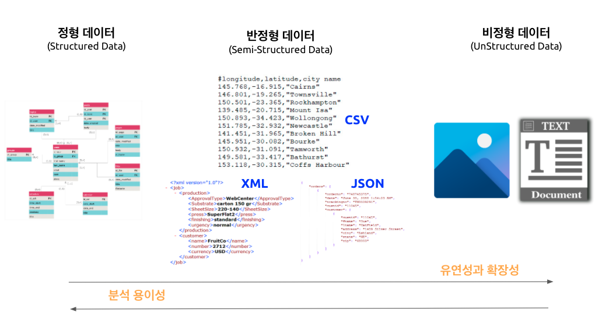
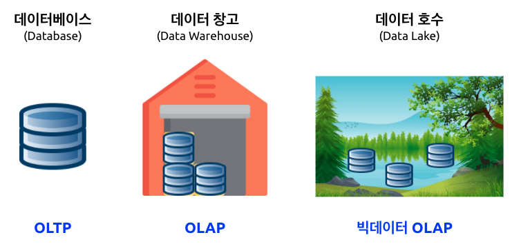
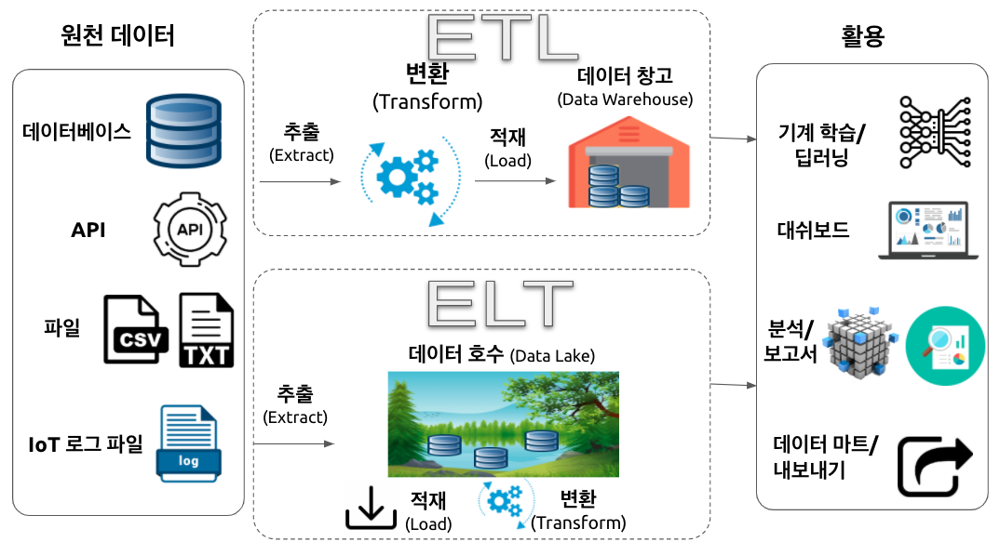
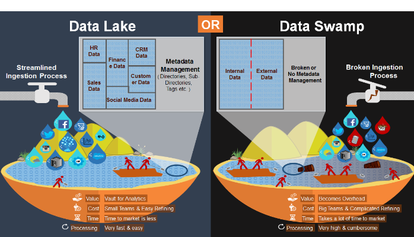

 
``` {r setup, include=FALSE}
knitr::opts_chunk$set(echo = TRUE, warning=FALSE, message=FALSE,
                    comment="", digits = 3, tidy = FALSE, prompt = FALSE, fig.align = 'center')

library(tidyverse)
```

# 데이터베이스 기본소양 {#database-basics}

## 데이터 구분 {#classify-data}

데이터는 정형데이터(RDBMS), 비정형 데이터, 반정형 데이터로 크게 나눌 수 있다. 각 자료형에 따라 장단점이 있는 것은 명확하다. 정형데이터는 분석하기 용이한 반면 확장성과 유연성이 떨어지고, 비정형 데이터는 분석하기는 다소 어려움이 있으나 확장성과 용이성에서는 장점을 갖는다. `.csv`, `.xml`, `.json` 파일은 그 중간적인 특성을 갖는 반정형 데이터로 분류도힌다.



## OLTP vs. OLAP {#oltp-vs-olap}

**OLTP** (OnLine Transaction Processing)는 데이터 자체 처리에 중점을 둔 개념인데 반해, **OLAP** (OnLine Analytical Processing)은 저장된 데이터를 분석하여 꿰뚤어 볼 수 있는 능력(Insight)를 도출하는데 중심을 두고 있다.

OLAP의 대표적인 예로 편의점 판매시점 정보관리(Point-Of-Sales, POS) 기계를 들어보자. 편의점에서 물건을 구매한 경우 다음과 같은 거래가 발생된다.

- 고객 카드에서 현금 10,000원 인출
- 편의점 통장에 10,000 지급
- 명세표 출력

상기 3건의 작업 프로세스가 하나의 트랜잭션(transaction) 묶어 모두 성공적으로 처리가 되어야 편의점 물건구매가 완료되도록 개발한다.

반면에 OLAP은 데이터를 체계적으로 저장하여 데이터에 기반한 의사결정지원을 할 수 있도록 주안점을 두고 있다.


|      |          OLAP             |          OLTP             | 
|------|:----------------------------------------------------|:---------------------------------------------------|
| 목적 | 트랜젝션 처리 | 데이터 분석과 보고서 작성, 대쉬보드 시각화 |
| 설계 | 앱 기능 지향  | 비즈니스 주제 지향 |
| 데이터 | 운영계, 실시간 최신 데이터 | 정보계, 통합/이력 데이터 |
| 크기 | 기가 바이트, 스냅샷          | 테라데이터, 아카이브 |
| SQL 쿼리 | 단순 트랜잭션, 빈번한 갱신 | 복잡한 집계 쿼리 |
| 사용자 | 아주 많음 | 분석가 포함 일부 |

## DW, Data Lake [^warehouse-lake] {#database-warehouse-lake}

[^warehouse-lake]: [talend, ""Four key differences between a data lake and a data warehouse](https://www.talend.com/resources/data-lake-vs-data-warehouse/)

전통적인 데이터베이스(Database)는 관계형 데이터베이스를 통해서 실시간 정형데이터를 빠르고 신뢰성있게 처리하는데 운영계를 지탱하는 주된 쓰임새가 있으며, 데이터 창고(Data Warehouse)는 이력 데이터를 통합하여 꿰뚤어 볼 수 있는 능력(Insight)을 제공함은 물론 보고서와 전체적인 현황을 대쉬보드를 통해 제공하는데 큰 의미가 있다. 데이터 호수(Data Lake)는 정형, 반정형, 비정형 데이터를 모두 저장하고 관리한다는 측면에서 유연성과 확장성을 내재하고 있으며 빅데이터를 분석하여 OLAP에서 추구하는 바를 한단계 더 넓혔다는 점에서 의의를 둘 수 있다. 



데이터 호수(Data Lake)는 특정한 구조가 없기 때문에 접근하기 용이하고 쉽게 수정하기도 용이한 반면에 데이터 창고(Data Warehouse)는 상대적으로 유연성이 떨어진다. 뿐만 아니라 데이터 과학자는 아직 결정되지 않는 비즈니스 활용 사례를 데이터 문제로 바꿔 모형을 만들고 시각화를 하는데 데이터 호수를 적합한 데 반해 비즈니스 현업전문가는 일단 전처리가 된 데이터를 데이터 창고에 넣어 특정 목적을 달성하는데 활용된다는 점에서 비교가 된다. 

|          |                   데이터 호수               |                    데이터 창고              |
|----------|:--------------------------------------------|:--------------------------------------------|
| 자료구조 | 원천 데이터 (Raw Data)                      | 전처리 된 데이터                            |
| 데이터 활용 목적 | 미결정 상태                         | 현재 사용 중                                |
| 사용자   | 데이터 과학자                               | 비즈니스 현업전문가                         |
| 접근성   | 접근성 높고 신속한 업데이트                 | 변경하기 쉽지 않고 비용도 많이 소요됨.      |

클라우드 서비스도 데이터 창고(Data Warehouse)를 기능으로 제공하고 있는데 상품명은 다음과 같다.

- AWS: 아마존 Redshift
- MS Azure: Azure SQL Data Warehouse
- 구글: 구글 빅쿼리(Big Query)

데이터 호수도 클라우드 서비스에서 제공된다. Object Storage와 함께 하둡/스파크 빅데이터 소프트웨어와 함께 검토된다.

- AWS: AWS S3
- MS Azure: Blob Storage / Azure Data Lake Storage
- 구글:  Cloud Storage
- 네이버: Object Storage

## ETL과 ELT [^data-swamp] {#etl-vs-elt}

[^data-swamp]: [thenortonsetup (Jan 10, 2017), "Don’t Let Your Data Lake Turn Into A Data Swamp"](https://medium.com/@thenortonsetup/dont-let-your-data-lake-turn-into-a-data-swamp-44dba717126b)

ETL은 추출, 변환, 적재(Extract, Transform, Load)의 약자로 동일 기종 혹은 이기종의 원천데이터로부터 
데이터 웨어하우스에서 쌓는 과정을 뜻하는데 변환(Transform) 과정이 무척 많은 노력이 투여된다.
반면에 ELT는 데이터를 먼저 적재한 후에 필요에 따라 변환과정을 거쳐 후속 작업에 사용한다. 데이터 호수 ELT 프로세스가 매력적으로 보이지만 데이터 카탈로그가 잘 관리되지 않는다면 **데이터 늪(Data Swamp)**가 될 수 있다.




데이터 호수를 잘 관리하지 않는다면 데이터 늪에 빠질 수 있는데 메타데이터를 잘 관리하고 거버넌스를 확립해야 되고 비정형데이터도 많이 다루기 때문에 데이터 전문가 과학자를 확보하여 효율성을 높인다.



