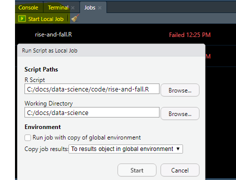

```{r, include=FALSE}
# source("tools/chunk-options.R")
knitr::opts_chunk$set(echo = TRUE, warning=FALSE, message=FALSE,
                    comment="", digits = 3, tidy = FALSE, prompt = FALSE, fig.align = 'center')

library(here)
```


# 사라지는 SPSS [^spss-is-dying] {#dying-spss}

[^spss-is-dying]: [Jonas Kristoffer Lindeløv (13. March 2019), "SPSS is dying. It’s time to change." NEUROSCIENCE, STATS, AND CODING](https://lindeloev.net/spss-is-dying/)

Jonas Kristoffer Lindeløv 님이 직접 R 코드를 짜서 2020년 R이 SPSS를 연간 인용수에 있어 따라 잡을 것으로 예상했다. 이것이 맞는지를 확인해보자. 이를 위해서 `rise-and-fall.R` 스크립트를 Jobs로 실행시켜 구글 스칼러에서 가져온다. 




[Google Scholar Scraper.R](https://github.com/lindeloev/spss-is-dying/blob/master/Google%20Scholar%20Scraper.R) 파일에서 `JASP`관련 부분을 생략하고 한국에서 많이 언급되는 통계팩키지를 중심으로 구글 스칼러에 등록된 소프트웨어를 살펴보자.

```{r google-scholar-code, eval = FALSE}
library(rvest)
library(httr)
library(tidyverse)

# Settings
years = 2010:2019
searches = list(
  R = '"the R software" OR "the R project" OR "r-project.org" OR "R development core" OR "bioconductor" OR "lme4" OR "nlme" OR "lmeR function" OR "ggplot2" OR "Hmisc" OR "r function" OR  "r package" OR "mass package" OR "plyr package" OR "mvtnorm"',
  SPSS = 'SPSS -"SPSS Modeler" -"Amos"',
  SAS = '"SAS Institute" -JMP -"Enterprise Miner"',
  STATA = '("stata" "college station") OR "StataCorp" OR "Stata Corp" OR "Stata Journal" OR "Stata Press" OR "stata command" OR "stata module"'
)
sleep_interval = c(1, 10)  # Uniformly break between searches in this interval to prevent scholar from rejecting searches
scholar_prefix = 'https://scholar.google.dk/scholar?hl=en&as_sdt=0%2C5&as_ylo=9999&as_yhi=9999&q='


###################
# HANDY FUNCTIONS #
###################

# Build the URL string
get_url = function(software, year) {
  url_prefix = gsub('9999', as.character(year), scholar_prefix)  # Enter year
  url_search = gsub(' ', '+', searches[[software]])  # Escape spaces
  url_search = gsub('\"', '%22', url_search)  # Escape quotes
  url = paste(url_prefix, url_search, sep='')
  url
}

# Do the web search
get_html = function(url) {
  html = read_html(url)
  #html = content(GET(url))
  html
}

extract_citations = function(html) {
  # Extract the citation number
  hits_strings = html %>%
    html_nodes(css='.gs_ab_mdw') %>%  # Name of the class where we can find citation number
    html_text()
  hits_string = strsplit(hits_strings[2], ' ')[[1]][2]  # Second hit, second "word"
  hits_numeric = as.numeric(gsub(',', '', hits_string))  # As numeric, not string
  hits_numeric
}

get_citations = function(software, year) {
  # Sleep to prevent HTTP error 503
  sleep_duration = runif(1, sleep_interval[1], sleep_interval[2])
  Sys.sleep(sleep_duration)
  
  # Do the search
  url = get_url(software, year)
  html = get_html(url)
  citations =  extract_citations(html)
  
  # Status and return
  print(sprintf('Got %i scholar citations in %i for %s', citations, year, software))
  citations
}


#################
# DO THE SEARCH #
#################
citation_history = expand.grid(years, names(searches))
names(citation_history) = c('year', 'software')

citation_history = citation_history %>%
  # filter(software == 'SAS') %>%
  rowwise() %>%
  mutate(
    citations = get_citations(software, year)
  )

# Save it so you don't have to repeat in case Scholar locks you out
write.csv(citation_history, 'data/citations.csv', row.names = F)

```

# 논문 인용 분석 {#analysis-spss-decline}

```{r spss-decline-data}
library(tidyverse)
library(ggthemes)
library(extrafont)
loadfonts()

citation_df <- read_csv("data/citations_2020.csv")

citation_df %>% 
  mutate(year = lubridate::make_date(year = year)) %>% 
  ggplot(aes(x=year, y=citations, color=software)) +
    geom_line() +
    geom_point(size=2) +
    theme_tufte(base_family = "NanumGothic") +
    labs(x="", y="논문 인용수", title="SPSS 몰락과 R의 비약", color="통계팩키지") +
    scale_y_sqrt(labels = scales::comma) 
```


