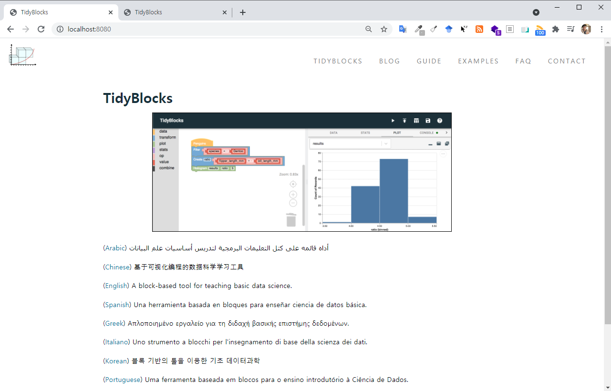
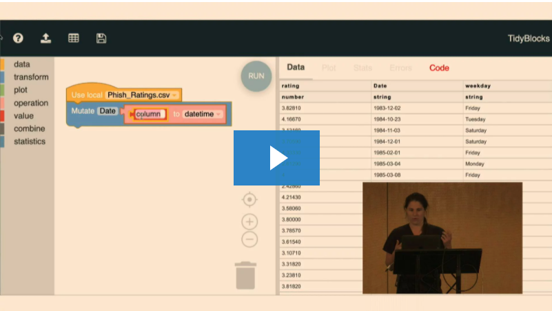
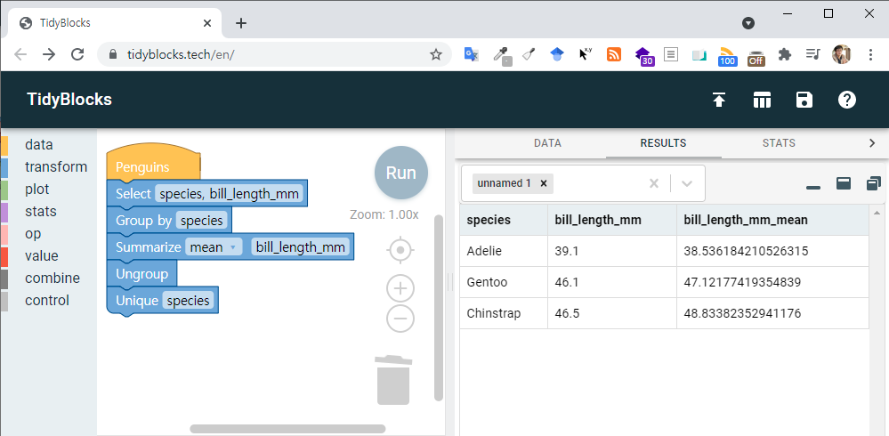

```{r setup, include=FALSE}
knitr::opts_chunk$set(echo = TRUE, warning=FALSE, message=FALSE,
                    comment="", digits = 3, tidy = FALSE, prompt = FALSE, fig.align = 'center')

library(reticulate)
library(tidyverse)

```

# 관련 자료 {#tidy-blocks-reference}

-   [TidyBlocks 웹페이지](https://tidyblocks.tech/)
-   [TidyBlocks GitHub 저장소](https://github.com/tidyblocks/tidyblocks/)

# 설치 {#install}

[`CONTRIBUTING.md`](https://github.com/tidyblocks/tidyblocks/blob/master/CONTRIBUTING.md) 문서에 `TidyBlocks` 설치에 대한 자세한 사항이 정리되어 있다.

1.  <https://github.com/tidyblocks/tidyblocks/> GitHub 저장소를 포크(Fork) 떠서 본인 데스크탑 PC에 복제(clone) 한다.
2.  복제한 `tidyblocks` 디렉토로리 이동하여 `npm run install` 명령어를 사용해서 모든 팩키지를 설치한다.
3.  `tests/` 디렉토리에 있는 단위 테스트를 `npm run test` 실행해서 모든 것이 제대로 동작하는지 확인한다.
4.  `npm run build` 명령어를 실행해서 자바스크립트를 다시 빌드하고 나서 `npm run serve` 명령어를 사용해서 로컬서버에 띄운다. 웹브라우저에서 <http://localhost:8080> 주소를 입력하면 모든 것이 완료된다.

## 실행결과 {#install-result}

설치를 완료한 후에 안내에 따라 `tidyblocks` 디렉토리로 이동해서 로컬서버에 서비스를 띄우고 웹브라우저로 결과를 확인할 수 있다.

```{r run-tidyblocks, eval = FALSE}
C:\xxx\tidyblocks (master -> origin) (tidyblocks@0.1.0)
λ npm run serve

> tidyblocks@0.1.0 serve C:\xxx\tidyblocks
> npx @11ty/eleventy --serve

[Eleventy-Plugin-SASS] Compiling sass files...
Browserslist: caniuse-lite is outdated. Please run:
npx browserslist@latest --update-db
Writing _site/feed.xml from ./feed.html.
Writing _site/governance/index.html from ./GOVERNANCE.md.
Writing _site/ar/index.html from ./ar/index.html.

Writing _site/blog/2020/12/20/a-new-design-for-join/index.html from ./_posts/2020-12-20-a-new-design-for-join.md.
Writing _site/blog/2020/11/12/representing-join/index.html from ./_posts/2020-11-12-representing-join.md.
Writing _site/blog/2020/08/28/the-other-ninety-percent/index.html from ./_posts/2020-08-28-the-other-ninety-percent.md.
Copied 129 files / Wrote 40 files in 3.88 seconds (97.0ms each, v0.11.0)
Watching…
[Browsersync] Access URLs:
 --------------------------------------
       Local: http://localhost:8080
    External: http://220.74.19.152:8080
 --------------------------------------
          UI: http://localhost:3001
 UI External: http://localhost:3001
 --------------------------------------
[Browsersync] Serving files from: _site
[Eleventy-Plugin-SASS] Compiling sass files...
[Eleventy-Plugin-SASS] Done compiling sass files
[Browsersync] Reloading Browsers...
```



# 유튜브 동영상 {#youtube-tutorial}

-   [1littlecoder (2020. 8. 26.) "TidyBlocks - Scratch-like Visual Programming to teach/learn Tidy Data Analytics"](https://www.youtube.com/watch?v=9hEVpbSvaiA)
-   [Maya Gans (February 4, 2020), "TidyBlocks: using the language of the Tidyverse in a blocks-based interface", RSTUDIO::CONF 2020 LIGHTNING TALKS](https://www.rstudio.com/resources/rstudioconf-2020/tidyblocks-using-the-language-of-the-tidyverse-in-a-blocks-based-interface/)

+:-----------------------------------------------------------------------------------------------------------------------------------------------------------------------------------------------------------------------------------------------:+:------------------------------------------------------------------------------------------------------------------------------------------------------------------------------:+
| <iframe width="300" height="180" src="https://www.youtube.com/embed/9hEVpbSvaiA" title="YouTube video player" frameborder="0" allow="accelerometer; autoplay; clipboard-write; encrypted-media; gyroscope; picture-in-picture" allowfullscreen> | [{width="300"}](https://www.rstudio.com/resources/rstudioconf-2020/tidyblocks-using-the-language-of-the-tidyverse-in-a-blocks-based-interface/) |
|                                                                                                                                                                                                                                                 |                                                                                                                                                                                |
| </iframe>                                                                                                                                                                                                                                       |                                                                                                                                                                                |
+-------------------------------------------------------------------------------------------------------------------------------------------------------------------------------------------------------------------------------------------------+--------------------------------------------------------------------------------------------------------------------------------------------------------------------------------+

# 헬로월드 {#helloworld}

[`TidyBlocks`](https://tidyblocks.tech/) 웹사이트에서 기본 제공되는 팔마펭귄 데이터를 활용하여 블록 데이터 분석방식과 코딩 데이터 분석방식으로 데이터 과학을 실천해 보자.

::: {.row}
::: {.col-md-6}
**블록 데이터 분석**


:::

::: {.col-md-6}
**코딩 데이터 분석**

```{r ggplot-penguine-code}
library(tidyverse)
library(palmerpenguins)

penguins %>% 
  group_by(species) %>% 
  summarise(bill_length_mm_mean = mean(bill_length_mm, na.rm = TRUE)) %>% 
  ungroup()
```
:::
:::
