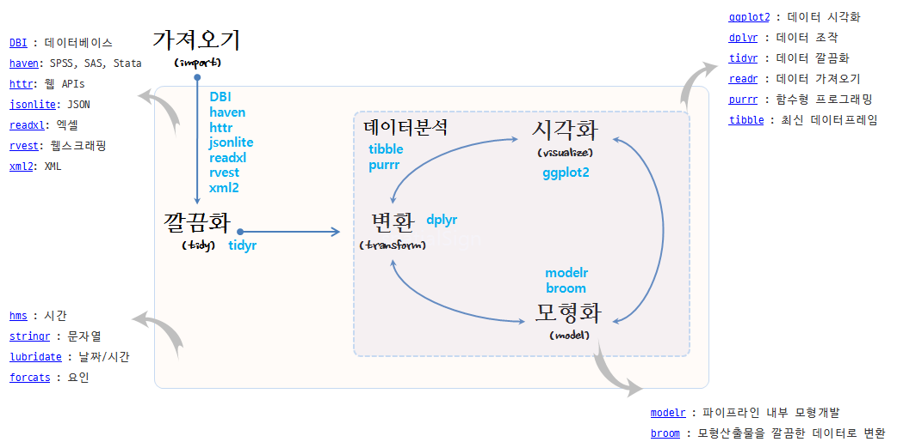

# 데이터 과학

> ## 학습 목표 {.objectives}
>
> * `tidyverse`와 `messyverse`를 이해한다.
> * 사람과 컴퓨터를 작업 최적화를 위한 접점을 찾아본다.
> * 데이터 과학 문제에 대한 R 진영 `tidyverse` 해결책을 이해한다.

## 1. 데이터 과학 문제정의

데이터 정제(Cleansing)는 원데이터를 시각화하거나 모형을 개발을 위해 다음 단계를 준비하는 사전 준비과정이다. 
하지만, 데이터 정제는 과거 많이 사용된 개념으로 정형화된 데이터베이스 혹은 통계 팩키지에 데이터를 사전 준비하는 과정을 
지칭하는 것으로 비정형 데이터와 정형 데이터가 함께 공존하고, 새로운 유형의 데이터가 넘처나는 지금에는 데이터 랭글링(Data Wrangling) 혹은 데이터 먼징(Data Munging)같은 용어가 사용된다.

목표는 원자료(raw data)를 또다른 형태로 수작업 혹은 자동화하는 프로그램을 작성하여 전환하거나 매핑하는 과정이다.
[데이터 과학자에 관한 하바드 비즈니스 리뷰 기사](https://hbr.org/2012/10/data-scientist-the-sexiest-job-of-the-21st-century/)[^data-science-hbr]에 따르면, 21세기 가장 인기있는 직업이 데이터 과학자로 친송받고 있지만, **[데이터 랭글링에 관한 뉴욕타임즈 기사](http://www.nytimes.com/2014/08/18/technology/for-big-data-scientists-hurdle-to-insights-is-janitor-work.html?_r=0)**[^data-science-nytimes]에 따르면 데이터 과학자 시간의 50% ~ 80% 시간을 데이터를 수집, 준비, 정제 등의 노동집약적인 작업에 소모하는 것으로 보고되고 있다. 

[^data-science-hbr]: [Data Scientist: The Sexiest Job of the 21st Century](https://hbr.org/2012/10/data-scientist-the-sexiest-job-of-the-21st-century/)
[^data-science-nytimes]: [For Big-Data Scientists, ‘Janitor Work’ Is Key Hurdle to Insights](http://www.nytimes.com/2014/08/18/technology/for-big-data-scientists-hurdle-to-insights-is-janitor-work.html?_r=0)

이런 문제에 대한 해결책을 오랜 기간동안 탐구해 왔지만, 문제의 본질을 파악하고 이에 대한 적절한 툴체인을 구축함으로써 
문제를 기회를 바꿀 수 있다.

데이터 과학은 컴퓨터와 사람이 데이터 프로그래밍 언어 R로 소통하는 과정으로 이해할 수 있다.
사람이 인지하여 생각한 것을 코딩을 통해 기술하고 이를 컴퓨터에 넣어주면, 컴퓨터가 이를 실행하는 과정이다.
과거, 컴퓨터 자원이 희귀하여 최대한 컴퓨터을 활용하는 점에 초점을 맞춰 데이터 과학 아키텍처가 설계되었다면,
현재는 클라우드, 오픈소스, 오픈 데이터, 인터넷에 연결된 수많은 컴퓨터로 말미암아 
사람이 가장 중요한 자원이 되었고, 컴퓨터에 작업명령을 기술하는 코딩도 기계중심 프로그래밍 언어에서
인간중심 프로그래밍 언어로 진화하고 있다.

## 2. 문제해결 개념 아키텍쳐

문제 해결의 중심에 사람이 있다. 하지만 `tidyr`을 통해 데이터테이블 형식의 
데이터가 `dplyr`에 들어오는 것을 기본 가정으로 깔고 있다.
데이터테이블로 데이터가 들어오면 데이터를 처리하는 인지능력을 통해
알고리즘을 생각하고, 이를 코딩으로 기술해서,
컴퓨터에 작업명령을 내린다.

### 2.1. `dplyr` 동사 명령어

인지능력을 통해 데이터를 처리하는 알고리즘은 데이터 처리 동사 명령어로 볼 수 있다.
`tidyr`을 통해 정규데이터 형태로 변형이 되었다고 가정하면,
변수에 연산작업을 내리는 `select()`, 행에 연산작업을 지시하는 `filter()`,
변수 변환과정을 통해 신규 변수를 생성하게 만드는 `mutate()`,
평균, 합, 분산, 최대값 등 관측점을 요약하는 `summarise()`,
변수에 관측점을 오름차순 혹은 내림차순으로 정렬하는 `arrange()` 함수가 있고,
추가로 `group_by()` 함수로 그룹집단을 지정한다.

- select: 데이터테이블에서 변수를 뽑아낸다.
- filter: 값으로 관측점을 뽑아낸다.
- mutate: 신규 변수를 생성한다. (log 변환)
- summarise: 관측점을 하나로 축약한다. (평균)
- arrange: 관측점을 오름차순, 내림차순으로 정렬한다.

### 2.2. `%>%` 파이프라인 연산자

`dplyr`은 파이프 연산자 [magrittr](https://cran.r-project.org/web/packages/magrittr/vignettes/magrittr.html)을 가져와서 사용한다. 
`%>%`은 "then"으로, 혹은 "파이프" 발음한다.

파이프-필터 스타일을 사용해야 되는 이유는 다음 전통적 R 코드와 파이프를 사용한 코드를 
살펴보게 되면 확연히 이해할 수 있다. 즉, 괄호를 많이 사용한 R코드는 인지적으로 
괄호안으로 들어갔다 나오고 이해하고, 또 괄호를 내부를 이해하고 나서 
괄호내부를 외부 괄호와 연결하는등 상당히 많은 두뇌회전을 요구하지만, 
파이프 연산자를 사용하면 매우 직관적으로 이해할 수 있다.

> ### 전통적 R 코드와 파이프 연산자를 사용한 R 코드 비교 {.callout}
>
> #### 전통적 R 코드
> ~~~ {.input}
> hourly_delay <- filter(   
>    summarise(   
>        group_by(   
>             filter(   
>                 flights,    
>                 !is.na(dep_delay)   
>             ),    
>             date, hour   
>        ),    
>    delay = mean(dep_delay),    
>         n = n()   
>    ),    
>    n > 10   
> )
> ~~~
>
> #### 파이프 연산자를 사용한 R 코드
> 
> ~~~ {.r}
> hourly_delay <- flights %>%  
>   filter(!is.na(dep_delay)) %>% 
>   group_by(date, hour) %>% 
>   summarise(delay = mean(dep_delay), n = n()) %>%  
>   filter(n > 10) 
> ~~~

### 2.3. SQL 코드 자동생성

`dplyr` 팩키지에 `translate_sql` 함수를 통해 R코드를 SQL 쿼리문으로 
바꿔 데이터베이스에 질의를 던지게 된다. 이를 통해 빅데이터 및 다양한 데이터베이스에 
존재하는 데이터를 R에서 인지적 부담없이 작업할 수 있게 된다.

~~~{.r}
flights %>%
 filter(!is.na(dep_delay)) %>%
 group_by(date, hour) %>%
 summarise(delay = mean(dep_delay), n = n()) %>%
 filter(n > 10)
}
~~~

~~~{.r}
SELECT "date", "hour", "delay", "n"
FROM (
    SELECT "date", "hour",
        AVG("dep_delay") AS "delay",
        COUNT() AS "n"
    FROM "flights"
    WHERE NOT("dep_delay" IS NULL)
    GROUP BY "date", "hour"
) AS "_W1"
WHERE "n" > 10.0
~~~

## 3. `tidyverse` 선언 [^tidyverse-menifesto]

데이터 과학 모형개발과 자료분석에서 R 팩키지 도구상자를 잘 갖추는 것도 중요한 작업이다.
다행히도, 최근에 [`tidyverse`](https://cran.r-project.org/web/packages/tidyverse/index.html) 팩키지가 새로 나와 많은 부분 체계화되었다.
사실 오픈소스 프로젝트가 성공되기 위해서 극복해야 되는 중요한 일중의 하나가 너무 많은 소프트웨어 덩어리를 정리하여
핵심적인 코드를 선별하여 다양성을 갖추면서도 성능과 신뢰성을 확보하는 것이 중요하다.

`tidyverse`는 Hadley Wickham의 오랜 작업을 나름대로의 방식으로 집대성하여 데이터과학을 유사한 방식으로 
접근하고자 하는 데이터과학자 및 실무자에게 도움을 주고자 한다. 어떻게 보면 오픈소스 운동의 커다란 동력이 될 수도 있다.

[^tidyverse-menifesto]: [The tidy tools manifesto](https://cran.r-project.org/web/packages/tidyverse/)

R 언어 기반의 만개가 넘는 팩키지가 개발되어 활용되고 있으나, 각자의 설계원칙에 맞춰 제각기 개발되고 손을 바꿔 다른 사람들이 
오랜동안 이어 받아 진행되어 초기 세워진 설계원칙이 많이 무너진 것도 사실이다. 이에 `tidyverse`는 데이터과학에 
그동안 R 팩키지를 개발하면서 축척된 경험과 노하우를 기반으로 R 설계 원칙을 정립하고자 한다.

엉망진창인 R 도구상자(`messyverse`)와 비교하여 깔끔한 R 도구상자(`tidyverse`)는 깔끔한(tidy) API에 다음과 같은 4가지 원칙을 제시한다.

- 기존 자료구조를 재사용: Reuse existing data structures.
- 파이프 연산자로 간단한 함수를 조합: Compose simple functions with the pipe.
- 함수형 프로그래밍을 적극 사용: Embrace functional programming.
- 기계가 아닌 인간을 위한 설계: Design for humans.

시각화(Visualization)는 데이터에 대한 통찰력(insight)과 탄성, 놀라움을 줄 수 있지만, 확장성(Scalability)은 떨어진다. 
왜냐하면, 사람이 데이터 분석 루프에 포함되기 때문에 확장 및 자동화에 한계가 있다. 
반대로 모형(Model)은 자동화와 확장성에는 장점이 있지만, 주어진 모형틀안에서 이루어지기 때문에 통찰력, 놀라움, 탄성을 주지는 못하는 아쉬움이 있다. 

가능하면 기존 자료구조를 재사용한다. `ggplot2`, `dplyr`, `tidyr`을 포함한 대다수 R 팩키지는 칼럼에 변수, 행에 관측점을 갖는 
직사각형 형태 데이터셋을 가정한다.  그리고, 일부 팩키지는 특정한 변수 자료형에 집중한다. `stringr`은 문자열, `lubridate`는 날짜/시간,
`forcats`는 요인 자료형에 집중한다.

파이프 연산자로 간단한 함수를 조합하여 시스템 전체의 힘을 극대화한다. 복잡한 문제를 해결하는 강력한 전략은 단순한 많은 조각으로 나누고 
이를 조합하는 것이다. 단, 각 조각은 격리되어 쉽게 파악되고, 다른 조각과 조합할 수 있는 표준이 성립되어야 된다.
R에 파이프 연산자를 사용하여 본 전략이 구현되어 있다. `%>%` 연산자는 많은 팩키지에 두루 걸쳐 동작되는 일반적인 결합 방식으로 이를 위해 함수를 
작성할 때 다음 원칙을 갖고 작성한다.

- 함수를 가능하면 단순하게 작성한다. 일반적으로 각 함수는 한가지 작업을 매우 잘해야 되고, 한 문장으로 함수 존재목적을 기술할 수 있어야 된다.
- 변형(transformation)과 부작용(side-effect)을 뒤섞지 마라. 함수가 객체를 반환하거나, 부작용을 일으키거나 둘 중 하나만 동작하게 만든다.
- 함수명은 동사가 되어야 한다. 하지만, 예외로 대다수 함수가 동일한 동사를 사용한다. 예를 들어 `modify`, `add`, `compute` 등을 들 수 있다.
이런 경우 반복되는 동사가 중복되지 않도록 명사에 집중한다. `ggplot2`가 좋은 예가 되는데 기존 플롯에 좌표, 점, 범례등을 거의 모든 함수가 추가하기 때문이다. 

R은 함수형 언어라 객체지향언어나 다른 언어 패러다임과 싸우려고 하지 말고 받아들여라. 이것이 의미하는 바는 다음과 같다.

- 상태불변 객체: 작성된 코드에 대한 추론이 쉬움.
- S3, S4 에서 제공하는 제네릭 함수: 상태변형 가능한 상태가 필요하다면, 파이프 내부에서 구현. 
- for 루프를 추상화한 도구: `apply` 함수 가족과 `purrr` 맵함수

데이터과학에서 병목점으로 문제가 발생되는 곳은 공통적으로 컴퓨터 실행시간(computing time)이 아니라 사람의 생각(thinking time)의 시간이다.
따라서, 함수명을 작성할 때 생각이 잘 연상되는 이름을 작명하는데 시간을 적절히 안분하고, 명시적이고 긴 명칭을 변수명, 함수명, 
객체명에 사용하고, 짧은 명칭은 가장 중요한 이름으로 활용한다. RStudio 소스 편집기의 자동완성기능을 사용하는 경우 접두어가 접미어보다 중요하고,
`stringr`, `xml2`, `rvest` 팩키지를 살펴보면 접두어에 일관된 명칭을 부여한 장점을 알수 있다.

> ### [Hal Abelson](https://en.wikipedia.org/wiki/Hal_Abelson) 명언 {.callout}
> 
> - No matter how complex and polished the individual operations are, 
> it is often the quality of the glue that most directly determines the power of the system.
> - Programs must be written for people to read, and only incidentally for machines to execute.  

## 4. 프로그래밍과 데이터 과학 작업흐름 [^jenny-plotcon-2016]

[^jenny-plotcon-2016]: [PLOTCON 2016: Jenny Bryan, Behind every great plot there's a great deal of wrangling](https://www.youtube.com/watch?v=4MfUCX_KpdE)

데이터 과학 작업흐름은 일반적인 데이터 분석과정과 유사하다.
다만, 다양한 데이터와 사투를 벌이는 과정에서 때로는 상당한 프로그래밍 기술도 필요하다.
특히, 원데이터를 가져오는 과정과 데이터분석을 통해 나온 산출물 주로 보고서와 모형, 예측모형 점수, 분류값 등을 내보내는 
작업에도 데이터 분석과는 다른 프로그래밍 기술이 필요하다.

조금 다르게 보면 탐색적 데이터 과정과, 기술통계 작업, 추론통계 작업과 예측모형 개발 과정은 
통계이론과 모형에 대한 이해가 좀더 필요하여 프로그래밍 코드 수준이 상대적으로 덜 필요할 수도 있다.
하지만, 데이터를 가져와서 정제하는 과정과 최종 보고서를 만들어내는 과정에는 때로는 웹앱을 만들거나 
RESTful API로 모형을 제공하는 경우도 있어 이는 완전히 다른 소프트웨어 개발 영역으로 볼 수도 있다.

<iframe width="320" height="180" src="https://www.youtube.com/embed/4MfUCX_KpdE" frameborder="0" allowfullscreen></iframe>

## 5. 가트너 데이터 과학

더이상 데이터를 분석하는 것이 뒤늦은 깨달음을 주고 이해를 하는 단계를 넘어섰다.
가트너가 제시한 데이터를 활용하는 4단계 즉, 기술분석, 진단분석, 예측분석, 처방분석 단계는 
데이터를 정보로서 활용하는 단계부터 최적화하는 단계까지 확장된다.

- 기술 분석(Descriptive Analytics): 무슨 일이 있었나? (What happened?)
- 진단 분석(Diagnostic Analytics): 왜 일어났나? (Why did it happen?)
- 예측 분석(Predictive Analytics): 무슨 일이 일어날까? (What will happen?)
- 처방 분석(Prescriptive Analytics): 어떻게 그런 일을 일으킬까? (How can we make it happen?)

이를 통해 뒤늦은 깨달음(Hindsight) 복기, 깨달음/통찰력(Insight), 예지력/선견지명(Foresight)을 얻을 수 있다.
가치도 크지만 그에 따른 어려움도 가중된다.

