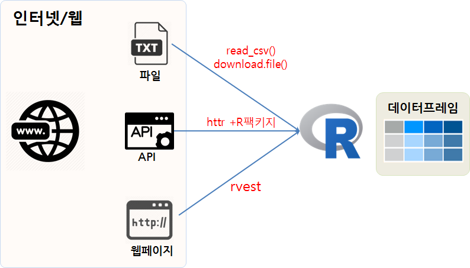

```{r, include=FALSE}
source("tools/chunk-options.R")
knitr::opts_chunk$set(echo=TRUE, message=FALSE, warning=FALSE)

library(tidyverse)
library(WikipediR)
library(httr)
library(stringr)
library(lubridate)
library(xml2)
library(config)
library(leaflet)
library(ggthemes)
library(extrafont)
# font_import(pattern = 'Nanum')
loadfonts()

```

## 1. 웹에서 구할 수 있는 데이터 [^webcrawling-law]{#webdata}

[^webcrawling-law]: [ZDNet, 2017-09-27, "경쟁사 웹사이트 무단 크롤링은 데이터베이스권 침해"](http://www.zdnet.co.kr/news/news_view.asp?artice_id=20170927180839)

웹에서 구할 수 있는 데이터는 형태가 다양하다. 파일형태로 지정된 것부터 시작해서 로그인을 하고 들어가서
스크래핑(Scraping)해서 가져와야 되는 것까지 정보도 많지만 다양한 기술도 필요하다.
결국 데이터를 분석하기 위해서는 R 데이터프레임으로 변환을 시켜야 한다. 
하지만, 인터넷에 널려있는 데이터는 크게 3가지 범주로 나눠볼 수 있다.

- 파일: `.csv`, `.xlsx`, `.zip`, ...
- 웹 API: JSON, XML
- 웹페이지: html 



파일형태 인터넷 데이터를 R로 가져오는 방법은 `read_csv()`, `read_delim()` 함수를 활용하는 방법이 있는데,
파일이 큰 경우 중간에 네트워크 장애등으로 날아갈 수 있음으로 안전하게 `download.file()` 함수로 파일을 
작업 컴퓨터에 저장한 후에 작업을 수행한다. 통상적으로 `download.file()` 함수를 사용하는 경우 
파일크기가 커서 압축되어 있는 경우가 대부분이다. 이런 경우 `unzip()` 등 압축을 풀어 R 데이터프레임으로 가져온다.

웹 API를 통해 데이터를 가져오는 경우는 `httr` 팩키지의 기본 `GET()`, `POST()`함수가 바탕이 되는데 통상 
각 API에 대응되는 R 팩키지가 개발되어 있는 경우가 많아 개발자가 아니면 굳이 웹 API에서 바로 받는 코드를 작성할 필요는 없고,
대신에 CRAN, GitHub 등에서 팩키지를 설치하고 사용한다. Google Vision API에 대응되는 `RoogleVision`,
Open Weather Map API에 대응되는 ROpenWeatherMap 등 수많은 API 대응 R팩키지가 존재한다.

웹페이지만 공개된 경우 크롤링(crawling)을 통해서 데이터를 가져와야하는데 `rvest`를 통해서 기본적인 웹프로그래밍 지식을 바탕으로
필요한 정보만을 추출하여 R 데이터프레임으로 변환하여 작업을 수행한다.

| 데이터 형태 |     파일 자료 형태        |         R 함수/팩키지           |
|-------------|---------------------------|---------------------------------|
| 파일        |  `.csv`, `.xlsx`, `.zip`, | `read_csv()`, `download.file()` |
| 웹 API      |         JSON, XML         | `httr` + API 대응 R 팩키지      | 
| 웹페이지    |           html            |            `rvest`              |

## 2. 파일 데이터 가져오기 [^download-and-unzip] {#webdata-file}

[^download-and-unzip]: [Downloading, extracting and reading files in R](http://hydroecology.net/downloading-extracting-and-reading-files-in-r/)

[https://vincentarelbundock.github.io/Rdatasets/datasets.html](https://vincentarelbundock.github.io/Rdatasets/datasets.html)
웹사이트에 가장 많이 활발히 사용되는 데이터셋이 인터넷에 공개되어 있다.
이런 데이터를 마우스 우클릭하지 않고 바로 데이터 분석 작업을 수행하는 
R 데이터프레임으로 가져오는 방법은 다음과 같다.

`tidyverse` 팩키지를 설치하면 `read_csv()` 함수를 활용하여 해당 `url`을 인자로 넣어주면 
웹서버에 저장된 데이터를 로컬 작업 컴퓨터에 가져오게 된다.

``` {r import-web-file}
# 1. CSV 파일 가져오기 -----------------------------------------
# library(tidyverse)

iris_df <- read_csv("https://raw.github.com/vincentarelbundock/Rdatasets/master/csv/datasets/iris.csv")
head(iris_df)
```

웹 파일이 중소규모 데이터를 가져올 때 `read_csv` 함수가 적합하고, 파일이 큰 경우 대부분 압축되어 있어
우선 `download.file()` 함수로 로컬 파일로 가져오고 나서, `unzip` 함수를 통해 압축을 풀어 분석작업을 이어나간다.

``` {r import-web-compressed-file}
# 2. 압축파일 다운로드 후 가져오기 -----------------------------------------

activity_url <- "https://github.com/rdpeng/RepData_PeerAssessment1/raw/master/activity.zip"
download.file(activity_url, destfile = "data/activity.zip", method = "libcurl", mode = "wb")

# 압축파일 내부 첫번째 파일명 
fname <- unzip(zipfile = "data/activity.zip", list=TRUE)$Name[1]

unzip(zipfile="data/activity.zip", exdir="data", files="activity.csv", overwrite=TRUE)
activity_df <- read_csv("data/activity.csv")
head(activity_df)
```

## 3. 웹 API {#webdata-webapi}

### 3.1. 공개 웹 API {#webdata-webapi-wikipedia}

웹페이지 정보를 API 형태로 제공할 경우 오남용하는 경우가 많다. 
그래서 인증키 `api_key`, `token`을 발행하여 인증키를 갖고 있는 사용자만 웹 API를 통해 
데이터에 대한 접근을 허용하는 경우도 많지만, 위키백과사전과 같이 
인증키 조차도 필요없이 데이터를 제공하는 경우도 많다. 

앞서 언급했듯이 인기 있는 대부분의 API는 R 팩키지를 통해서 제공되는 경우가 많아 
API로 데이터를 바로 받아오는 것보다 API를 팩키지화한 것을 R에서 설치하여 활용하는 것이 
경우에 따라서는 더 유용하다.

[WikipediR: A MediaWiki API Wrapper](https://cran.r-project.org/web/packages/WikipediR/)은 
위키백과사전에서 제공하는 API를 통해 R에서 바로 데이터를 가져올 수 있도록 지원하고 있다.
`devtools::install_github("Ironholds/WikipediR")` 명령어로 설치를 하고 나서, 
예를 들어 **통계학** 이라는 검색어로 백과사전을 검색하게 되면 통계학에 대한 페이지 정보를 
포함하여 어느 범주에 포함되어 있고, 통계학을 역참조한 링크는 무엇이며 통계학 페이지 내부에 
포함된 링크를 포함하여 다양한 정보를 확인할 수 있다.


### 3.1. 공개 웹 API {#webdata-webapi-wikipedia}

``` {r web-api}
# 1. 팩키지 설치 및 환경설정 ----------------------
# devtools::install_github("Ironholds/WikipediR")
# library(WikipediR)

# 2. 위키사전 API 활용 ----------------------------
## 2.1. 통계학 위키 페이지 정보
stat_page_metadata <- page_info("ko","wikipedia", page = "통계학")
listviewer::jsonedit(stat_page_metadata)

## 2.2. 통계학 위키 페이지
stat_content <- page_content("ko","wikipedia", page_name = "통계학")
listviewer::jsonedit(stat_content)

## 2.3. 위키 사전 통계학 분류
stat_cats <- categories_in_page("ko", "wikipedia", pages = "통계학")
listviewer::jsonedit(stat_cats)

## 2.4. 위키 사전 통계학 백링크 
stat_backlink <- page_backlinks("ko", "wikipedia", page = "통계학")
listviewer::jsonedit(stat_backlink)

## 2.5. 위키 사전 통계학 페이지 내부링크
stat_links <- page_links("ko","wikipedia", page = "통계학")
listviewer::jsonedit(stat_links)

## 2.6. 위키 사전 통계학 페이지 외부링크
stat_external_links <- page_external_links("ko", "wikipedia", page = "통계학")
listviewer::jsonedit(stat_external_links)
```


### 3.2. 공개 웹 API 토큰 {#webdata-webapi-ecos}

한국은행 [ECOS OpenAPI 서비스](https://ecos.bok.or.kr/)는 디렉토리 방식으로 서비스를 제공하고 있다.
대부분 `?` 매개변수를 넘기는 방식과 비교하여 차이가 있고, 2013년 개발된 후 특별히 개선되거나 
활발히 활용되고 있는 것 같아 보이지는 않는다. 

1. `paste` 함수를 사용하여 url을 전체적으로 완성시킨다.
1. `GET` 함수로 ECOS OpenAPI 서비스에서 데이터를 가져온다.
1. `content` 함수로 필요한 데이터를 끄집어 낸다.
1. 데이터프레임으로 변환시킨 후에 분석작업을 수행한다.

``` {r open-api-token}

# 1. 팩키지 설치 및 환경설정 ----------------------
# library(httr)
# library(ggthemes)
# library(extrafont)
# loadfonts()

# 2. 한국은행 오픈 API ----------------------

base_url <- "http://ecos.bok.or.kr/api/StatisticSearch"
API_KEY <- config::get("bok_key")
data_type <- "json"
country <- "kr"
start_index <- "1"
end_index <- "1000"
statlist <- "010Y002"
cycle_type <- "MM"
start_date <- "201001"
end_date <- "201708"
item_no <- "AAAA11"


ecos_url <- paste(base_url, API_KEY, data_type, country, start_index, end_index, statlist, 
                  cycle_type, start_date, end_date, item_no, sep="/")
  
ecos_res <- GET(ecos_url)  
listviewer::jsonedit(content(ecos_res))

# 3. 한국은행 주요경제지표 시각화 ----------------------

ecos_lst <- content(ecos_res)
ecos_df <- ecos_lst$StatisticSearch$row %>% bind_rows

ecos_df %>% 
  mutate(ddate = lubridate::ymd(paste0(str_sub(TIME,1,4), "-", str_sub(TIME,5,6), "-15")),
         value = as.numeric(DATA_VALUE)) %>% 
  select(ddate, value, STAT_CODE) %>% 
  ggplot(aes(ddate, value, group=STAT_CODE)) +
    geom_line() +
    theme_bw(base_family="NanumGothic") +
    labs(x="", y="화폐발행잔액", title="주요통화금융지표 중 화폐발행잔액",
         subtitle="단위: 십억원") +
    scale_y_continuous(labels = scales::comma)
```

### 3.3. 공개 웹 API 토큰과 GET 모수 {#webdata-webapi-gg-token}

[경기데이터드림 OpenAPI](http://data.gg.go.kr/portal/mainPage.do)를 통해서 경기도 데이터를 공개하여 API를 포함한 형태로 
제공해 주고 있다. 우선, 경기데이터드림 사이트에서 API-KEY를 발급받아 저장한다.
그리고 "물류 창고업체 현황"을 찾아 물류 창고업체 정보를 지리정보와 매핑하여 시각화해보자.
`SIGUN_CD`를 인자로 념겨 "수원시"에 위치한 물류 창고업체 현황정보를 파악해보자.

1. `query_param` 위치에 매개변수로 넘길 값을 리스트로 정리한다.
1. `GET(gg_url, query=query_param)` 명령어로 API 기본주소와 매개변수를 `query`로 넘긴다.
1. `content(logistics)` 명령어를 통해 XML 데이터로 출력값을 받아낸다.
1. `xml2` 팩키지 `xml_find_all()` 함수를 사용해서 `xpath`를 통해 필요한 필드값만 채워낸다.
1. `leaflet`을 통해 시각화한다.


``` {r webdata-gg-get-token}
# 1. 팩키지 설치 및 환경설정 ----------------------
# library(xml2)
# library(config)
# library(leaflet)

sigun_cd_df <- tribble(
~시군코드,	~시군명,
41000,	"경기도",
41110,	"수원시",
41130,	"성남시",
41150,	"의정부시",
41170,	"안양시",
41190,	"부천시",
41210,	"광명시",
41220,	"평택시",
41250,	"동두천시",
41270,	"안산시",
41280,	"고양시",
41290,	"과천시",
41310,	"구리시",
41360,	"남양주시",
41370,	"오산시",
41390,	"시흥시",
41410,	"군포시",
41430,	"의왕시",
41450,	"하남시",
41460,	"용인시",
41480,	"파주시",
41500,	"이천시",
41550,	"안성시",
41570,	"김포시",
41590,	"화성시",
41610,	"광주시",
41630,	"양주시",
41650,	"포천시",
41670,	"여주시",
41800,	"연천군",
41820,	"가평군",
41830,	"양평군")

# 2. 경기도 오픈 API ----------------------
## 2.1. 물류데이터 가져오기 --------------------

API_KEY <- config::get("gg_key")
gg_url <- "http://openapi.gg.go.kr/LogisticsWarehouse"

query_param <- list(
  KEY = API_KEY,
  Type = "xml",
  pIndex = "1",
  pSize = "100",
  SIGUN_CD = "41110"
)
 
logistics <- GET(gg_url, query=query_param)

## 2.2. XML 데이터프레임 변환 --------------------

gg_xml <- content(logistics)

sigun_cd <- xml_find_all(gg_xml, "//SIGUN_CD") %>% xml_text
sigun_nm <- xml_find_all(gg_xml, "//SIGUN_NM") %>% xml_text
bizplc_nm <- xml_find_all(gg_xml, "//BIZPLC_NM") %>% xml_text
emply_cnt <- xml_find_all(gg_xml, "//EMPLY_CNT") %>% xml_text
lon <- xml_find_all(gg_xml, "//REFINE_WGS84_LOGT") %>% xml_text
lat <- xml_find_all(gg_xml, "//REFINE_WGS84_LAT") %>% xml_text

logistics_df <- tibble(sigun_cd = sigun_cd,
                       sigun_nm = sigun_nm,
                       bizplc_nm = bizplc_nm,
                       emply_cnt = emply_cnt,
                       lon = lon,
                       lat = lat)

logistics_df <- logistics_df %>% 
  mutate(lon = as.numeric(lon),
         lat = as.numeric(lat))

# 3. 창고 위치 시각화 --------------------

leaflet(data = logistics_df) %>% 
  addProviderTiles(providers$OpenStreetMap) %>% 
  addMarkers(lng=~lon, lat=~lat, clusterOptions = markerClusterOptions(),
             popup = ~ as.character(paste0("<strong> 물류시설 위치</strong><br><br>",
                                           "&middot; 시군명: ", sigun_nm, "<br>", 
                                           "&middot; 회사명: ", bizplc_nm, "<br>", 
                                           "&middot; 종업원수: ", emply_cnt, "<br>")))
```

## 4. 날씨 예보 {#webdata-webapi-openweather}

R 팩키지 [ROpenWeatherMap: R Interface to OpenWeatherMap API](https://cran.r-project.org/web/packages/ROpenWeatherMap/index.html)를 활용하는 
것도 가능하지만, 직접 [Open Weather Map API](http://openweathermap.org/)에서 데이터를 가져와서 시각화하는 것도 가능하다.
이를 위해서 R 팩키지 사용법과는 별도로 일부 HTTP GET/POST에 대한 학습이 추가로 필요하다.

### 4.1. 날씨 예보 도시 하나 {#webdata-webapi-openweather-city}

[Open Weather Map API](http://openweathermap.org/)에서 도시 하나를 선택하여 날씨 정보를 가져온다.
가져온 중첩 JSON/XML 형태 데이터를 리스트 형태 데이터로 변환한 후에 `leaflet`으로 넘겨 
날씨정보를 시각화한다.

``` {r openweather-city, eval=FALSE}
# 0. 환경설정 -----------------------------------
# library(rvest)
# library(httr)

API_KEY <- config::get("weather_key")

# 1. 데이터 가져오기 ----------------------------

query_param <- list(APPID=API_KEY, 
                    q="Seoul,kr",
                    units="metric")

weather_seoul <- GET("http://api.openweathermap.org/data/2.5/weather", query=query_param,
                     user_agent("kwangchun.lee.7@gmail.com studying..."))

weather_seoul_lst <- content(weather_seoul)
listviewer::jsonedit(weather_seoul_lst)

# 2. 데이터프레임 변환 ----------------------------

weather_df <- weather_seoul_lst %>% {
  tibble(
    city = weather_seoul_lst$name,
    lon = weather_seoul_lst$coord$lon,
    lat = weather_seoul_lst$coord$lat,
    temp = weather_seoul_lst$main$temp,
    temp_min = weather_seoul_lst$main$temp_min,
    temp_max = weather_seoul_lst$main$temp_max,
    humidity = weather_seoul_lst$main$humidity,
    speed = weather_seoul_lst$wind$speed,
    deg = weather_seoul_lst$wind$deg
  )
}


# 3. 날씨 시각화 ----------------------------

leaflet(data = weather_df) %>% 
  addProviderTiles(providers$OpenStreetMap) %>% 
  addMarkers(lng=~lon, lat=~lat, clusterOptions = markerClusterOptions(),
             popup = ~ as.character(paste0("<strong> 날씨 예보</strong><br><br>",
                                           "&middot; 시군명: ", city, "<br>", 
                                           "&middot; 평균온도: ", temp, " 도<br>",
                                           "&middot; 최저온도: ", temp_min, " 도<br>", 
                                           "&middot; 최고온도: ", temp_max, " 도<br>",
                                           "&middot; 바람속도: ", speed, " m/s<br>", 
                                           "&middot; 풍향: ", deg, " 도 <br>", 
                                           "&middot; 습도: ", humidity, " % <br>")))
```

### 4.2. 날씨 예보 도시 여러개 {#webdata-webapi-openweather-cities}

도시를 하나 시각화 했으면... 도시를 여러개 가져와야 한다.
리스트 하나가 아닌 여러 도시를 리스트에 묶는 과정이 추가로 필요하고 입수한 데이터를 다시 풀어 
데이터프레임으로 변환하여 `leaflet`으로 시각화한다.

``` {r openweather-cities, eval=FALSE}
# 0. 환경설정 -----------------------------------

API_KEY <- config::get("weather_key")

# 1. 데이터 가져오기 ----------------------------

weather_lst <- list()

cities <- c("Seoul,kr", "Pusan,kr", "Sokcho,kr", "Daejeon,kr", "Daegu,kr")

for(city in cities) {
  query_param <- list(APPID=API_KEY, 
                      q=city,
                      units="metric")
  
  city_weather_lst <- GET("http://api.openweathermap.org/data/2.5/weather", query=query_param,
                  user_agent("kwangchun.lee.7@gmail.com studying..."))
  weather_lst[[city]] <- city_weather_lst 
}

weather_content_lst <- map(weather_lst, content)

listviewer::jsonedit(weather_content_lst)

# 2. 데이터프레임 변환 ----------------------------

weather_df <- weather_content_lst %>% {
  tibble(
    city = weather_content_lst$name,
    lon = weather_content_lst$coord$lon,
    lat = weather_content_lst$coord$lat,
    temp = weather_content_lst$main$temp,
    temp_min = weather_content_lst$main$temp_min,
    temp_max = weather_content_lst$main$temp_max,
    humidity = weather_content_lst$main$humidity,
    speed = weather_content_lst$wind$speed,
    deg = weather_content_lst$wind$deg
  )
}

name_df <- map(weather_content_lst, `[`, "name") %>% flatten %>% unlist %>% tibble
names(name_df) <- "city_name"
lon_df <- map(weather_content_lst, `[`, "coord") %>% flatten %>% map(., `[`, "lon") %>% unlist %>% tibble
names(lon_df) <- "lon"
lat_df <- map(weather_content_lst, `[`, "coord") %>% flatten %>% map(., `[`, "lat") %>% unlist %>% tibble
names(lat_df) <- "lat"
temp_df <- map(weather_content_lst, `[`, "main") %>% flatten %>% map(., `[`, "temp") %>% unlist %>% tibble
names(temp_df) <- "temp"
temp_min_df <- map(weather_content_lst, `[`, "main") %>% flatten %>% map(., `[`, "temp_min") %>% unlist %>% tibble
names(temp_min_df) <- "temp_min"
temp_max_df <- map(weather_content_lst, `[`, "main") %>% flatten %>% map(., `[`, "temp_max") %>% unlist %>% tibble
names(temp_max_df) <- "temp_max"
humidity_df <- map(weather_content_lst, `[`, "main") %>% flatten %>% map(., `[`, "humidity") %>% unlist %>% tibble
names(humidity_df) <- "humidity"
speed_df <- map(weather_content_lst, `[`, "wind") %>% flatten %>% map(., `[`, "speed") %>% unlist %>% tibble
names(speed_df) <- "speed"
deg_df <- map(weather_content_lst, `[`, "wind") %>% flatten %>% map(., `[`, "deg") %>% unlist %>% tibble
names(deg_df) <- "deg"

weather_df <- bind_cols(name_df, lon_df, lat_df, temp_df, temp_min_df, temp_max_df, humidity_df, speed_df, deg_df)

# 3. 날씨 시각화 ----------------------------

leaflet(data = weather_df) %>% 
  addProviderTiles(providers$OpenStreetMap) %>% 
  addMarkers(lng=~lon, lat=~lat, clusterOptions = markerClusterOptions(),
             popup = ~ as.character(paste0("<strong> 날씨 예보</strong><br><br>",
                                           "&middot; 시군명: ", city, "<br>", 
                                           "&middot; 평균온도: ", temp, " 도<br>",
                                           "&middot; 최저온도: ", temp_min, " 도<br>", 
                                           "&middot; 최고온도: ", temp_max, " 도<br>",
                                           "&middot; 바람속도: ", speed, " m/s<br>", 
                                           "&middot; 풍향: ", deg, " 각도<br>", 
                                           "&middot; 습도: ", humidity, " % <br>")))
```


