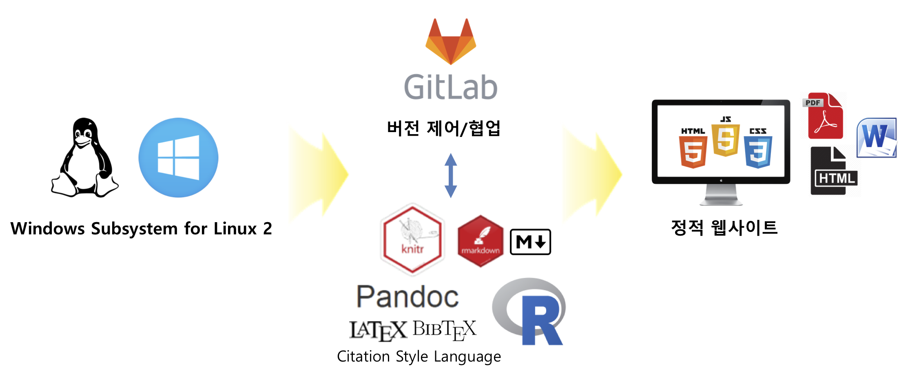
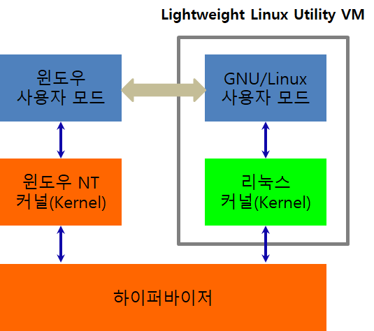
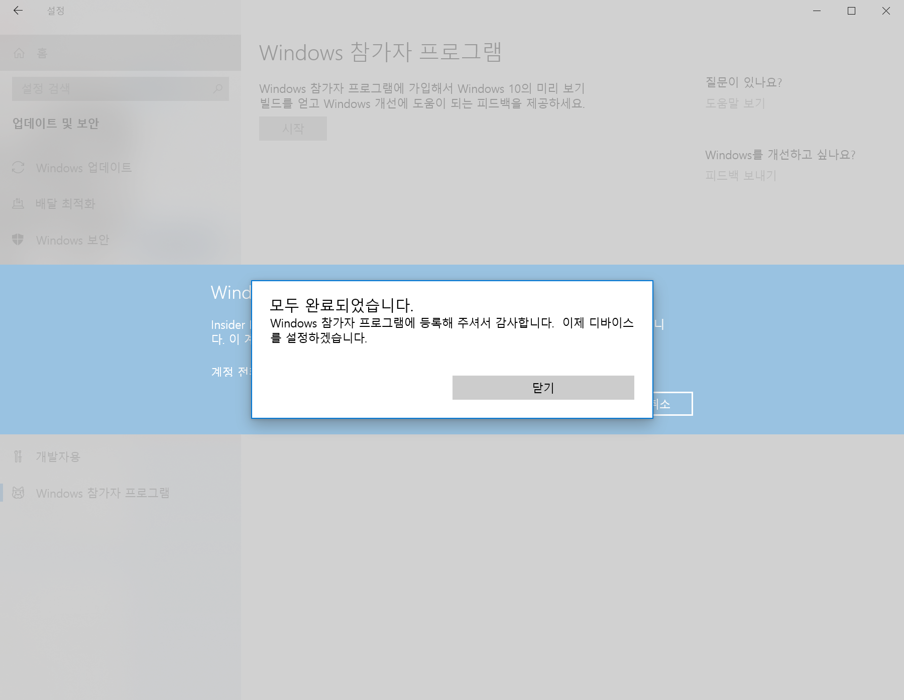
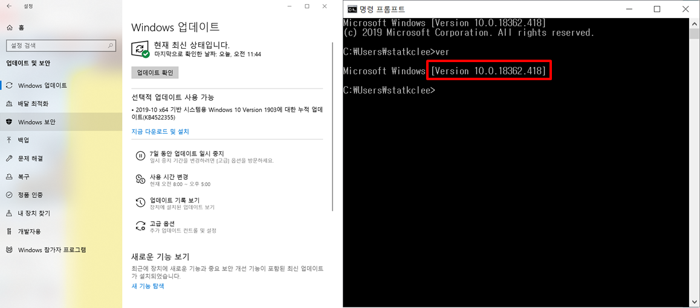
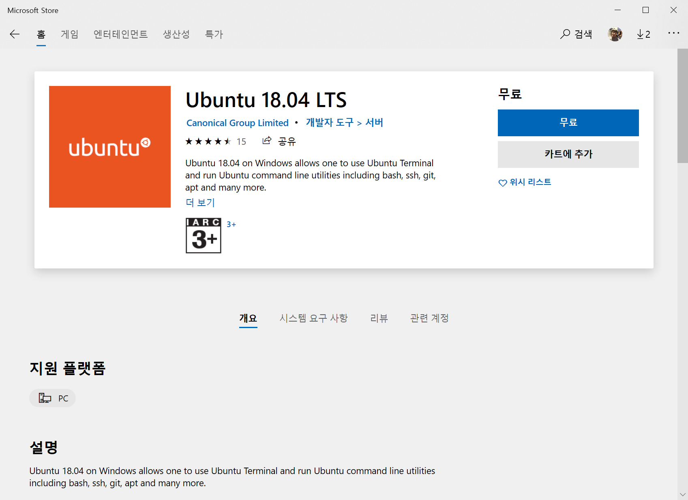
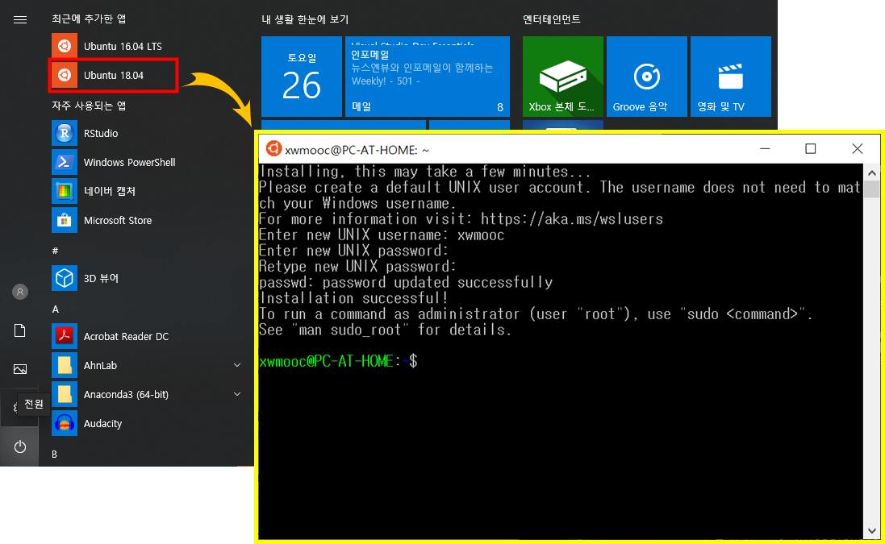

```{r, include=FALSE}
knitr::opts_chunk$set(echo = TRUE, warning=FALSE, message=FALSE,
                    comment="", digits = 3, tidy = FALSE, prompt = FALSE, fig.align = 'center')

library(tidyverse)
```


> * 한글 윈도우 10에서 데이터 과학을 위한 개발자 환경을 설정한다.
> * 윈도우 10 WSL(Windows Subsystem for Linux) 2 우분투 배쉬를 설치하낟.
> * 버전제어 및 개발구성요소인 Gitlab을 설치한다.
> * R마크다운으로 정적 웹사이트를 구축한다.

{#id .class width="100%"}

# WSL 2 [^wsl2] {#windows-setup-wsl2}

[^wsl2]: ["리눅스에 대한 마이크로소프트의 사랑", WSL 2의 이해와 시작하기](http://www.itworld.co.kr/news/127776)

윈도우 10에 WSL이 버전업이 되면서 WSL 2가 도입되면서 속도가 대폭 향상되었다. 이를 마이크로소프트 빌드(Build) 2019 컨퍼러스에서 처음 소개했다.
기존 WSL 1이 리눅스 시스템 호출을 윈도우에서 번역했다면, WSL 2는 윈도우 자체 커널과 함께 실행되는 리눅스 커널로 발전시켰다는 평가를 받고 있다. 
WSL 2를 정의하는 두가지 기능이 있다.

- 마이크로소프트가 윈도우의 격리 계층으로 하이퍼-V 가상화 툴을 사용하는 데 초점을 두면서 하이퍼-V를 범용 하이퍼바이저 서비스로 만들고 있다는 점.
- 도커, LCOW라고 하는 윈도우 리눅스 컨테이너(Linux Containers on Windows)와의 긴밀하게 연관된 협업.

{#id .class width="57%"}

# WSL 설치 {#windows-setup}

## WSL 1 설치 {#windows-setup-wsl-install}

WSL 1 우분투 배쉬를 윈도우 10에 설치하기 위한 최소 환경은 다음과 같습니다.

- Windows 10 Anniversary Edition – Build 14316, (2016/4/6 이후, Insider Fast Ring 버전으로 설치 가능)
- 64 비트 운영체제 (설정 &rarr; 시스템 &rarr; 정보, Settings &rarr; System &rarr; About)

<style>
div.blue { background-color:#e6f0ff; border-radius: 5px; padding: 10px;}
</style>
<div class = "blue">

**빌드번호가 14316 보다 낮은 경우**

> 아래 두가지 방법 중 잘되는 것으로 진행: 윈도우즈 업데이트 기능 혹은 윈도우 10 기념 업데이터 버젼을 다운로드하여 설치
> 
> - 업데이트 정보를 확인하신 후 고급 설정 메뉴에서 Fast Track 여부 확인 (설정 &rarr; 업데이트 및 복구 &rarr; 고급옵션 &rarr; ..., Update and Recovery &rarr; Advanced option &rarr; Fast Track로 설정)
> - [About the Windows 10 Anniversary Update, "Get the Anniversay Update now"](https://support.microsoft.com/en-us/help/12387/windows-10-update-history) 다운로드하여 설치

</div>


## WSL 1: 우분투 배쉬 설치 [^windows-bash-install] {#wsl-1}

[^windows-bash-install]: [윈도우 10에서 Bash shell 지원](https://blogs.msdn.microsoft.com/eva/?p=7633)

## 개발자 모드 설정 {#wsl-dev-mode}

설정 &rarr; 업데이트 및 복구 &rarr; 개발자용 (Settings &rarr; Update & Security &rarr; For developers) 으로 들어가서 **개발자 모드(Developer Mode)**를 활성화 시킨다.
64비트 운영체제가 아니거나 빌드번호가 14316이 아닌 경우 개발자 모드가 활성화 되지 않는다.

개발자 모드를 선택하게 되면 부팅을 새로해야 한다.


## Windows Subsystem for Linux 기능 활성화 {#wsl-linux}

개발자 모드로 부팅을 새로하게 되면 `Turn Windows features on or off`에서 `Windows Subsystem for Linux (beta)`을 선택할 수 있게 된다.
제어판 &rarr; 프로그램 &rarr; 프로그램 및 기능 &rarr; Windows 기능 켜기/끄기 를 선택한다.

영어명으로 `Windows Subsystem for Linux (beta)`이 `Linux용 Windows 하위 시스템(베타)`로 명칭 바뀌면서 순서가 조정되었으니 활성화 시킬 때 주의해서 잘 찾도록 한다.


## 명령 프롬프트 창에서 bash 실행 {#wsl-bash}

이제 나름 어려운 설정은 모두 마무리 되었으니 명령 프롬프트 열고 bash를 실행한다. 사용자명과 더불어 비밀번호를 등록한다.


## 바로가가 배쉬 아이콘 생성 {#wsl-icon}

[How to Install and Use the Linux Bash Shell on Windows 10](http://www.howtogeek.com/249966/how-to-install-and-use-the-linux-bash-shell-on-windows-10/) 같은 외국 블로그를 보면 2.3 과정까지 마치게 되면 시작 메뉴에 `Bash on Ubuntu on Windows` 아이콘이 생성되는데 한글 윈도우 10에서 나타나지 않아 구글링을 통해 이유를 알아낼 수 있었다.


`C:\Users\<사용자명>\AppData\Roaming\Microsoft\Windows\Start Menu\Programs> 아래 **Windows.lnk의 Ubuntu에 대한 Bash** 파일이 존재한다. 
즉, 번역결과가 잘못 윈도우 시스템에 반영되면서 생겨난 오류로 판단된다. 이를 수정하는 방식은 파일명을 다음과 같이 수정하면 된다.

**Windows.lnk의 Ubuntu에 대한 Bash** &rarr; **Bash 윈도우 우분투.lnk**

확장자만 `.lnk`로 맞춰주면 시작화면에 정상적으로 아이콘이 등록된다.


# WSL 2 설치 {#windows-setup-wsl2-first}

WSL 2 우분투 배쉬를 윈도우 10에 설치하기 위한 최소 환경은 다음과 같습니다. [^lesstif]

[^lesstif]: [정광섭, "WSL 2(Windows Subsystem For Linux 2) 사용하기"](https://www.lesstif.com/pages/viewpage.action?pageId=71401661)

- "Windows 참가자 프로그램"에 참여한 후에 "참가자 설정 선택"해야 가능함.
    - 불안정하기 때문에 잘 죽는데요!!!
- 빌드번호 Build 18917 을 다운로드 설치 후 재시작
    - `cmd`  윈도우 터미널에서 `ver` 명령어로 확인
- WSL 2는 경량화된 Hyper-V 를 통해 구동되므로 "가상 머신 플랫폼" 을 활성화
    - 즉, [Hyper-V 가상화](https://www.thomasmaurer.ch/2017/08/install-hyper-v-on-windows-10-using-powershell/)를 활성화시켜야 한다.

## `Windows` 참가자 프로그램 {#windows-program}

제어판에서 "Windows 참가자 프로그램"에 참여하면 WSL 2를 설치할 사전준비가 된 것이다.

{#id .class width="77%"}

## `Windows` 업데이터 {#windows-program-update}

제어판에서 "Windows 업데이트"로 가서 업데이터를 실행시킨다.
이를 통해서 기존 빌드번호 각자 다를 수 있지만 예를 들어, 18362 에서 18917 이후 빌드번호를 확인할 수 있다.

윈도우 터미널(`cmd`)를 열고 `ver` 명령어를 타이핑하여 빌드번호가 바뀐 것을 확인한다.

{#id .class width="77%"}

## `Virtual Machine Platform` 활성화 후 리눅스 설치 {#windows-wsl-activate}

파워쉘에서 `Enable-WindowsOptionalFeature` 명령어로 `Microsoft-Windows-Subsystem-Linux` 활성화 시킨 후에 리눅스 배포판을 "Microsoft Store" 혹은 직접 웹사이트에서 리눅스 배포판을 다운로드 받아 설치한다. `Enable-WindowsOptionalFeature` 명령어를 실행시킬 경우 항상 **관리자 권한**으로 파워셀을 여는 것을 잊지 않는다.

```{r powershell, eval=FALSE}
PS C:\WINDOWS\system32> Enable-WindowsOptionalFeature -Online -FeatureName Microsoft-Windows-Subsystem-Linux
```

"Microsoft Store"를 열고 "ubuntu" 검색어를 넣으면 다양한 배포판을 확인할 수 있고 이를 다운로드 받아 설치한다.

{#id .class width="57%"}

회사 방화벽 등 막힌 경우는 [Linux 배포판 패키지에 대 한 Windows 하위 시스템 수동으로 다운로드](https://docs.microsoft.com/ko-kr/windows/wsl/install-manual)를 참조하여 설치한다.

`Invoke-WebRequest` 명령어로 `https://aka.ms/wsl-ubuntu-1804`을 서버에서 다운로드 받아 `Ubuntu.appx` 파일명으로 저장시킨다.
그리고 나서, `Add-AppxPackage .\Ubuntu.appx` 명령어로 설치를 해준다.

```{r install-ubuntu-lts, eval=FALSE}
PS C:\WINDOWS\system32> Invoke-WebRequest -Uri https://aka.ms/wsl-ubuntu-1804 -OutFile Ubuntu.appx -UseBasicParsing

PS C:\WINDOWS\system32> Add-AppxPackage .\Ubuntu.appx
```

마지막으로 설치된 리눅스를 완료하는 과정을 거치면 된다. [^complete-install-process]

[^complete-install-process]: [Initializing a newly installed distro](https://docs.microsoft.com/en-us/windows/wsl/initialize-distro)

{#id .class width="77%"}

## `wsl` 기본명령어 {#windows-wsl-activate-command}

`wsl` 기본명령어를 통해서 윈도우에서 리눅스를 사용해보자.

```{r basic-wsl-commands, eval=FALSE}
PS C:\> wsl -l # 설치된 하위 시스템 확인
Linux 배포용 Windows 하위 시스템:
Ubuntu-18.04(기본값)
Ubuntu-16.04
PS C:\> wsl --set-version Ubuntu-16.04  2 # 하위 시스템 변환
```

## 우분투 배쉬쉘 {#windows-wsl-activate-command-bash}

`wsl` 명령어를 실행시키면 기본 설정된 리눅스 배포판으로 들어가게 된다. 그 후 `sudo apt-get` 등 명령어로 리눅스를 사용할 수 있게 된다.

```{r wsl-linux, eval = FALSE}
PS C:\WINDOWS\system32> wsl
To run a command as administrator (user "root"), use "sudo <command>".
See "man sudo_root" for details.

tidyverse@PC-AT-HOME:/mnt/c/WINDOWS/system32$ whoami
tidyverse
```

