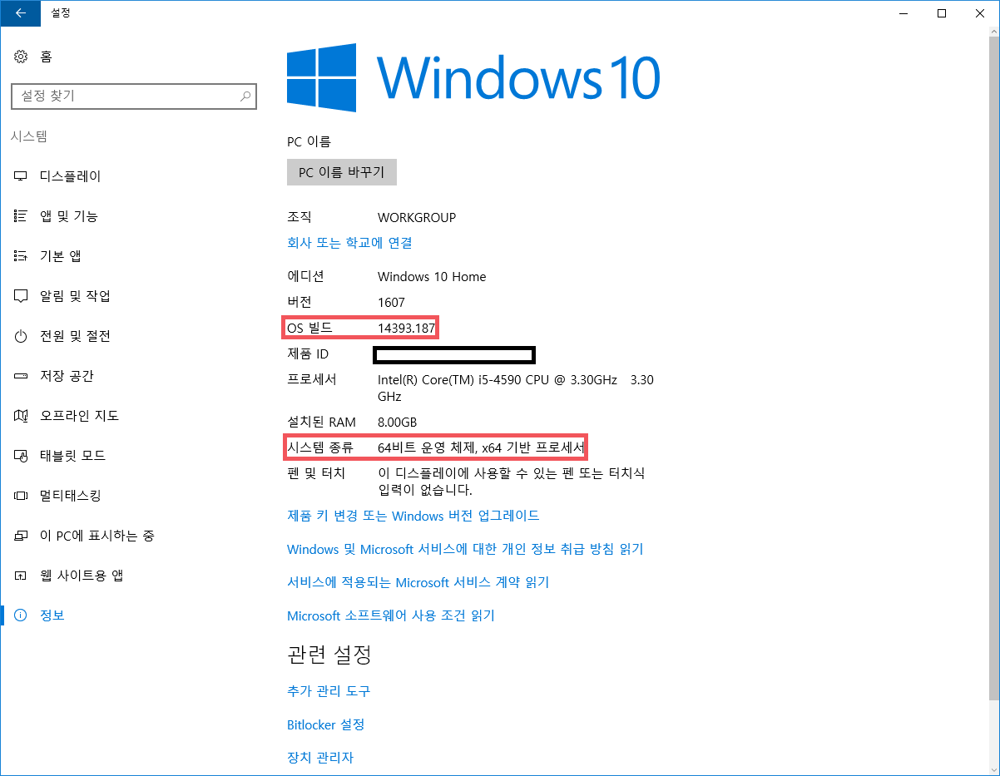
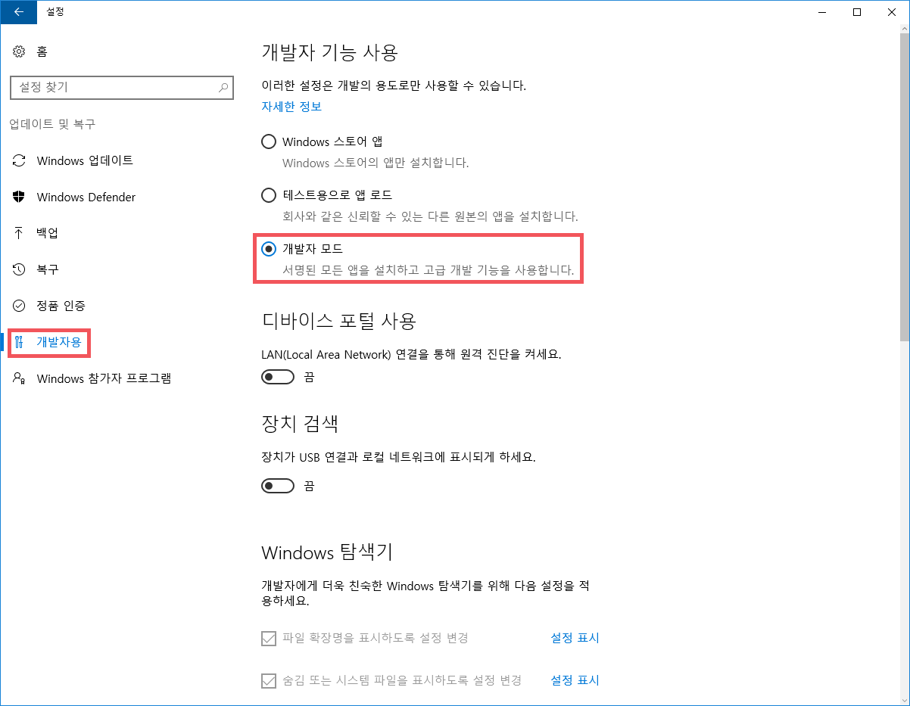
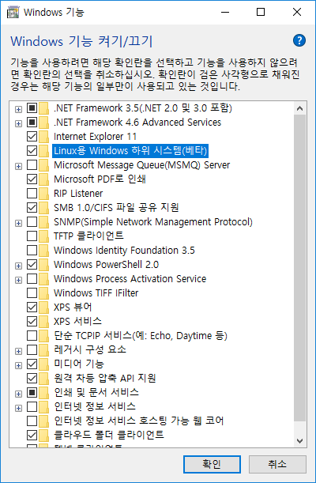
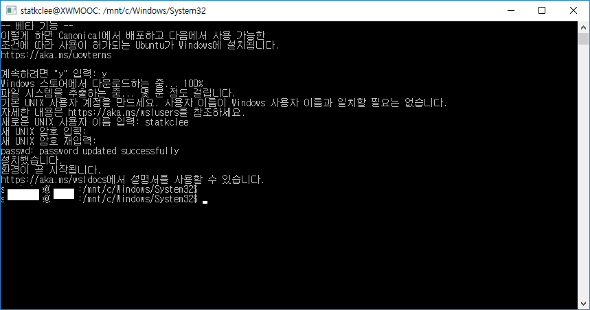
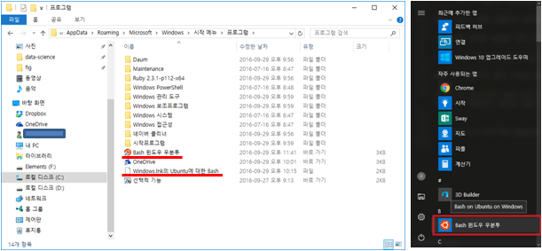

> ## 학습 목표 {.objectives}
>
> * 한글 윈도우 10에서 데이터 과학을 위한 개발자 환경을 설정한다.
> * 윈도우 10 기념 업데이터에서 지원되기 시작한 우분투 배쉬를 즐겨본다.

### 1. 윈도우 10 설치 환경 점검

우분투 배쉬를 윈도우 10에 설치하기 위한 최소 환경은 다음과 같습니다.

- Windows 10 Anniversary Edition – Build 14316, (2016/4/6 이후, Insider Fast Ring 버전으로 설치 가능)
- 64 비트 운영체제 (설정 &rarr; 시스템 &rarr; 정보, Settings &rarr; System &rarr; About)

> ### 빌드번호가 14316 보다 낮은 경우 {.callout}
>
> 아래 두가지 방법 중 잘되는 것으로 진행: 윈도우즈 업데이트 기능 혹은 윈도우 10 기념 업데이터 버젼을 다운로드하여 설치
> 
> - 업데이트 정보를 확인하신 후 고급 설정 메뉴에서 Fast Track 여부 확인 (설정 &rarr; 업데이트 및 복구 &rarr; 고급옵션 &rarr; ..., Update and Recovery &rarr; Advanced option &rarr; Fast Track로 설정)
> - [About the Windows 10 Anniversary Update, "Get the Anniversay Update now"](https://support.microsoft.com/en-us/help/12387/windows-10-update-history) 다운로드하여 설치

### 2. 윈도우 10 환경 우분투 배쉬 설치 [^windows-bash-install]

[^windows-bash-install]: [윈도우 10에서 Bash shell 지원](https://blogs.msdn.microsoft.com/eva/?p=7633)

#### 2.1. 개발자 모드 설정

설정 &rarr; 업데이트 및 복구 &rarr; 개발자용 (Settings &rarr; Update & Security &rarr; For developers) 으로 들어가서 **개발자 모드(Developer Mode)**를 활성화 시킨다.
64비트 운영체제가 아니거나 빌드번호가 14316이 아닌 경우 개발자 모드가 활성화 되지 않는다.

개발자 모드를 선택하게 되면 부팅을 새로해야 한다.

#### 2.2. Windows Subsystem for Linux 기능 활성화

개발자 모드로 부팅을 새로하게 되면 `Turn Windows features on or off`에서 `Windows Subsystem for Linux (beta)`을 선택할 수 있게 된다.
제어판 &rarr; 프로그램 &rarr; 프로그램 및 기능 &rarr; Windows 기능 켜기/끄기 를 선택한다.

영어명으로 `Windows Subsystem for Linux (beta)`이 `Linux용 Windows 하위 시스템(베타)`로 명칭 바뀌면서 순서가 조정되었으니 활성화 시킬 때 주의해서 잘 찾도록 한다.

#### 2.3. 명령 프롬프트 창에서 bash 실행

이제 나름 어려운 설정은 모두 마무리 되었으니 명령 프롬프트 열고 bash를 실행한다. 사용자명과 더불어 비밀번호를 등록한다.

### 3. 바로가가 배쉬 아이콘 생성

[How to Install and Use the Linux Bash Shell on Windows 10](http://www.howtogeek.com/249966/how-to-install-and-use-the-linux-bash-shell-on-windows-10/) 같은 외국 블로그를 보면 2.3 과정까지 마치게 되면 시작 메뉴에 `Bash on Ubuntu on Windows` 아이콘이 생성되는데 한글 윈도우 10에서 나타나지 않아 구글링을 통해 이유를 알아낼 수 있었다.

`C:\Users\<사용자명>\AppData\Roaming\Microsoft\Windows\Start Menu\Programs> 아래 **Windows.lnk의 Ubuntu에 대한 Bash** 파일이 존재한다. 
즉, 번역결과가 잘못 윈도우 시스템에 반영되면서 생겨난 오류로 판단된다. 이를 수정하는 방식은 파일명을 다음과 같이 수정하면 된다.

**Windows.lnk의 Ubuntu에 대한 Bash** &rarr; **Bash 윈도우 우분투.lnk**

확장자만 `.lnk`로 맞춰주면 시작화면에 정상적으로 아이콘이 등록된다.

