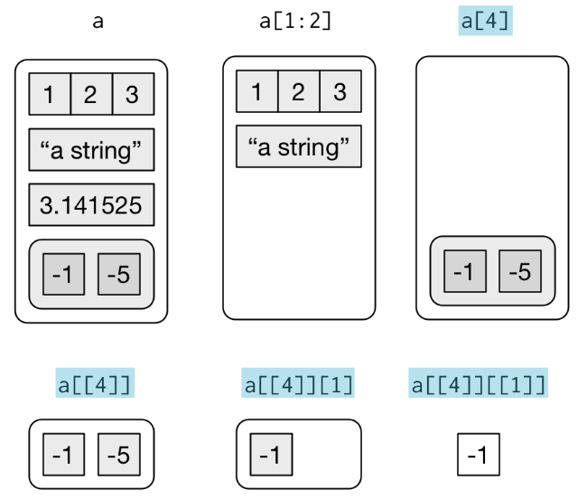

```{r, include=FALSE}
source("tools/chunk-options.R")
```

> ## 학습 목표 {.objectives}
>
> * R 프로그래밍 모범사례를 살펴본다.
> * R 함수 작성방법을 이해한다.
> * R 언어 자료구조를 이해한다.

### 1. R 프로그래밍 모범 사례

[Martin Maechler](http://datascience.la/martin-maechler-invited-talk-at-user-2014-good-practices-in-r-programming/) useR 2014 컨퍼런스에서 "Good Practice in R Programming" 주제로 발표를 했습니다.  

- **Rule 1.** Work with source files !  
    - 원본 소스 파일(R Script) 작업하고 이를 통해 객체나 바이너리 산출물 생성로 일원화  
    - Emacs + ESS(Emacs Speacks Statistics) 혹은 Rstudio 같은 IDE(Integrated Development Environment) 사용

- **Rule 2.** Keep R source well-readable and maintainable
    - 가독성이 뛰어난 소스 코드는 나중에 유지 보수하기 좋다.
    - 들여쓰기(identation), 공백, 70~80 칼럼, 주석처리(하나(``#``)는 코드 끝에, 두개(``##``)는 일반 주석, 세개(``###``)는 코드 블록에 사용)
    - Sweave 혹은 knitr을 사용한다.
    - naming convention을 따른다.

- **Rule 3.** Do read the documentation
    - R 프로그래밍 책을 읽는다.화 V&R "S Programming"
    - R 매뉴얼 참조 : An introduction to R, Writing R extentions
    - R 패키지 Vignettes
    - help.search()
- **Rule 4.** Do learn from the masters
    - John Chambers, Bill Venables, Bill Dunlap, Luke Tierney, Brian Riply, R-core team, Dirk Eddelbuettel, Hadley Wickham
    - 다른 사람이 작성한 코드를 읽고 배운다. 일종의 Learning by examples.
    - 부활절 달걀(Easter egg)를 찾아라.
    - [Uwe Ligges, "R Help Desk", The Newsletter of the R Project Volume 6/4, October 2006](http://www.r-project.org/doc/Rnews/Rnews_2006-4.pdf)
    
~~~ {.input}
> anybody ? there ???
+ ?
+ ''
~~~

~~~ {.output}
Contacting Delphi...the oracle is unavailable.
We apologize for any inconvenience.
~~~

- **Rule 5.** Do not Copy and Paste!
    - 이유는 유지보수성이 좋지 않고 복사하면 확장성, 이식성이 떨어진다.
    - 함수(function)을 작성하고, 큰 함수는 잘게 쪼개 작은 함수로 나누어 작성하고, 함수를 사용한다. 

> #### John Chambers {.callout}
>
> Everything that **exists** is an object;  
> Everything that **happens** is a function call.

- **Rule 6.** Strive for clarity and simplicity
    - 자기설명가능한 변수명 사용하고, 간결하게 주석을 섞어 작성
    - 모듈방식 작성   

> #### Venables and Ripley {.callout}
>
> ''Refine and polish your code in the same way you would polish your English prose''

- **Rule 7.** Test your code !
    - 단위 테스트, 모듈
    - ``package.skeleteon()``을 통한 패키지 작성: auto-testing, specific testing, documentation.
    - R 패키지 ``tools``의 ``R CMD check`` 사용, Luke Tierney ``codetools`` 사용
    - 단위 테스트 패키지 ``RUnit``, ``testthat`` 사용
    - 테스트 후에 최적화
    - 최적화에 두가지 원칙: 
        * Don't do it unless you need it.
        * Measure, don't guess, about the speed
    - ``Rprof()``, ``unix.time()``, ``gc()``, R 패키지 ``rbenchmark``, ``microbenchmark``, ``pdbPROF``.

**새로 추가된 안내지침**  

- **Rule 8.** Maintain R code in **Packages** (extension of "Test!")
- **Rule 9.** Source code management, Git/GitHub, HG
- **Rule 10.** Rscript or R CMD BATCH *.R should "always" work ! -> Reproducible Data Analysis and Research

> #### R 코딩 규칙 {.callout}
> 
> R 코드를 가독성이 좋으며 이해하기 쉽게 일관되게 작성하는 것이 중요하다. 코딩 규칙에 대한 자세한 사항은 [The State of > Naming Conventions in R](https://journal.r-project.org/archive/2012-2/RJournal_2012-2_Baaaath.pdf) 참조한다.
> 
> - [Bioconductor’s coding standards](http://wiki.fhcrc.org/bioc/Coding_Standards)
> - [Hadley Wickham’s style guide](http://stat405.had.co.nz/r-style.html)
> - [Google’s R style guide](http://google-styleguide.googlecode.com/svn/trunk/google-r-style.html)
> - [Colin Gillespie’s R style guide](http://csgillespie.wordpress.com/2010/11/23/r-style-guide/)


### 2. 함수 작성

함수를 정의할 때 함수명(`my_fun`)을 먼저 적고 대입 연산자(`<-`)를 작성하고 
예약어 `function` 을 적어 나서 인자(`arg1`, `arg2`)를 정의한다. 그리고 함수 몸통을 적성한다.

``` {r define-fun}
my_fun <- function(arg1, arg2) {
    함수 몸통부분
}
```

예를 들어, 두 수를 더하여 합을 구하는 `add` 함수를 정의해 보자. 함수명 `add`를 적고 나서 
예약어 `function`을 적고 나서 인자 `x`, `y`를 선언한다. 그리고 나서 함수몸통부분에 두 수를 더하는 로직 
`x + y` 를 정의한다. 

``` {r define-add-fun}
add <- function(x, y = 1) {
    x + y
}
```

#### 2.1. 함수 해부

`add` 상기 함수를 `formals`, `body`, `environment` 명령어를 통해 해부할 수 있다. 

``` {r fun-anatomy}
formals(add)

body(add)

environment(add)
```

#### 2.2. 함수 반환값

R에서 명시적으로 `return` 예약어를 사용해서 반환하기도 하지만, `return` 예약어로 명시하지 않는 경우
함수몸통부문 마지막 표현식이 평가되어 반환된다.

``` {r fun-return}
f <- function(x) {
    if (x < 0) {
        -x
    } else {
        x
    }
}
```

상기 함수 `f`는 숫자를 받아 양수면 양수로, 음수면 양수로 절대값으로 변환하는 함수다.

``` {r fun-return-ex}
f(-5)

f(15)
```

#### 2.3. 함수는 객체다.

함수는 일반 R 객체처럼 다룰 수 있다.

``` {r fun-objects}
mean2 <- mean

mean2(1:10)

function(x) { x + 1 }

(function(x) { x + 1 })(2)
```

`mean` 함수로 `mean2` 객체를 생성시킬 수 있고, 인자를 받아 평균을 계산하고, 이름없는 함수에 인자를 넣어 계산도 가능하다.


### 3. 함수 유효 범위(Scope)

함수 유효범위(Scoping)는 명칭으로 값을 R이 찾는 방법으로 함수 내부에 명칭이 정의하지 않는 경우 한단계 상위 수준에서 R이 자동으로 검색한다.

``` {r fun-scoping}
x <- 2

g <- function() {
    y <- 1
    c(x, y)
}

g()
```

변수명이 함수내부에서 지역적으로 정의되지 않고, 상위 수준에서도 정의되지 않는 경우 오류가 발생된다.

``` {r fun-scoping-error}
rm(x) # 변수 x를 제거

g <- function() {
    y <- 1
    c(x, y)
}

g()
```

유효범위는 값을 찾는 장소를 정의하지만, 시간을 정의하지는 않는다. 

``` {r fun-scoping-where}
f <- function() x

x <- 15
f()

x <- 20
f()
```

변수와 마찬가지로, 검색(lookup)도 함수에 대해 동일하게 적용된다.

``` {r fun-lookup}
l <- function(x) x + 1

m <- function() {
    l <- function(x) x * 2
    l(10)
}

m()
```

함수를 호출할 때마다 새로 시작되는 자체 환경이 새롭게 준비되고, 새로운 환경이 인자값과 함께 제공된다.
객체는 그 자체 환경을 먼저 검색하고 만약, 찾는 것이 없으면 함수가 생성된 환경에서 검색을 재개한다.

``` {r fun-clean-env}
j <- function() {
    if (!exists("a")) {
        a <- 1
    } else {
        a <- a + 1
    }
        print(a)
}

j()

j()

a
```

### 4. 자료구조

6가지 **원자 벡터** 와 리스트가 자료구조로 R에 존재한다.
원자벡터는 `logical`, `integer`, `double`, `character`, `complex`, `raw` 가 있고, 자료가 모두 동일해야 한다.
반면에 리스트는 이질적인 원자벡터를 포함할 수 있다.

#### 4.1. 결측값

* `NULL`: 벡터가 존재하지 않는 경우를 표현하는데 사용된다.
* `NA`: 벡터에 빠진 값을 표현하는데 사용된다.

``` {r missing-values}
typeof(NULL)
length(NULL)

typeof(NA)
length(NA)
```

벡터 내부에 `NA` 가 존재하는 경우 `is.na` 함수를 통해 검출가능하다.

``` {r na-vector}
x <- c(1, 2, 3, NA, 5)

x

is.na(x)
```

#### 4.2. `NA`는 전염된다.

``` {r na-contagious}
NA + 10

NA / 2

NA > 5

10 == NA

NA == NA
```

#### 4.3. 리스트

리스트는 다른 형태 객체를 담을 수 있다는 점에서 유용한데, 복잡하게 반환되는 객체는 거의 리스트다. 예를 들어 회귀분석, `lm()` 에서 반환되는 객체를 살펴보면 쉽게 이해된다.

`list()` 함수로 리스트를 생성하고, `[`, `[[`, `$` 을 통해 부분집합을 뽑아낸다.

* `[`: 리스트가 포함한 하위 리스트를 뽑아낸다.
* `[[`, `$`: 원소를 추출하고, 계층구조 수준을 한단계 제거한다.

``` {r list-subset}
a <- list(
    a = 1:3,
    b = "a string",
    c = pi,
    d = list(-1, -5)
)

str(a[4])

str(a[[4]])
```




