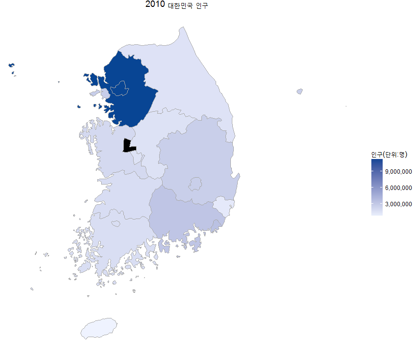

> ## 학습 목표 {.objectives}
>
> * 단계구분도를 이해한다.
> * 대한민국인구를 단계구분도를 사용하여 지리정보 시각화한다.

### 단계구분도(choropleth)

[단계구분도(Choropleth map)](https://en.wikipedia.org/wiki/Choropleth_map)는 
주제도(thematic map)으로 인구밀도, 1인당 소득 같은 정보를 비례하여 음영처리나 패턴을 넣어 지도상에 표현하는 방식이다.

[choroplethr](https://cran.r-project.org/web/packages/choroplethr/index.html)[^choroplethr]은 R에서
단계구분도 생성을 간략화하려는 목적으로 개발되었다. 특히, [Administrative Level 1 Maps](https://cran.r-project.org/web/packages/choroplethr/vignettes/i-creating-admin1-maps.html) 소품문에 나와 있듯이,
인구조사 센서스 데이터가 있는 경우 쉽게 단계구분도를 쉽게 적용할 수 있다.

[^choroplethr]: [choroplethr: Simplify the Creation of Choropleth Maps in R](https://cran.r-project.org/web/packages/choroplethr/index.html)

> #### 사용시 주의사항 {.prereq}
>
> * `admin1_choropleth` 함수는 지명은 `admin1.regions`에 **기재된 영문명** 을 사용한다.
> * 단계구분도에 사용되는 값은 항상 변수명이 **`value`** 만 가능하다.

~~~ {.r}
##==========================================================================
## 팩키지 및 데이터 가져오기
##==========================================================================
library(choroplethr);library(choroplethrAdmin1);library(Kormaps);library(dplyr)
setwd("~/Dropbox/01_data_science") # 윈도우

# 지도데이터 가져오기
data(admin1.regions)
head(admin1.regions)

admin.all <- tbl_df(admin1.regions)
admin.kr <-  filter(admin.all, grepl("south korea", country))

admin1_map("south korea") # 가져온 데이터가 맞는 것인지 확인하는 명령어

# 시각화에 사용될 2010년 대한민국 인구센서스 데이터
df_korea_census <- korpopmap1@data
df_korea_census$name_eng <- tolower(df_korea_census$name_eng)

df_korea_census_mapdata <- df_korea_census %>% 
  select(16,21)

names(df_korea_census_mapdata) <- c("region","value")

# choroplethrAdmin1 지도영문명 일치
# 서울 --> 서울특별시, 제주 --> 제주특별자치시, 세종시는 자료가 없음 (검은색 표시)

df_korea_census_mapdata$region[df_korea_census_mapdata$region=="seoul"] <- "seoul-teukbyeolsi"
df_korea_census_mapdata$region[df_korea_census_mapdata$region=="jeju"] <- "jeju-teukbyeoljachido"

##==========================================================================
## 대한민국 2010년 인구 단계구분도 지리정보 시각화
##==========================================================================

admin1_choropleth(country.name = "south korea", 
                  df           = df_korea_census_mapdata, 
                  title        = "2010 대한민국 인구", 
                  legend       = "인구(단위:명)", 
                  num_colors   = 1)

~~~

`choroplethr`, `choroplethrAdmin1`, `Kormaps` 팩키지를 활용한 단계구분도로 시각화하였다.
2010년 시점 세종시는 정보가 없어 검은색으로 나타나 있음에 주의한다.
경기도와 서울에 대분의 인구가 몰려있음을 단계구분도를 통해 시각적으로 확인할 수 있다.

