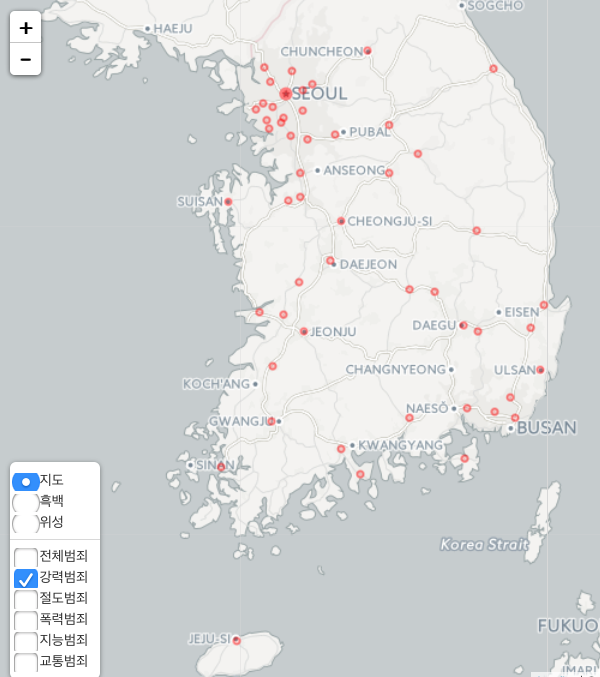

``` {r, include=FALSE}
source("tools/chunk-options.R")
```

> ## 학습 목표 {.objectives}
>
>  * 
>  *  보호관찰소 위치정보를 시각화한다.
>  *  전국 범죄를 지리정보로 시각화한다.


### 1. 생활안전 - 보호관찰소와 범죄


범죄발생에 대한 공공데이터를 확보한다. 공공데이터 포털에 올라가 있는 범죄데이터를 기준으로 작업을 시작한다.
공공데이터와 함께 보호관찰소 및 지소 정보를 [법무부 범죄예방정책국](http://www.moj.go.kr/HP/TSPB/spb_40/spb_4040.jsp) 웹사이트에서 정리하여 구글 지도 `geocode` API 를 사용하여 위도와 경도 정보를 붙여 자바스크립트 라이브러리 `leafelt`을 활용하여 R언어로 작성한다. 

범죄데이터는 공공데이터 포털과 [국가통계포털(KOSIS)](http://kosis.kr/statHtml/statHtml.do?orgId=132&tblId=DT_13204_3105&vw_cd=MT_ZTITLE&list_id=132_13204_GKIT659_gik986_di654&seqNo=&lang_mode=ko&language=kor&obj_var_id=&itm_id=&conn_path=E1)에서
이용가능한 최신 데이터를 활용한다.

전국적으로 2014년 **1,778,966	**건 발생했다. 또한,             , 절도범죄, 폭력범죄, 지능범죄 등 총 15개 범죄가 유형별로 있으며,
각 범죄별로 내부를 뜯어보면             의 경우, 살인기수, 강도, 강간, 유사강간, 강제추행, 방화 등으로 쪼개진다.
이 자체만으로도 대한민국 국민은 누구나 범죄에 노출되어 있음을 실감하게 된다. 

> ### 보호관찰제도 [^moj] {.callout}
> 범죄인을 구금하는 대신 일정한 의무를 조건으로 자유로운 사회생활을 허용하면서 국가공무원인 보호관찰관이 직접 또는 민간자원 봉사자인 
> 범죄예방위원의 협조를 받아 지도 감독 및 원호를 하거나, 사회봉사 수강명령을 집행함으로써 성행을 교정하여 건전한 사회복귀를 촉진하고 
> 재범을 방지하는 선진형사제도입니다.

[^moj]: [범죄예방정책국 - 보호관찰](http://www.moj.go.kr/HP/TSPB/spb_50/spb_50202010.jsp)


### 2. 보호관찰소 지리정보 시각화

보호관찰소 및 지소가 수도권 및 충청도 지역에 집중 배치되어 있는 것을 한눈에 확인할 수 있다.
또한, 지역을 확대하게 되면 사용자 거주지에 얼마나 가까이 있는지도 확인이 가능하다. 


[](html/probation_office.html)

보호관찰소 및 지소가 위치한 자세한 정보 확인은 이미지 클릭


### 2.1. 보호관찰소 지리정보 시각화 코드

`geocode` 함수를 이용하여  보호관찰소 및 지소가 위치한 곳의 위도경도정보를 받아온다.
공공데이터의 위치정보는 간단히 "서울시", "성남시", "속초시" 등 간략한 정보만 나와있어,
이를 `geocode`에 넣게 되면 해당 도시의 대표 위도와 경도 정보가 반환된다.

보호관찰소 지소의 경우 전체주소를 넣는다. 예를 들어, "논산지소"의 경우 "충청남도 논산시 시민로294길 27"  
주소를 `geocode`의 인자값으로 밀어 넣는다.

주소정보를 넣어 위도경도 정보를 `bind_cols` 함수로 합치게 되면 `leaflet`에 범례도 추가하고,
표식도 추가하고, 표식이 너무 많은 경우 `clusterOptions = markerClusterOptions()` 을 추가한다.

~~~ {.r}
library(readxl); library(ggmap); library(dplyr); library(leaflet)
##===========================================================
## 범죄데이터 가져오기 
##===========================================================
# 보호관찰소 위치
probation.rd <- read_excel("crime/data/범죄발생-2011-2014-지역.xlsx", sheet="merge")

##===========================================================
## 위도경도 정보
##===========================================================
# 보호관찰소
probation.rd.lonlat <- geocode(probation.rd$city)
crime.city.office <- bind_cols(probation.rd, probation.rd.lonlat)
probation.office

##===========================================================
## 지리정보 시각화
##===========================================================
# 최종 (군집 표시)
probation.office.html <- 
leaflet(data = probation.office) %>% addTiles() %>%
  addMarkers(~lon, ~lat, popup = ~as.character(city), clusterOptions = markerClusterOptions()) %>% 
  addLegend("bottomright", colors= "#ffa500", labels="위치", title="보호관찰소 및 지소")

##===========================================================
## HTML 파일 내보내기
##===========================================================
library(htmlwidgets)
saveWidget(widget=probation.office.html,file="probation_office.html")
~~~


### 2.2. 2014년 범죄 발생정보 시각화

참으로 다양하고 많은 범죄가 죄종별로 분류가 된다. 특히, 절도범죄, 폭력범죄, 교통범죄, 지능범죄가 
전체발생 범죄의 70~80%를 점유한다.

|  순  | 죄종별(대)      | 죄종별(소)                    |
|------|------------------|------------------------------|
|   1   | 강력범죄        | 살인기수                     |
|      |                      | 살인미수등                  |
|      |                      | 강도                           |
|      |                      | 강간・강제추행              |
|      |                      | 강간                           |
|      |                      | 유사강간                     |
|      |                      | 강제추행                     |
|      |                      | 기타 강간·강제추행등    |
|      |                      | 방화                            |
|   2   | 절도범죄         |                                   |
|   3   | 폭력범죄         | 상해                            |
|      |                      | 폭행                            |
|      |                      | 체포・감금                    |
|      |                      | 협박                            |
|      |                      | 약취・유인                    |
|      |                      | 폭력행위                     |
|      |                      | 공갈                            |
|      |                      | 손괴                            |
|    4  | 지능범죄         | 직무유기                     |
|      |                       | 직권남용                     |
|      |                       | 증수뢰                         |
|      |                       | 통화                            |
|      |                       | 문서・인장                    |
|      |                       | 유가증권인지               |
|      |                       | 사기                            |
|      |                       | 횡령                            |
|      |                       | 배임                            |
|    5  | 풍속범죄         | 성풍속범죄                  |
|   6   |                       | 도박                            |
|    7  | 특별경제범죄   |                                   |
|    8  | 마약범죄         |                                   |
|   9   | 보건범죄         |                                   |
|   10   | 환경범죄         |                                   |
|   11   | 교통범죄         |                                   |
|  12    | 노동범죄         |                                   |
|   13   | 안보범죄         |                                   |
|   14   | 선거범죄         |                                   |
|    15  | 병역범죄         |                                   |
|   16   | 기타범죄         |                                   |

[](html/crime_korea_2014.html)

자세한 도시별 2014년 범죄발생 내역을 확인하려면 상기 지도이미지를 클릭합니다. 

KOSIS 국가통계포털에서 범죄발생데이터를 다운로드하여 `read_excel()` 함수로 불러 읽어온다.
죄종별로 데이터를 구분하고, 구글 지도 API 위경도 정보 매칭을 위해 키값으로 도시명을 사용한다.
불러온 데이터가 맞는지 검증차원에서 `1,778,966` 범죄발생건수가 2014년 동일한지 엑셀원본과 검증한다.

`crime.2014.cl$city` 도시를 기준으로 위도경도정보를 구글 지도API `geocode`로 붙여넣는다.

 `leaflet` 팩키지를 활용하여 범죄정보를 죄종별로 시각화한다.

~~~ {.r}
##===========================================================
## 지역별 범죄 데이터 적개
##===========================================================
# KOSIS: http://kosis.kr/statHtml/statHtml.do?orgId=132&tblId=DT_13204_3105&vw_cd=MT_ZTITLE&list_id=132_13204_GKIT659_gik986_di654&seqNo=&lang_mode=ko&language=kor&obj_var_id=&itm_id=&conn_path=E1
crime.rd <- read_excel("crime/data/crime-2011-2014.xlsx", sheet = "Sheet1", skip=1,
                       col_types = c("text","text",rep("numeric",44)))

names(crime.rd) <- paste0("v",seq(from=1,to=46,by=1))
crime.rd[is.na(crime.rd)] <- 0
crime.2014.cl <- crime.rd %>% 
  rename(year=v1,city=v2,cat01=v4, cat02=v14, cat03=v15, cat04=v24, 
         cat05=v34, cat06=v37, cat07=v38, cat08=v39, cat09=v40,
         cat10=v41, cat11=v42, cat12=v43, cat13=v44, cat14=v45,cat15=v46) %>% 
  select(year, city, starts_with("cat")) %>% 
  filter(year=="2014" & !(city %in% c("계")) ) %>% 
  mutate(city = paste0(city,"시")) %>% 
  mutate(cat_tlt = cat01+cat02+cat03+cat04+cat05+cat06+cat07+cat08+cat09+cat10+cat11+cat12+cat13+cat14+cat15)
crime.2014.cl$cat_tlt %>% sum # 1778966

##===========================================================
## 위도경도 정보
##===========================================================
# 구글 지도 API 위경도 정보 결합
crime.lonlat <- geocode(crime.2014.cl$city)
crime.2014.lonlat <- bind_cols(crime.2014.cl, crime.lonlat)
# NA 값은 제외시킨다. -----> leaflet에서 오동작 방지
crime.2014.lonlat <- crime.2014.lonlat %>% 
  mutate(lat = ifelse(city %in% c("기타도시시"), NA, lat)) %>% 
  mutate(lon = ifelse(city %in% c("기타도시시"), NA, lon)) %>% 
  filter(!is.na(lat) | !is.na(lon))

##===========================================================
## 지리정보 시각화
##===========================================================
# 범죄정보 시각화

crime.korea.2014 <- leaflet(data = crime.2014.lonlat) %>% 
  # 기본 그룹
  addProviderTiles("CartoDB.Positron", group ="지도") %>%
  addProviderTiles("Stamen.Toner", group = "흑백") %>%
  addProviderTiles("OpenTopoMap", group = "위성") %>%
  # 시각화 범죄그룹  
  addCircles(~lon, ~lat, radius = ~cat_tlt/5, popup=~city, stroke = TRUE, group = "전체범죄") %>% 
  hideGroup("전체범죄") %>% 
  addCircles(lng = ~lon, lat=~lat, radius = ~cat01/2, popup=~city, stroke = TRUE, group = "강력범죄", color="red")  %>%  
  #hideGroup("강력범죄") %>% 
  addCircles(lng = ~lon, lat=~lat, radius = ~cat02/2, popup=~city, stroke = FALSE, group = "절도범죄",  color="grey")  %>%  
  hideGroup("절도범죄") %>% 
  addCircles(lng = ~lon, lat=~lat, radius = ~cat03/2, popup=~city, stroke = FALSE, group = "폭력범죄",  color="purple")  %>%  
  hideGroup("폭력범죄") %>% 
  addCircles(lng = ~lon, lat=~lat, radius = ~cat04/2, popup=~city, stroke = FALSE, group = "지능범죄",  color="violet")  %>%  
  hideGroup("지능범죄") %>% 
  addCircles(lng = ~lon, lat=~lat, radius = ~cat10/2, popup=~city, stroke = FALSE, group = "교통범죄",  color="brown")  %>%  
  hideGroup("교통범죄") %>% 
  # Layers control
  addLayersControl(
    baseGroups = c("지도","흑백", "위성"),
    overlayGroups = c("전체범죄", "강력범죄","절도범죄","폭력범죄","지능범죄","교통범죄"),
    position = "bottomleft",
    options = layersControlOptions(collapsed = FALSE)
  ) 

##===========================================================
## HTML 파일 내보내기
##===========================================================
library(htmlwidgets)
saveWidget(widget=crime.korea.2014 ,file="crime_korea_2914.html")
~~~


[^shape-polygon-clipping]: [Clipping polygons in R](https://philmikejones.wordpress.com/2015/09/01/clipping-polygons-in-r/)
[^shape-polygon-dissolving]: [Dissolve polygons in R](https://philmikejones.wordpress.com/2015/09/01/clipping-polygons-in-r/)


