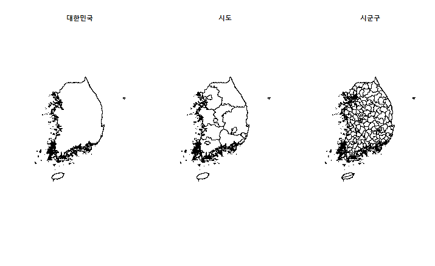

> ## 학습 목표 {.objectives}
>
> * `ggmap`

~~~ {.r kor-map}
setwd("~/Dropbox/01_data_science")

#### 패키지 로딩 & 데이터 읽어오기 ####
library("ggplot2")
library("ggmap")
library("sp")
library("maptools")
library("dplyr")

kor.map.shp = readShapePoly("kor-map/센서스용_행정구역경계_2013_시군구/BND_SIGUNGU_PG.shp")
kor.map = fortify(korea.map.shp)
head(kor.map)
ggplot(kor.map, aes(long, lat)) + geom_polygon()

m <- ggplot(kor.map, aes(long, lat)) + geom_polygon(fill = "white", colour = "blue")
m
~~~

~~~{.r}
bd <- subset(korea_map_shp, korea_map_shp$sigungu_nm %in% c("성남시수정구","성남시중원구", "성남시분당구"))
~~~

~~~{.output}
Error in subset(korea_map_shp, korea_map_shp$sigungu_nm %in% c("성남시수정구", : 객체 'korea_map_shp'를 찾을 수 없습니다

~~~

~~~{.r}
bd
~~~

~~~{.output}
Error in eval(expr, envir, enclos): 객체 'bd'를 찾을 수 없습니다

~~~

~~~{.r}
ggplot(data = bd, aes(x = long, y = lat, group = group, colour = id)) + 
  geom_polygon(fill = "#FFFFFF")
~~~

~~~{.output}
Error in eval(expr, envir, enclos): 함수 "ggplot"를 찾을 수 없습니다

~~~

##### GIS 데이터

지리정보시스템(GIS) 데이터 처리를 위한 기본 R 팩키지를 설치한다.

[rgdal](http://www.rdocumentation.org/packages/rgdal), [raster](http://www.rdocumentation.org/packages/raster), [sp](http://www.rdocumentation.org/packages/sp)를 3종세트로 GIS 데이터 처리를 시작해 본다.

~~~ {.r}
install.packages("raster") # Geographic data analysis and modeling
install.packages("rgdal") # Bindings for the Geospatial Data Abstraction Library
install.packages("sp") # Classes and Methods for Spatial Data
~~~

~~~ {.r}
#===========================
# 필요한 라이브러리를 메모리에 적재한다.
#===========================
library("sp ", "rgdal", "raster")

#===========================
# 지리정보 데이터 정보
# ㄴ 원본 .sph 데이터: http://biogeo.ucdavis.edu/data/gadm2/shp/KOR_adm.zip
#===========================

#===========================
# 작업 디렉토리를 생성한다.
#===========================
localDir <- 'KOR_GIS_data'
if (!file.exists(localDir)) {
    dir.create(localDir)
}

#===========================
# 데이터를 불러와서 압축을 푼다.
#===========================
url <- 'http://biogeo.ucdavis.edu/data/gadm2/shp/KOR_adm.zip'
file <- paste(localDir,basename(url),sep='/')
if (!file.exists(file)) {
    download.file(url, file)
    unzip(file,exdir=localDir)
}

# list.files(localDir)

#===========================
# 계층을 설정하고, 내부정보를 살펴본다.
#===========================

# .shp 파일에서 파일 확장자를 제거한 계층명칭이된다.
layer_KOR_adm0 <- "KOR_adm0"  
layer_KOR_adm1 <- "KOR_adm1"  
layer_KOR_adm2 <- "KOR_adm2"  

# 데이터를 불러온다.
KOR_adm0_projected <- readOGR(dsn=localDir, layer=layer_KOR_adm0) 
KOR_adm1_projected <- readOGR(dsn=localDir, layer=layer_KOR_adm1) 
KOR_adm2_projected <- readOGR(dsn=localDir, layer=layer_KOR_adm2) 

#class(KOR_adm0_projected)
#slotNames(KOR_adm0_projected)

# 행정구역 정보 시각화
par(mfrow=c(1,3))
plot(KOR_adm0_projected)
plot(KOR_adm1_projected)
plot(KOR_adm2_projected)
~~~

 

[Using R - Working with Geospatial Data](http://mazamascience.com/WorkingWithData/?p=1277)
[Raster Data in R - The Basics](http://neondataskills.org/R/Raster-Data-In-R/)

