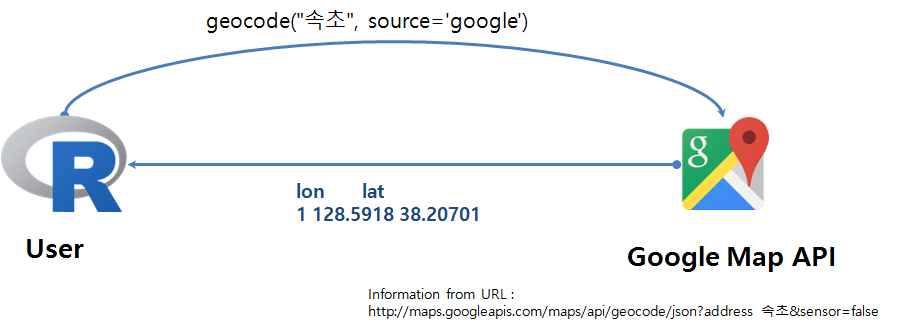
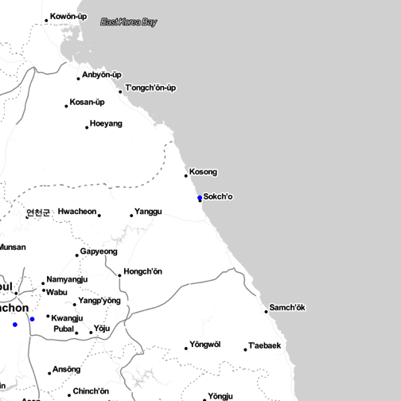

> ## 학습 목표 {.objectives}
>
> *  한국 주소명을 지리정보(위도, 경도)로 변환한다. [^geoCodingWithR]
> * `dplyr` 팩키지 `mutate_geocode` 위도경도 함수를 파이프연산자와 결합하여 코드를 간결화한다.  

### 1. 지리정보 API - `geocode` 

데이터를 지리정보와 결합하여 제공할 경우 현상에 대한 이해, 예측, 통찰력을 얻을 수 있다.
데이터를 지리정보와 결합할 때, 가장 필요한 것이 주소정보에 위도와 경도 정보를 붙여 지도에 표시하게 된다.

주소정보가 제공되었을 때, 이에 해당되는 위도와 경도를 불러올 때 사용하는 것이 함수의 일종인 API다.
위경도 정보를 제공하는 업체로 구글, 네이버, 다음 등 여러 업체가 있다.

R에서 구글, 네이버, 다음등에서 제공하는 지리정보 API를 활용할 경우, 크게 두가지 방법이 존재한다. 
하나는 직접 구글, 네이버, 다음 지리정보 API 문서를 읽고 R코드로 작성하는 방식이 있고,
또 다른 하나는 `ggmap` 팩키지에서 이미 지리정보 API를 내재화해서 함수로 구현해 놓은 것을 호출해서 사용하는 방법이다.

한국주소를 전달하면 위도, 경도 정보를 반환하는 API로 [구글 지도 API](https://developers.google.com/maps/?hl=ko)를 기본으로 사용한다. 
`library(ggmap)` 팩키지를 불러오면 `geocode` 함수가 주소명을 받아 위도, 경도 정보를 반환한다.
하지만, Hadley Wickham이 관여한 팩키지는 [인코딩](encoding.html)으로 **utf-8**을 사용한다. 
따라서, 한국어는 `enc2utf8` 함수를 사용해서 인코딩을 바꿔 넣은 후에 `geocode` 함수에 인자로 넣어야 원하는 위도경도 정보를 반환받을 수 있다. 

~~~{.r}
library(ggmap)
library(ggplot2)
geocode(enc2utf8("속초"), source='google')
~~~

~~~{.output}
FALSE        lon      lat
FALSE 1 128.5918 38.20701

~~~

주소정보를 함께 출력하고자할 경우 `output="latlona"` 선택옵션을 추가한다.

~~~{.r}
#geocode(enc2utf8("속초"), source='google', output="latlona")
geocode(enc2utf8("속초&language=ko"), source='google', output="latlona")
~~~

~~~{.output}
FALSE        lon      lat                address
FALSE 1 128.5918 38.20701 대한민국 강원도 속초시

~~~
`"속초"`를 `geocode` 함수 인자로 넣은 경우와 `"속초&language=ko"` 넣어 함께 넘긴 경우 한글주소로 출력되게 한다.

### 2. 한개 이상 주소정보에서 위도경도 정보 뽑아내기 

구글 지도 API를 사용할 경우, 무료로 이용할 수 있는 반면에 사용자의 오남용을 방지하기 위해서 어느 API 서비스도 마찬가지지만,
구글이나 API 서비스 제공자 임의로 API를 변경할 수 있고, 사용제한을 둔다.
현재 글을 작성하는 시점에서 구글 지도 API의 경우 일일 2,500 번 무료로 사용이 가능하다.

`geocodeQueryCheck(userType = "free")` 명령어를 사용하여 구글 지도 API 사용량을 확인할 수 있다.

~~~{.r}
geocodeQueryCheck(userType = "free")
~~~

~~~{.output}
2498 geocoding queries remaining.

~~~

경기도 및 강원도 3개 지점에 대한 위도경도 정보를 받아오는 경우, 먼저 데이터프레임을 생성하고 나서,
`enc2utf8()` 함수로 인코딩을 검증하고 나서 `geocode` API를 호출해서 위도경도 정보를 받아오면서
바로 데이터프레임에 붙인다.

~~~{.r}
library(ggmap)
library(ggplot2)
library(plyr)

geocodeQueryCheck(userType = "free")

kangwon.loc <- data.frame(addr=c("강원도 속초시 영랑동", 
                                 "경기도 의왕시 포일세거리로 73",
                                 "경기도 성남시 분당구 미금동"), stringsAsFactors = FALSE)

kangwon.loc$addr <- enc2utf8(kangwon.loc$addr)

kangwon.loc.latlon <- geocode(kangwon.loc$addr, source="google")

kangwon.loc.latlon <- with(kangwon.loc, data.frame(addr,
                                   laply(addr, function(val){geocode(val)})))

kangwon.loc.latlon  
~~~

~~~{.output}
FALSE                            addr      lon     lat
FALSE 1          강원도 속초시 영랑동  128.588 38.2239
FALSE 2 경기도 의왕시 포일세거리로 73 126.9683 37.3447
FALSE 3   경기도 성남시 분당구 미금동 127.1189 37.3827

~~~

`geocodeQueryCheck(userType = "free")` 명령어로 사용량이 3개 준 것을 확인할 수 있다.

~~~{.r}
geocodeQueryCheck(userType = "free")
~~~

~~~{.output}
2492 geocoding queries remaining.

~~~

### 3. `dplyr` 함수를 활용한 더 간결한 코드

`dplyr`에서 제공하는 `mutate_geocode` 함수를 사용해서 위도경도 정보를 일괄적으로 받아와서 R 데이터프레임으로 저장한다.

~~~{.r}
library(dplyr)
kangwon.loc.dplyr <- kangwon.loc %>% mutate_geocode(addr)
kangwon.loc.dplyr
~~~

~~~{.output}
FALSE                            addr      lon     lat
FALSE 1          강원도 속초시 영랑동 128.5880 38.2239
FALSE 2 경기도 의왕시 포일세거리로 73 126.9683 37.3447
FALSE 3   경기도 성남시 분당구 미금동 127.1189 37.3827

~~~

경기도와 강원도 3개 주소정보를 구글 지도 API 지역에 전달하여 위도와 경도정보를 받아와서 이를 데이터프레임에 붙인다.
받아온 정보를 `kangwon.loc.dplyr` 데이터프레임에 저장하고 이를 활용하여 구글지도에 시각화를 한다.

~~~{.r}
kangwonMap <- qmap(enc2utf8("속초"), zoom = 8, maptype = "toner-lite")

kangwonMap + geom_point(data = kangwon.loc.dplyr, aes(lon,lat), size = 2, colour="blue")
~~~

[^geoCodingWithR]: [GeoCoding with R](http://lumiamitie.github.io/r/geocoding-with-r-02/)
